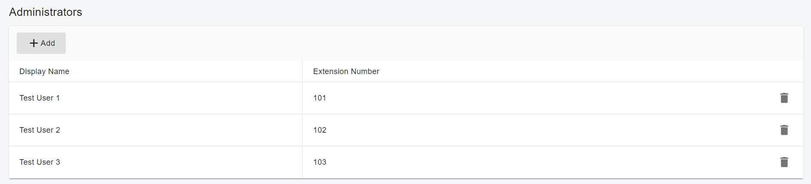
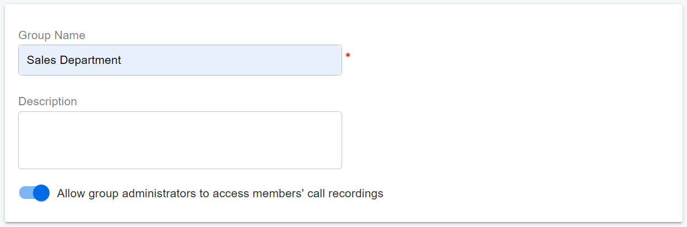

# User Group Recording Access

### Overview

PortSIP PBX supports User Group–based access to call recordings. This allows department managers and team supervisors to review recordings for members of the groups they administer without granting them tenant-wide **Company Recordings** permission.

This guide explains how to configure recording access for User Group Administrators and how to find recordings within an authorized scope.

***

### Recording Access Permissions

A user’s recording access depends on their **Company Recordings** and **User Recordings** permissions, together with their User Group Administrator assignments.

| User permissions                                       | Accessible recordings                                                                                               |
| ------------------------------------------------------ | ------------------------------------------------------------------------------------------------------------------- |
| **Company Recordings**                                 | Recordings for all users in the current tenant, regardless of User Group recording access settings.                 |
| **User Recordings**, without **Company Recordings**    | The user’s own recordings, plus recordings for members of groups they administer where recording access is enabled. |
| Neither **Company Recordings** nor **User Recordings** | No access to recording records. The recording page is hidden, even if the user is a User Group Administrator.       |

> ❗**Note:** The User Group recording access setting controls access to members’ recordings. It does not enable or disable call recording.

***

### Configure User Group Recording Access

Sign in to the PBX Web Portal using an account with permission to manage User Groups, then go to:

**Call Manager > User Groups**

Open the User Group you want to configure.

#### Assign Administrators

1. Open the **Administrators** tab.
2. Select one or more extension users as Administrators for the group.
3. Save your changes.

A User Group can have multiple Administrators. An extension user can also administer multiple User Groups.

<figure><figcaption></figcaption></figure>

Assigning an Administrator does not automatically grant access to group members’ recordings. You must also enable recording access for the group and ensure the user has permission to access the recording page.

#### Enable Access to Members’ Recordings

1. Open the **INFORMATION** tab.
2. Locate **Allow administrators to access members' call recordings** below **Description**.
3. Set the switch to **On**.
4. Save your changes.

| Setting | Behavior                                                                                          |
| ------- | ------------------------------------------------------------------------------------------------- |
| **On**  | Allows the group’s Administrators to access recordings for all group members.                     |
| **Off** | Does not grant access to members’ recordings through the Administrator assignment for this group. |

<figure><figcaption></figcaption></figure>

This setting affects recording access only. It does not change an Administrator’s other User Group roles or capabilities.

Turning the setting off does not revoke access granted through another permission or group. For example, a user with **Company Recordings** permission can still access all user recordings in the current tenant.

#### Defaults and Upgrades

For newly created User Groups, **Allow administrators to access members' call recordings** defaults to **Off**.

After upgrading from an earlier version, the setting also defaults to **Off** for all existing User Groups.

To allow Administrators to access members’ recordings after an upgrade, review the relevant groups, verify their Administrator assignments, and enable the setting.

***

### View Call Recordings

Users with **Company Recordings** permission can go to:

**Data Analytics > Call Recordings**

to view recordings for all users in the current tenant.

Users with **User Recordings** permission, but without Company Recordings permission, can go to:

**Data Analytics > My Call Recordings**

to view their own recordings and any group member recordings they are authorized to access.

#### Example: One User Group

User Group A has the following configuration:

| Configuration                                               | Value         |
| ----------------------------------------------------------- | ------------- |
| Administrator                                               | 100           |
| Members                                                     | 101, 102, 103 |
| **Allow administrators to access members' call recordings** | **On**        |

If user 100 has **User Recordings** permission but does not have Company Recordings permission, they can access:

* Their own recordings.
* Recordings for extension 101.
* Recordings for extension 102.
* Recordings for extension 103.

If the group’s recording access setting is changed to **Off**, user 100 retains access to their own recordings. Their Administrator assignment for Group A no longer grants access to recordings for extensions 101, 102, and 103.

#### Example: Multiple User Groups

When a user administers multiple groups, they can access member recordings from every group where recording access is enabled.

For example, user 100 has User Recordings permission, does not have Company Recordings permission, and administers these groups:

| User Group | User 100 is an Administrator | Recording access | Member access granted through this group |
| ---------- | ---------------------------- | ---------------- | ---------------------------------------- |
| Group A    | Yes                          | **On**           | Yes                                      |
| Group B    | Yes                          | **On**           | Yes                                      |
| Group C    | Yes                          | **Off**          | No                                       |

User 100 can access their own recordings and recordings for members of Group A and Group B. Their Administrator assignment for Group C does not grant access to Group C members’ recordings.

If a member belongs to both Group A and Group C, user 100 can still access that member’s recordings through Group A.

***

### Filter Call Recordings

The recording page includes a **User Groups** multiselect filter before **Extension Number**. Use it to narrow the results to recordings for members of specific groups.

#### User Groups Filter Options

| Option               | Behavior                                                                                                                          |
| -------------------- | --------------------------------------------------------------------------------------------------------------------------------- |
| **No filter**        | The default. Does not filter by User Group. Returns recordings within your authorized scope that match the other search criteria. |
| **All my groups**    | Returns member recordings from all groups you administer where recording access is enabled.                                       |
| One User Group       | Returns recordings for members of the selected group.                                                                             |
| Multiple User Groups | Returns recordings for members of any selected group.                                                                             |

Groups are displayed by **Group Name**. A group appears in the dropdown only when both conditions are met:

* You are an Administrator of the group.
* **Allow administrators to access members' call recordings** is **On** for the group.

**Note:**

* **No filter** removes the User Group filter; it does not expand your recording access.
* **All my groups** refers to the groups you administer with recording access enabled, rather than every group in the tenant.
* When you select groups, your own recordings are included only if you are also a member of a group within the selected scope.

#### Select One or More Groups

To view recordings for a single group, select that group in **User Groups**.

To view recordings for several groups, select multiple groups. The results include recordings for members of any selected group.

If a member belongs to more than one selected group, the same recording appears only once.

To view member recordings from all groups you administer with recording access enabled, select **All my groups**.

Users with **Company Recordings** permission retain tenant-wide recording access. Selecting a User Groups filter narrows their search results without changing that permission.

#### Combine User Groups with Extension Number

**User Groups**, **Extension Number**, and the other search criteria work together. A recording must match all applied criteria to appear in the results.

For example:

| Filter               | Value |
| -------------------- | ----- |
| **User Groups**      | Sales |
| **Extension Number** | 102   |

This search returns recordings for extension 102 only if extension 102 belongs to Sales and you are authorized to access those recordings. The recordings must also match any other applied criteria.

If extension 102 does not belong to Sales, the search returns no recordings for that extension, even if you can access them through another permission or group.

#### Pagination and Total Records

Recording results support pagination. The system determines your authorized recording scope, applies the search criteria, and then paginates the matching results.

* **Total Records** shows the number of accessible recordings that match all applied criteria.
* Each page contains only recordings you are authorized to access that match the search criteria.
* A recording is counted and displayed only once, even if the member belongs to multiple selected groups.
* The User Groups filter works alongside the page’s existing search criteria and features.

Recording access is validated by the server. Changing search criteria does not expand your permissions.

***

### Frequently Asked Questions

#### Why can’t an Administrator see group members’ recordings?

Check the following:

1. The user has **Company Recordings** or **User Recordings** permission. Without either permission, the recording page is hidden.
2. The user is assigned under the group’s **Administrators** tab.
3. **Allow administrators to access members' call recordings** is **On**.
4. The relevant extensions are members of the group.
5. Recordings exist for the relevant calls.
6. The search criteria do not exclude the recordings. Set **User Groups** to **No filter** and review the other criteria.

#### Why can a user still see some member recordings after group recording access is turned off?

The user may have access through another source, such as:

* **Company Recordings** permission.
* **User Recordings** permission when viewing their own recordings.
* An Administrator assignment in another group where recording access is enabled and the same member belongs.

Turning off recording access for one group removes only the access granted through that group’s Administrator assignment.

#### Why is a User Group missing from the filter dropdown?

A group appears only if you are one of its Administrators and its recording access setting is **On**.

Group membership alone does not make the group available in the dropdown.

#### Why are my own recordings missing when I select All my groups?

**All my groups** filters recordings by group membership. If you administer the groups but are not a member of any of them, your own recordings are not included solely because you are an Administrator.

To search your full authorized recording scope, including your own recordings, select **No filter**.

#### Do existing User Groups need configuration after an upgrade?

Yes, if you want their Administrators to access members’ recordings.

The recording access setting defaults to **Off** for existing groups after an upgrade. Enable it for the relevant groups and verify the Administrator assignments and user recording permissions.

