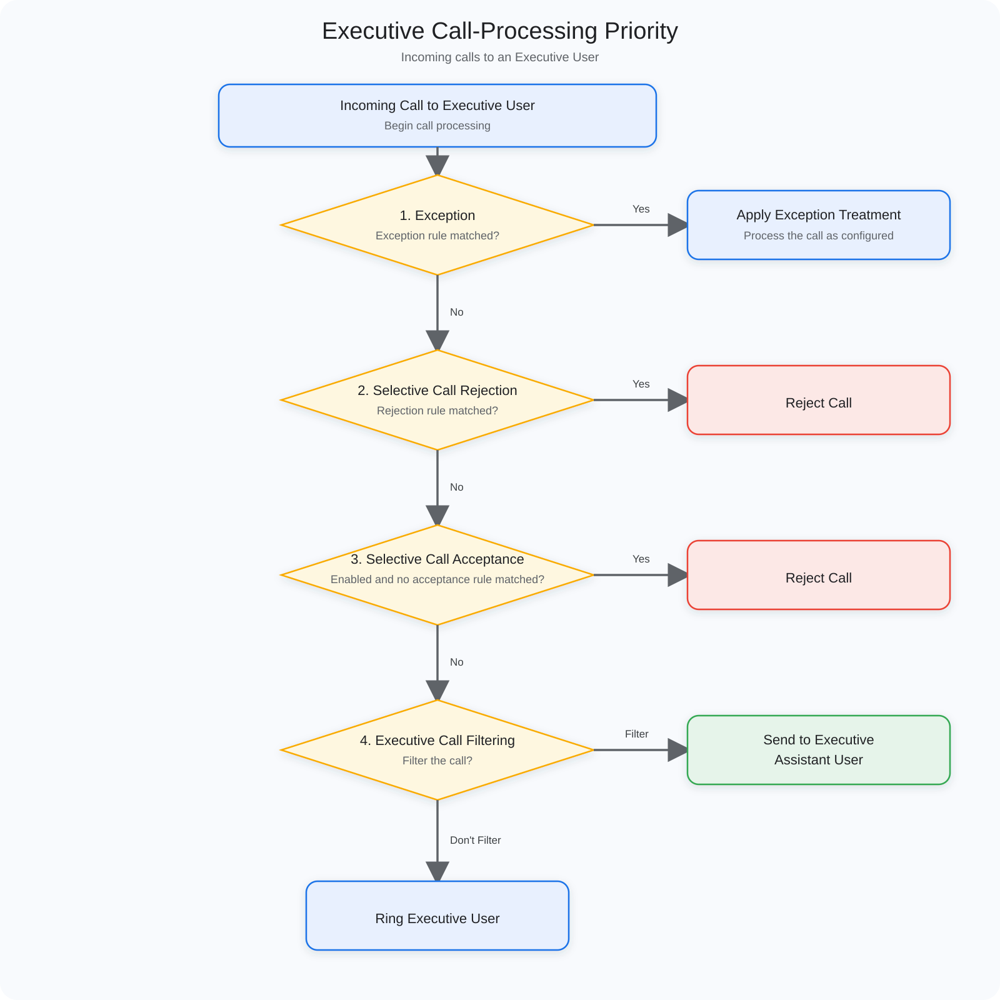

# 36 Executive Assistant

The Executive Assistant feature helps Executive Users and their Executive Assistant Users manage incoming and outgoing calls more efficiently.

> ❗This feature is supported in PortSIP PBX v22.8.0 and later.

With this feature:

* An Executive User can create an Assistant Pool and authorize multiple Executive Assistant Users to manage calls on the Executive User's behalf.
* An Executive Assistant User can answer calls routed from an Executive User and place outgoing calls on the Executive User's behalf.
* An Executive User can specify which incoming calls are routed to Executive Assistant Users and how those users are alerted.
* An Executive Assistant User can push eligible active calls to the corresponding Executive User.

***

### Call-Processing Priority

Incoming calls to an Executive User are processed in the following order:

1. **Exception**
   * If the call matches an Exception rule, the PBX applies the configured Exception treatment.
   * If the call does not match, processing continues to the next step.
2. **Selective Call Rejection**
   * If the call matches a rejection rule, the PBX rejects the call.
   * If the call does not match, processing continues to the next step.
3. **Selective Call Acceptance**
   * If the feature is enabled and the call does not match an acceptance rule, the PBX rejects the call.
   * If the call matches, or the feature is disabled, processing continues to the next step.
4. **Executive Call Filtering**
   * If the call matches a filtering rule, the PBX routes it to the Executive Assistant Users.
   * If the call does not match, the PBX calls the Executive User directly.

<figure><figcaption></figcaption></figure>

> ❗When a call is delivered to an Executive User as a Ring Group Member or Queue Agent, it is not routed to an Executive Assistant User. The existing Ring Group or Call Queue alerting rules continue to apply.

***

### User Roles

Each extension user can be assigned one of the following roles:

* **None**: The user does not use the Executive Assistant feature. This is the default role for new users and users upgraded from an earlier version.
* **Executive**: The user becomes an Executive User and can configure an Assistant Pool, Call Filtering, alerting, and rollover treatment for unanswered calls.
* **Executive Assistant**: The user becomes an Executive Assistant User and can answer and place calls for one or more Executive Users.

#### Permission Requirements

A user with **User Full Access** permission can:

* Assign the None, Executive, or Executive Assistant role to themselves or another user.
* View and modify all Executive Assistant settings on the page.

Without **User Full Access** permission:

* A user cannot change their own role or another user's role.
* If the user's role is None, the related settings are unavailable.
* An Executive User can manage their own settings but cannot change their role.
* An Executive Assistant User can manage the settings available to them but cannot change their role.

***

### Configure an Executive User

An administrator can open the target extension user and select the **Executive / Executive Assistant** tab. An Executive User can also sign in to the Web Portal and select **Profile** from the left menu to manage their own settings.

1. Set the user's role to **Executive**.
2. Add the required Executive Assistant Users.
3. Specify whether assistants can Opt-In or Opt-Out themselves.
4. Configure the Call Filtering rules.
5. Select Sequential Alerting or Simultaneous Alerting.
6. Configure the Caller ID displayed on the assistants' phones.
7. Configure the Rollover Action for unanswered calls.
8. Save the settings.

***

### Assistants

Each Executive User can have up to 10 Executive Assistant Users. Users in the Assistant Pool are ordered as shown on the page. Drag and drop users to change their order.

This order is used for **Sequential Alerting**. The PBX alerts available Executive Assistant Users who are currently opted in, one at a time, in the order shown in the Assistant Pool.

#### Allow Assistant Opt-In or Opt-Out

This option controls whether Executive Assistant Users can change their own Opt-In or Opt-Out status.

* Default: **On**
* On: An Executive Assistant User can choose whether to receive filtered calls for this Executive User.
* Off: An Executive Assistant User cannot change their own status.

Opting out stops filtered calls for the corresponding Executive User from being sent to that Executive Assistant User. It does not remove the user from the Assistant Pool.

***

### Call Filtering

Call Filtering determines which incoming calls to an Executive User are routed to Executive Assistant Users.

When an incoming call matches the configured filtering criteria, the PBX routes it to available Executive Assistant Users who are currently opted in. When Call Filtering is disabled, incoming calls are routed directly to the Executive User unless another call-processing rule handles them first.

Each Executive User can configure up to 20 Call Filtering rules.

#### Caller Numbers

Caller Numbers specifies the types of incoming calls to filter:

* **All Calls**: All incoming calls.
* **All Internal Calls**: All incoming calls from other extensions.
* **All External Calls**: All incoming calls from SIP trunks.
* **Select Phone Numbers**: Only incoming calls that match the specified number rules.

#### Number Rules

When **Select Phone Numbers** is selected, enter each number rule separately. The following formats are supported:

* Single number: `1001`
* Number prefix: `33*`, which matches any number beginning with 33
* Any number: `*`
* Fixed-length pattern: `22?????`, which matches any seven-digit number beginning with 22; each `?` represents one digit
* Number range: `100-200`, inclusive

The following restrictions apply:

* Each user can configure up to 20 number rules.
* Each rule can contain up to 32 characters.
* The combined length of all number rules cannot exceed 660 characters.
* Only digits, `?`, `*`, and `-` are allowed.
* `*` must be used by itself or placed at the end of a numeric prefix. Formats such as `*33`, `**`, and `*1` are not supported.
* A leading `+` in the caller number is ignored during matching.
* Both values in a number range must contain digits only, and the start value cannot be greater than the end value.

#### Schedule

Each Call Filtering rule can use one of the following schedules:

* **All Hours**: Applies at all times. This is the default.
* **Global Office Hours**: Applies during the tenant's office hours.
* **Outside Global Office Hours**: Applies outside the tenant's office hours.
* **Personal Office Hours**: Applies during the user's personal office hours.
* **Outside Personal Office Hours**: Applies outside the user's personal office hours.
* **Specific Office Hours**: Applies during a custom schedule.

If the user's Personal Office Hours are configured to use the tenant's office hours, the PBX evaluates the schedule using the tenant's time zone.

#### Holidays

Each rule can include up to 50 tenant Holidays. The user's personal Holidays always apply.

Personal Holidays and selected tenant Holidays are treated as outside office hours:

* For an Office Hours schedule, a call received during a Holiday does not match the rule.
* For an Outside Office Hours schedule, a call received during a Holiday can match the rule.

***

### Alerting

An Executive User can select how the PBX alerts Executive Assistant Users:

* **Sequential Alerting**: Alerts available Executive Assistant Users who are currently opted in, one at a time, in the order shown in the Assistant Pool.
* **Simultaneous Alerting**: Alerts all available Executive Assistant Users who are currently opted in at the same time.

If no Executive Assistant User answers, the PBX performs the configured Rollover Action when the timeout expires.

***

### Caller ID Shown on Assistant's Phone

An Executive User can configure the caller name and number displayed on Executive Assistant Users' phones.

#### Name

* **Originator**: Displays the original caller's name.
* **Executive**: Displays the Executive User's name.
* **Custom**: Displays a custom name. A name is required and must follow the same validation rules as the Display Name for an extension.

#### Number

* **Originator**: Displays the original caller's number.
* **Executive**: Displays the Executive User's extension number.
* **Custom**: Displays a custom number. The value must follow the same validation rules as a single Outbound Caller ID.

***

### Rollover Action

If none of the eligible Executive Assistant Users answers, the Executive User can configure a timeout and one of the following actions:

* **Send to Executive Voicemail**: Sends the call to the Executive User's voicemail.
* **Forward to Number**: Forwards the call to a specified extension or external number.
* **Hang Up**: Disconnects the call.

A destination number is required only when **Forward to Number** is selected.

***

### Manage Executive Assistant User Settings

An Executive Assistant User can sign in to the Web Portal, select **Profile** from the left menu, and then open the **Executive Assistant** tab.

The page displays:

* All Executive Users to whom the user is assigned.
* The user's current Opt-In or Opt-Out status for each Executive User.

If the corresponding Executive User has enabled **Allow Assistant Opt-In or Opt-Out**, the Executive Assistant User can change their status. Otherwise, the status cannot be changed.

An Executive Assistant User cannot view or modify an Executive User's Assistant Pool and cannot remove themselves from the pool.

#### Call Diversion

An Executive Assistant User can enter a destination in **Forward Filtered Calls To** to forward filtered calls received on behalf of an Executive User. The destination can be an extension or an external number.

The Executive Assistant User's own Forwarding Rules do not apply to Executive Calls routed through Call Filtering.

***

### Place a Call on Behalf of an Executive User

An Executive Assistant User can use the **Executive Assistant Initiate Call FAC** to place a call on behalf of an Executive User. The default FAC is `*24`.

Use the following dialing format:

```
*24 + Executive User extension + * + destination number
```

For example, to call 12345678 on behalf of Executive User 1001, dial:

```
*241001*12345678
```

To call another extension, enter the extension number as the destination. To call an external number, enter the number according to the PBX's normal outbound dialing rules.

***

### Push a Call to an Executive User

An Executive Assistant User can push an active Executive Call to the corresponding Executive User. Call Push is available for:

* An incoming call answered by the Executive Assistant User through Call Filtering.
* An outgoing call placed by the Executive Assistant User on behalf of the Executive User.

During the active call, **blind-transfer the call to the corresponding Executive User's extension**. The PBX then calls the Executive User:

* If the Executive User answers, the call is transferred to the Executive User.
* If the Executive User does not answer within the configured timeout, the call is returned to the Executive Assistant User's device.

***

### Use FACs to Manage Call Filtering and Assistant Status

The following are the default FACs. A system administrator can change these codes. Always use the codes configured in the PBX.

#### Enable or Disable Call Filtering

An Executive User can dial:

* `*22` to enable Call Filtering.
* `*23` to disable Call Filtering.

#### Opt-In

An Executive Assistant User can dial:

* `*27` to opt in to assisting all assigned Executive Users.
* `*27` followed by an Executive User's extension to opt in to assisting that Executive User only.

For example, dial `*271001` to opt in to assisting Executive User 1001.

#### Opt-Out

An Executive Assistant User can dial:

* `*28` to opt out of assisting all assigned Executive Users.
* `*28` followed by an Executive User's extension to opt out of assisting that Executive User only.

For example, dial `*281001` to opt out of assisting Executive User 1001.

Opt-In and Opt-Out are available only when the Executive User has enabled **Allow Assistant Opt-In or Opt-Out**.

***

### Change a User's Role

Changing a user's role automatically removes relationships that are no longer applicable:

* When an Executive Assistant User is changed to None or Executive, the PBX removes the user from every Assistant Pool to which they belong.
* When an Executive User is changed to None or Executive Assistant, the PBX clears that user's Assistant Pool.

> ❗Before changing a role, confirm that the related Assistant Pool configuration is no longer required. Any relationships removed by the role change must be configured again if needed.

