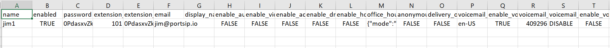

# Bulk Importing Users and Auto Provisioning IP Phones

This guide is designed to assist company administrators in configuring a large number of company employees using the bulk importing feature of PortSIP PBX. This feature allows for the quick and easy addition of users in a spreadsheet format, eliminating the need for time-consuming individual device setting configurations. Furthermore, when importing users in bulk, you can also auto-provision IP Phones to the users simultaneously.

## **Best Practices**

1. Create a user with all necessary settings, such as forwarding rules, office hours, IP Phone, and BLF keys.
2. Export this user to a CSV file to serve as a template.
3. Delete that user in the PortSIP PBX web portal.
4. Edit the template CSV file to add new user information. This can be done by copying from the example user and making necessary changes. For instance, you may need to change the username, password, extension number, office hours, and phone information, among other things.
5. Save your changes and then import the CSV file into the PortSIP PBX web portal.

By following these steps, you can efficiently manage and configure multiple users on the PortSIP PBX platform. This process not only saves time but also ensures consistency in user settings across the board. Remember, the key to successful bulk importing and auto-provisioning lies in careful preparation and attention to detail when creating and editing your CSV file.


The CSV file configuration in a spreadsheet or text editor must be performed in UTF-8 format.


## **Template Columns** Explanation

The CSV file header columns like the below:

<figure><figcaption></figcaption></figure>

* **name**: This is the username that the user will enter to access the PBX web portal. It should consist of numbers and letters.
* **enabled**: This indicates whether this user is enabled or not. The value can be TRUE or FALSE. The user will be disabled if it is set to FALSE.
* **password**: This is the password for the user to log in to the PBX web portal. It must meet the tenant’s password policy, otherwise, the importing will fail.
* **extension\_number**: This is the extension number of the user. It only accepts numbers and is limited to a maximum of 64 digits.
* **extension\_password**: This is the password for the extension to register to PBX from the SIP endpoint. It must meet the tenant’s password policy, otherwise, the importing will fail.
* **email**: This is the email address of the user.
* **display\_name**: This is the full name of the user, for example: Jim Keeny.
* **enable\_audio\_recording**: This indicates whether to enable the audio call recording or not for the user. **TRUE** for enabled and **FALSE** for disabled.
* **enable\_video\_recording**: This indicates whether to enable the video recording or not for the user. **TRUE** for enabled and **FALSE** for disabled.
* **enable\_acb**: This indicates whether to enable the automatic callback or not for the user. **TRUE** for enabled and **FALSE** for disabled.
* **enable\_dnd**: This indicates whether to enable the Do Not Disturb or not for the user. **TRUE** for enabled and **FALSE** for disabled.
* **enable\_hot\_desking**: This indicates whether to enable the Hot Desking or not for the user. **TRUE** for enabled and **FALSE** for disabled.
* **office\_hours**: This specifies the office hours for the user. It can use the global office hours from the tenant level, or create custom office hours for this user only. The office hours are defined in JSON format.

If the **mode** is "**CUSTOM"**, it means to use the specified office hours for that user. For each weekday, if the key **enabled** is true, it means that the day is open, and the ranges is a JSON array used to define the time shifts for office hours. If the ranges is empty, it means the whole day is opened; if the key **enabled** is false, it means that the whole day is closed, and the ranges will be ignored.

```
{
	"mode": "CUSTOM",
	"monday": {
		"enabled": true,
		"ranges": [{
			"from": "09:00",
			"to": "11:00"
		}, {
			"from": "12:00",
			"to": "17:00"
		}]
	},
	"tuesday": {
		"enabled": true,
		"ranges": [{
			"from": "09:00",
			"to": "17:00"
		}]
	},
	"wednesday": {
		"enabled": true,
		"ranges": []
	},
	"thursday": {
		"enabled": true,
		"ranges": []
	},
	"friday": {
		"enabled": true,
		"ranges": []
	},
	"saturday": {
		"enabled": false,
		"ranges": []
	},
	"sunday": {
		"enabled": false,
		"ranges": []
	}
}
```

If the **mode** is set to "**GLOBAL"**, it means that the user's office hours will follow the tenant's office hours.

```
{
	"mode": "GLOBAL",
	"monday": {
		"enabled": true,
		"ranges": []
	},
	"tuesday": {
		"enabled": true,
		"ranges": []
	},
	"wednesday": {
		"enabled": true,
		"ranges": []
	},
	"thursday": {
		"enabled": true,
		"ranges": []
	},
	"friday": {
		"enabled": true,
		"ranges": []
	},
	"saturday": {
		"enabled": true,
		"ranges": []
	},
	"sunday": {
		"enabled": true,
		"ranges": []
	}
}
```

* **anonymous\_outbound\_calls**: This indicates whether to enable the anonymous call or not for the user. **TRUE** for enabled and **FALSE** for disabled.
* **delivery\_outbound\_cid**: This indicates whether to rewrite the user part of the **From** header by the outbound caller ID in the SIP INVITE message or not when the user makes a call to the trunk. **TRUE** for enabled and **FALSE** for disabled.
* **sms:** This indicates the permission for sending SMS and WhatsApp messages, it can be **DISABLE**, **ALLOW\_WITH\_SENDER\_ID**,  **ALLOW**. It's only applicable to the PBX v22.0 and higher.
* **voicemail\_prompt**: This specifies the voicemail prompt language. It’s BCP 47 Language Tags (The Internet Best Current Practices (BCP) for language tags), for example, **en-US**.
* **enable\_voicemail\_pin**: This indicates whether to verify the voicemail PIN or not when the user accesses his voicemail by dialing FAC. **TRUE** for enabled and **FALSE** for disabled.
* **voicemail\_pin**: This sets the voicemail PIN. This is a mandatory field and must be numeric and meet the voicemail password policy.
* **voicemail\_play\_datetime**: This indicates whether to play the date and time or not when the user accesses his voicemail. **TRUE** for enabled and **FALSE** for disabled.
* **enable\_voicemail\_notify**: This indicates whether to send an email notification to the user’s email or not if a new voicemail is generated. **TRUE** for enabled and **FALSE** for disabled.
* **online\_no\_answer\_forward\_rule**: This specifies the forward rule if the user is online but does not answer the call at a certain time. It’s a JSON object that includes the following keys:
  * **action**: Allows to set the `FORWARD_TO_NUMBER`, `FORWARD_TO_VOICEMAIL`, `HANGUP`.
  * **timeout**: Specifies the max ringing time before taking the action, in seconds.
  * **number**: Specifies the destination number for the action is set to `FORWARD_TO_NUMBER`. It will be ignored if the action is not set as `FORWARD_TO_NUMBER`.

For example, if the call is not answered in 60 seconds, that call will be forwarded to the voicemail. This can be set as follows:

```
{
	"action": "FORWARD_TO_VOICEMAIL",
	"timeout": 60,
	"number": ""
}
```

* **online\_busy\_forward\_rule**: This specifies the forward rule if the user is online but currently on a call. It’s a JSON object that includes the following keys:
  * **action**: Allows to set the `FORWARD_TO_NUMBER`, `FORWARD_TO_VOICEMAIL`, `RING_ANYWAY`, `HANGUP`.
  * **timeout**: It will be ignored for the online busy forward rule.
  * **number**: Specifies the destination number for the action is set to `FORWARD_TO_NUMBER`. It will be ignored if the action is not set as `FORWARD_TO_NUMBER`.

For example, if the user is on a call, the new call that called him will be sent to him anyway. The `timeout` and `number` keys will be ignored. This can be set as follows:

```
{
	"action": "RING_ANYWAY",
	"timeout": 60,
	"number": ""
}
```

* **offline\_office\_hours\_forward\_rule**: This specifies the forward rule if the user is offline and currently in office hours. It’s a JSON object that includes the following keys:
  * **action**: Allows to set the `FORWARD_TO_NUMBER`, `FORWARD_TO_VOICEMAIL`, `HANGUP`.
  * **timeout**: It will be ignored for the offline forward rule.
  * **number**: Specifies the destination number for the action is set to `FORWARD_TO_NUMBER`. It will be ignored if the action is not set as `FORWARD_TO_NUMBER`.

For example, if the user is offline during office hours, the new call that called him will be hung up. The `timeout` and `number` keys will be ignored. This can be set as follows:

```
{
	"action": "HANGUP",
	"timeout": 60,
	"number": ""
}
```

* **offline\_non\_office\_hours\_forward\_rule**: This specifies the forward rule if the user is offline and currently outside of office hours. It’s a JSON object that includes the following keys:
  * **action**: Allows to set the `FORWARD_TO_NUMBER`, `FORWARD_TO_VOICEMAIL`, `HANGUP`.
  * **timeout**: It will be ignored for the offline forward rule.
  * **number**: Specifies the destination number for the action is set to `FORWARD_TO_NUMBER`. It will be ignored if the action is not set as `FORWARD_TO_NUMBER`.

For example, if the user is offline outside of office hours, the new call that called him will be forwarded to the number **123456**. The `timeout` key will be ignored. This can be set as follows:

```
{
	"action": "FORWARD_TO_NUMBER",
	"timeout": 60,
	"number": "123456"
}
```

* **custom\_forward\_rules**: These rules serve as exceptions that override the standard forwarding rules. They are defined as a JSON object. If you wish to leave this field empty, set it to `[]`. This allows the user to establish their own exception rules via the PortSIP PBX web portal.
* **blfs**: This field is used to specify the BLF (Busy Lamp Field) keys. It is also a JSON object. To leave it empty, set it to `[]`.
* **interface**: This field is used to specify the network interface IP Address, which is used to generate the QR code. The client application will connect to the PortSIP PBX using this IP address. It accepts the following values:
  * WEB\_DOMAIN: The client app will use the PortSIP PBX Web Domain as the outbound proxy server address.
  * PUBLIC\_IPV4: The client app will use the PortSIP public IP IPv4 address as the outbound proxy server address.
  * PUBLIC\_IPV6: The client app will use the PortSIP PBX public IPv6 address as the outbound proxy server address.
  * PRIVATE\_IPV4: The client app will use the PortSIP PBX private IPv4 address as the outbound proxy server address.
  * PRIVATE\_IPV6: The client app will use the PortSIP PBX private IPv6 address as the outbound proxy server address.
  * SBC\_DOMAIN: The client app will use the PortSIP SBC web domain as the outbound proxy server address, and then the client app registers to PortSIP PBX via the PortSIP SBC.
* **preferred\_transport**: This field is used to specify the transport protocol for the PortSIP PBX in the QR code. After scanning the QR code, the client app will prioritize using this specified transport to register with PortSIP PBX. This key accepts `UDP`, `TCP`, and `TLS`.
* **custom\_options**: This field is reserved for setting custom options. It is typically left empty.
* **role**: This field is used to specify the user’s role. It accepts the following values: `StandardUser`, `StandardInternationalUser`, `QueueManager`, `Admin`.
* **phones**: This field is used to specify auto-provisioning the IP Phone for this user. It’s a JSON object that includes the following keys:
  * **mac**: This is the MAC address of the phone. It should be in lowercase with a separator “:” or “-”. Please ensure this Phone MAC address is not used by other users, otherwise, the provisioning will fail.
  * **filename**: This is the template file of the IP phone.
  * **vendor**: This is the vendor of the IP phone.
  * **interface**: This specifies the PBX IP Address of the network interface for the IP phone, which will be treated as the outbound proxy server in the IP Phone settings. The values are the same as the `interface` explained above.
  * **preferred\_transport**: This specifies the PortSIP PBX transport protocol for this IP phone. The IP Phone will prioritize using this specified transport to register with PortSIP PBX. It allows **UDP**, **TCP**, or **TLS**.
  * **model**: This is the phone model.
  * **password**: This specifies the phone web UI password.
  * **language**: This specifies the display language for the IP phone. It supports the following values: `ENGLISH`, `CHINESE`, `DUTCH`, `FRENCH`, `GERMAN`, `GREEK`, `ITALIAN`, `JAPANESE`, `POLISH`, `RUSSIAN`, `SPANISH`, `SWEDISH`, `UKRAINIAN`, `BULGARIAN`.
  * **timezone**: This specifies the timezone for this IP Phone.
  * **transfer**: This specifies the transfer mode for the transfer key of the IP phone. It can be `ATTENDED`, `BLIND`, and `NEW_CALL`.
  * **ringtone**: This is the ring tone for receiving a new call.
  * **queue\_ringtone**: This specifies the ring tone for the queue call.
  * **date\_format**: This is the date format for the phone.
  * **time\_format**: This is the time format for the phone.
  * **powerled**: This is the power LED lights.
  * **backlight**: This is the backlight of the IP Phone screen.
  * **screensaver**: This is the screensaver of the IP Phone.
  * **rps**: This indicates whether to store the auto-provisioning URL into the IP Phone vendor’s RPS server or not. Set to `true` will be stored in the RPS and `false` will not.
  * **https**: This indicates whether to generate the auto-provisioning URL with the HTTPS scheme or not. Set to `true` the URL will be HTTPS and `false` will be HTTP.

**For the v22.x:**

```json
[
  {
    "mac": "0c:38:3e:63:fe:e8",
    "rps": true,
    "https": false,
    "model": "V62 Pro",
    "codecs": [
      "PCMU",
      "PCMA",
      "G729",
      "G722"
    ],
    "vendor": "Fanvil",
    "filename": "fanvil.ph.xml",
    "language": "English",
    "password": "63FEE8",
    "powerled": "Both (Voicemail and Missed calls)",
    "ringtone": "Default",
    "timezone": "GMT+8 China(Beijing)",
    "transfer": "BLIND",
    "backlight": "30 seconds",
    "interface": "WEB_DOMAIN",
    "pc_port_id": 254,
    "date_format": "15 JAN MON",
    "enable_lldp": false,
    "screensaver": "",
    "time_format": "24-hour clock",
    "wan_port_id": 256,
    "serial_number": "",
    "door_password1": "",
    "door_password2": "",
    "queue_ringtone": "Ring 1",
    "pc_port_priority": 0,
    "wan_port_priority": 0,
    "enable_vlan_pc_port": false,
    "preferred_transport": "UDP",
    "enable_vlan_wan_port": false
  }
]
```

**For the v16.x:**

```json
[{
	"mac": "cc:5e:f8:41:b7:95",
	"filename": "yealinkT3x.ph.xml",
	"vendor": "Yealink",
	"interface": "PRIVATE_IPV4",
	"preferred_transport": "UDP",
	"model": "SIP-T32G",
	"password": "365894258",
	"language": "English",
	"timezone": "GMT-5:00 US Eastern Time, New York",
	"transfer": "BLIND",
	"ringtone": "",
	"queue_ringtone": "Ring 1",
	"date_format": "",
	"time_format": "",
	"powerled": "",
	"backlight": "",
	"screensaver": "",
	"rps": false,
	"https": false,
	"codecs": ["PCMU", "PCMA", "G729", "G722"],
	"enable_lldp": false,
	"enable_vlan_wan_port": false,
	"wan_port_id": 1,
	"wan_port_priority": 0,
	"enable_vlan_pc_port": false,
	"pc_port_id": 1,
	"pc_port_priority": 0
}]
```

## Sample CSV File

We provide a sample CSV file for bulk importing and auto-provisioning four users.

* For v22.x: [Sample CSV file](https://www.portsip.com/provision/portsip_bulk_users_v22.csv)
* For v16.x: [Sample CSV file](https://www.portsip.com/provision/portsip_bulk_users.csv)

After you download that sample CSV file, you can sign in to the PortSIP PBX web port, in the menu **Call Manager > Users**, click the **Import** button, and select the sample CSV file to import the users, the users will be successfully created with provisioning information.

Please also reference the article [Zero Touch Provisioning Phones](zero-touch-provisioning-phones.md).

