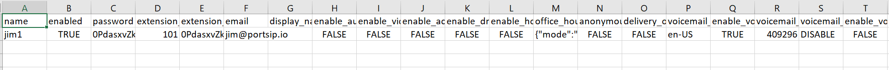

# Bulk Importing Users and Auto Provisioning IP Phones

This guide is designed to assist company administrators in configuring a large number of company employees using the bulk import feature of PortSIP PBX. This feature allows administrators to quickly create users from a CSV file and, when required, provision IP phones for those users at the same time.

### Best Practices

1. Create a user with all the necessary settings, such as forwarding rules, office hours, IP phones, and BLF keys.
2. Export the user from PortSIP PBX as a CSV file to use as a template.
3. Delete the example user from the PortSIP PBX web portal.
4.  **Do not open the exported CSV file directly in Microsoft Excel.**

    Double-clicking a CSV file or opening it directly in Excel may cause Excel to automatically convert long numeric values. For example, internal PBX IDs may be converted to scientific notation or rounded because Excel supports only 15 significant digits for numeric values.

    Once this conversion occurs, changing the cell format to **Text** does not restore the original value.
5. To edit the CSV file in Microsoft Excel, open Excel first and create a new blank workbook.
6.  Import the CSV file by selecting:

    **Data > From Text/CSV**
7. Select the exported CSV file, and then choose **Transform Data** instead of loading the file directly.
8.  In the Power Query Editor, review the columns before loading the data.

    Set the data type to **Text** for:

    * Any column that contains an internal PortSIP PBX ID or other long numeric identifier.
    * Any ID column whose value must remain exactly the same as exported.
    * The **extension\_number** column, especially if extension numbers may contain leading zeros or long numeric values.

    This is required to prevent Excel from converting these values to scientific notation, removing leading zeros, or changing their numeric precision.

    **Important:** Do not modify internal PBX ID values unless the documentation for that field specifically instructs you to do so.
9. After confirming that these columns are set to **Text**, load the data into Excel.
10. Edit the template to add or modify users as required. You can copy the example user and update fields such as:

    * Username
    * Password
    * Extension number
    * Office hours
    * Forwarding settings
    * IP phone settings
    * BLF keys

    When editing the CSV file, preserve the format of fields that contain JSON data.
11. After completing the changes, save the file as a **CSV UTF-8** file.

    In Excel, choose:

    **File > Save As > CSV UTF-8 (Comma delimited) (\*.csv)**
12. Import the saved CSV file into PortSIP PBX.
13. After saving the CSV file, **do not open it again directly in Excel before importing it into PortSIP PBX**.

    If you need to verify the CSV content, use a plain text editor such as Notepad++, Visual Studio Code, or another UTF-8-compatible text editor.

    Reopening the CSV file directly in Excel may cause long numeric IDs or other numeric identifiers to be automatically converted again, which can corrupt the data and cause the import to fail.

#### Recommended Workflow

```
Export CSV from PortSIP PBX
→ Open Microsoft Excel first
→ Create a blank workbook
→ Data > From Text/CSV
→ Transform Data
→ Set internal ID and long numeric identifier columns to Text
→ Set extension_number to Text
→ Load the data into Excel
→ Edit or duplicate users
→ Save as CSV UTF-8
→ Import the CSV into PortSIP PBX
```

Do not use the following workflow:

```
Export CSV
→ Double-click the CSV file to open it in Excel
→ Edit
→ Save
→ Reopen it in Excel
→ Import
```

This workflow may cause Excel to modify internal PBX IDs, long numeric identifiers, extension numbers, or other values that must remain unchanged.

If a CSV file has already been opened directly in Excel and contains long numeric IDs, **do not continue editing that file**. Export a new copy from PortSIP PBX and import it into Excel using **Data > From Text/CSV** as described above.

### CSV File Format

The CSV file must be saved in **UTF-8** format.

When using Microsoft Excel, always save the edited file as:

**CSV UTF-8 (Comma delimited) (\*.csv)**

Do not change the CSV column names or remove required columns unless specifically instructed by the PortSIP documentation.

### **Template Columns** Explanation

The CSV file header columns are described below:

<figure><figcaption></figcaption></figure>

* **name**: This is the username that the user will enter to access the PBX web portal. It should consist of numbers and letters.
* **enabled**: This indicates whether this user is enabled or not. The value can be TRUE or FALSE. The user will be disabled if it is set to FALSE.
* **password**: This is the password for the user to log in to the PBX web portal. It must meet the tenant’s password policy, otherwise, the importing will fail.
* **extension\_number**: This is the extension number of the user. It only accepts numbers and is limited to a maximum of 64 digits.
* **extension\_password**: This is the password for the extension to register to PBX from the SIP endpoint. It must meet the tenant’s password policy, otherwise, the importing will fail.
* **email**: This is the email address of the user.
* **display\_name**: This is the full name of the user, for example: Jim Keeny.
* **enable\_audio\_recording**: This indicates whether to enable the audio call recording or not for the user. **TRUE** for enabled and **FALSE** for disabled.
* **enable\_video\_recording**: This indicates whether to enable the video recording or not for the user. **TRUE** for enabled and **FALSE** for disabled.
* **enable\_acb**: This indicates whether to enable the automatic callback or not for the user. **TRUE** for enabled and **FALSE** for disabled.
* **enable\_dnd**: This indicates whether to enable the Do Not Disturb or not for the user. **TRUE** for enabled and **FALSE** for disabled.
* **enable\_hot\_desking**: This indicates whether to enable the Hot Desking or not for the user. **TRUE** for enabled and **FALSE** for disabled.
* **office\_hours**: This specifies the office hours for the user. It can use the global office hours from the tenant level, or create custom office hours for this user only. The office hours are defined in JSON format.

If the **mode** is "**CUSTOM"**, it means to use the specified office hours for that user. For each weekday, if the key **enabled** is true, it means that the day is open, and the ranges is a JSON array used to define the time shifts for office hours. If the ranges is empty, it means the whole day is opened; if the key **enabled** is false, it means that the whole day is closed, and the ranges will be ignored.

```json
{
	"mode": "CUSTOM",
	"monday": {
		"enabled": true,
		"ranges": [{
			"from": "09:00",
			"to": "11:00"
		}, {
			"from": "12:00",
			"to": "17:00"
		}]
	},
	"tuesday": {
		"enabled": true,
		"ranges": [{
			"from": "09:00",
			"to": "17:00"
		}]
	},
	"wednesday": {
		"enabled": true,
		"ranges": []
	},
	"thursday": {
		"enabled": true,
		"ranges": []
	},
	"friday": {
		"enabled": true,
		"ranges": []
	},
	"saturday": {
		"enabled": false,
		"ranges": []
	},
	"sunday": {
		"enabled": false,
		"ranges": []
	}
}
```

If the **mode** is set to "**GLOBAL"**, it means that the user's office hours will follow the tenant's office hours.

```json
{
	"mode": "GLOBAL",
	"monday": {
		"enabled": true,
		"ranges": []
	},
	"tuesday": {
		"enabled": true,
		"ranges": []
	},
	"wednesday": {
		"enabled": true,
		"ranges": []
	},
	"thursday": {
		"enabled": true,
		"ranges": []
	},
	"friday": {
		"enabled": true,
		"ranges": []
	},
	"saturday": {
		"enabled": true,
		"ranges": []
	},
	"sunday": {
		"enabled": true,
		"ranges": []
	}
}
```

* **anonymous\_outbound\_calls**: Indicates whether anonymous outbound calling is enabled for the user. **TRUE** means enabled; **FALSE** means disabled.
* **delivery\_outbound\_cid**: Indicates whether the user part of the **From** header in the SIP INVITE is rewritten with the outbound caller ID when the user places a call through a trunk. **TRUE** means enabled; **FALSE** means disabled.
* **sms**: Specifies the user’s permission to send SMS and WhatsApp messages. The available values are **DISABLE**, **ALLOW\_WITH\_SENDER\_ID**, and **ALLOW**. This field is applicable only to PortSIP PBX v22.0 and later.
* **voicemail\_prompt**: Specifies the language used for voicemail prompts. The value must be a BCP 47 language tag, for example, **en-US**.
* **enable\_voicemail\_pin**: Indicates whether the voicemail PIN must be verified when the user accesses voicemail by dialing a Feature Access Code (FAC). **TRUE** means enabled; **FALSE** means disabled.
* **voicemail\_pin**: Specifies the voicemail PIN. This field is mandatory. The PIN must contain only numeric digits and comply with the configured voicemail PIN policy.
* **voicemail\_play\_datetime**: Indicates whether the date and time are played when the user accesses voicemail. **TRUE** means enabled; **FALSE** means disabled.
* **enable\_voicemail\_notify**: Indicates whether an email notification is sent to the user’s email address when a new voicemail message is received. **TRUE** means enabled; **FALSE** means disabled.
* **online\_no\_answer\_forward\_rule**: Specifies the forwarding rule to apply when the user is online but does not answer an incoming call within the configured timeout. It is a JSON object that includes the following keys:
  * **action**: Specifies the action to take. Supported values are `FORWARD_TO_NUMBER`, `FORWARD_TO_VOICEMAIL`, and `HANGUP`.
  * **timeout**: Specifies the maximum ringing time, in seconds, before the configured action is taken.
  * **number**: Specifies the destination number when **action** is set to `FORWARD_TO_NUMBER`. This field is ignored when **action** is set to any other value.

For example, to forward the call to voicemail if it is not answered within 60 seconds, configure the rule as follows:

```json
{
	"action": "FORWARD_TO_VOICEMAIL",
	"timeout": 60,
	"number": ""
}
```

* **online\_busy\_forward\_rule**: Specifies the forwarding rule to apply when the user is online but is currently on another call. It is a JSON object that includes the following keys:
  * **action**: Specifies the action to take. Supported values are `FORWARD_TO_NUMBER`, `FORWARD_TO_VOICEMAIL`, `RING_ANYWAY`, and `HANGUP`.
  * **timeout**: This field is ignored for the online busy forwarding rule.
  * **number**: Specifies the destination number when **action** is set to `FORWARD_TO_NUMBER`. This field is ignored when **action** is set to any other value.

For example, to have a new incoming call ring the user even when the user is already on another call, set **action** to `RING_ANYWAY`. The `timeout` and `number` fields are ignored. Configure the rule as follows:

```json
{
	"action": "RING_ANYWAY",
	"timeout": 60,
	"number": ""
}
```

* **offline\_office\_hours\_forward\_rule**: Specifies the forwarding rule to apply when the user is offline during office hours. It is a JSON object that includes the following keys:
  * **action**: Specifies the action to take. Supported values are `FORWARD_TO_NUMBER`, `FORWARD_TO_VOICEMAIL`, and `HANGUP`.
  * **timeout**: This field is ignored for the offline forwarding rule.
  * **number**: Specifies the destination number when **action** is set to `FORWARD_TO_NUMBER`. This field is ignored when **action** is set to any other value.

For example, to hang up a new incoming call when the user is offline during office hours, set **action** to `HANGUP`. The `timeout` and `number` fields are ignored. Configure the rule as follows:

```json
{
	"action": "HANGUP",
	"timeout": 60,
	"number": ""
}
```

* **offline\_non\_office\_hours\_forward\_rule**: Specifies the forwarding rule to apply when the user is offline outside of office hours. It is a JSON object that includes the following keys:
  * **action**: Specifies the action to take. Supported values are `FORWARD_TO_NUMBER`, `FORWARD_TO_VOICEMAIL`, and `HANGUP`.
  * **timeout**: This field is ignored for the offline forwarding rule.
  * **number**: Specifies the destination number when **action** is set to `FORWARD_TO_NUMBER`. This field is ignored when **action** is set to any other value.

For example, to forward a new incoming call to **123456** when the user is offline outside of office hours, set **action** to `FORWARD_TO_NUMBER` and **number** to `123456`. The `timeout` field is ignored. Configure the rule as follows:

```json
{
	"action": "FORWARD_TO_NUMBER",
	"timeout": 60,
	"number": "123456"
}
```

* **custom\_forward\_rules**: Specifies custom forwarding rules that act as exceptions and override the standard forwarding rules. The rules are defined in JSON format. To leave this field empty, set it to `[]`. Users can also configure their own exception rules through the PortSIP PBX web portal.
* **blfs**: Specifies the BLF (Busy Lamp Field) keys in JSON format. To leave this field empty, set it to `[]`.
* **interface**: Specifies the network interface address used when generating the QR code. The client application uses this address to connect to the PortSIP PBX. The following values are supported:
  * **WEB\_DOMAIN**: The client app uses the PortSIP PBX web domain as the outbound proxy server address.
  * **PUBLIC\_IPV4**: The client app uses the PortSIP PBX public IPv4 address as the outbound proxy server address.
  * **PUBLIC\_IPV6**: The client app uses the PortSIP PBX public IPv6 address as the outbound proxy server address.
  * **PRIVATE\_IPV4**: The client app uses the PortSIP PBX private IPv4 address as the outbound proxy server address.
  * **PRIVATE\_IPV6**: The client app uses the PortSIP PBX private IPv6 address as the outbound proxy server address.
  * **SBC\_DOMAIN**: The client app uses the PortSIP SBC web domain as the outbound proxy server address and registers with the PortSIP PBX through the PortSIP SBC.
* **preferred\_transport**: Specifies the transport protocol for the PortSIP PBX in the QR code. After scanning the QR code, the client app prioritizes the specified transport protocol when registering with the PortSIP PBX. Supported values are `UDP`, `TCP`, and `TLS`.
* **custom\_options**: Reserved for custom options. This field is typically left empty.
* **role**: Specifies the user’s role. Supported values are `StandardUser`, `StandardInternationalUser`, `QueueManager`, and `Admin`.
* **phones**: Specifies the IP phone auto-provisioning settings for the user. It is a JSON object that includes the following keys:
  * **mac**: Specifies the MAC address of the IP phone. The MAC address must use lowercase letters and may use either `:` or `-` as the separator. Ensure that the MAC address is not already assigned to another user; otherwise, provisioning will fail.
  * **filename**: Specifies the template file used for the IP phone.
  * **vendor**: Specifies the IP phone vendor.
  * **interface**: Specifies the PortSIP PBX network interface address used as the outbound proxy server in the IP phone configuration. The supported values are the same as those described for **interface** above.
  * **preferred\_transport**: Specifies the transport protocol that the IP phone should prioritize when registering with the PortSIP PBX. Supported values are `UDP`, `TCP`, and `TLS`.
  * **model**: Specifies the IP phone model.
  * **password**: Specifies the password for the IP phone’s web UI.
  * **language**: Specifies the display language for the IP phone. Supported values are `ENGLISH`, `CHINESE`, `DUTCH`, `FRENCH`, `GERMAN`, `GREEK`, `ITALIAN`, `JAPANESE`, `POLISH`, `RUSSIAN`, `SPANISH`, `SWEDISH`, `UKRAINIAN`, and `BULGARIAN`.
  * **timezone**: Specifies the time zone for the IP phone.
  * **transfer**: Specifies the transfer mode used by the IP phone’s transfer key. Supported values are `ATTENDED`, `BLIND`, and `NEW_CALL`.
  * **ringtone**: Specifies the ringtone for incoming calls.
  * **queue\_ringtone**: Specifies the ringtone for incoming queue calls.
  * **date\_format**: Specifies the date format displayed on the IP phone.
  * **time\_format**: Specifies the time format displayed on the IP phone.
  * **powerled**: Specifies the behavior of the IP phone’s power LED.
  * **backlight**: Specifies the backlight setting for the IP phone display.
  * **screensaver**: Specifies the screensaver setting for the IP phone.
  * **rps**: Indicates whether the auto-provisioning URL is stored on the IP phone vendor’s RPS server. Set this field to `true` to store the URL on the RPS server or `false` not to store it.
  * **https**: Indicates whether the auto-provisioning URL uses HTTPS. Set this field to `true` to generate an HTTPS URL or `false` to generate an HTTP URL.

**For v22.x:**

```json
[
  {
    "mac": "0c:38:3e:63:fe:e8",
    "rps": true,
    "https": false,
    "model": "V62 Pro",
    "codecs": [
      "PCMU",
      "PCMA",
      "G729",
      "G722"
    ],
    "vendor": "Fanvil",
    "filename": "fanvil.ph.xml",
    "language": "English",
    "password": "63FEE8",
    "powerled": "Both (Voicemail and Missed calls)",
    "ringtone": "Default",
    "timezone": "GMT+8 China(Beijing)",
    "transfer": "BLIND",
    "backlight": "30 seconds",
    "interface": "WEB_DOMAIN",
    "pc_port_id": 254,
    "date_format": "15 JAN MON",
    "enable_lldp": false,
    "screensaver": "",
    "time_format": "24-hour clock",
    "wan_port_id": 256,
    "serial_number": "",
    "door_password1": "",
    "door_password2": "",
    "queue_ringtone": "Ring 1",
    "pc_port_priority": 0,
    "wan_port_priority": 0,
    "enable_vlan_pc_port": false,
    "preferred_transport": "UDP",
    "enable_vlan_wan_port": false
  }
]
```

**For v16.x:**

```json
[{
	"mac": "cc:5e:f8:41:b7:95",
	"filename": "yealinkT3x.ph.xml",
	"vendor": "Yealink",
	"interface": "PRIVATE_IPV4",
	"preferred_transport": "UDP",
	"model": "SIP-T32G",
	"password": "365894258",
	"language": "English",
	"timezone": "GMT-5:00 US Eastern Time, New York",
	"transfer": "BLIND",
	"ringtone": "",
	"queue_ringtone": "Ring 1",
	"date_format": "",
	"time_format": "",
	"powerled": "",
	"backlight": "",
	"screensaver": "",
	"rps": false,
	"https": false,
	"codecs": ["PCMU", "PCMA", "G729", "G722"],
	"enable_lldp": false,
	"enable_vlan_wan_port": false,
	"wan_port_id": 1,
	"wan_port_priority": 0,
	"enable_vlan_pc_port": false,
	"pc_port_id": 1,
	"pc_port_priority": 0
}]
```

### Sample CSV File

We provide a sample CSV file for bulk importing and auto-provisioning four users.

* For v22.x: [Sample CSV file](https://www.portsip.com/provision/portsip_bulk_users_v22.csv)
* For v16.x: [Sample CSV file](https://www.portsip.com/provision/portsip_bulk_users.csv)

After downloading the sample CSV file, sign in to the PortSIP PBX Web Portal and navigate to **Call Manager > Users**. Click **Import**, select the sample CSV file, and import it. The users will then be created automatically with the provisioning settings defined in the CSV file.

Please also reference the article [Zero Touch Provisioning Phones](zero-touch-provisioning-phones.md).

