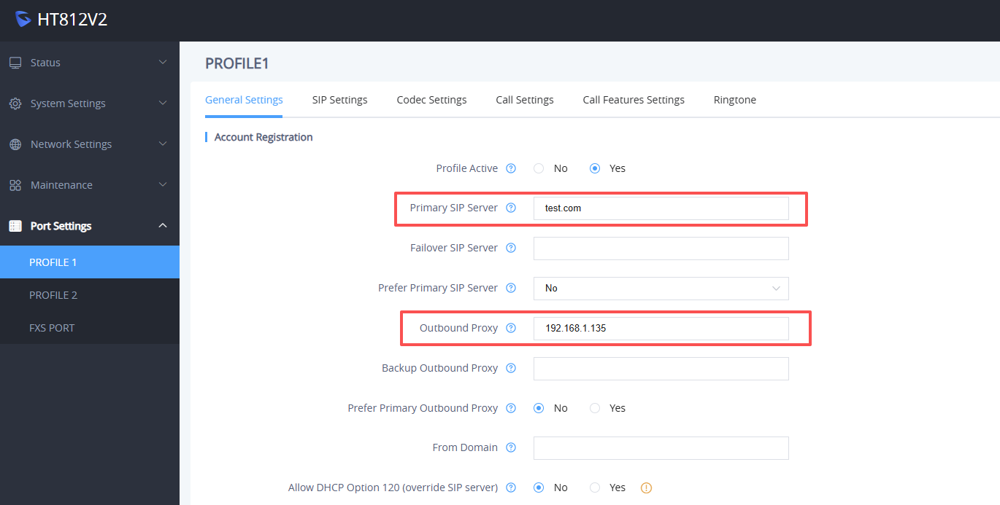
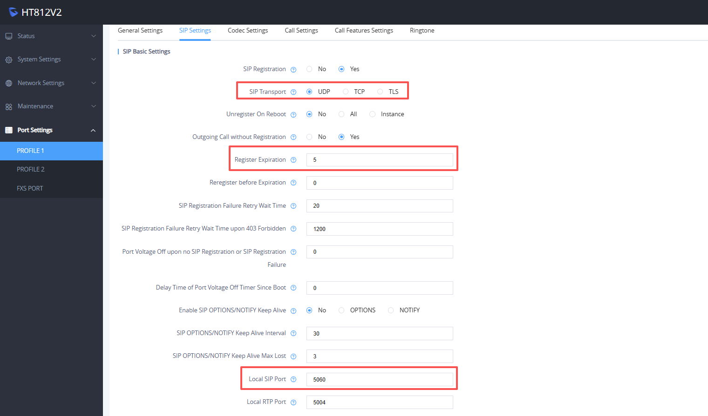
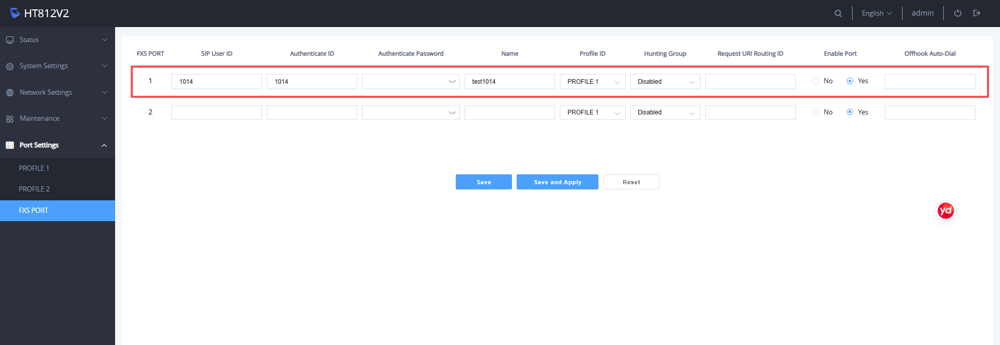

# Configuring Grandstream HTxxx

This guide explains how to configure a Grandstream HTxxx V2 analog telephone adapter (ATA) and register one of its FXS ports as an extension on PortSIP PBX.

This guide uses the **Grandstream HT812 V2** as an example. Menu names and available settings may vary slightly depending on the device model and firmware version.

### Prerequisites

Before you begin, make sure you have the following information:

* The IP address of the Grandstream HT812 V2
* The device administrator password
* The PortSIP PBX tenant SIP domain
* The PortSIP PBX server IP address
* The SIP transport protocol and port
* The extension number
* The extension SIP authentication password

***

### Configure the HT812 V2

#### 1. Sign in to the device web interface

1. Open a web browser and enter the IP address of the HT812 V2.
2. Sign in to the device web interface using the following credentials:
   * **Username:** `admin`
   * **Password:** The default administrator password printed on the device label

After you sign in successfully, the HT812 V2 web administration interface opens.

#### 2. Configure the SIP server

1. Go to **Port Settings > PROFILE 1 > General Settings**.
2. In **Primary SIP Server**, enter the PortSIP PBX tenant SIP domain.
3. In **Outbound Proxy**, enter the PortSIP PBX server IP address.
4. Click **Save and Apply**.

<figure><figcaption></figcaption></figure>

#### 3. Configure the SIP transport and registration interval

1. Go to **Port Settings > PROFILE 1 > SIP Settings**.
2. In **SIP Transport**, select the SIP transport protocol configured on PortSIP PBX.
3. In **Local SIP Port**, enter the corresponding local SIP port.
4. Set **Register Expiration** to `5`. Note: this is minutes, not seconds.
5. Click **Save and Apply**.

> **Note:** The SIP transport protocol and port must match the settings configured on PortSIP PBX. TLS commonly uses a different port from UDP or TCP.
>
> When using TLS, make sure the HT812 V2 trusts the certificate presented by PortSIP PBX or the PortSIP SBC.

<figure><figcaption></figcaption></figure>

#### 4. Configure the FXS port extension account

1. Go to **Port Settings > FXS PORT**.
2. In **SIP User ID**, enter the PortSIP PBX extension number.
3. In **Authenticate ID**, enter the SIP authentication ID assigned to the extension. In most deployments, this is the same as the extension number.
4. In **Authenticate Password**, enter the extension’s SIP authentication password.
5. Click **Save and Apply**.

<figure><figcaption></figcaption></figure>

***

### Verify the Configuration

After applying the configuration:

1. Open the **Status** page on the HT812 V2.
2. Confirm that the configured FXS port displays **Registered** or a similar registration status.
3. Connect an analog phone to the configured FXS port.
4. Place an inbound test call to the extension.
5. Place an outbound test call from the analog phone.
6. Confirm that the calls have two-way audio.
7. Confirm that DTMF input works correctly.

***

### Troubleshooting

If the FXS port fails to register, verify the following settings:

* The tenant SIP domain is correct.
* The outbound proxy address is correct.
* The selected SIP transport matches the PortSIP PBX configuration.
* The SIP port is correct.
* The extension number and authentication credentials are correct.
* The required SIP and RTP ports are permitted by the firewall.
* The HT812 V2 can reach PortSIP PBX or the PortSIP SBC over the network.
* The device time is correct, particularly when TLS certificate validation is enabled.
