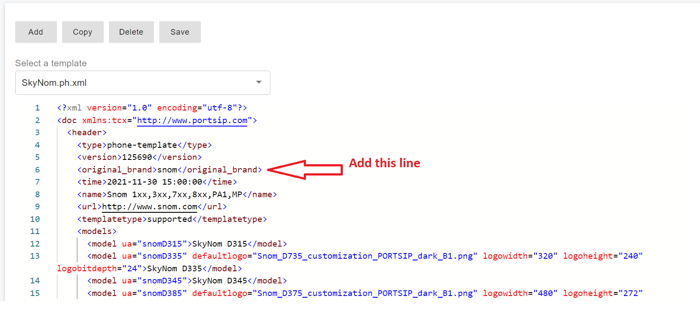

# Customing IP Phone Template

PortSIP PBX allows you to customize IP phone provisioning templates, enabling you to deliver a branded user experience and apply your own corporate identity to supported IP phones.

By creating custom templates, service providers and enterprises can present IP phones under their own brand while maintaining full provisioning and management functionality.

***

### Copying a Base Phone Template

1. Sign in to the PortSIP PBX Web Portal as the System Administrator.
2. Navigate to **Advanced > Phone Templates**.
3. From the **Select a Template** drop-down list, choose the **default template** you want to copy.
4. Verify that the phone models you intend to customize are included in the selected template.
5. Click **Copy**, enter a **new template name**, and click **OK**.

A new, editable phone template is created and ready for customization.

<figure><figcaption></figcaption></figure>

***

### Editing the Custom Phone Template

After copying the template, you can edit the following sections to apply your branding:

#### Template Name

* Update the `<name>` section to reflect your brand\
  **Example:** `PortSIP IP Phone`

***

#### Models Section (Optional)

* Update the `ua=xxx` value if required (not mandatory).
* Edit the **model description** to match your branding.

**Example changes:**

* `Fanvil V62` → `PortSIP V62`
* `Fanvil V65` → `PortSIP V65`

***

#### Description Section

* Update the template description to your branding name.

***

#### Friendly Device Name

Most templates include a section similar to the following:

```xml
<data>
  <device>
    <type>phone</type>
    <!-- Friendly Name -->
    <field name="Name">PortSIP Phone</field>
```

* Replace the **friendly name** with your branded phone name.

***

### SNOM Phone Templates (Special Requirement)

If your custom template is copied from a **SNOM** base template, you must add an additional tag.

SNOM phones require configuration files named using **uppercase MAC addresses**. Because it is not always obvious whether a template originated from a SNOM base, you must explicitly declare the original brand.

#### Required SNOM Tag

Add the following line to the custom template:

```xml
<original_brand>snom</original_brand>
```

> ❗ **Important**\
> This tag is required for proper provisioning of SNOM phones.\
> Without it, SNOM devices may fail to download or apply configuration files correctly.

Please refer to the example shown in the screenshot for reference.

<figure><figcaption></figcaption></figure>

***

### Saving the Custom Template

1. After completing all required edits, click **Save**.
2. The new custom template will appear in the template list.

When a tenant performs **auto-provisioning** for an IP phone, the **custom-branded phone models** will now be available for selection.

***

### Provisioning Phones with the Custom Template

* Select the desired **custom-branded phone model**
* Provision the device using the same workflow as a standard phone template

No additional steps are required during user or extension provisioning.

***

### Making Changes to Templates

Any changes made to a phone template in the **PBX Web Portal** will directly affect IP phones.

> ❗ **Important**\
> Always test template changes using a **sample device in a non-production environment** before deploying them system-wide.

***

#### Template Content Boundaries

Within the template file:

* The provisioning content starts **after** the following marker:

```xml
<![CDATA[
```

* All content **above** this marker is used by the **PBX Web Portal** and **must not be modified**.

> ❗ **Critical Warning**\
> Editing content above `<![CDATA[` may cause:
>
> * The custom template to disappear from the Web Portal
> * Extension settings to become inaccessible
> * The need to restore a backup or delete and recreate extensions

***

### Provisioning Precautions and Best Practices

* Avoid **duplicate provisioning parameters** for the same device.
* Always refer to the **vendor’s official provisioning guide**.
* If a value must be reverted to the device default, **explicitly set it back**—do not simply delete the parameter.
* When unsure, contact the **IP phone vendor** or **PortSIP support** for guidance.

***

### Yealink Phone-Specific Template Behavior

Yealink phones differ from most vendors and require **two configuration files** during provisioning.

As a result, Yealink templates contain **two `<![CDATA[` sections**, each generating a separate configuration file.

#### Yealink Provisioning Structure

1. **First `<![CDATA[` section (Y-files)**
   * Device default configuration
   *   Uses filenames such as:

       ```
       y0000000000xx.cfg
       ```
   * The `xx` value is a **model-specific identifier** defined by Yealink and **must not be changed**
2. **Second `<![CDATA[` section**
   * MAC-specific configuration
   * Contains **user-specific data**, such as extension number and credentials

> ❗ **Important**\
> When modifying Yealink templates, you must review and update **both `<![CDATA[` sections** to ensure consistent and correct provisioning behavior.


