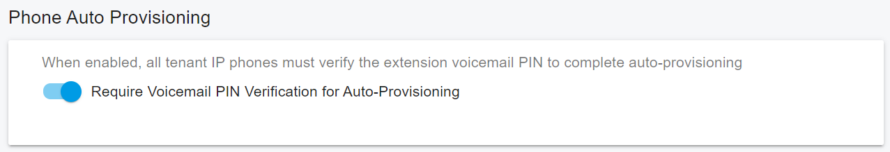
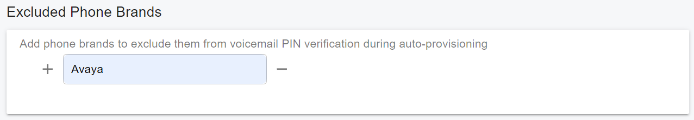

# PIN Verification for IP Phone Auto-Provisioning

Starting from **PortSIP PBX v22.6**, PortSIP PBX supports PIN verification during IP phone auto-provisioning.

When this feature is enabled, users must enter a PIN before the IP phone can download its provisioning configuration file. This helps protect IP phone provisioning security. Even if someone obtains the provisioning file URL, they cannot access the configuration file without the required PIN.

> ❗**Important:** We strongly recommend that PBX System Administrators or Tenant Administrators enable this feature to improve IP phone provisioning security.

***

### Overview

PortSIP PBX supports PIN verification for auto-provisioning at two levels:

| Level            | Description                                                                                                               |
| ---------------- | ------------------------------------------------------------------------------------------------------------------------- |
| **System Level** | Applies to all tenants and all extension users in the PBX system.                                                         |
| **Tenant Level** | Applies only to the current tenant. Tenant-level settings are affected only when the system-level setting is not enabled. |

***

### How System-Level and Tenant-Level Settings Work

#### System-Level Setting

If the PBX System Administrator enables **Require Voicemail PIN Verification for Auto-Provisioning** at the system level, all extension users in all tenants must verify their PIN during IP phone auto-provisioning.

This requirement applies even if the tenant-level setting is not enabled.

#### Tenant-Level Setting

If the PBX System Administrator does not enable this feature at the system level, each Tenant Administrator can enable it for their own tenant.

When enabled at the tenant level, only users in that tenant must verify their PIN during IP phone auto-provisioning.

***

### Configuring PIN Verification for Auto-Provisioning

#### For PBX System Administrators

1. Sign in to the PBX Web Portal as a **System Administrator**.
2. Navigate to **Advanced > Security**.
3. Click the **Password Policy** tab.
4. In the **Phone Auto Provisioning** section, turn on **Require Voicemail PIN Verification for Auto-Provisioning**.
5. Save the changes.

After this option is enabled, all tenants and extension users must verify their PIN when provisioning supported IP phones.

#### For Tenant Administrators

1. Sign in to the PBX Web Portal as a **Tenant Administrator**.
2. Navigate to **Company**.
3. Click the **Password Policy** tab.
4. In the **Phone Auto Provisioning** section, turn on **Require Voicemail PIN Verification for Auto-Provisioning**.
5. Save the changes.

After this option is enabled, users in the tenant must verify their PIN when provisioning supported IP phones.

> **Note:** If the System Administrator has already enabled this feature at the system level, the setting applies to all tenants. In that case, the tenant-level setting may not be required.

<figure><figcaption></figcaption></figure>

***

### Excluded Phone Brands

Some legacy IP phones may not support PIN verification during auto-provisioning.

To allow these phones to continue provisioning, the System Administrator can add the phone brand to the **Excluded Phone Brands** list.

When a phone brand is excluded, PortSIP PBX does not require PIN verification for phones of that brand during auto-provisioning.

> **Note:** Excluding a phone brand reduces provisioning security for those devices. Only exclude brands that cannot support PIN verification.

<figure><figcaption></figcaption></figure>

***

### User Experience During Auto-Provisioning

When PIN verification is enabled, the IP phone displays a prompt during auto-provisioning.

The user must enter the required PIN. After the PIN is verified successfully, the phone continues the provisioning process and downloads its configuration from the PBX.

If the PIN is incorrect, the provisioning process cannot continue.

***

### PIN Code Usage

PortSIP PBX uses different PIN fields depending on the device or provisioning scenario.

| Provisioning Scenario           | PIN Used for Verification                     |
| ------------------------------- | --------------------------------------------- |
| Extension IP phone provisioning | The extension’s voicemail PIN                 |
| DECT phone provisioning         | The device’s **Provisioning PIN**             |
| Hot Desking provisioning        | The Hot Desking device’s **Provisioning PIN** |

#### Extension IP Phones

When provisioning an IP phone for an extension, PortSIP PBX uses the extension’s **voicemail PIN** for verification.

Users must enter the voicemail PIN assigned to their extension.

#### DECT Phones and Hot Desking

Starting from **PortSIP PBX v22.6**, DECT phones and Hot Desking devices include a new field named **Provisioning PIN**.

When provisioning a DECT phone or Hot Desking device, PortSIP PBX uses this **Provisioning PIN** instead of an extension voicemail PIN.

***

### Upgrade Considerations

If you upgrade from a version earlier than **v22.6** and then enable PIN verification for auto-provisioning, review your DECT phones and Hot Desking devices.

You must set the **Provisioning PIN** for each DECT phone and each Hot Desking device before users can complete PIN-verified provisioning.

***

### Best Practices

* Enable PIN verification for auto-provisioning whenever possible.
* Use strong voicemail PINs and provisioning PINs.
* Avoid simple PINs such as `0000`, `1234`, or the extension number.
* Exclude phone brands only when they cannot support PIN verification.
* Review DECT phones and Hot Desking devices after upgrading to v22.6 or later.
* Keep provisioning URLs private, even when PIN verification is enabled.

***

### Important Notes

* This feature is available from **PortSIP PBX v22.6**.
* System-level settings apply to all tenants.
* Tenant-level settings apply only when the system-level setting is not enabled.
* For extension IP phones, the extension’s voicemail PIN is used for verification.
* For DECT phones and Hot Desking devices, the **Provisioning PIN** is used for verification.
* If a phone brand is added to **Excluded Phone Brands**, phones of that brand do not require PIN verification during auto-provisioning.
