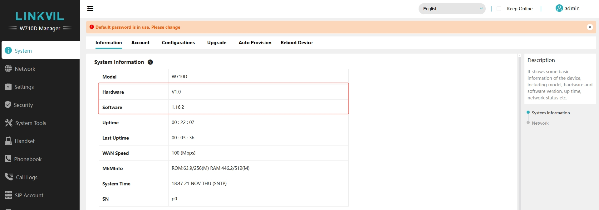
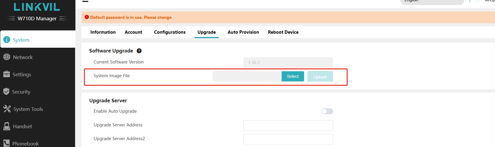
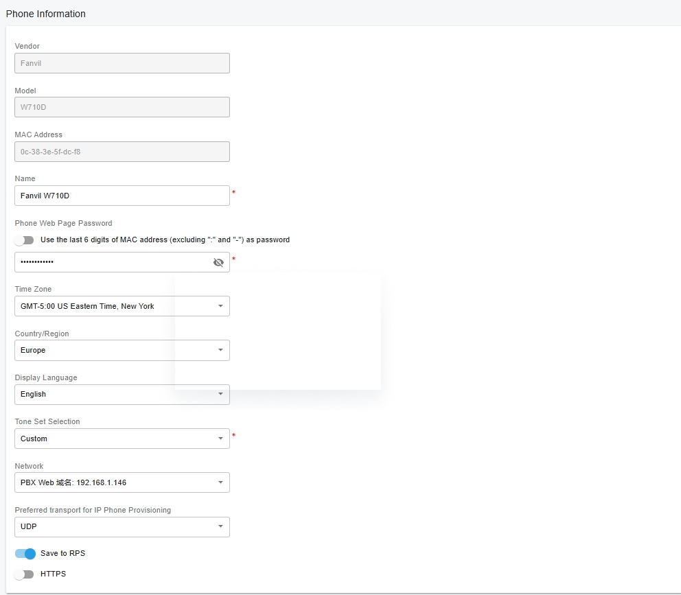
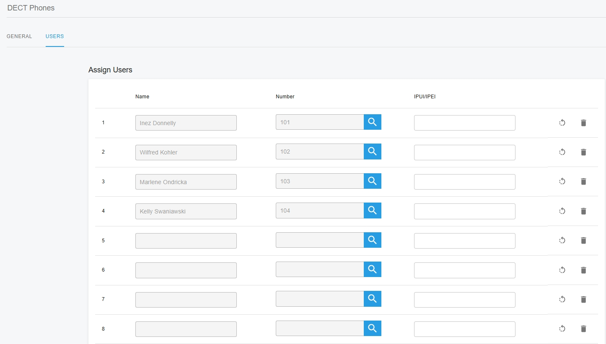
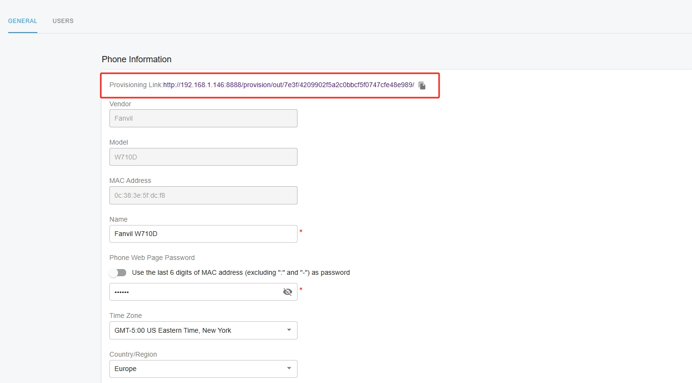
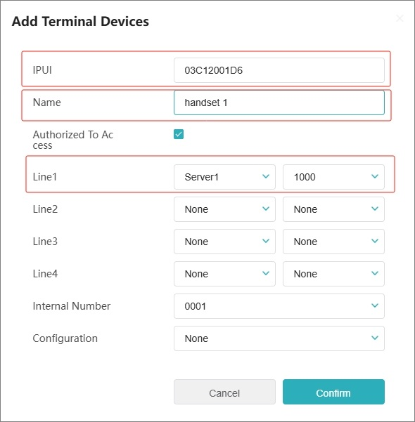

# Provision Fanvil DECT IP Phones

### Supported Fanvil DECT IP Phone Models

This guide applies to the following **Fanvil DECT models**:

* **W710D**
* **W710H**

***

### Factory Reset the Fanvil DECT System

It is recommended to factory reset the DECT system before provisioning or upgrading firmware.

#### Reset Using the Hardware Button

1. Press and hold the **Reset** button on the device for **at least 10 seconds**.
2. Release the button.
3. The device will reset and reboot automatically.

***

#### Reset via Web Interface (Alternative Method)

You can also perform a factory reset from the web interface:

1. Sign in to the **Fanvil DECT Manager** web portal.
2. Navigate to **System > Configurations > Reset Devices > Reset**.
3. Click **Reset to Factory Settings**.

***

### Upgrade the DECT Base and Handsets to the Latest Firmware

Before provisioning with PortSIP PBX, ensure that both the **DECT base station** and **handsets** are running the **latest supported firmware**.

<figure><figcaption></figcaption></figure>

***

#### Download the Firmware

1. Visit the **official Fanvil website**.
2. Go to **Software**.
3. Select your **Fanvil DECT model**.
4. Download the latest **firmware image file**.

***

#### Upgrade the DECT Base Station Firmware

1. Open a web browser and sign in to the **Fanvil DECT Manager** web interface.
2. Navigate to **System > Upgrade > Software Upgrade > System Image File**.
3. Click **Select**, choose the downloaded firmware image file, then click **Upload**.
4. Wait for the upgrade process to complete. The device may reboot automatically.

<figure><figcaption></figcaption></figure>

***

#### Multiple Base Stations (W710H)

If you are using **Fanvil W710H**:

* Repeat the firmware upgrade process for **each base station** connected to the DECT Manager.

***

#### Upgrade Handset Firmware

Handset firmware can be upgraded using the **same procedure**:

1. Navigate to **System > Upgrade > Software Upgrade > System Image File**.
2. Upload the handset firmware image.
3. Start the upgrade process and allow the handset to reboot if prompted.

> ❗**Important**\
> Before performing the upgrade, ensure the handset is placed in the **charging cradle** and the battery level is **above 50%**.

***

### Add a DECT Phone in PortSIP PBX

Follow the steps below to add a **DECT phone** to **PortSIP PBX**.

#### To add a DECT phone:

1. Sign in to the PortSIP PBX Web Portal.
2. Navigate to **Call Manager > DECT Phones**.
3. Click **Add**.\
   The **Add DECT Phone** window appears.
4. Select the **phone model** and enter the **MAC address** of the DECT base station.
5. Click **OK**.
6. Enter a **descriptive name** for the DECT phone to help identify it easily.
7. In the **Network** field, select the **network interface** the DECT phone will use.
8.  In the **Country/Region** field, select the appropriate **country and region**.

    > The selected country/region **must match the configuration of the DECT base station**.
9. Select the **transport protocol** the phone will use to send and receive SIP signaling with the PBX (for example, **UDP**, **TCP**, or **TLS**).
10. If your PBX is deployed in the cloud, enable **Save to RPS**.

<figure><figcaption></figcaption></figure>

***

### Assign Users to Handsets

After adding the DECT phone, you need to assign users to the handsets.

#### To assign users to handsets:

1. Click the **Users** tab.
2. For each handset, select the **user(s)** you want to assign.

<figure><figcaption></figcaption></figure>

***

### Auto-Provision Handsets via RPS

If your PortSIP PBX is deployed in the **cloud** and you enabled **Save to RPS** when configuring the DECT phone in the previous steps, handset provisioning is performed automatically.

With **Save to RPS** enabled:

* The DECT base station downloads its **configuration file** from the vendor’s **Remote Provisioning Server (RPS)**.
* The base station automatically provisions all associated **handsets**.
* All handsets registered to this DECT base station are **automatically registered with PortSIP PBX**, without manual configuration.

***

### Manually Provision Handsets

If your PortSIP PBX is deployed **on-premises without Internet access**, or if you **disabled the Save to RPS option**, you must provision the DECT handsets manually.

#### To manually provision handsets:

1. Sign in to the PortSIP PBX Web Portal.
2. Navigate to **Call Manager > DECT Phones**.
3. **Double-click** the DECT phone you want to provision.
4. **Copy the provisioning URL**.

<figure><figcaption></figcaption></figure>

***

#### Configure the DECT Base Station

5. Open a web browser and enter the **IP address of the DECT base station**.
6. Sign in to the DECT base station web interface.
7. Navigate to **System > Auto Provision > Static Provisioning Server**.
8. Configure the following fields:
   * **Server Address**: Paste the copied **provisioning URL**
   *   **Configuration File Name**: Enter

       ```
       {mac}.cfg
       ```
9. Click **Apply** to save the settings.
10. Click **Auto Provision Now** to start the provisioning process.

***

### Pair the Handset with the DECT Base Station

Follow the steps below to pair a handset with the DECT base station.

#### Step 1: Open the DECT Base Station Web Interface

1. Open a web browser.
2. Enter the **IP address of the DECT base station** to access its web interface.

***

#### Step 2: Add the Handset on the Base Station

1. In the web interface, navigate to **Handset > Maintenance**.
2. Click **Add**.
3. Enter the following handset details:
   * **IPUI** of the handset
   * A **friendly name** to identify the handset
4. Select the corresponding **extension number** for the handset.
5. Click **Confirm** to save the settings.

***

#### Step 3: Verify Country and Region Settings

Ensure that the **Country/Region** selected for the handset (for example, **W601D**) matches the configuration of the DECT base station.

> **Important**\
> If the country or region setting is changed, the system will **restart automatically**.

***

#### Step 4: Connect the Handset to the Base Station

1. On the handset, navigate to **Menu > Networks > Available Networks**.
2. Tap **Scan** to search for available DECT networks.
3. Select the target **base station** from the list.
4. Enter the **password**, then tap **Confirm** to complete the pairing.

<figure><figcaption></figcaption></figure>


