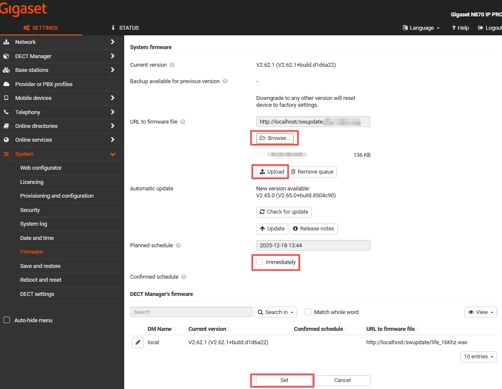
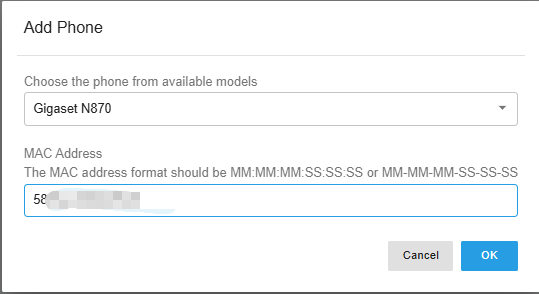
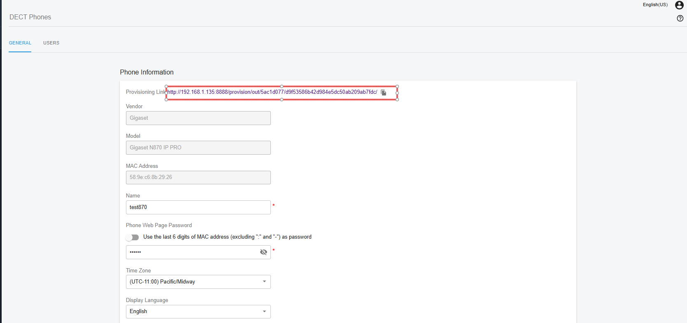
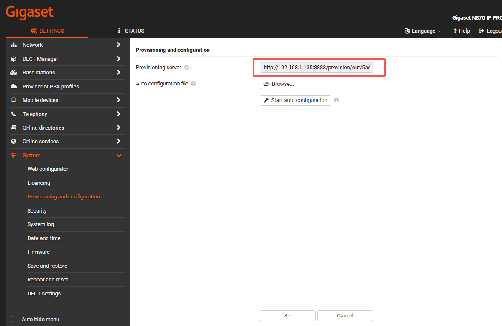
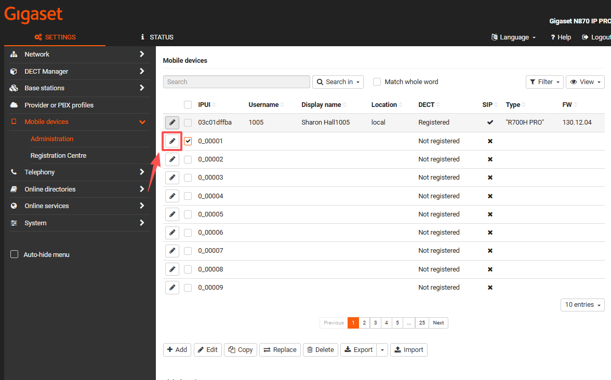
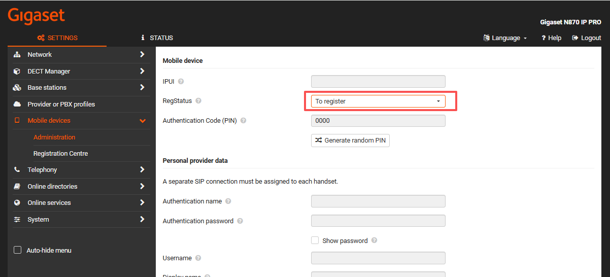

# Provision Gigaset DECT IP Phones

### Supported Gigaset DECT IP Phone Models

This guide applies to the following models:

* **N610**
* **N670**
* **N770**
* **N870**

> ❗ Note
>
> For the **N610** and **N670**, this guide applies **only to the “Regular” role** and **does not cover the “Internal Telephony” role**.

***

### Enable DHCP All-in-One Mode

1. Press and hold the **base station button** for **10 seconds** until the LED turns off.
2. When the **green LED** turns on, the device is in **DECT Base** mode.
3. Press the base station button again until **both LEDs turn blue**, indicating **Integrator / DECT Manager and Base** mode.
4. Press and hold the base station button for **5 seconds** to confirm the new mode.
5. The device may take up to **5 minutes** to reboot and come online in **Integrator / DECT Manager and Base** mode with **factory default settings**.
6. After the reboot, the base station LEDs will display **different colors** to indicate the current operating status.

***

### Upgrade to the Required Firmware

Download the latest supported firmware version and install it using the steps below:

1. Enter the **IP address of the device** in your web browser.
2. In **Settings**, navigate to **System > Firmware**.
3. Click **Browse** and select the downloaded firmware file.
4. Click **Upload**, check the **Immediate** option, and then click **Set** to start the firmware upgrade.

<figure><figcaption></figcaption></figure>

***

### Configure the PBX in PortSIP Web Portal

1. Obtain the **MAC address** of the device.
2. In **PortSIP Tenant Management**, navigate to **Call Manager > DECT Phones**.
3. Click **Add**.
4. Select the appropriate **model**, enter the **MAC address**, and click **OK**.

<figure><figcaption></figcaption></figure>

5. Go to the **Users** menu and select the **extension** to bind to the device.
6. Copy the displayed **Provisioning URL** for later use.

<figure><figcaption></figcaption></figure>

***

### Configure the Device Using the Web Interface

1. Enter the **device IP address** in your web browser.
2. In **Settings**, navigate to **System > Provisioning and Configuration**.
3. In the **Provisioning Server** field, paste the **Provisioning URL** copied earlier.
4. Click **Set**, then click **Start auto configuration**.

<figure><figcaption></figcaption></figure>

***

### Register the DECT Handsets

1. Enter the **device IP address** in your web browser and navigate to **Mobile Devices > Administration**.
2. Click **Edit**.

<figure><figcaption></figcaption></figure>

3. Set the **RegStatus** field to **To register**, then click **Register now**.

<figure><figcaption></figcaption></figure>

4. Navigate to **Mobile Devices > Registration Centre**, then click **Start now**.

<figure><figcaption></figcaption></figure>

5. Press the **Register** button on the handset and enter the **PIN code**\
   (default: **0000**) to complete handset registration.

