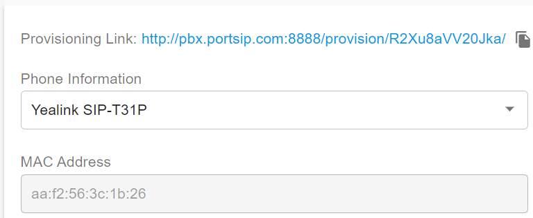

# Provision Phone Using DHCP Option 66

### What Is DHCP Option 66?

For most environments, **RPS (Redirection and Provisioning Service)** is the simplest way to provision IP phones. However, in scenarios where:

* Internet access is blocked for phones
* Legacy phones are in use
* A large number of phones must be provisioned on a local network

**DHCP Option 66** provides an effective alternative.

> (Despite the name, DHCP Option 66 has nothing to do with the famous Route 66.)

**DHCP Option 66** is a configuration option on a DHCP server that allows you to specify a **provisioning server URL** for devices. In the case of PortSIP PBX, Option 66 is set to the **provisioning root URL** of the PBX.

#### Provisioning Flow with Option 66

The provisioning process works as follows:

1. The phone boots up
2. The phone requests an IP address from the DHCP server
3. The DHCP server returns:
   * An IP address
   * **DHCP Option 66**, containing the provisioning URL
4. The phone uses this URL to download its configuration file from **PortSIP PBX**, based on its MAC address

<figure><figcaption></figcaption></figure>

***

### Copying the Provisioning Link

> ⚠️ **Security Note**\
> For security reasons, you must **disable Auto-Provisioning Security Enhancement** before provisioning phones using DHCP Option 66.\
> Refer to the article "[**DHCP Option 66 and Auto-Provisioning in PortSIP PBX**](auto-provisioning-security.md#dhcp-option-66-and-auto-provisioning-in-portsip-pbx)**"** for details.

Each PortSIP PBX installation uses a **unique provisioning URL**. To obtain it:

1. Sign in to the **PBX Web Portal**
2. Navigate to **Call Manager > Phones**
3. Select a phone and click **Edit**
4. Open the **Phone Provisioning** tab
5. Configure the phone and click **OK**
6. Reopen the **Phone Provisioning** tab

If the phone is successfully configured, the **Provisioning Link** appears at the top of the page (see screenshot below).

***

#### Determining the Provisioning Root Folder

The provisioning link includes a **randomly generated folder name** for security.

**Example:**

```http
http://pbx.portsip.com:8888/provision/R2Xu8aVV20Jka/
```

* `pbx.portsip.com` – Your PBX FQDN
* `R2Xu8aVV20Jka` – Random provisioning folder name

This **root folder URL** should be used for **DHCP Option 66**, unless you are using **SNOM phones**.

***

#### Special Note for SNOM Phones

* If your **PortSIP PBX version is earlier than v16.2**, append `cfg{mac}` to the URL:

```
http://pbx.portsip.com:8888/provision/R2Xu8aVV20Jka/cfg{mac}
```

* If your **PortSIP PBX version is v16.2 or later**, this step is **not required**.

<figure><figcaption></figcaption></figure>

***

### Configuring DHCP Option 66

The example below uses a **Microsoft DHCP Server**, but the concept applies to all DHCP servers.

#### DHCP Scope Options

You can configure Option 66 at different scope levels:

* **Global Scope**\
  Applies to all DHCP clients
* **Reservation Scope**\
  Applies only to devices matching a specific MAC address
* **Dynamic Scope**\
  Uses the Vendor Class Identifier (VCI)

#### Best Practice

* If all phones use the **same provisioning format** (Yealink, Fanvil, Grandstream, Dinstar, ALE, Htek), use a **Global Scope**
* If you also have **SNOM phones**, create **separate reservations** for them, as they require a different URL format

***

#### Steps to Configure Option 66 (Microsoft DHCP Server)

1. Open the **DHCP Server** management console
2. Navigate to **IPv4 > Scope > Scope Options**
3. Right-click and select **Configure Options…**
4. Locate **Option 66 – Boot Server Host Name**
5. Paste the **PortSIP provisioning root URL**
6. Click **OK**
7. Restart the **DHCP Server**

<figure><figcaption></figcaption></figure>

<figure><figcaption></figcaption></figure>

***

### Restart the IP Phones

After configuring DHCP Option 66:

1. Restart the IP phone
2. The phone requests a new IP address
3. The DHCP server supplies Option 66
4. The phone downloads its configuration from PortSIP PBX
5. The phone applies the settings and registers automatically

Once complete, the phone is fully provisioned and ready for use.

