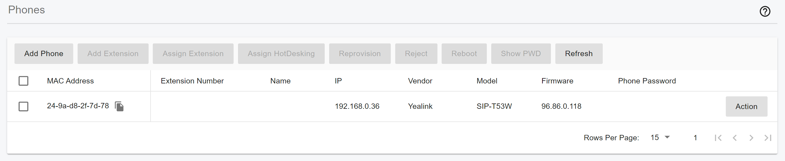
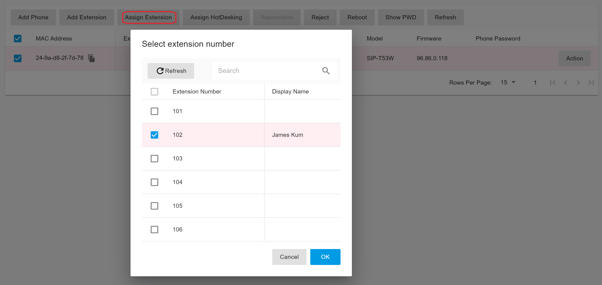
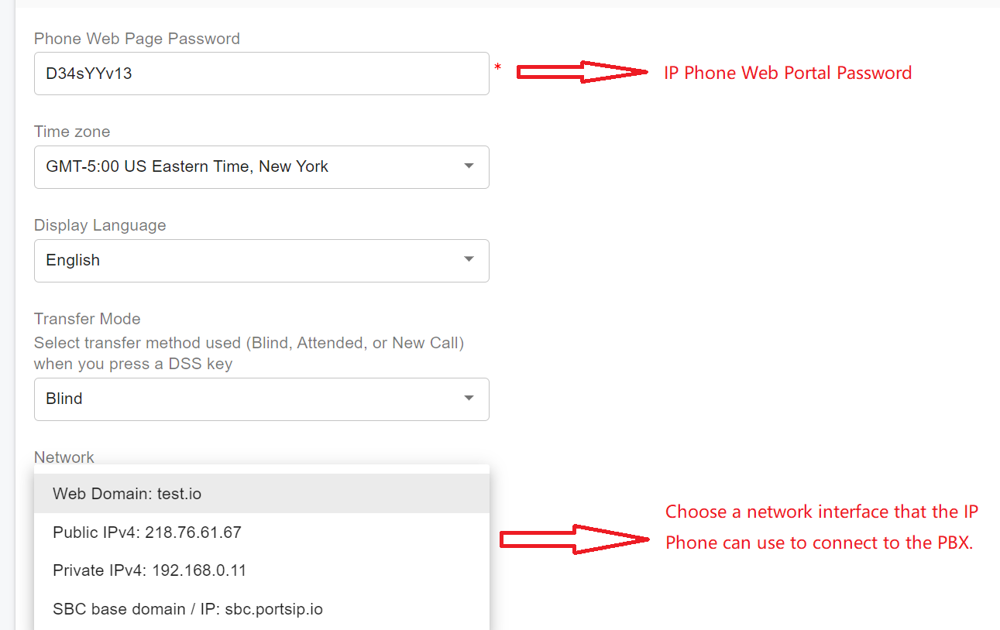
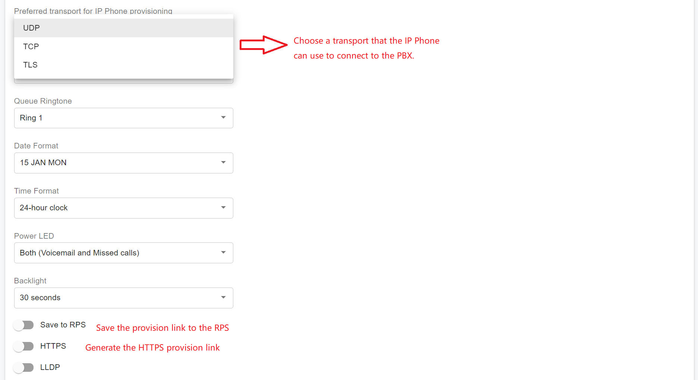
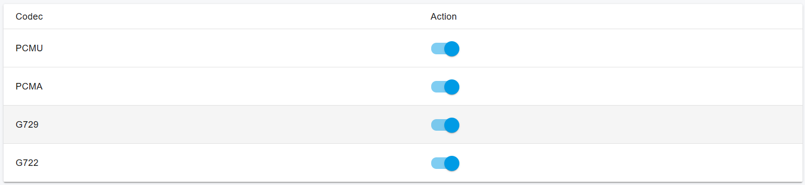
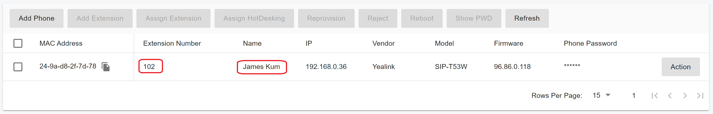

# Provision Phone Using PnP

### Topology Requirements

PnP provisioning requires that:

* The **PortSIP PBX** is running on the **default SIP port (5060)**.
* The **IP phones** are located on the **same local LAN subnet** as the PortSIP PBX.

<figure><figcaption></figcaption></figure>

***

### Auto-Provisioning Phones with Plug and Play

To provision IP phones automatically using **Plug and Play (PnP)**, follow these steps:

1. **Connect the phone**\
   Plug the IP phone into the network.
2. **Phone discovery**\
   The phone sends a **multicast message** on the local LAN, which is detected by the PortSIP PBX.
3. **Phone detection in the Web Portal**\
   The phone appears as a new device under **Call Manager > Phones** in the Web Portal.

<figure><figcaption></figcaption></figure>

4. **Assign an extension**
   * Select the phone and click **Assign Extension** to associate it with an existing extension, **or**
   * Click **Add Extension** to create a new extension for the phone.

<figure><figcaption></figcaption></figure>

5. **Configure phone settings**\
   Navigate to the extension’s **Phone Provisioning** tab and configure additional settings as needed.
6. **Enter phone credentials**\
   Enter the password required to access the **IP phone web portal**.
7. **Set language and time zone**\
   Select the **Phone Display Language** and **Time Zone** for the phone.
8. **Select network interface and transport**\
   Choose the **network interface** the IP phone uses to connect to the PBX.\
   This typically corresponds to the **Outbound Proxy Server** used by the phone.

<figure><figcaption></figcaption></figure>

As shown in the screenshot above, you can also select the **transport protocol** (UDP/TCP/TLS) for the phone.

* **Save to RPS** allows the provisioning link to be saved to the phone’s **RPS (Redirect and Provisioning Server)**.
* **HTTPS** determines whether the provisioning URL is generated using HTTPS.

<figure><figcaption></figcaption></figure>

9. **Configure audio codecs**\
   Enable or disable **audio codecs** for the phone by toggling the codec options, as shown in the screenshot below.

<figure><figcaption></figcaption></figure>

10. **Apply settings**\
    Click **OK** to save the configuration.

***

#### Provisioning Completion

After the configuration is saved:

* The PBX generates a **provisioning URL** for the phone.
* The phone downloads the **configuration file** using the provisioning link.
* The phone applies the settings and **automatically registers** with the **PortSIP PBX**.

Once provisioning is complete, the phone is fully **managed through the PortSIP PBX Web Portal**.\
You can view the registered phone under **Call Manager > Phones**, as shown in the screenshot below.

<figure><figcaption></figcaption></figure>

***

### Provisioning Phones Using the Provisioning Link Manually

Remote IP phones that are not located on the same LAN as the PortSIP PBX—and therefore cannot broadcast SIP multicast messages—must be provisioned manually using a provisioning link.

To provision a remote phone manually, follow these steps:

1. **Add a new phone**
   * In the PortSIP PBX Web Portal, navigate to **Call Manager > Phones**.
   * Click **Add Phone**.
2. **Select the extension**
   * Choose the extension that will be associated with the phone.
3. **Enter the MAC address**
   * Enter the phone’s **MAC address**, which can usually be found on the label at the bottom of the device.
4. **Select the phone model**
   * Choose the appropriate **phone model** from the drop-down list.
5. **Enter phone credentials**
   * Enter the password required to access the **IP phone web portal**.
6. **Set language and time zone**
   * Select the **Phone Display Language** and **Time Zone** for the phone.
7.  **Select network interface and transport**

    * Choose the **network interface** the IP phone uses to connect to the PBX.\
      This typically corresponds to the **Outbound Proxy Server** used by the phone.

    <figure><figcaption></figcaption></figure>

    * Select the **transport protocol** (**UDP**, **TCP**, or **TLS**) as shown in the screenshot above.
    * **Save to RPS** allows the provisioning link to be saved to the phone’s **RPS (Redirect and Provisioning Server)**.
    * **HTTPS** determines whether the provisioning URL is generated using **HTTPS**.

<figure><figcaption></figcaption></figure>

8. **Configure audio codecs**

* Enable or disable **audio codecs** for the phone by toggling the codec options, as shown in the screenshot below.

<figure><figcaption></figcaption></figure>

9. **Apply settings**

* Click **OK** to save the configuration.

***

#### Provisioning Completion

After the configuration is saved:

* The PBX generates a **provisioning URL** for the phone.
* The phone downloads the **configuration file** using the provisioning link.
* The phone applies the settings and **automatically registers** with the **PortSIP PBX**.

Once provisioning is complete, the phone is fully **managed through the PortSIP PBX Web Portal**.\
You can view the registered phone under **Call Manager > Phones**, as shown in the screenshot below.

<figure><figcaption></figcaption></figure>

