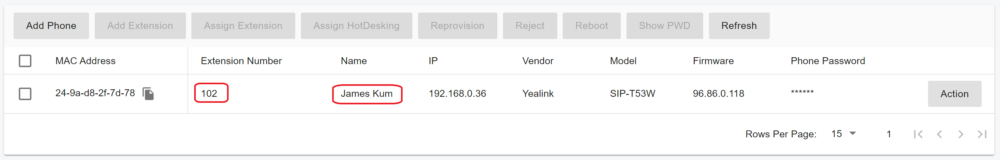

# Provision Phone Using RPS

When the PortSIP PBX is deployed in the cloud, IP phones can be auto-provisioned using **RPS** (Redirection and Provisioning Service).

PortSIP PBX supports RPS for the following IP phone vendors:

* [Fanvil](https://www.fanvil.com)
* [Yealink](https://www.yealink.com)
* [GrandStream](https://www.grandstream.com/)
* [SNOM](https://www.snom.com)
* [ALE](https://www.al-enterprise.com/)
* [Htek](https://www.htek.com/)
* [Gigaset](https://www.gigaset.com/)

If you are using an IP phone from one of the vendors listed above, you can provision the phone automatically without manually copying the provisioning link.\
In this deployment scenario, the PnP method is not available, and RPS must be used instead.

<figure><figcaption></figcaption></figure>

***

### ❗ **Warning**

\
By default, when you provision IP phones and other devices using **RPS**, PortSIP PBX uses **PortSIP’s RPS account** with each supported phone vendor’s RPS service. This means the device’s provisioning information (for example, the configuration URL/link) is stored under the vendor RPS account created for PortSIP.

If you do not want your provisioning information stored under PortSIP’s vendor RPS account, configure and use **your own private RPS account** instead. For instructions, see [Configuring Private RPS Account.](configuring-private-rps-account.md)

***

### Provisioning a Remote Phone Using RPS

> ❗ **Important**: Before using RPS auto provisioning with PortSIP PBX, ensure that the target IP phone has not been previously provisioned by another PBX using RPS.If a phone is already registered in an RPS (Redirect and Provisioning Service) under a different PBX, auto provisioning with PortSIP PBX will fail.&#x20;
>
> 1. Verify that the phone is not associated with another PBX in the vendor’s RPS system.&#x20;
> 2. If the phone was previously provisioned by another PBX using RPS, Delete or unbind the phone from the existing RPS configuration in the other PBX.

To provision a remote IP phone via RPS, follow the steps below.

#### Add a New Phone

1. **Open the Phones page**\
   In the PortSIP PBX Web Portal, navigate to **Call Manager > Phones**.
2. **Add the phone**\
   Click **Add Phone**.
3. **Select the extension**\
   Choose the extension that will be associated with the phone.
4. **Enter the MAC address**\
   Enter the phone’s **MAC address**, which is usually printed on the label at the bottom of the device.
5. **Select the phone model**\
   Choose the appropriate **phone model** from the drop-down list.
6. **Enter phone credentials**\
   Enter the password required to access the **IP phone web portal**.
7. **Set language and time zone**\
   Select the **Phone Display Language** and **Time Zone**.
8.  **Select network interface and transport**

    * Choose the **network interface** the phone will use to connect to the PBX.\
      Since the PBX is hosted in the cloud, select the **public IP** network interface.
    * This typically corresponds to the **Outbound Proxy Server** used by the phone.

    <figure><figcaption></figcaption></figure>

    * Select the **transport protocol** (**UDP**, **TCP**, or **TLS**).
    * Enable **Save to RPS** to store the provisioning link in the phone vendor’s RPS.
    * Enable **HTTPS** if the provisioning URL should be generated using HTTPS.

<figure><figcaption></figcaption></figure>

9. **Configure audio codecs**\
   Enable or disable **audio codecs** for the phone by toggling the codec options, as shown in the screenshot below.

<figure><figcaption></figcaption></figure>

10. **Save the configuration**\
    Click **OK**. The PortSIP PBX saves the provisioning link to the IP phone’s **RPS**.

***

### Restart the IP Phone

When the IP phone powers on or restarts:

* The phone queries the **RPS server** using its **MAC address**
* The RPS server returns the **provisioning URL**
* The phone downloads the configuration file automatically
* The phone applies the settings and registers with the **PortSIP PBX**

***

### Provisioning Completion

After provisioning is complete:

* The phone is **automatically registered** with the PortSIP PBX
* The phone can be fully **managed from the PortSIP PBX Web Portal**
* You can view the registered phone under **Call Manager > Phones**, as shown in the screenshot below

<figure><figcaption></figcaption></figure>

