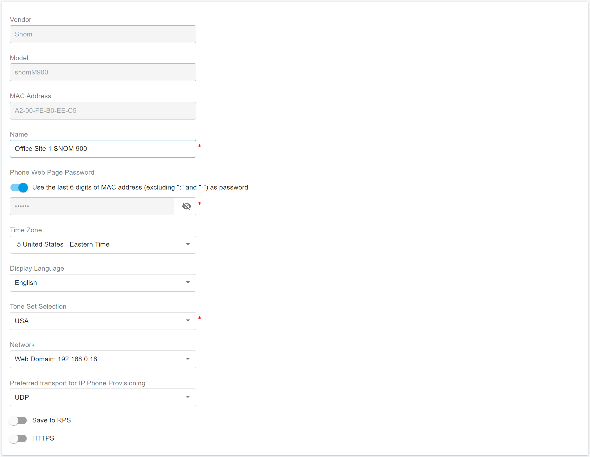
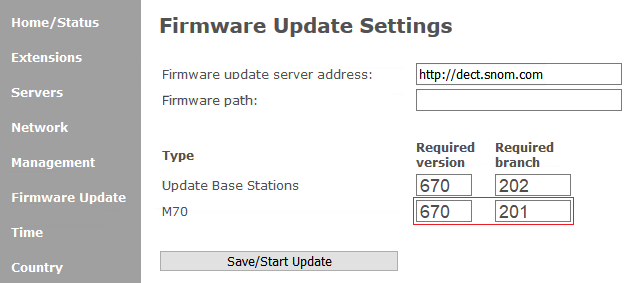

# Provision Snom DECT IP Phones

### Supported Snom DECT Models

This guide applies to the following SNOM DECT base stations:

* **M300**
* **M400**
* **M700**
* **M900**

***

### Factory Reset the Snom DECT System

Before provisioning, it is recommended to reset both the **base station** and **handsets** to factory defaults.

***

#### Reset the Snom DECT Base Station

_(M300, M400, M700, M900)_

1. Press and hold the **Reset** button on the base station for **at least 10 seconds**.
2. Release the button and allow the base station to restart.

After the restart, the base station is restored to factory default settings.

***

#### Reset Snom DECT Handsets

_(M25, M65, M70, M80, M85, M90)_

1. Press the **Menu** key on the handset.
2. Navigate to **Settings > Reset settings**.
3. Select **Yes** to confirm.
4. Enter the PIN **0000**, then press **OK**.
5. Wait for the handset to restart.

After the restart, the handset is successfully reset to factory defaults.

***

### Upgrade the Base Station Firmware

Before provisioning your SNOM DECT system with PortSIP PBX, ensure the base station is running the **latest required firmware**.

#### Check and Update Firmware

1. Open a web browser and navigate to the **IP address of the DECT base station**.
2. Log in using the default credentials:
   * **Username:** `admin`
   * **Password:** `admin`
3. Go to **Home / Status > Firmware Version**.
4. Compare the **Version** and **Branch** with the latest firmware available on the SNOM support website.
5.  Navigate to **Firmware Update** and enter the following:

    * **Firmware update server address:**\
      `http://dect.snom.com`
    * **Required Version:**\
      Enter the latest firmware version provided by SNOM.
    * **Required Branch:**\
      Enter the required branch for your model.

    > **Example**\
    > At the time this guide was written, the latest firmware for the **M900** base station was:
    >
    > * Version: **670**
    > * Branch: **202**
6. Click **Save / Start Update**.

<figure><figcaption></figcaption></figure>

***

#### Firmware Upgrade Process

* The firmware upgrade will begin after a short delay.
* During the upgrade, the **LED on the base station will flash red**, indicating that the update is in progress.

***

> ❗**Important**\
> The firmware upgrade process may take several minutes.\
> **Do not power off, restart, or interrupt** the base station during the upgrade.

***

### Troubleshooting

If you encounter any issues during the firmware upgrade:

* Refer to the **SNOM user guide troubleshooting section**, or
* Contact **SNOM technical support** or your **PortSIP support representative** for assistance.

Here also have the SNOM official guides:

* [How to update M300,M700,M900 DECT Base Station manually](https://service.snom.com/display/wiki/How+to+update+M300%2CM400%2CM700%2CM900+DECT+Base+Station+manually)
* [How to update M-Series - DECT handsets](https://service.snom.com/display/wiki/How+to+update+M-Series+-+DECT+handsets)

***

### Add a DECT Phone in PortSIP PBX

Follow the steps below to add an **SNOM DECT phone** to the **PortSIP PBX**.

#### To add a DECT phone:

1. Sign in to the PortSIP PBX Web Portal.
2. Navigate to **Call Manager > DECT Phones**.
3. Click **Add**.\
   The **Add DECT Phone** window appears.
4. Select the **phone model** and enter the **MAC address** of the DECT base station.
5. Click **OK**.
6. Enter a **descriptive name** for the DECT phone to help identify it easily.
7. In the **Network** field, select the **network interface** that the DECT phone will use.
8. Select the **transport protocol** the phone will use to send and receive SIP signaling with the PBX (for example, UDP, TCP, or TLS).

<figure><figcaption></figcaption></figure>

***

### Assign Users to Handsets

After adding the DECT phone, assign users to the handsets to enable calling and user-specific behavior.

#### To assign users to handsets:

1. Open the **Users** tab.
2. For each handset, select the **user(s)** you want to assign.
3. (Optional) To restrict a user to a specific handset, enter the handset’s **IPUI/IPEI** in the corresponding field.
   * Leave this field **blank** if you do not want to apply any handset restriction.
4. Click **OK** to save the settings.

> ❗**Important**\
> Verify the **IPUI/IPEI** values carefully before saving. Entering an incorrect value may prevent the user from registering or receiving calls.

<figure><figcaption></figcaption></figure>

***

### Remove IPUI/IPEI Restriction for a User

If you need to remove a handset restriction for a user, you can clear the assigned IPUI/IPEI.

#### To remove the IPUI/IPEI restriction:

1. Locate the user’s **IPUI/IPEI** field.
2. Enter **`FFFFFFFFFF`** in the IPUI/IPEI field.
3. Save your changes.

***

### Enter the Provisioning URL in the DECT Web UI

After configuring the DECT phone in PortSIP PBX, you must enter the **provisioning URL** in the DECT base station’s web interface to provision the handsets.

#### Step 1: Copy the Provisioning URL from PortSIP PBX

1. Sign in to the PortSIP PBX Web Portal.
2. Navigate to **Call Manager > DECT Phones**.
3. Double-click the desired **DECT phone** to open its settings.
4. Copy the **Provisioning URL**.

<figure><figcaption></figcaption></figure>

***

#### Step 2: Configure the DECT Base Station

1. Open a web browser and enter the **IP address of the DECT base station**.
2. Log in to the DECT web interface.
3. Navigate to **Management > Configuration > Configuration Server Address Settings**.
4. Paste the copied **Provisioning URL** into the appropriate field.
5. Click **Save and Reboot**.

<figure><figcaption></figcaption></figure>

***

### Register Snom Handsets and Assign Users

After completing the configuration, register the SNOM handsets with the DECT base station and assign them to users.\
Register the handsets **in the same numerical order** used during the configuration process.

#### To register a handset and assign a user:

1. On the handset, press the **Menu** button.\
   &#xNAN;_(For the M25 handset, press the **center button** of the navigation circle.)_
2. Navigate to **Connectivity**, then press the **center button** to select it.
3. Select **Register**.
4. When prompted for the **Access Code**, enter **0000**, then press **OK**.
5. Wait for the registration process to complete.

Once registration is successful, the handset is **automatically assigned** to the corresponding user.

#### Repeat for Additional Handsets

Repeat the steps above for each handset you want to register with the base station.

***

### Upgrade Snom Handset Firmware

To upgrade a SNOM handset’s firmware, the handset must already be **paired with the DECT base station** and **registered as an extension**.\
This procedure can be performed **only after**:

* The DECT base station has been upgraded to the required firmware
* The base station has been provisioned by PortSIP PBX
* The handsets have been successfully registered (paired)

> ❗**Important**\
> Before performing the upgrade, ensure the handset is placed in the **charging cradle** and the battery level is **above 50%**.

***

### Check the Current Handset Firmware Version

1. On the handset, press the **Menu** key.
2. Navigate to **Settings > Status > Handset status**.
3. Locate the **SW version**, which indicates the current handset firmware version.

***

### Upgrade the Handset Firmware

1. Open a web browser and enter the **IP address of the DECT base station**.
2. Log in to the web interface:
   * **Username:** `admin`
   * **Password:** The password you configured when [adding the DECT phone to PortSIP PBX](provision-snom-dect-ip-phones.md#add-a-dect-phone-in-portsip-pbx)
3. Navigate to the **Firmware Update** tab.
4. In the **Firmware update server address** field, enter: [http://dect.snom.com](http://dect.snom.com/)
5. Verify that the handset model appears in the **Type** field\
   (for example, **M70**).
6. Enter the required firmware information:
   * **Required Version:** `670`
   * **Required Branch:** `201` _(or the latest branch available for your handset model)_

<figure><figcaption></figcaption></figure>

7. Click **Start Update**.

* The firmware update will begin shortly after you start the process.
* The handset may reboot automatically during the upgrade.

> ❗**Important**\
> Do not power off, reset, or disconnect the DECT base station or handset while the firmware upgrade is in progress. Interrupting the process may cause the handset to become unusable.

