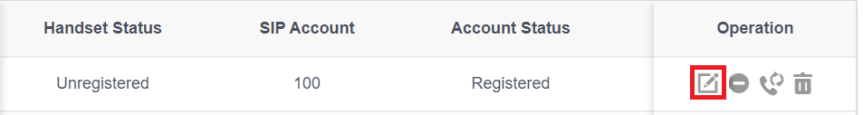

# Provision Yealink DECT IP Phones

### Supported Yealink DECT IP Phone Models

This guide applies to the following **Yealink DECT IP phone models**:

* **W60B**
* **W70B**
* **W80B / DM**
* **W90B / DM**

***

### Factory Reset the Yealink DECT System

It is recommended to factory reset the DECT system before provisioning or firmware upgrades.

#### Reset the Yealink DECT Base Station

1. Press and hold the **Reset** button on the base station for **at least 20 seconds**.
2. Release the button.
3. The base station will reset and reboot automatically.

***

#### Reset via Web Interface (Alternative Method)

You can also reset the base station from the web interface:

1. Sign in to the **Yealink DECT Manager** or base station web UI.
2. Navigate to **Settings > Upgrade > Select and Upgrade Firmware**.
3. Click **Reset to Factory Settings**.

***

### Upgrade the Yealink DECT Base and Handsets to the Latest Firmware

Before provisioning Yealink DECT devices with PortSIP PBX, ensure that **both the DECT base station and all handsets** are running the **latest supported firmware**.

<figure><figcaption></figcaption></figure>

#### Download the Firmware

1. Visit the [official Yealink website](https://www.yealink.com/en/solution-detail/resource-for-3cx).
2. Navigate to **Support > Download > Software**.
3. Select your **Yealink DECT model**.
4. Download the latest **firmware image file**.

***

#### Upgrade the DECT Base Station Firmware

1. Open a web browser and sign in to the **Yealink DECT Manager** or base station web interface.
2. Navigate to **Settings > Upgrade > Select and Upgrade Firmware**.
3. Click **Browse**, select the downloaded firmware file, and then click **Upgrade**.
4. Wait for the upgrade to complete. The base station may reboot automatically.

<figure><figcaption></figcaption></figure>

***

#### Multiple Base Stations (W80B / W90B)

If you are using a **W80B or W90B multi-cell DECT system**:

* Repeat the firmware upgrade process for **each base station** connected to the DECT Manager.

***

#### Upgrade Yealink Handset Firmware

> ❗**Important**\
> Before performing the upgrade, ensure the handset is placed in the **charging cradle** and the battery level is **above 50%**.

Handset firmware can be upgraded using the same workflow:

1. Navigate to **Settings > Upgrade > Select and Upgrade Firmware**.
2. Upload the handset firmware image.
3. Start the upgrade process.
4. Allow the handset to reboot if prompted

***

> ❗**Important**\
> Do **not** power off, reset, or disconnect the DECT base station or handsets during the firmware upgrade.\
> Interrupting the upgrade process may cause permanent device failure

***

### Add a DECT Phone in PortSIP PBX

Follow the steps below to add a **DECT phone** to **PortSIP PBX**.

#### To add a DECT phone:

1. Sign in to the **PortSIP PBX Web Portal**.
2. Navigate to **Call Manager > DECT Phones**.
3. Click **Add**.\
   The **Add DECT Phone** window appears.
4. Select the **phone model** and enter the **MAC address** of the DECT base station.
5. Click **OK**.
6. Enter a **descriptive name** for the DECT phone to help identify it easily.
7. In the **Network** field, select the **network interface** that the DECT phone will use.
8. Select the **transport protocol** the phone will use to send and receive SIP signaling with the PBX (for example, **UDP**, **TCP**, or **TLS**).
9. If your PBX has **Internet access**, enable **Save to RPS**.

<figure><figcaption></figcaption></figure>

***

### Assign Users to Handsets

After adding the DECT phone, you need to assign users to the handsets.

#### To assign users to handsets:

1. Open the **Users** tab.
2. For each handset, select the **user(s)** you want to assign.

<figure><figcaption></figcaption></figure>

***

### Auto-Provision Handsets via RPS

If your PortSIP PBX is deployed in the **cloud** and you enabled **Save to RPS** when configuring the DECT phone, the provisioning process is fully automatic.

With this option enabled:

* The DECT base station automatically downloads its **configuration file** from the vendor’s **Remote Provisioning Server (RPS)**.
* The DECT base station provisions all associated **handsets**.
* The handsets are automatically **registered to the PortSIP PBX** without manual intervention.

***

### Manually Provision Handsets

If your PortSIP PBX is deployed **on-premises without Internet access**, or if you **disabled the Save to RPS option**, you must provision the DECT handsets manually.

#### To manually provision handsets:

1. Sign in to the PortSIP PBX Web Portal.
2. Navigate to **Call Manager > DECT Phones**.
3. **Double-click** the DECT phone you want to provision.
4. Copy the provisioning URL.

<figure><figcaption></figcaption></figure>

***

#### Configure the DECT Base Station

5. Open a web browser and enter the **IP address of the DECT base station**.
6. Log in to the DECT base station web interface.
7. Navigate to **Settings > Auto Provision**.
8. In the **Server URL** field, paste the **provisioning URL** you copied.
9. Click **Confirm** to save the settings.
10. Click **Auto Provision Now** to start the provisioning process.

***

### Yealink W80 / W90 Only

> ❗**Applies to:** **Yealink W80 and W90 DECT Manager systems only**\
> If you are **not** using a W80 or W90 system, **skip this section**.

***

#### Step 1: Configure the Base Station

1. Open a web browser and enter the **IP address of the Yealink Base Station**.
2. Sign in to the Base Station web interface.
3. Navigate to **Base Mode**.
4. In the **DECT Manager IP Address** field, enter the **IP address of the DECT Manager**.
5. Click **Confirm** to save the settings.

<figure><figcaption></figcaption></figure>

***

#### Step 2: Register the Base Station on the DECT Manager

1. Open a web browser and enter the **IP address of the Yealink DECT Manager**.
2. Sign in to the DECT Manager web interface.
3. Navigate to **Base Station Registration**.
4. Locate the base station you want to associate with the DECT Manager.
5. Click **Register** next to the base station, then click **OK** to confirm.

***

#### Step 3: Verify Base Station Status

1. Navigate to **Base Station Settings**.
2. Confirm that the base station status is shown as **Active** and **Synced**.

<figure><figcaption></figcaption></figure>

***

### Register Yealink Handsets and Assign Users

After assigning users in PortSIP PBX, register the Yealink handsets and associate them with the corresponding extensions.

#### To register handsets and assign users:

1. Open a web browser and enter the **IP address of the Yealink DECT device** (DECT Manager or base station).
2. Sign in to the web interface.
3.  Navigate to **Handset & Account > Handset Registration**.

    You will see a list of **extension users** that were assigned in the previous step ([Assign Users to the Handsets](provision-yealink-dect-ip-phones.md#assign-users-to-handsets)).
4. Click the **Edit** icon next to the extension you want to configure.

<figure><figcaption></figcaption></figure>

***

#### Register the Handset

5. Click **Start Register Handset**.
6. On the handset, do one of the following:
   * Press the **Reg.** softkey (Easy Pairing), or
   * Navigate to **Settings > Registration > Base 1**.
7. From the scan results, select the **DECT base station**.
8. When prompted, enter the **PIN `0000`**, then confirm.

***

#### Repeat for Additional Users

Repeat the steps above for each extension you want to assign to a handset.

