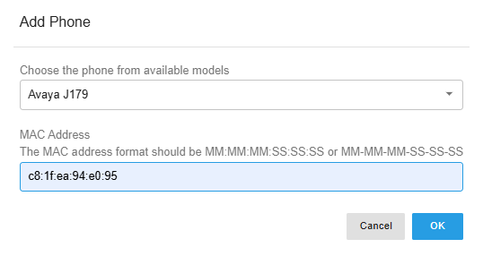
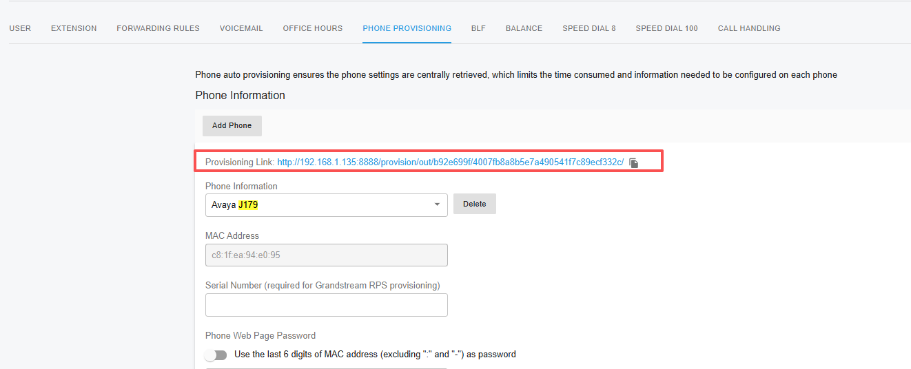
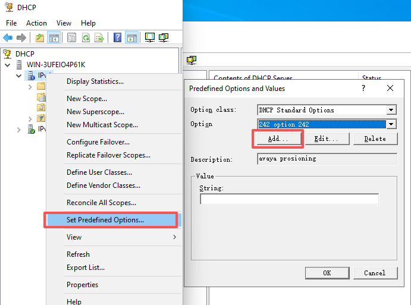
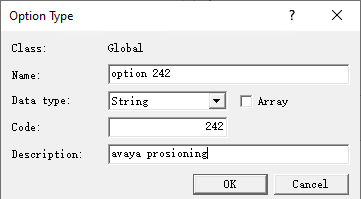
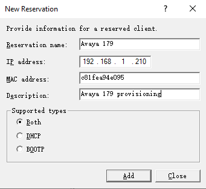
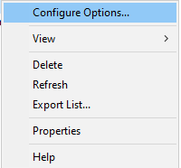
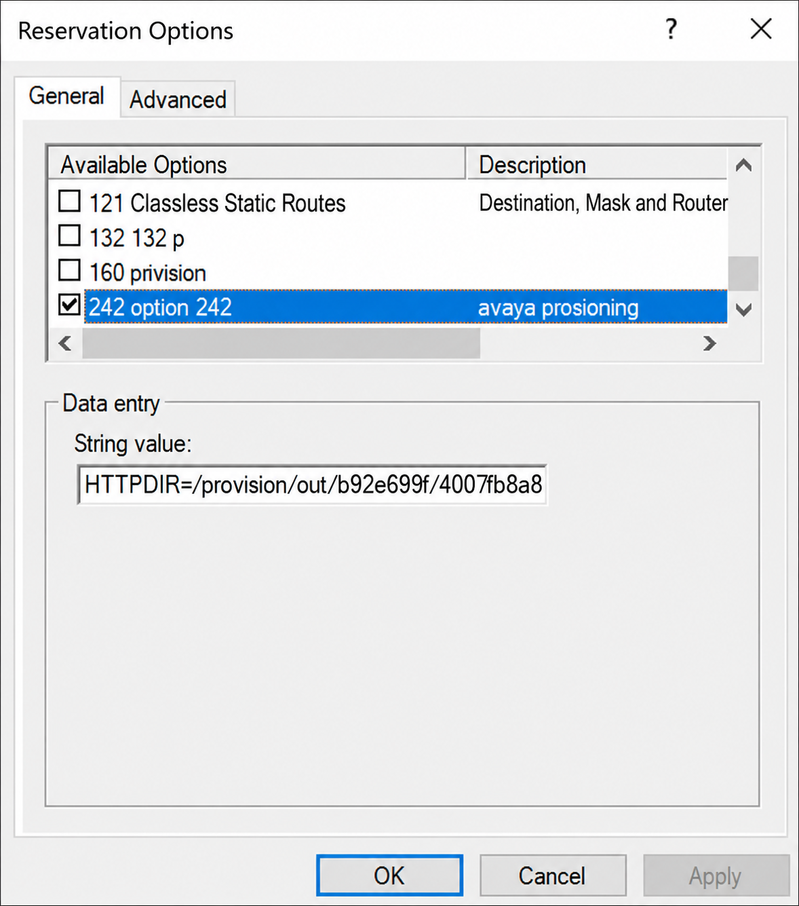

# Provisioning Avaya J Series Using DHCP Option 242

This guide explains how to provision an Avaya J-Series IP phone with PortSIP PBX by using **DHCP Option 242** to provide the phone with the required provisioning server information.

The procedure includes the following steps:

1. Configure the Avaya phone for a PortSIP PBX extension.
2. Add DHCP Option 242 to the DHCP server.
3. Create a DHCP reservation for the phone and configure its provisioning parameters.
4. Reset the Avaya phone to factory defaults so that it retrieves the new DHCP and provisioning configuration.

### Version Requirements

Before you begin, ensure that your environment meets the following minimum version requirements:

| Component                     | Minimum Version |
| ----------------------------- | --------------- |
| PortSIP PBX                   | v22.6.1         |
| Avaya J-Series phone firmware | 4.1.11.0.9      |

> **Important**
>
> Upgrade PortSIP PBX and the Avaya J-Series phone firmware to the minimum versions listed above or later before following this guide.

***

### Prerequisites

Ensure that the Avaya phone can reach both the DHCP server and the PortSIP PBX provisioning service over the network.

***

### Step 1: Configure the Phone for an Extension

First, assign the Avaya phone to an extension in PortSIP PBX.

1. Sign in to the PortSIP PBX Web Portal.
2. Edit the extension that will use the Avaya phone. In this example, the extension is **1001**.
3. Navigate to the **Phone Configuration** tab, and click **Add**.
4. Select **Avaya J179** as the phone model.
5. Enter the phone's MAC address in the **MAC** field.

<figure><figcaption></figcaption></figure>

6. Complete the remaining phone configuration settings as required, and click **Save**.
7. Copy and note the generated provisioning configuration path. You will need this path later when [configuring DHCP Option 242](provisioning-avaya-j-series-using-dhcp-option-242.md#configure-dhcp-option-242-for-the-reservation).

<figure><figcaption></figcaption></figure>

***

### Step 2: Add DHCP Option 242

Avaya phones use **DHCP Option 242** to obtain provisioning server information. Before configuring the option for a phone, add Option 242 as a predefined option on the DHCP server.

<figure><figcaption></figcaption></figure>

#### Add DHCP Option 242 as a Predefined Option

1. Open the DHCP management console.
2. Right-click **IPv4**, and select **Set Predefined Options**.
3. Click **Add**.

<figure><figcaption></figcaption></figure>

4. Configure the new option with the following values:

| Field           | Value                |
| --------------- | -------------------- |
| **Name**        | `Option 242`         |
| **Data Type**   | `String`             |
| **Code**        | `242`                |
| **Description** | `Avaya provisioning` |

5. Click **OK** to create DHCP Option 242.

***

### Step 3: Create a DHCP Reservation

Create a DHCP reservation for the Avaya phone so that its provisioning parameters can be configured specifically for that device.

<figure><figcaption></figcaption></figure>


#### Create the Reservation

1. In the DHCP management console, right-click **Reservations**, and select **New Reservation**.
2. Enter the reservation details for the phone. For example:

| Field                | Example Value             |
| -------------------- | ------------------------- |
| **Reservation Name** | `Avaya J179`              |
| **IP Address**       | `192.168.2.210`           |
| **MAC Address**      | `c81fea94e095`            |
| **Description**      | `Avaya J179 provisioning` |

3. Click **Add** to create the reservation.

#### Configure DHCP Option 242 for the Reservation

<figure><figcaption></figcaption></figure>

4. Locate the newly created reservation under **Reservations**.
5. Right-click the reservation and select **Configure Options**.

<figure><figcaption></figcaption></figure>


6. Select **Option 242** from the list of available options.
7. In the **String value** field, enter the provisioning parameters in the following format:

```
HTTPDIR=/provision/out/b92e699f/4007fb8a8b5e7a490541f7c89ecf332c/,HTTPPORT=8888,HTTPSRVR=192.168.1.135,SIG=2
```

The parameters are defined as follows:

| Parameter  | Example Value                                               | Description                                                                                                                                                                                                                |
| ---------- | ----------------------------------------------------------- | -------------------------------------------------------------------------------------------------------------------------------------------------------------------------------------------------------------------------- |
| `HTTPDIR`  | `/provision/out/b92e699f/4007fb8a8b5e7a490541f7c89ecf332c/` | The secure provisioning path generated by PortSIP PBX, you copied in the [Step 1: Configure the Phone for an Extension](provisioning-avaya-j-series-using-dhcp-option-242.md#step-1-configure-the-phone-for-an-extension). |
| `HTTPPORT` | `8888`                                                      | The HTTP web port used by the PortSIP PBX provisioning service, such as `80` or `8888`.                                                                                                                                    |
| `HTTPSRVR` | `192.168.1.135`                                             | The IP address or fully qualified domain name (FQDN) of the PortSIP PBX server.                                                                                                                                            |
| `SIG`      | `2`                                                         | Specifies the signaling software type. `2` indicates SIP.                                                                                                                                                                  |

> **Important**
>
> For this provisioning workflow, configure `HTTPPORT` with the **HTTP web port** of the PortSIP PBX provisioning service. Do not enter the PBX HTTPS web port.

> **Example**
>
> Replace the example provisioning path, HTTP port, and PBX IP address with the actual values from your PortSIP PBX deployment.

***

### Step 4: Reset the Avaya Phone to Factory Defaults

After completing the DHCP configuration, reset the Avaya phone to factory defaults. This allows the phone to restart, obtain its DHCP settings, retrieve the provisioning server information from DHCP Option 242, and download its configuration from PortSIP PBX.

1. Press the **Menu** button on the Avaya phone.
2. Navigate to **Administration**.
3.  Enter the administrator password. The default password is:

    ```
    27238
    ```
4. Select **Reset to factory defaults**.
5. Confirm the reset when prompted.

The phone automatically reboots. After restarting, it should obtain its network configuration from the DHCP server and use DHCP Option 242 to locate the PortSIP PBX provisioning service.

***

### Expected Result

After the phone restarts successfully:

* The phone obtains its IP configuration from the DHCP server.
* DHCP Option 242 provides the PortSIP PBX provisioning server information.
* The phone downloads its configuration from PortSIP PBX.
* The assigned extension registers successfully with the PBX.
