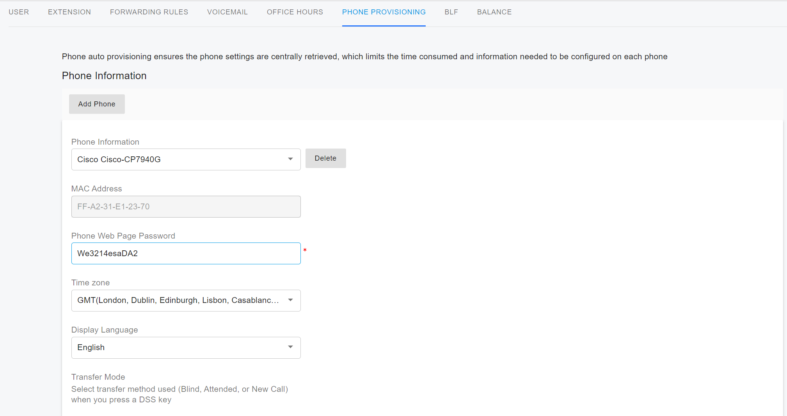

# Provisioning Cisco 79xx IP Phones

Legacy phone support has been implemented to allow easy migration from an existing PBX to PortSIP PBX without the need to replace all existing IP phones. It is strongly recommended not to intentionally buy these new devices or as a replacement.

## **Download Firmware & Copy to Provisioning Directory**

These phones have been tested with PortSIP PBX with the following firmware:

Cisco 7940 - SIP Firmware 8.5.4s\
Cisco 7941 - SIP Firmware 8.5.4s\
Cisco 7960 - SIP Firmware 8.5.4s\
Cisco 7961 - SIP Firmware 8.5.4s


Other Firmware versions may work with Portsip PBX. It's just we haven't tested it yet.


You need to ensure that the phones are running on this firmware. In case the defined version of the firmware is not installed, manually update the firmware before proceeding. To do this:

1. Download the appropriate firmware files.
2. Find the provisioning folder of your PortSIP PBX Installation – by default it is located below path: **C:\ProgramData\PortSIP\pbx\provision\R2Xu8aVV20Jka.** Where **R2Xu8aVV20Jka** is the randomly generated provisioning folder name.
3. Place the whole content of the zip into this folder. This bundle will also change your phone to use SIP and updates the firmware to 8.5.4.s.

## Configure TFTP Server 

Read this article that shows you how to[ configure a TFTP server for PortSIP PBX](provision-phone-using-tftp.md).&#x20;

## **Factory Reset the IP Phone**

Before provisioning the IP phone, the phone must be brought back to factory defaults in case the device has residual settings of a previous configuration. To reset the device, follow the below instructions:

1. Turn off the device.
2. Press and hold the “#” key and power on the device.
3. Keep on holding the “#” key until the line key flashes orange.
4. While the line keys are flashing, press “1”, “2”, “3”, “4”, “5”, “6”, “7”, “8”, “9”, “\*”, “0”, “#” keys sequentially.

After restart, your phone will be successfully reset.

## **Configure The Phone in PortSIP PBX**

1\. Sign in to the PortSIP Web Portal, select the menu **Call Manager > Phones**, click the **Add Phone** button, and select from the extension list to which the IP phone shall be assigned.

<figure><figcaption></figcaption></figure>

2\. After clicking the OK button in the previous step, you will be prompted to select the phone model and enter the MAC address of the phone. Once finished, press **OK**.

<figure><figcaption></figcaption></figure>

3\. Optional settings include the phone’s **Time Zone**, **Phone Web Page Password**, **Phone Display Language,** and codecs. Click **OK** to apply the settings.

4\. Edit this extension and select the **Phone Provisioning** tab, Copy the **Provisioning Link**.

<figure><figcaption></figcaption></figure>

## **Set the Provisioning Link Using DHCP Option 66**

Now the phone needs to know where to pick up the firmware files and configuration information. The only way to do this is to set up **option 66** in your DHCP server.

Follow this guide to [configure your DHCP 66 server](provision-phone-using-dhcp-option-66.md) and paste the IP address of the provisioning link that you copied in the previous step. NowyYour phone will be provisioned automatically.

