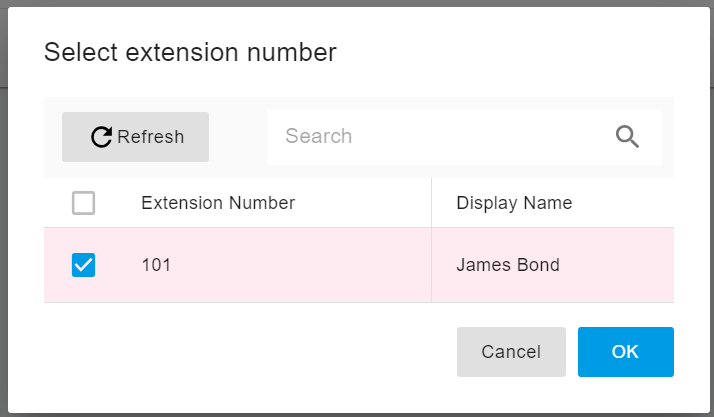
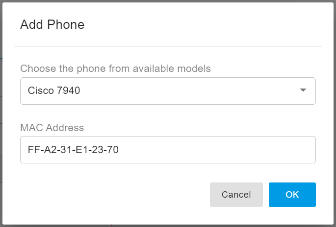

# Provisioning Cisco 79xx IP Phones

### Legacy IP Phone Support

PortSIP PBX provides **legacy IP phone support** to simplify migration from an existing PBX system without requiring you to replace all deployed devices.

> **Important Recommendation**\
> Legacy phone support is intended **only for migration purposes**.\
> It is **strongly recommended not to purchase these legacy models as new devices or as replacements**.

***

### Supported Legacy Phone Models and Firmware

The following legacy Cisco IP phones have been tested with PortSIP PBX using the firmware versions listed below:

* **Cisco 7940** – SIP Firmware **8.5.4s**
* **Cisco 7941** – SIP Firmware **8.5.4s**
* **Cisco 7960** – SIP Firmware **8.5.4s**
* **Cisco 7961** – SIP Firmware **8.5.4s**

> **Note**\
> Other firmware versions _may_ work with PortSIP PBX, but they have not been officially tested.

***

### Download Firmware and Copy to the Provisioning Directory

You must ensure that the IP phones are running the supported firmware version.\
If the required firmware is not installed, manually upgrade the phone firmware before proceeding.

#### To update the firmware:

1. Download the appropriate **Cisco SIP firmware package**.
2.  Locate the **PortSIP PBX provisioning directory**.\
    By default, it is located at:

    ```
    C:\ProgramData\PortSIP\pbx\provision\R2Xu8aVV20Jka
    ```

    > `R2Xu8aVV20Jka` is a **randomly generated provisioning folder name** and may differ in your environment.
3. Extract and copy **all contents of the firmware ZIP package** into this provisioning directory.

This firmware bundle will:

* Convert the phone to **SIP mode**
* Upgrade the phone firmware to **version 8.5.4s**

***

### Configure the TFTP Server

To allow the phones to download firmware and configuration files, you must configure a **TFTP server**.

Refer to the following guide for detailed instructions:

* [Configure a TFTP server for PortSIP PBX](provision-phone-using-tftp.md)

***

### Factory Reset the IP Phone

Before provisioning, reset the IP phone to factory defaults to remove any residual configuration from a previous PBX system.

#### To factory reset the phone:

1. Power off the device.
2. Press and hold the **`#`** key.
3. While holding **`#`**, power on the device.
4. Continue holding **`#`** until the **line keys flash orange**.
5.  While the keys are flashing, press the following keys **in sequence**:

    ```
    1 2 3 4 5 6 7 8 9 * 0 #
    ```
6. Release the keys and allow the phone to restart.

After the reboot completes, the phone is restored to **factory default settings**.

***

### Configure the Phone in PortSIP PBX

Follow the steps below to configure an IP phone in **PortSIP PBX**.

#### To configure the phone:

1. Sign in to the PortSIP PBX Web Portal.
2. Navigate to **Call Manager > Phones**.
3. Click **Add Phone**.
4. From the **Extension** list, select the extension to which the IP phone will be assigned.
5. Click **OK**.

<figure><figcaption></figcaption></figure>

***

#### Enter Phone Details

6. When prompted, select the **phone model**.
7. Enter the **MAC address** of the IP phone.
8. Click **OK**.

<figure><figcaption></figcaption></figure>

***

#### Configure Optional Settings

9. (Optional) Configure additional phone settings as needed, such as:
   * **Time Zone**
   * **Phone Web Page Password**
   * **Phone Display Language**
   * **Codecs**
10. Click **OK** to apply the settings.

***

#### Obtain the Provisioning Link

11. Edit the extension you just configured.
12. Open the **Phone Provisioning** tab.
13. Copy the **Provisioning Link**.

<figure><figcaption></figcaption></figure>


***

### Set the Provisioning Link Using DHCP Option 66

Now the phone needs to know where to pick up the firmware files and configuration information. The only way to do this is to set up **option 66** in your DHCP server.

Follow this guide to [configure your DHCP 66 server](provision-phone-using-dhcp-option-66.md) and paste the IP address of the provisioning link that you copied in the previous step. Now your phone will be provisioned automatically.


