# Verifying the Provisioning PIN for DECT Phones

Some DECT base stations do not have a built-in screen. In addition, some DECT phone brands and models do not support entering the provisioning password from the handset screen.

This guide explains how to verify the provisioning PIN when auto-provisioning a DECT phone.

***

### Prerequisites

Before you begin, enable the PIN verification feature for IP phone auto-provisioning.

For details, see [PIN Verification for IP Phone Auto-Provisioning](pin-verification-for-ip-phone-auto-provisioning.md).

***

### Configuring the Provisioning PIN for a DECT Phone

Use the following steps to configure the provisioning PIN for a DECT phone in PortSIP PBX.

#### To configure the provisioning PIN

1. Sign in to the PortSIP PBX web portal as a **System Administrator** and select the tenant you want to manage.\
   Alternatively, sign in directly as the **Tenant Administrator**.
2. Go to **Call Manager > DECT Phones**.
3. Click **Add** to configure a new DECT phone, or select an existing DECT phone to edit it.
4. In the **Provisioning PIN** field, enter the PIN that will be used to verify the provisioning request.
5. Configure the extensions for the handsets as the guide:
   1. Fanvil:  [Provision Fanvil DECT IP Phones](provision-fanvil-dect-ip-phones.md).
   2. Yealink: [Provision Yealink DECT IP Phones](provision-yealink-dect-ip-phones.md).
   3. Snom: [Provision Snom DECT IP Phones](provision-snom-dect-ip-phones.md).
   4. Gigaset: [Provision Gigaset DECT IP Phones](provision-gigasedect-ip-phones.md).
6. Save the changes.

<figure>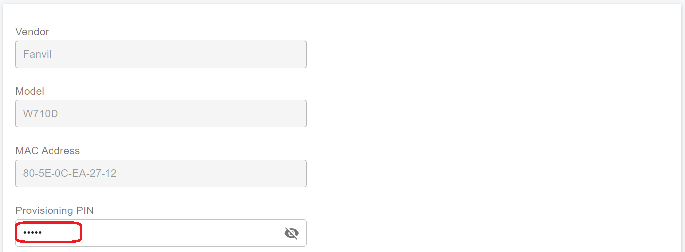<figcaption></figcaption></figure>

**Expected outcome**

The DECT phone has a provisioning PIN assigned. This PIN must be provided by the phone during auto-provisioning.

***

### Verifying the PIN for Fanvil LINKVIL DECT Phones

After you configure a Fanvil LINKVIL DECT phone in PortSIP PBX, use the following steps to configure PIN verification on the phone.

#### To verify the provisioning PIN on a Fanvil LINKVIL DECT phone

In the PortSIP PBX web portal, copy the phone provisioning URL.\
See the screenshot below for reference.

<figure>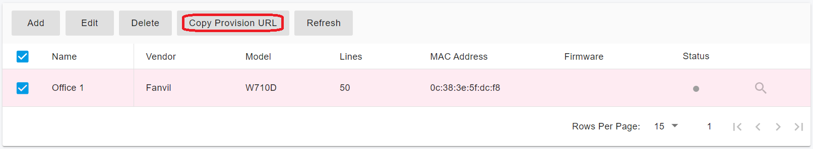<figcaption></figcaption></figure>

1. Sign in to the Fanvil LINKVIL web portal.
2. Go to **System > Auto Provision > Static Provisioning Server**.
3. Paste the copied provisioning URL into the **Server Address** field.
4.  In the **Configuration File Name** field, enter the configuration file name in the following format:

    ```
    {MAC}.cfg
    ```

    For example:

    ```
    0c383e5fdcf8.cfg
    ```

See the screenshot below:

<figure>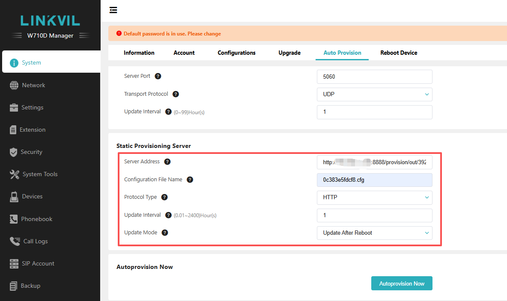<figcaption></figcaption></figure>

5. Go to **System > Auto Provision > Basic Settings**.
6. In the **Authentication Name** field, enter any text value for it.
7. In the authentication password field, enter the **Provisioning PIN** that you configured in PortSIP PBX.
8. Click **Apply** to save the changes and restart the DECT phone base station.

<figure>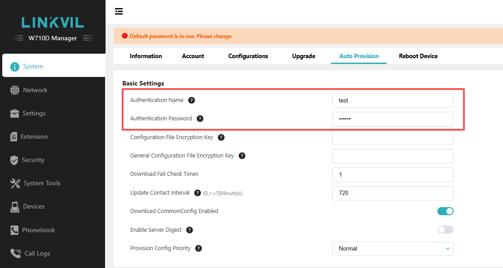<figcaption></figcaption></figure>

**Expected outcome**

The Fanvil LINKVIL DECT phone sends the provisioning PIN during auto-provisioning. PortSIP PBX verifies the PIN before allowing the phone to download its provisioning configuration.

***

### Verifying the PIN for Yealink DECT Phones

After you configure a Yealink DECT phone in PortSIP PBX, use the following steps to verify the provisioning PIN on the phone.

Yealink DECT phones can be provisioned in either of the following ways:

* **Provision via RPS**
* **Provision manually**

***

#### Provision via RPS

Use this method if you enabled **Save to RPS** when configuring the Yealink DECT phone in PortSIP PBX.

**To provision the Yealink DECT phone via RPS**

1. Restart the Yealink DECT base station.
2. Wait for the base station to restart.

**Expected outcome**

After the base station restarts, it receives the provisioning information from the Yealink RPS service and is provisioned automatically.

***

#### Provision Manually

Use this method if you did not enable **Save to RPS** when configuring the Yealink DECT phone in PortSIP PBX.

**To manually configure provisioning PIN verification**

1. In the PortSIP PBX web portal, copy the phone provisioning URL.\
   See the screenshot below for reference.

<figure><figcaption></figcaption></figure>

2. Sign in to the Yealink DECT phone web portal.
3. Go to **Settings > Auto Provision**.
4. Paste the copied provisioning URL into the **Server URL** field.
5. In the **Username** field, enter any text value.
6. In the **Password** field, enter the **Provisioning PIN** that you configured in PortSIP PBX.
7. Click **Apply** to save the changes.
8. Restart the Yealink DECT base station.

<figure>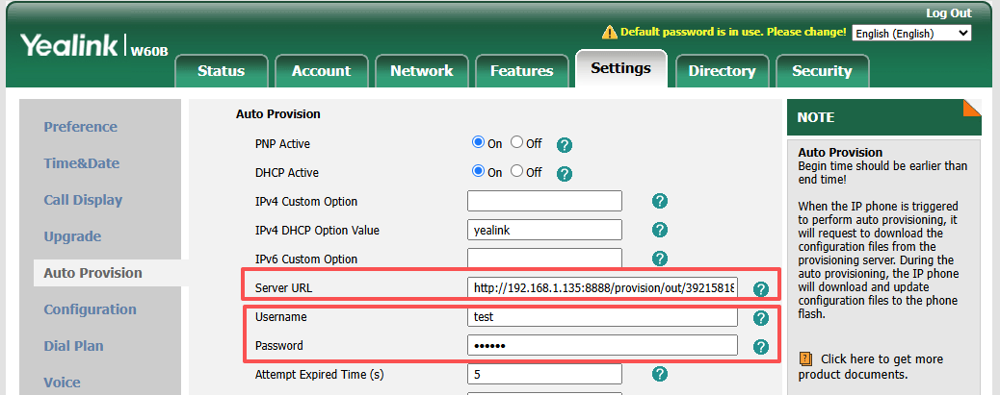<figcaption></figcaption></figure>

**Expected outcome**

After the base station restarts, it starts the provisioning process. If prompted, enter the username and provisioning PIN to verify the provisioning request.

After the PIN is verified successfully, the Yealink DECT phone downloads and applies its provisioning configuration.

***

### Verifying the PIN for Snom DECT Phones

After you configure a Snom DECT phone in PortSIP PBX, use the following steps to configure PIN verification on the phone.

#### To verify the provisioning PIN on a Fanvil LINKVIL DECT phone

In the PortSIP PBX web portal, copy the phone provisioning URL.\
See the screenshot below for reference.

<figure>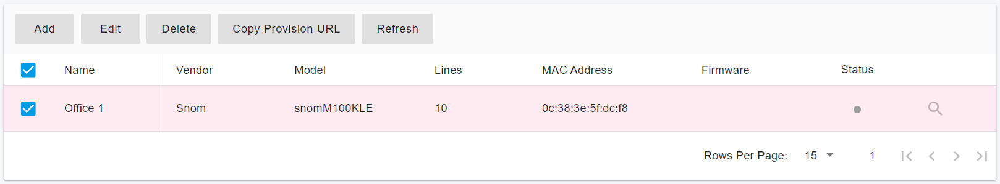<figcaption></figcaption></figure>

**M100:**

1. Sign in to the M100 web portal.
2. Go to the **Provisioning** menu.
3. Paste the copied provisioning URL into the **Server URL field**.
4. In the **Server Authentication Name** field, enter any text value for it.
5. In the **Server Authentication Password** field, enter the **Provisioning PIN** that you configured in PortSIP PBX.
6. Save the changes and restart the DECT phone base station.

<figure>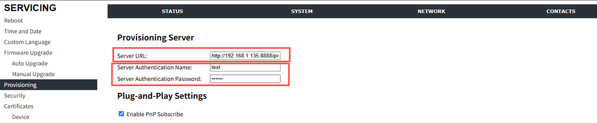<figcaption></figcaption></figure>

**M400:**

1. Sign in to the M400 web portal.
2. Go to the **Management Settings**.
3. In the **HTTP Management username** field, enter any text value for it.
4. In the **HTTP Management password** field, enter the **Provisioning PIN** that you configured in PortSIP PBX.
5. Paste the copied provisioning URL into the **Configuration Server Address** field.
6. In the Filename field, enter the **snomM400-{mac}.htm.**
7. Save the changes and restart the DECT phone base station.

<figure>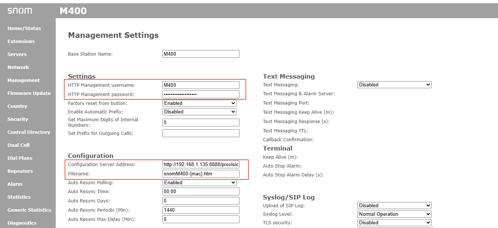<figcaption></figcaption></figure>

**M500:**

1. Sign in to the M500 web portal.
2. Go to the **SERVICING > Provisioning > Provisioning Server**.
3. Paste the copied provisioning URL into the **Server URL** field.
4. In the **Server Authentication Name** field, enter any text value for it.
5. In the **Server Authentication Password** field, enter the **Provisioning PIN** that you configured in PortSIP PBX.
6. Save the changes and restart the DECT phone base station.

<figure>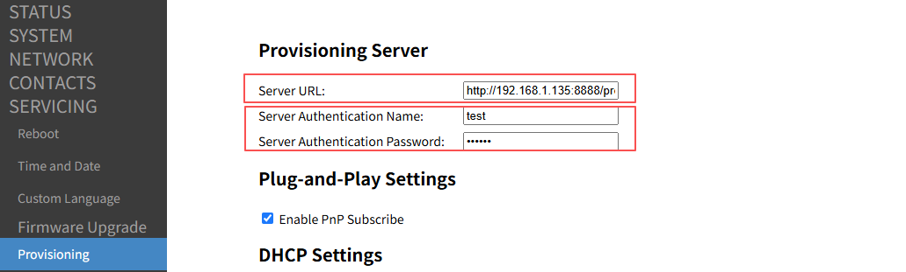<figcaption></figcaption></figure>

**M900:**

1. Sign in to the M900 web portal.
2. Go to the **Management Settings**.
3. In the **HTTP Management username** field, enter any text value for it.
4. In the **HTTP Management password** field, enter the **Provisioning PIN** that you configured in PortSIP PBX.
5. Paste the copied provisioning URL into the **Configuration Server Address** field.
6. In the Filename field, enter the **snomM900-{mac}.htm.**
7. Save the changes and restart the DECT phone base station.

<figure>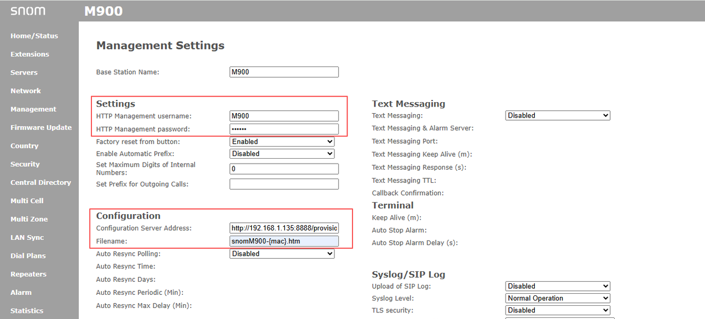<figcaption></figcaption></figure>

***

### Verifying the PIN for Gigaset DECT Phones

After you configure a Gigaset DECT phone in PortSIP PBX, use the following steps to configure PIN verification on the phone.

#### To verify the provisioning PIN on a Gigaset LINKVIL DECT phone

In the PortSIP PBX web portal, copy the phone provisioning URL.\
See the screenshot below for reference.

<figure>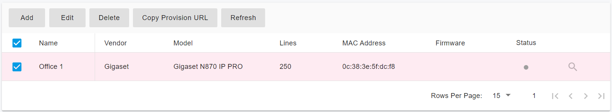<figcaption></figcaption></figure>

1. Sign in to the Gigaset DECT phone web portal.
2. Go to the menu **SETTINGS >System > Provisioning and configuration**.
3. Paste the copied provisioning URL into the **Server Address** field and save changes.

<figure>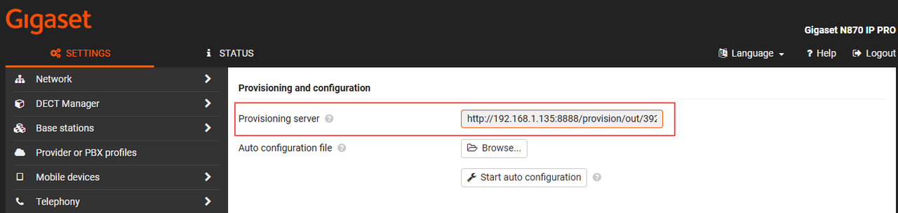<figcaption></figcaption></figure>

4. Go to menu **SETTINGS >System > Security**.
5. In the **HTTP digest username** field, enter any text value for it.
6. In the HTTP digest password field, enter the **Provisioning PIN** that you configured in PortSIP PBX.
7. Save the changes and restart the DECT phone base station.

<figure>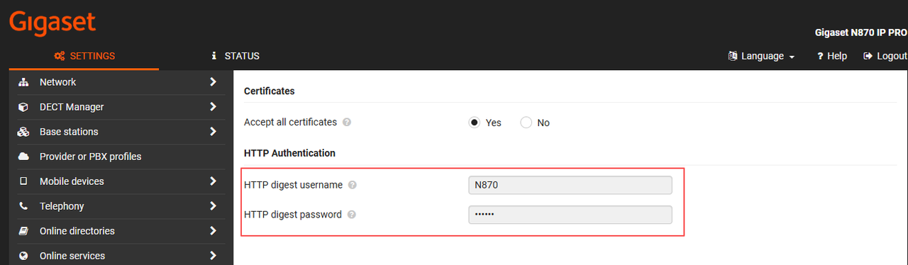<figcaption></figcaption></figure>

**Expected outcome**

The Gigaset DECT phone sends the provisioning PIN during auto-provisioning. PortSIP PBX verifies the PIN before allowing the phone to download its provisioning configuration.

