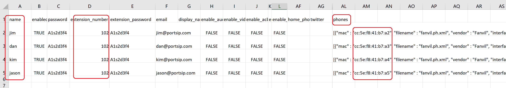

# Zero Touch Provisioning Phones

Zero Touch Provisioning (ZTP) enables IP phones and devices to self-configure out of the box, eliminating the need for manual setup.

When IP phones are shipped directly from the factory, each device has a unique MAC address. PortSIP PBX uses this MAC address to associate the phone with its configuration file URL, storing it on the vendor’s RPS server. Once the phone is plugged in and connected to the internet, it retrieves the configuration URL from the vendor’s RPS server, connects to PortSIP PBX, downloads its configuration, and registers automatically.

## **How ZTP Works**

1. **Order Placement**: The PBX service provider orders IP phones from the seller. The seller ships the phones to end users (via DHL, FedEx, etc.) and sends the phones' MAC addresses to the provider.
2. **Configuration Setup**: The PBX service provider configures user extension accounts and phone MAC addresses by importing a CSV file. PortSIP PBX automatically saves the MAC addresses and configuration URLs to the vendor’s RPS server.
3. **Automatic Provisioning**: When users receive and connect the IP phones, the devices reach out to the vendor’s RPS server, retrieve their configuration file URLs, and download the configuration from PortSIP PBX. The phones register automatically, completing the setup.

With ZTP, deploying IP phones is seamless and efficient. Follow the steps below to get your phones up and running in no time.

## Prerequisites

In this example, we’ll demonstrate how to use Zero Touch Provisioning (ZTP) for five IP phones of the **Fanvil X303** model. These phones are shipped directly to users, and we already have the MAC addresses for all five devices. The MAC addresses are as follows:

* CC-5E-F8-41-B7-A1
* CC-5E-F8-41-B7-A2
* CC-5E-F8-41-B7-A3
* CC-5E-F8-41-B7-A4
* CC-5E-F8-41-B7-A5

## Export a Template File

Please follow the below steps:

### Create a user with phone provisioning information for the template

1. Create a user with the IP Phone by selecting the menu **Call Manager > Users** and clicking the **Add** button.&#x20;
2. Enter the **username**, **password**, **email**, and **extension number**, **extension password**, then click the **PHONE PROVISIONING** tab.
3. On the **PHONE PROVISIONING** tab, click the **Add Phone** button, and select the phone model, in this case, **Fanvil X303.** Enter the phone's MAC address, in this case, **CC-5E-F8-41-B7-A1**.
4. Configure the necessary parameters for this phone, and please pay attention to the **Network** combo box. Please choose the appropriate network interface. If the PBX is on the internet, you will need to choose the **Web Domain** or **Public IPv4** here. If you have a PortSIP SBC configured, you can also choose the **SBC base domain or IP address**.
5. Choose the appropriate transport for the IP phone that will be used to register to PBX.
6. Ensure the **Save to RPS** is turned on.
7. Click the **OK** button to save the changes.

### Export the user as a template file

1. **Navigate to Export Users**
   * Go to **Call Manager > Users** in the PortSIP PBX interface.
2. **Export User Data**
   * Click the **Export** button to download a CSV file containing user and phone information.

## Edit the template file

* **Open the CSV File**
  * Locate and open the CSV file. You will see a row corresponding to the user you created earlier.
* **Modify the Details for the Second User**
  * Update the following fields for the second user:
    * Name
    * Password
    * Extension number
    * Extension password
    * IP Phone MAC address (e.g., **CC-5E-F8-41-B7-A2**)
* **Add Additional Users**
  * Copy the line for the existing user and paste it to add rows for the remaining three users.
  * Update the following details for each new user:
    * Name
    * Password
    * Extension number
    * Extension password
    * IP Phone MAC address
  * Ensure you **do not include the user and MAC address for CC-5E-F8-41-B7-A1**, as it is already configured in the PBX.
* **Save the CSV File**
  * Once all changes are made, save the file. The file is now ready for import.

<figure><figcaption>
Copy users and change the name, password, extension number, extension password, and phone MAC address
</figcaption></figure>


You can use the same password and extension password for all users without modifying them, but this is not recommended.


## **Importing Users with Phone Information**

1. **Import Users**
   * Navigate to **Call Manager > Users** and click the **Import** button to import users along with their phone information into PortSIP PBX.
2. **Configuration URL Registration**
   * After a successful import, PortSIP PBX automatically writes the IP phone configuration URL to the vendor’s RPS server.
3. **Automatic Phone Provisioning**
   * Once users receive their IP phones and connect them to the internet:
     * The phones reach out to the vendor’s RPS server to retrieve the configuration file URL.
     * The devices then download the configuration file from PortSIP PBX and register with the system automatically.

This seamless process ensures all users and phones are provisioned efficiently and effortlessly.

Please also reference the article [Bulk Importing Users and Auto Provisioning IP Phones](bulk-importing-users-and-auto-provisioning-ip-phones.md).

