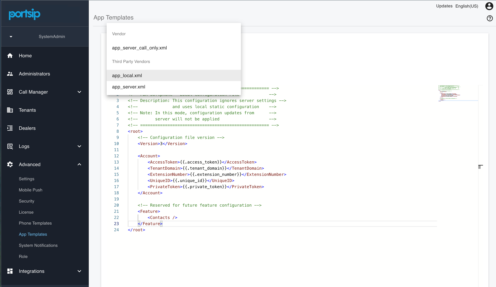
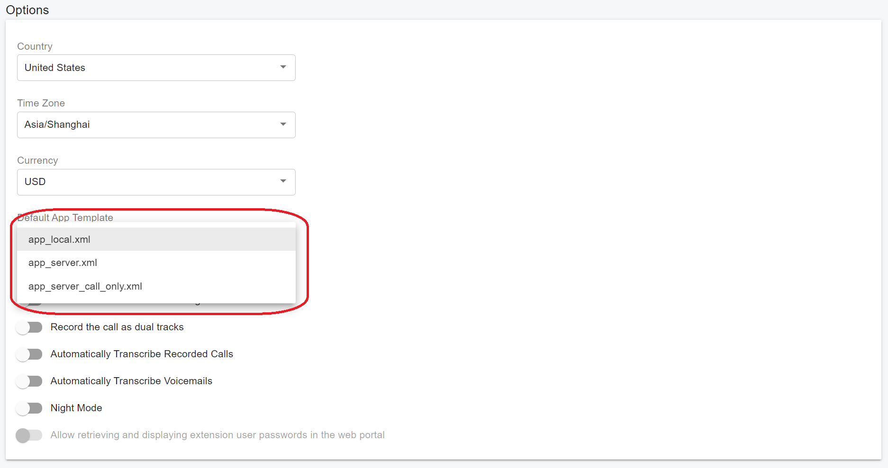
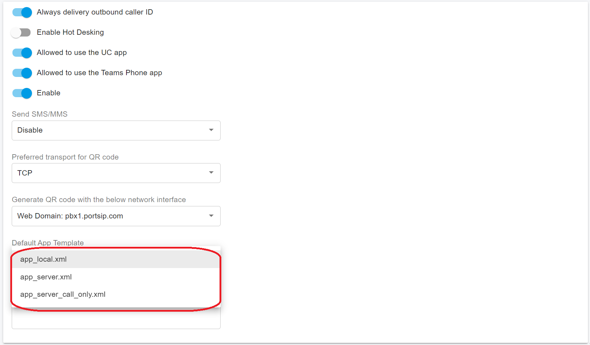

# App Template

### 1. Introduction

The **App Template** feature enables System Administrators to centrally manage the configurations of the **PortSIP ONE** client when users log in by scanning a QR code.

This App Template feature allows centralized and standardized provisioning of the PortSIP ONE client through QR code login. This feature **simplifies onboarding, reduces configuration errors, and ensures consistent client behavior across the organization**.

* `app_local.xml` → Client-managed configuration
* `app_server.xml` → Server-enforced configuration (recommended)
* Templates can be assigned at the tenant level or to individual extensions
* Only System Administrators can manage templates
* QR codes must be regenerated after template changes

**Supported Versions:**

* **PortSIP PBX**: version 22.4 or later
* **PortSIP ONE** client: version 10.8.6 or later

> ❗**Important**\
> Ensure both the PBX server and PortSIP ONE client are upgraded to the required versions. If either component is outdated, the App Template feature will not function.

#### Supported Configurable Parameters

With the template, you can configure the following parameters for the apps. You can view the supported default parameters in the `app_server.xml` template:

* **UI View**: For example, hide the SMS view.
* **Settings**: For example, hide the profile settings in the app.
* **Appearance**: Theme and language settings.
* **Office Hours**: Define business hours for the app.
* **Sound Effect Options**: Such as **FAC** (Far-End Call) and **AEC** (Acoustic Echo Cancellation).
* **Codecs**: Select and enforce preferred codecs.
* **Screen Pop**: Configure screen pop settings for incoming calls

#### Scope and Permissions

* Only System Administrators have the ability to create and modify App Templates.
* Tenant administrators and end users cannot modify template files, but can choose the template to apply.

***

### 2. Managing App Template Files

#### 2.1 Accessing the App Templates Page

To manage App Templates:

1. Log in to the **PBX Web Admin Portal** as a **System Administrator**.
2. Navigate to: **Advanced > App Templates**

After installation, the PBX includes two default built-in templates.

<figure><figcaption></figcaption></figure>

***

#### 2.2 Built-in Templates

**1) `app_local.xml`**

When this template is used:

* The generated extension QR code contains **only login settings**.
* All other settings are configured **independently** within the PortSIP ONE client.
* The PBX server does **not** push any other configurations to the client.

**Use Case**:\
Choose this template if you want users to manage their own client-side settings, such as codecs and media options.

***

**2) `app_server.xml`**

When this template is used:

* The generated QR code includes all predefined server-side configuration.
* The PBX enforces initial configuration settings, such as selected audio and video codecs.
* The client automatically applies these settings upon QR code login.

**Use Case**:\
Recommended for organizations that require standardized configuration, including:

* Enforced codec policies
* Consistent media behavior
* Centralized configuration control

> ❗**Best Practice**\
> For enterprise deployments, use the server-controlled template (`app_server.xml`) to ensure consistent configuration and reduce support overhead.

***

#### 2.3 Creating a Custom App Template

You can create your own template file.

**Option A – Add a New Template**

1. Sign in to the PortSIP PBX Web Admin Portal as a System Administrator.
2. Navigate to: **Advanced > App Templates**.
3. Click **Add**.
4. Define the template name and configurations.
5. Click **Save**.

**Option B – Copy an Existing Template (Recommended)**

1. Select `app_server.xml`.
2. Click **Copy**.
3. Rename the template.
4. Modify the configurations as needed.
5. Click **Save**.

> ❗**Recommendation**\
> It is strongly recommended to copy `app_server.xml` and modify it, rather than creating a template from scratch. This ensures that required baseline parameters remain intact.

***

#### 2.4 Security Considerations

* QR codes contain login settings and configuration information, which should be treated as **sensitive credentials**.
* Never share QR codes over unsecured channels (e.g., public messaging apps).
* If you suspect exposure, regenerate the QR code immediately.

> ❗**Warning**\
> Anyone with access to a valid QR code can potentially register the extension to the PBX.\
> Protect QR codes with the same level of security as passwords.

***

### 3. Using App Templates

App Templates can be applied at two levels:

* **Tenant (Company) level** – Default template for newly created extensions
* **Individual extension level** – Specific template assigned to a user

***

#### 3.1 Set Default Template for a Tenant (Company)

You can define a default template for all newly created extensions within a tenant.

<figure><figcaption></figcaption></figure>

**Steps**

1. Log in as a **Tenant Administrator**.
2. Navigate to: **Company > GENERAL**
3. Locate **Default App Template**.
4. Select the desired template.
5. Click **Save**.

**Expected Result**

* All newly created extensions within this tenant will automatically use the selected template.
* Existing extensions will not be affected.

> ❗**Note**\
> Changing the tenant default does not retroactively update existing users. To apply the template to existing users, it must be reassigned manually.

***

#### 3.2 Assign an App Template to a Specific Extension

You can override the default template for an individual user.

<figure><figcaption></figcaption></figure>

**Steps**

1. Log in as a **Tenant Administrator**.
2. Navigate to: **Call Manager > Users**
3. Select the desired user.
4. Click **Edit**.
5. Go to the **Extension** tab.
6. Locate **Default App Template**.
7. Select the desired template.
8. Click **OK** to save.

***

#### 3.3 Regenerate and Use the QR Code

After assigning a template:

1. Navigate to: **Call Manager > Users**
2. Select the desired user.
3. Click **Edit**.
4. Go to the **Extension** tab.
5. Click **Refresh** to regenerate the QR code.

> ❗**Important**\
> If you change the template, you must regenerate the QR code. Previously generated QR codes will not apply the updated template.

***

#### End-User Login Procedure

1. Install **PortSIP ONE 10.8.6 or later**.
2. Open the application.
3. Select **Scan QR Code**.
4. Scan the regenerated QR code.

**Expected Result**

* The client logs in successfully.
* The client applies the configuration settings defined in the assigned App Template.
* If using a server-controlled template, enforced parameters (e.g., codecs) will be applied automatically.

