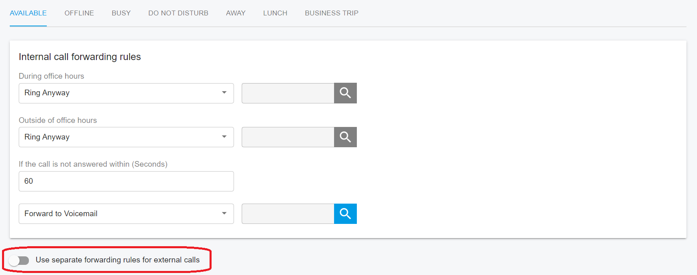

# Configure Call Forwarding Rules

Each extension can be configured with call forwarding rules that define how PortSIP PBX handles incoming calls when the extension user is unable to answer.

Forwarding rules can be evaluated based on:

* User status
* Time conditions
* Call source

***

### Status-Based Forwarding

A forwarding rule can be configured for each of the following user statuses:

* **Available**
* **Offline**
* **Busy**
* **Do Not Disturb**
* **Away**
* **Lunch**
* **Business Trip**

For example, if the user cannot answer calls while their status is **Available**, incoming calls can be forwarded to:

* Voicemail
* Another extension
* A service number, such as a ring group, queue, or Virtual Receptionist
* A mobile or landline number

> **Note** Forwarding calls to an external PSTN number requires a configured SIP trunk and an appropriate outbound routing rule.

***

### Forwarding Actions

Each forwarding rule supports the following actions.

#### Forward to Voicemail

Routes the call to voicemail and allows the caller to leave a voice message.

You can optionally specify an extension number for the voicemail box. If extension 108 is specified, the voicemail is stored in extension 108's mailbox. If the field is left blank, the voicemail is stored in the current extension's mailbox.

#### Forward to Number

Forwards the call to a specified destination, including:

* An extension number
* A system extension, such as a ring group, Virtual Receptionist, meeting, or queue
* A PSTN number

> **Important** Forwarding calls to a PSTN number requires a configured SIP trunk and an appropriate outbound routing rule.

#### Hang Up

Immediately terminates the call at the PBX.

#### Ring Anyway

Delivers the call to the extension even if other forwarding conditions are met.

***

### Configure Separate Forwarding Rules for Internal and External Calls

PortSIP PBX allows extension users to apply different forwarding rules based on the call source:

* **Internal calls** are calls from other extensions within the PBX.
* **External calls** are calls received through a SIP trunk.

This feature allows users to forward external calls to different destinations or apply different forwarding behavior when they are busy, offline, or in another presence status.

The option can be configured independently for each user status.

#### Configure Separate Forwarding Rules

1. In the Web Portal, navigate to **Call Manager > Extensions**.
2. Select an extension and click **Edit**.
3. Select **Forwarding Rules**.
4. Select the user status you want to configure.
5. Turn on **Use separate forwarding rules for external calls**.
6. Configure the following two sets of rules:
   * **Internal call forwarding rules** apply to calls from other extensions.
   * **External call forwarding rules** apply to calls received through a SIP trunk.
7. Save the changes.

For example, you can use separate rules for external calls when the extension is **Busy**, while using the same rules for all calls when the extension is **Offline**.

#### When Separate Forwarding Rules Are Disabled

When **Use separate forwarding rules for external calls** is turned off:

* Both internal and external calls use the **Internal call forwarding rules**.
* The **External call forwarding rules** are hidden.
* Previously configured external call forwarding rules are retained but are not applied.

Turning off this option does not reset, overwrite, or delete the saved external call forwarding rules. The rules are displayed and applied again when the option is turned on.

<figure><figcaption></figcaption></figure>

#### When Separate Forwarding Rules Are Enabled

When **Use separate forwarding rules for external calls** is turned on:

* Calls from other extensions use the **Internal call forwarding rules**.
* Calls received through a SIP trunk use the **External call forwarding rules**.

#### Default Behavior

For newly created extensions, **Use separate forwarding rules for external calls** is turned off by default. Internal and external calls use the same forwarding rules unless separate rules for external calls are enabled.

For extensions upgraded from an earlier version, this option is also turned off by default. Existing call forwarding behavior remains unchanged after the upgrade.

***

### Exception Rules

Exception rules allow you to override the standard call handling behavior for specific incoming calls.

On the **Call Handling** tab, you can configure an exception rule by specifying:

* **Caller ID**
* **Received During**: The time period during which the rule applies
* **Forward To**: The action to apply to matching calls

When an incoming call matches an exception rule:

* The call is processed according to the exception rule.
* The extension’s standard call handling and forwarding rules are bypassed.

