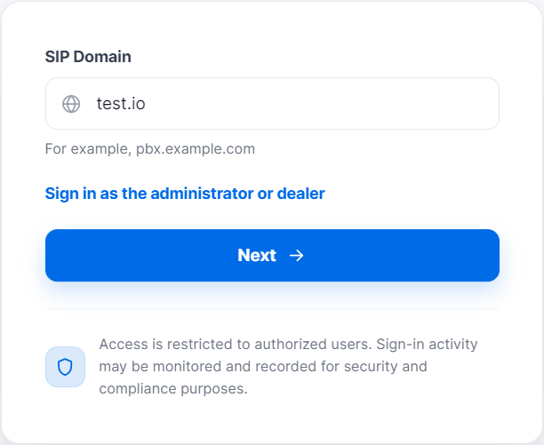
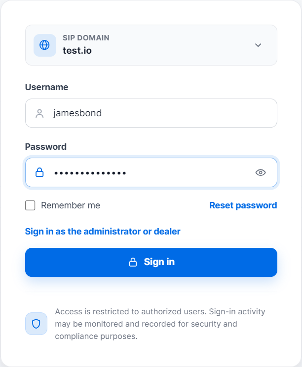
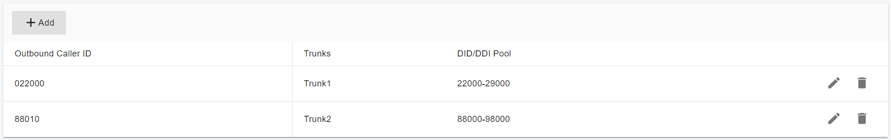
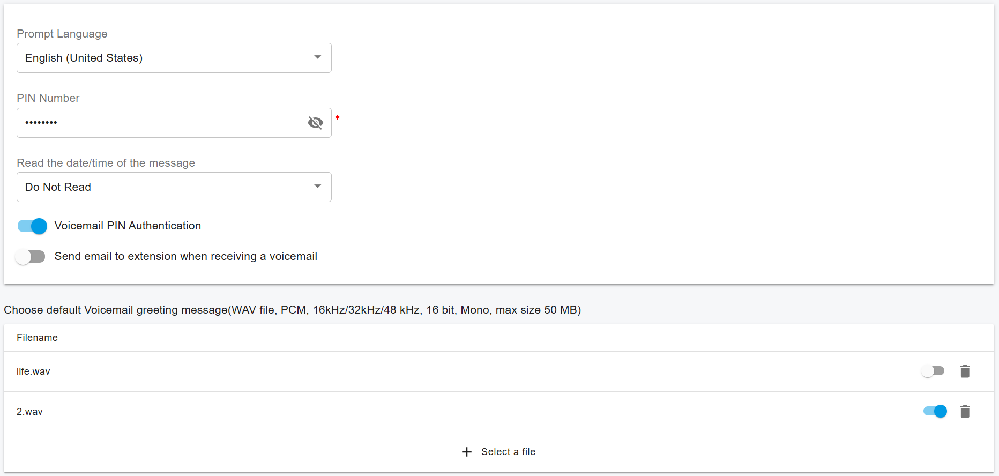
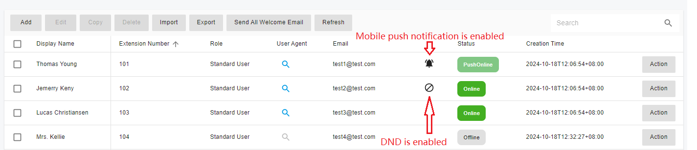
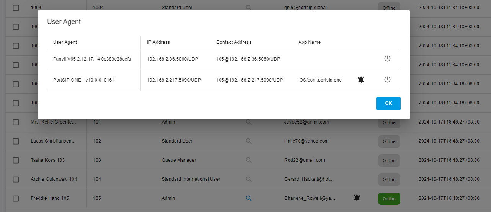

# Configure Extension Users

This guide explains how to create and configure extensions in PortSIP PBX. The system supports multiple methods for creating extensions to accommodate different deployment and provisioning scenarios.

When provisioning a new phone, you can create a new extension specifically for that device.

### Methods to Create an Extension

Extensions can be created using any of the following methods:

* **Manually** from the Web Portal: **Call Manager > Extensions**
* **By bulk import** using a `.csv` file
* **Programmatically** using the REST API
* **By duplication** from an existing extension

***

### Access Extension Configuration

To configure extensions, use one of the following methods:

* Sign in to the PortSIP PBX Web Portal using **System Admin** credentials. Select **Tenants**, select the target tenant, and then click **Manage**.
* Sign in to the Web Portal using an account with the **Tenant Admin** role to manage that tenant directly.

***

### Add or Edit an Extension

1. In the Web Portal, navigate to **Call Manager > Extensions**.
2. To create an extension, click **Add**.
3. To configure an existing extension, select the extension and click **Edit**.

***

### User

#### Username and Password

On the **User** tab, enter the user's **Username** and **Password**.

> **Important** These credentials are used only to access the **PBX Personal Web Portal**. They are not used for SIP device registration.

For example, you can create a user with the username `jamesbond`.

#### Role Assignment

Select a role from the **Role** list:

* **User**: Provides standard extension access.
* **Admin**: Grants tenant-level administrative privileges.

A user assigned the **Admin** role is referred to as a **Tenant Admin**.

> **Notes**
>
> * A Tenant Admin can manage all settings for their tenant.
> * PortSIP PBX allows multiple Tenant Admins within the same tenant.

#### Email Address

The **Email** field is required. PortSIP PBX uses this address to send system notifications and user-related emails.

#### Display Name

The **Display Name** represents the user's full name, for example, **James Bond**.

#### Sign In to the PBX Web Portal

After the user is created, they can sign in to the PBX Web Portal using their:

* Username
* Password
* Tenant SIP domain

On the initial sign-in screen, click **Sign in as a tenant user**. On the next page, enter the tenant SIP domain and click **Next**.

<figure><figcaption></figcaption></figure>

If the SIP domain is correct, the system displays the sign-in screen where the user can enter their username and password.

<figure><figcaption></figcaption></figure>

***

### Extension

#### Extension Number and Password

On the **Extension** tab, enter the **Extension Number** and **Password**. Both fields are required.

#### Welcome Email and QR Code Provisioning

If the tenant's SMTP server is configured, PortSIP PBX automatically sends a welcome email to the user's email address after the extension is created. The email includes:

* Extension details
* PBX SIP domain
* PBX IP address
* A QR code for client provisioning

The PortSIP UC App can scan the QR code to register with the PBX without requiring manual configuration.

#### QR Code Login

Each extension has a dedicated QR code. The user can save the QR code and scan it with the PortSIP App to sign in to the PBX without entering the account details manually.

#### Preferred Transport for QR Code

The **Preferred Transport for QR Code** option specifies the transport protocol associated with the QR code, such as UDP, TCP, or TLS.

When the PortSIP App registers by scanning the QR code, it prioritizes the selected transport.

#### Network Interface for QR Code Generation

The **Generate QR code with the below network interface** option specifies the outbound proxy server address used by the client app when registering through the QR code.

This setting is useful in multi-NIC or NAT environments, where the client must connect through the correct public-facing interface.

#### Outbound Caller ID

In the **Outbound Caller ID** section, you can assign a DID from the trunk DID pool to the extension.

When the extension places a call through a trunk, the selected outbound caller ID is presented as the user part of the `From` header in the SIP `INVITE` message.

For example:

* Calls placed through Trunk 1 present an outbound caller ID of `022000`.
* Calls placed through Trunk 2 present an outbound caller ID of `88010`.

<figure><figcaption></figcaption></figure>

#### Call Recording Options

* **Record audio calls**: Records all audio calls for the extension and saves them as audio files.
* **Record video calls**: Records all video calls for the extension and saves them as MP4 files.

#### Caller ID Privacy and Delivery

* **Always make outbound anonymous calls**: Sets the user part of the `From` header to `anonymous` in outbound SIP `INVITE` messages.
* **Always deliver outbound caller ID**: Always uses the configured outbound caller ID as the user part of the `From` header in outbound SIP `INVITE` messages sent to the trunk.

> **Note** Enabling both options at the same time may result in conflicting behavior. Confirm the caller ID and privacy requirements of your trunk provider before enabling these settings.

***

### Voicemail

The **Voicemail** page allows you to configure the extension's voicemail preferences, including:

* Setting the voicemail PIN
* Enabling or disabling PIN authentication
* Enabling date and time announcements during voicemail playback

#### Configure a Voicemail Greeting

In the **Choose Default Voicemail Greeting Message** section, you can manage the voicemail greetings used for the extension.

**Upload a Greeting**

1. Click **+** to upload a greeting audio file.
2. Click the **Switch** icon next to the greeting to set it as the active voicemail greeting.

**Record a Greeting**

Users can record their voicemail greeting from their phone by dialing the Feature Access Code (FAC) `*57`.

<figure><figcaption></figcaption></figure>

***

### Office Hours

The **Office Hours** feature allows an extension's user status to change automatically based on global office hours or extension-specific office hours.

Select one of the following options:

* **Use Global Office Hours**
* **Use Specific Office Hours** to define different office hours for each day of the week

#### Time Range Behavior

* `00:00–23:59`: The entire day is open for business.
* `00:00–00:00`: The entire day is closed.

For more information about configuring office hours and holidays, refer to the [Office Hours and Holiday Schedule](../office-hours-and-holiday-schedule/) section.

***

### Phone Provisioning

The **Phone Provisioning** tab allows you to add or edit the settings of IP phones associated with the extension.

Detailed management of IP phone configuration is covered in [Phone Device Management](../4-phone-device-management/).

***

### BLF

The **BLF** tab allows you to configure Busy Lamp Field keys on supported IP phones. You can associate a BLF key with an extension so that it displays the extension's real-time status.

The number of available BLF keys depends on the phone model.

#### Supported BLF Functions

* **BLF**: Displays the call or dialog status of another extension.
* **Visual Park**: Provides access to PortSIP PBX visual call parking. For details, see [Call Parking](../14-call-parking/).
* **Speed Dial**: Assigns a phone number for one-touch dialing.
* **Custom Speed Dial**: Allows advanced or customized speed-dial behavior.
* **Change Status**: Allows the user to change their presence status from the phone.
* **Night Mode**: Allows the user to activate or deactivate Night Mode. For details, see [Night Mode](../32-night-mode.md).

***

### Balance

A Tenant Admin can add funds to an extension's balance.

When billing is enabled, calls fail automatically if the extension has an insufficient balance.

***

### Extension Status

To view extension status, navigate to **Call Manager > Extensions**. The current status of each extension is displayed in the **Status** column.

<figure><figcaption></figcaption></figure>

#### Status Indicators

* **Alarm icon**: Indicates that the extension has successfully enabled push notifications.
* **Blocked icon**: Indicates that Do Not Disturb is enabled for the extension.

#### View Device Registration Details

Click the **Search** icon next to an online extension to view its device registration details, including:

* Client or phone type
* IP address
* Port number
* Transport protocol, such as UDP, TCP, or TLS

For example, extension 102 may be registered simultaneously on the following devices:

* **PortSIP ONE app**
  * IP address: `192.168.0.22`
  * Port: `5960`
  * Transport: UDP
* **Yealink T53 IP phone**
  * IP address: `192.168.0.36`
  * Port: `5060`
  * Transport: UDP

<figure><figcaption></figcaption></figure>

***

### Register Client Apps and IP Phones

For instructions on registering client applications and IP phones with PortSIP PBX, see [How to Configure the Endpoints](how-to-configure-the-endpoints.md).

