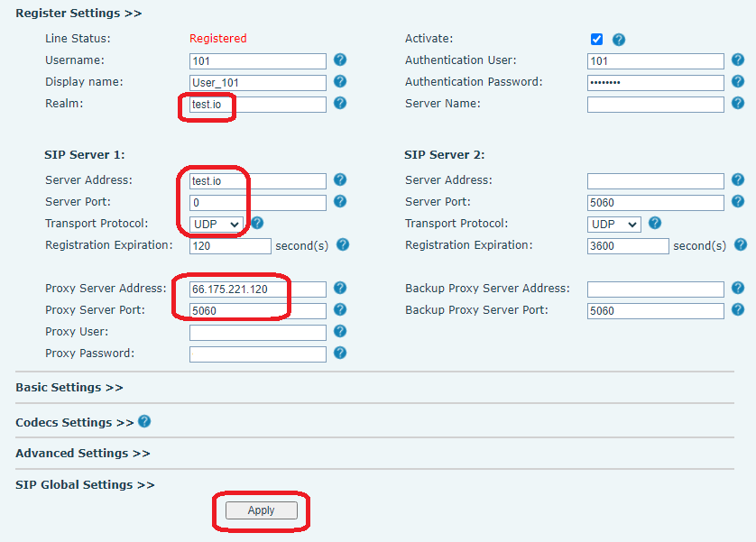

# How to Configure the Endpoints?

After successfully [configuring the PortSIP PBX](../2-configuring-the-portsip-pbx.md) and [SBC](../9-configuring-portsip-sbc/), and [creating the tenants](../3-tenant-management/) and [extensions](./), you can now register the endpoints (WebRTC, mobile app, Windows Desktop app, IP Phone, and any SIP-based device) to the PBX. This will allow you to make and receive calls.

## Configuring the PortSIP ONE App

If you are using the PortSIP PBX v22.0 or higher, please follow the guide [PortSIP ONE Guides](broken-reference) to configure it.

## Configuring the PortSIP Softphone App

If you are using the PortSIP PBX v16.x, please follow the guide [PortSIP Softphone](../../../apps-guides/portsip-softphone.md) to configure it.

## Configuring IP Phone

In this article, we assume the following configurations:

* The PortSIP PBX and SBC are installed on a server with a public IP of **66.175.221.120** and a private IP of **192.168.1.72**.
* The PBX web domain **uc.portsip.cc** has been resolved to the PBX server public IP **66.175.221.120**.
* The PBX created UDP transport on port **5060**, TLS transport on port **5061** over TLS,  TCP transport on port **5063**, and WSS transport on port **5065** in the SBC.
* A tenant has been created with the SIP domain set up as **test.io**.

As per the above settings, after you sign in to the PBX as the system administrator, you will see the page like the screenshot below:

<figure><figcaption></figcaption></figure>

### Essential Information

There are some rules for configuring the client endpoints for the above scenario:

* **Transport.** It's the network transport for sending & receiving the SIP message in the PBX. For more details please read the article: [Transport Management](../6-transport-management.md).
* **Outbound Proxy server.** The PBX server IP refers to the **Outbound Proxy Server** in the client endpoints. If the client endpoint registers to PBX over the internet, use the public IP as the **Outbound Proxy Server**. You can also use **uc.portsip.cc** as the **Outbound Proxy Server** if registering to PBX over the internet since this domain has been resolved to the public IP; If registering to PBX from the LAN, use the private IP as the **Outbound Proxy Server**.
* **Outbound Proxy Server Port.** The port of transport is created in the PBX or SBC. For example, if you want the endpoint registered to the PBX over TCP transport, then you will need to set 5063 for **Outbound Proxy Server Port** in the endpoint settings.
* **Domain.** Also known as **SIP domain** or **SIP server** in the endpoint settings. It’s the **SIP domain** of the tenant that was created in PortSIP PBX - so just set the tenant’s **SIP domain** for Domain/SIP Domain/SIP server in the endpoint settings.&#x20;


&#x20;Just need to set the transport port for the Outbound Proxy Server Port only. Don’t set the transport port for the Domain in the endpoint settings. If the endpoint requires filling the port for the Domain, please fill in 0 for the domain port.


### Auto provision the IP phone to PBX

For popular IP phones such as Fanvil, Yelaink, SNOM, GrandStream, DinStar, ALE, and Htek, they can be auto-provisioned to register to the PortSIP PBX without the need to configure the IP phone manually. For more details, please read this article: [Phone Device Management](../4-phone-device-management/).

### Manually Register the IP Phone to PBX

You can also enter the SIP user extension details on the IP Phone web portal to register the IP Phone or other SIP-based device/app.

#### Example of Fanvil IP Phone

<figure><figcaption></figcaption></figure>

#### Example of Yealink IP Phone

<figure><figcaption></figcaption></figure>

For other SIP-based apps and IP Phones, you can configure them similarly to the above description.

