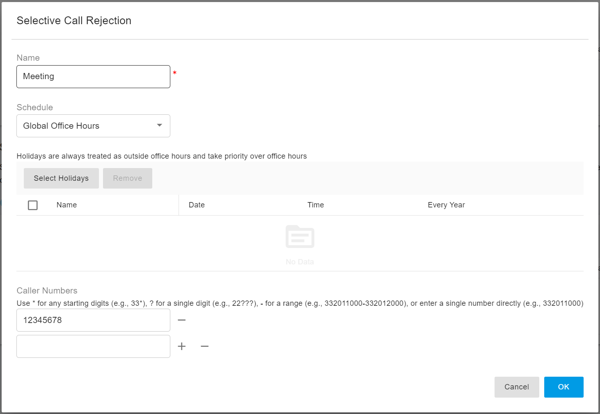

# Selective Call Rejection and Call Acceptance

PortSIP PBX allows extension users to control which callers can reach them during specific time periods by using **Selective Call Rejection** and **Selective Call Acceptance**.

These features apply only to calls routed directly to an extension. They do not block calls delivered through a **Call Queue**, **Team**, or **Ring Group**.

***

### Overview

Selective call filtering provides two types of rules:

| Feature                       | Description                                                                                                                           |
| ----------------------------- | ------------------------------------------------------------------------------------------------------------------------------------- |
| **Selective Call Rejection**  | Blocks calls from selected caller numbers when the rule schedule is active.                                                           |
| **Selective Call Acceptance** | Allows calls only from selected caller numbers when the rule schedule is active. Other callers are rejected while the rule is active. |

Each rule can include:

* A caller number or caller number pattern
* A schedule condition, such as all hours, office hours, outside office hours, or specific office hours
* Optional holiday schedules

***

### Selective Call Rejection

Selective Call Rejection works as a deny list.

When this feature is enabled, PortSIP PBX checks whether the caller number matches a rejection rule whose schedule is currently active.

#### Behavior

| Schedule Active? | Caller Number Matches? | Result               |
| ---------------- | ---------------------: | -------------------- |
| No               |         Not applicable | The call is accepted |
| Yes              |                    Yes | The call is rejected |
| Yes              |                     No | The call is accepted |

#### Example

Extension `1001` enables Selective Call Rejection and adds caller number `18005550100`.

The rule is configured to apply during office hours.

* If `18005550100` calls during office hours, the call is rejected.
* If `18005550100` calls outside office hours, the schedule is not active, so the call is not rejected by this feature.
* If another caller calls during office hours, the call is accepted because the caller number does not match the rejection rule.

***

### Selective Call Acceptance

Selective Call Acceptance works as an allow list.

When this feature is enabled, PortSIP PBX checks whether at least one acceptance rule schedule is currently active.

If no acceptance rule schedule is active, the feature does not affect the call, and the call is accepted.

If an acceptance rule schedule is active, only callers that match the configured acceptance numbers are allowed. Other callers are rejected.

#### Behavior

| Schedule Active? | Caller Number Matches? | Result               |
| ---------------- | ---------------------: | -------------------- |
| No               |         Not applicable | The call is accepted |
| Yes              |                    Yes | The call is accepted |
| Yes              |                     No | The call is rejected |

#### Example

Extension `1001` enables Selective Call Acceptance and adds caller number `18005550100`.

The rule is configured to apply during office hours.

* If `18005550100` calls during office hours, the call is accepted.
* If another caller calls during office hours, the call is rejected.
* If any caller calls outside office hours, the acceptance rule is not active, so the call is not rejected by this feature.

***

### Rule Schedule Conditions

Each selective call rule can use one of the following schedule conditions.

| Condition                         | Description                                                                                                                                             |
| --------------------------------- | ------------------------------------------------------------------------------------------------------------------------------------------------------- |
| **All Hours**                     | The rule is always active. Holiday schedules do not affect this condition.                                                                              |
| **Specific Office Hours**         | The rule is active only during the office hours configured for this rule.                                                                               |
| **Personal Office Hours**         | The rule is active during the extension’s personal office hours. If the extension uses global office hours, the tenant’s global office hours are used.  |
| **Outside Personal Office Hours** | The rule is active outside the extension’s personal office hours. If the extension uses global office hours, the tenant’s global office hours are used. |
| **Global Office Hours**           | The rule is active during the tenant’s global office hours.                                                                                             |
| **Outside Global Office Hours**   | The rule is active outside the tenant’s global office hours.                                                                                            |

### Holiday Handling

Holiday schedules override office hours.

If a rule is configured to apply during office hours, the rule is not active during a holiday.

If a rule is configured to apply outside office hours, the rule is active during a holiday.

The **All Hours** condition ignores holidays and remains active at all times.

#### Example

Assume the following configuration:

* Office hours are Monday to Friday, 9:00 AM to 6:00 PM.
* The current time is Monday, 10:00 AM.
* Today is also configured as a holiday.

In this case:

* A rule using **Office Hours** is not active.
* A rule using **Outside Office Hours** is active.
* A rule using **All Hours** is active.

### Rule-Specific Holidays and Extension Holidays

A selective call rule may have its own holiday schedule.

If the rule has a holiday schedule, PortSIP PBX uses that holiday schedule when evaluating the rule.

If the rule does not have a holiday schedule, PortSIP PBX uses the extension’s configured holiday schedule.

***

### Evaluation Order

PortSIP PBX evaluates selective call filtering in the following order:

1. Exceptions
2. Selective Call Rejection
3. Selective Call Acceptance
4. Normal call routing

Selective Call Rejection has higher priority than Selective Call Acceptance.

This means that if a caller matches an active rejection rule, the call is rejected immediately, even if the same caller would also match an acceptance rule.

### Empty Rule Lists

If Selective Call Rejection is enabled but no rejection numbers are configured, the feature does not reject any calls.

If Selective Call Acceptance is enabled but no acceptance numbers are configured, the feature does not reject any calls.

This behavior prevents an extension from accidentally blocking all callers because of an empty allow list.

### Call Rejection Response

When a call is rejected by Selective Call Rejection or Selective Call Acceptance, PortSIP PBX rejects the call before ringing the extension.

The caller may receive a busy or rejected response, depending on PBX configuration, SIP endpoint behavior, and the upstream carrier.

***

### Recommended Use Cases

#### Block Unwanted Callers During Business Hours

Use Selective Call Rejection with an office-hours schedule to block specific callers only while the extension is working.

#### Allow Only Important Callers During Business Hours

Use Selective Call Acceptance with an office-hours schedule to allow calls only from selected callers during business hours.

#### Allow All Calls Outside the Active Schedule

If a selective call rule is not active because its schedule does not match the current time, PortSIP PBX allows the call to continue normally.

This ensures that schedule-based rules affect calls only during their configured time periods.

***

### Configuring Selective Call Rejection and Acceptance

Selective Call Rejection and Selective Call Acceptance can be configured by Tenant Administrators or by extension users.

#### For Tenant Administrators

1. Sign in to the PBX Web Portal as a Tenant Administrator.
2. Navigate to **Call Manager > Users**.
3. Select the target extension.
4. Click the **Call Handling** tab.
5. Enable **Selective Call Rejection** or **Selective Call Acceptance**.
6. Click **Add**.
7. Enter the caller number or caller number pattern.
8. Select the schedule condition.
9. Configure office hours or holiday schedules if required.
10. Save the rule.

#### For Extension Users

1. Sign in to the PBX Web Portal as an extension user.
2. Open the **Profile** menu.
3. Click the **Call Handling** tab.
4. Enable **Selective Call Rejection** or **Selective Call Acceptance**.
5. Click **Add**.
6. Enter the caller number or caller number pattern.
7. Select the schedule condition.
8. Configure office hours or holiday schedules if required.
9. Save the rule.

<figure><figcaption></figcaption></figure>

***

### Activating or Deactivating Selective Call Filtering Using Feature Access Codes

Users can also activate or deactivate Selective Call Rejection and Selective Call Acceptance by dialing **Feature Access Codes (FACs)** from a phone or client app.

This allows users to quickly turn the feature on or off without signing in to the Web Portal.

#### Selective Call Rejection FACs

| Action                              | Feature Access Code |
| ----------------------------------- | ------------------- |
| Activate Selective Call Rejection   | `*25`               |
| Deactivate Selective Call Rejection | `*26`               |

To activate Selective Call Rejection:

1. From your phone or client app, dial `*25`.
2. Follow the PBX voice prompts.
3. After the feature is activated, the PBX plays a confirmation prompt.

To deactivate Selective Call Rejection:

1. From your phone or client app, dial `*26`.
2. Follow the PBX voice prompts.
3. After the feature is deactivated, the PBX plays a confirmation prompt.

#### Selective Call Acceptance FACs

| Action                               | Feature Access Code |
| ------------------------------------ | ------------------- |
| Activate Selective Call Acceptance   | `*60`               |
| Deactivate Selective Call Acceptance | `*61`               |

To activate Selective Call Acceptance:

1. From your phone or client app, dial `*60`.
2. Follow the PBX voice prompts.
3. After the feature is activated, the PBX plays a confirmation prompt.

To deactivate Selective Call Acceptance:

1. From your phone or client app, dial `*61`.
2. Follow the PBX voice prompts.
3. After the feature is deactivated, the PBX plays a confirmation prompt.

***

### Important Notes

* These features apply only to calls routed directly to an extension. They do not block calls delivered through a **Call Queue**, **Team**, or **Ring Group**.
* Selective Call Rejection is evaluated before Selective Call Acceptance.
* Holidays override office hours.
* The **All Hours** condition ignores holidays.
* A rule schedule must be active before caller-number matching affects the call.
* For Selective Call Acceptance, unmatched callers are rejected only when at least one acceptance rule schedule is currently active.
* Outside the active schedule, Selective Call Acceptance does not block callers.
