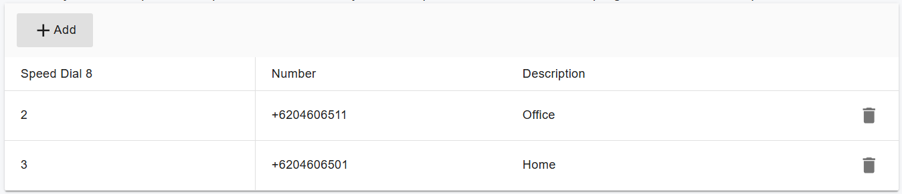

# Speed Dial 8

Speed Dial 8 allows you to set up to eight frequently dialed or hard-to remember long strings of digits that can be called with the push of a button. Users can then use the single digit instead of full numbers to place calls.

This single-digit code(2-9) is referred to as a speed code. The user can associate a phone number including 911 emergency and 611 for customer service.&#x20;

There are two methods by which a user can program speed codes, through the web portal or by dialing a feature access code.

## Configuring Speed Dial 8 in the Web Portal

You can configure Speed Dial 8 in the PortSIP PBX Web Portal through the following steps:

1. **For Tenant Admins**:
   * Log in to the Web Portal as a tenant administrator.
   * Navigate to **Call Manager > Users**, select the desired extension, and click the **Speed Dial 8** tab to set up speed dialing options.
2. **For Extension Users**:
   * Log in to the Web Portal as an extension user.
   * Go to the **Profile** menu, then click the **Speed Dial 8** tab to configure your speed dialing settings.

<figure><figcaption></figcaption></figure>

## Configuring Speed Dial 8 Using Feature Access Codes (FAC)

You can also set up Speed Dial 8 by dialing the Feature Access Code (FAC) directly from your phone or app.

### Setting Up a Speed Dial Code

To program speed dial code **5** for the phone number **12345678**:

1. From your phone, dial `*74512345678`.
2. Follow the voice prompts provided by the PBX, which will confirm if the setup was successful.

Once configured, you can use the speed dial by simply dialing the single digit **5** on your phone, and the PBX will automatically call **12345678**.

### Modifying Speed Dial Code Settings

To update the number assigned to an existing speed dial code:

* Dial `*7450033125`. This command will replace the previous number for code 5 with the new number **0033125**.

### Deleting a Speed Dial Code

To delete the settings for speed dial code 5:

* Dial `*745*` to clear the stored number for code 5.

