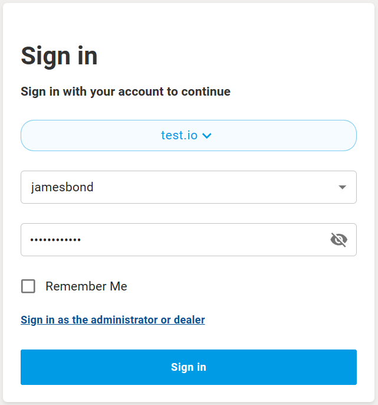
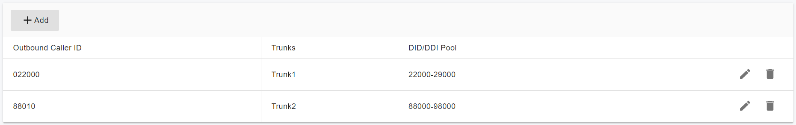
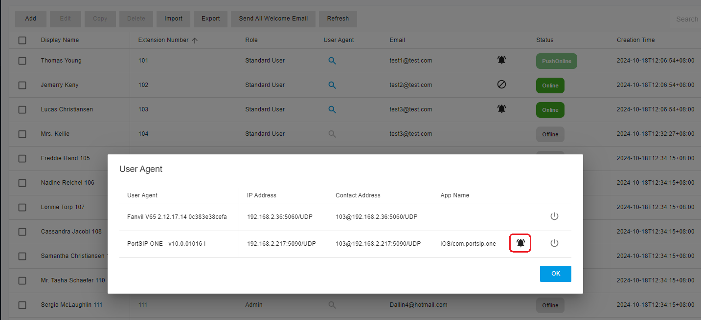

# Users

This section explains how to create and configure extensions in **PortSIP PBX**. The system supports multiple methods for creating extensions to fit different deployment and provisioning scenarios.

When provisioning a new phone, you can choose to **create a new extension** specifically for that device.

#### Methods to Create an Extension

Extensions can be created using any of the following methods:

* **Manually**, from the Web Portal:\
  **Call Manager > Extensions**
* **Bulk import**, by uploading a `.csv` file
* **Programmatically**, by calling the **REST API**
* **By duplication**, copying from an existing extension

***

#### Accessing Extension Configuration

To configure extensions, do one of the following:

* Sign in to the PortSIP PBX Web Portal using **System Admin** credentials.\
  Click **Tenants**, select the target tenant, and then click **Manage**.

**OR**

* Sign in to the Web Portal using an account with the **Tenant Admin** role to manage that tenant directly.

***

#### Adding or Editing an Extension

1. In the Web Portal, navigate to **Call Manager > Extensions**.
2. Click **Add** to create a new extension, **or**
3. Select an existing extension and click **Edit** to configure or manage that extension.

***

#### Username and Password

On the **User** tab, enter the **Username** and **Password** for the user.

> **Important**\
> These credentials are used **only** to access the **PBX Personal Web Portal**.\
> They are **not** used for SIP device registration.

For example, you may create a user with the username **`jamesbond`**.

***

#### Role Assignment

Assign permissions by selecting a role from the **Role** list:

* **User**\
  Provides standard extension access.
* **Admin**\
  Grants tenant-level administrative privileges.

A user assigned the **Admin** role is referred to as a **Tenant Admin**.

> **Notes**
>
> * A Tenant Admin can manage all settings for the tenant to which they belong.
> * PortSIP PBX allows **multiple Tenant Admins** within the same tenant.

***

#### Email Address

The **Email** field is **mandatory**.

The PBX uses this email address to send system notifications and user-related emails.

***

#### Display Name

The **Display Name** represents the user’s full name, for example:\
**James Bond**

***

### Signing In to the PBX Web Portal

After the user is created, the user can sign in to the **PBX Web Portal** using:

* **Username**
* **Password**
* **Tenant SIP Domain**

On the initial login screen, the user must first enter the **tenant’s SIP domain** and click **Next**.

<figure><figcaption></figcaption></figure>

* If the SIP domain is correct, the system displays the login screen where the user can enter their **username and password**.

<figure><figcaption></figcaption></figure>

***

### Extension

On the **Extension** tab, the **Extension Number** and **Password** are **mandatory** and must be provided.

***

#### Welcome Email and QR Code Provisioning

If the tenant’s **SMTP server** is configured, the PBX automatically sends a **welcome email** to the user’s email address after the extension is created successfully.\
This email includes:

* Extension details
* PBX SIP domain
* PBX IP address
* A **QR code** for client provisioning

The **PortSIP UC App** can scan this QR code to register with the PBX automatically, eliminating the need for manual configuration.

***

#### QR Code Login

Each extension includes a dedicated **QR code**. Instead of entering account details manually, you can save the QR code and use the PortSIP App to scan it and sign in to the PBX.

***

#### Preferred Transport for QR Code

The **Preferred Transport for QR Code** option allows you to specify the transport protocol (for example, UDP, TCP, or TLS) associated with the QR code.

When the client registers by scanning the QR code, the PortSIP App will **prioritize the selected transport**.

***

#### Network Interface for QR Code Generation

The **Generate QR code with the below network interface** option specifies the **outbound proxy server address** that the client app will use when registering via QR code.

This setting is especially useful in multi-NIC or NAT environments to ensure clients connect using the correct public-facing interface.

***

#### Outbound Caller ID

In the **Outbound Caller ID** section, you can assign a DID from the trunk DID pool to the extension.

When the extension makes an outbound call through a trunk, the selected **Outbound Caller ID** is presented as the **user part of the `From` header** in the SIP `INVITE` message.

For example:

* Calls placed over **Trunk 1** present an Outbound Caller ID of **022000**
* Calls placed over **Trunk 2** present an Outbound Caller ID of **88010**

<figure><figcaption></figcaption></figure>

***

#### Call Recording Options

* **Record audio calls**\
  When enabled, all audio calls for this extension are recorded and saved as audio files.
* **Record video calls**\
  When enabled, all video calls for this extension are recorded and saved as video files (MP4 format).

***

#### Caller ID Privacy and Delivery

* **Always make outbound anonymous calls**\
  When enabled, the user part of the `From` header in outbound SIP `INVITE` messages is set to **`anonymous`**.
* **Always deliver outbound caller ID**\
  When enabled, the configured **Outbound Caller ID** is always used as the user part of the `From` header in outbound SIP `INVITE` messages sent to the trunk.

> **Note**\
> Enabling both options at the same time may result in conflicting behavior. Ensure your trunk provider’s caller ID and privacy requirements are clearly understood before enabling these settings.

***

### Forwarding Rules

Each extension can be configured with a set of **call forwarding rules** that define how **PortSIP PBX** handles incoming calls when the extension user is **unable to answer**.

Forwarding rules can be evaluated based on the following criteria:

* **User status**
* **Time conditions**

***

#### Status-Based Forwarding

A forwarding rule must be defined **for each user status**.

For example, if a user cannot answer calls while their status is **Available**, incoming calls can be forwarded to:

* Voicemail, or
* Another extension number, or
* A service number, such as a ring group, queue, IVR, or
* A mobile phone number or landline

> **Note**\
> Forwarding calls to an external (PSTN) number requires a **configured SIP trunk** and an appropriate **outbound routing rule**.

***

#### Forwarding Actions

Each forwarding rule supports the following optional actions:

#### Forward to Voicemail

Routes the call to the voicemail service, allowing the caller to leave a voice message.

* You may optionally specify an **extension number** for the voicemail box.
  * If **Extension 108** is selected, the voicemail is stored in extension 108’s mailbox.
  * If left **blank**, the voicemail is stored in the **current extension’s mailbox**.

***

#### Forward to Number

Forwards the call to a specified destination number. Supported destinations include:

* An extension number
* A system extension, such as:
  * Ring Group
  * Virtual Receptionist
  * Meeting number
  * Queue number
* A PSTN phone number

> **Important**\
> Forwarding calls to a PSTN number requires a configured SIP trunk and outbound rule.

***

#### Hang Up

Immediately terminates the call at the PBX.

***

#### Ring Anyway

Delivers the call to the extension, even if other forwarding conditions are met.

***

### Exception Rules

You can define **exception rules** to override the standard forwarding behavior for specific calls.

An exception rule is configured by specifying:

* **Caller ID**
* **Time range**, using the **Received During** field
* The desired action in the **Forward To** field

If an incoming call matches an exception rule:

* The call is processed according to the **exception rule**, and
* The extension’s **normal forwarding rules are bypassed**.

***

### Voicemail

The **Voicemail** page allows you to configure an extension’s voicemail preferences, including:

* Setting the **voicemail PIN** for authentication
* Enabling or disabling **PIN authentication**
* Enabling message **date and time announcements** during voicemail playback

These settings control how users access and interact with their voicemail messages.

***

### Voicemail Greeting Configuration

In the **Choose Default Voicemail Greeting Message** section, you can manage the voicemail greetings used for this extension.

#### Uploading a Greeting

* Click the **“+”** button to upload a new greeting audio file.
* Click the **Switch** icon next to a greeting to set it as the **active voicemail greeting**.

#### Recording a Greeting

Users can also record their voicemail greeting directly from their phone by dialing the **Feature Access Code (FAC) `*57`**.

<figure><figcaption></figcaption></figure>

***

### Office Hours

The Office Hours feature allows an extension’s user status to change automatically based on either global office hours or extension-specific office hours.

* Choose whether the extension uses **Global Office Hours** or **Specific Office Hours**.
* Select **Use Specific Office Hours** to define different office hours for each day of the week.

#### Time Range Behavior

* **00:00 – 23:59**: The entire day is considered **open for business**.
* **00:00 – 00:00**: The entire day is considered **closed**.

For more information about configuring office hours and holidays, refer to the [Office Hours and Holiday Schedule](../office-hours-and-holiday-schedule/) section.

***

### Phone Provisioning

The Phone Provisioning tab allows you to add or edit the settings of IP phones associated with this extension.

Detailed management of IP phone configuration is covered in [Phone Device Management](../4-phone-device-management/).

***

### BLF (Busy Lamp Field)

The **BLF** tab allows you to configure BLF keys on supported IP phones.

You can associate a BLF button with an extension so the button displays the **real-time status** of that extension.\
The number of available BLF buttons depends on the phone model.

#### Supported BLF Functions

* **BLF**\
  Displays the call/dialog status of another extension.
* **Visual Park**\
  PortSIP PBX’s visual call parking feature.\
  For details, see [Call Parking](../14-call-parking/).
* **Speed Dial**\
  Assigns a phone number for one-touch dialing.
* **Custom Speed Dial**\
  Allows advanced or customized speed-dial behavior.
* **Change Status**\
  Enables the user to change their presence status directly from the phone.
* **Night Mode**\
  Allows quick activation or deactivation of Night Mode.\
  For details, see [Night Mode](../32-night-mode.md).

***

### Balance

The **Balance** for an extension can be recharged by a **Tenant Administrator**.

When billing is enabled:

* Calls will **fail automatically** if the extension’s balance is insufficient.

***

### Extension Status

You can view the status of extensions by navigating to **Call Manager > Users**.\
Each extension’s **current status** is displayed in the **Status** column.

#### Status Indicators

* **Alarm icon**\
  Indicates that the extension has successfully enabled **push notifications**.
* **Blocked icon**\
  Indicates that **Do Not Disturb (DND)** is enabled for the extension.

<figure><figcaption></figcaption></figure>

***

#### Viewing Device Registration Details

You can click the **Search** icon next to an online extension to view its **device registration details**.

The device details show:

* Client or phone type
* IP address
* Port number
* Transport protocol (UDP/TCP/TLS)

As shown in the example:

* **Extension 102** is registered from:
  * A **PortSIP ONE app**
    * IP address: `192.168.0.22`
    * Port: `5960`
    * Transport: `UDP`
  * A **Yealink T53 IP phone**
    * IP address: `192.168.0.36`
    * Port: `5060`
    * Transport: `UDP`

This indicates that the extension is simultaneously registered on multiple devices.

<figure><figcaption></figcaption></figure>

***

### Registering Client Apps and IP Phones

This section explains how to register client applications and IP phones with the PortSIP PBX.

For detailed, step-by-step instructions, refer to the following article:

[How to Configure the Endpoints](how-to-configure-the-endpoints.md)

