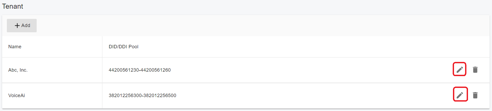

# Configuring SIP Trunk

## **Introduction**

VoIP service providers replace traditional telecom lines by hosting phone lines and delivering trunk services. These providers can assign local numbers in various cities or countries and route calls to your system, often supporting number porting as well. VoIP providers typically offer better call rates, leveraging international networks or favorable rate negotiations to reduce overall call costs.

PortSIP PBX supports several types of trunks:

1. **Register-Based Trunk**\
   A Register-Based Trunk requires the PBX to register with the trunk provider using an authentication ID and password. The System Admin can configure this type of trunk and assign it to multiple tenants, with each tenant receiving a unique DID pool. Tenant Admins can also set up Register-Based Trunks; however, these trunks cannot be shared with other tenants. To avoid conflicts, the hostname and authentication ID must be unique.
2. **Accept Register Trunk**\
   With an Accept Register Trunk, the trunk registers with the PBX using a predefined authentication ID and password. The System Admin can configure this trunk and assign it to tenants, with each tenant receiving its own DID pool. Like Register-Based Trunks, Tenant Admins can also configure Accept Register Trunks, but these cannot be shared across tenants, and the hostname and authentication ID must remain unique.
3. **IP-Based Trunk**\
   An IP-Based Trunk does not require registration with the trunk provider. Instead, the provider configures the PBX’s IP address on their end to route calls correctly. Only the System Admin can configure this trunk, and it can only be added once per provider. If multiple tenants need access, the System Admin assigns the trunk to the tenants and allocates unique DID pools for each.
4. **Microsoft Teams**\
   PortSIP PBX supports Microsoft Teams Direct Routing as a trunk. This trunk type can only be configured by the Tenant Admin and cannot be shared with other tenants.
5. **WhatsApp**\
   PortSIP PBX also supports WhatsApp as a trunk, allowing users to send and receive messages via WhatsApp. This trunk type can only be set up by the Tenant Admin and cannot be shared with other tenants.

## Tenant Admin Permissions

The Tenant Admin has access to view all trunks assigned by the System Admin and can create both inbound and outbound rules based on those trunks. However, the Tenant Admin cannot modify the settings of any trunk that was not created by them.

The Tenant Admin can modify the settings of any trunk that they have added themselves.

## **Configuring a Trunk**

To begin, ensure that you have an account with a VoIP or SIP trunk service provider. PortSIP PBX supports most popular SIP-based VoIP and SIP trunk providers.

Once you have obtained an account from your VoIP/SIP trunk provider, you can configure the account in PortSIP PBX.

<figure><figcaption></figcaption></figure>

## **DID Pool Concept**

Since PortSIP PBX is a multi-tenant system, if multiple tenants set up trunks from the same provider and use the same DID number for their inbound rules, the PBX would not know which tenant to route the incoming call to. Similarly, if an extension from one tenant uses an outbound caller ID that belongs to another tenant, it could cause conflicts.

To prevent these issues, PortSIP PBX introduced the concept of a **DID pool**, which is a designated range of DID numbers assigned to each tenant.

When the System Admin assigns a trunk to a tenant, they must configure a DID pool for that tenant. The DID numbers in this pool cannot overlap with other tenants’ DID pools. When a tenant creates an inbound rule for the assigned trunk, they can only use DID numbers from their specific DID pool.

If a Tenant Admin adds a trunk independently, they must also specify a DID pool for that trunk. When creating inbound rules based on this trunk, the tenant must use DID numbers from their designated pool. Overlapping DID pools with the same trunk provider will cause conflicts.

For example:

* Tenant A adds a trunk from provider XYZ and sets the DID pool to **1000-2000**.
* Tenant B adds a trunk from the same provider XYZ and sets the DID pool to **2000-3000**.

This setup would fail because the DID pools overlap. When an incoming call is directed to **2000**, the PBX would not know which tenant to route the call to.

The DID pool can consist of individual numbers or a range of numbers, as shown below:

* **1000-2000**
* **282556000-282556900**
* **101; 203; 300-450**


When configuring the DID Pool for a tenant, the DID number or range cannot begin with "+", "0", or "00". If your DID number or range starts with any of these, please remove the prefix before entering it into the system.


## **Add the Trunk by System Admin**

To add a trunk, follow these steps:

1. Navigate to **Call Manager > Trunks**, then click the arrow button to select the type of trunk you need to add.
2. Enter a friendly name for the trunk.
3. Choose the trunk brand from the Brand combo box, if your trunk is preconfigured there, please follow the [Configuring SIP Trunks](../../configuring-sip-trunks/) guide to cofigure it.
4. If your trunk is not preconfigured, Please choose the **Generic** for the brand field and follow the below steps.
5. and fill in the **Host Domain or IP**, **Port**, **Outbound Proxy Server**, and **Outbound Proxy Server Port** fields using the details provided by your trunk service provider.
6. **Transport**:\
   Choose the appropriate transport protocol (UDP, TCP, or TLS) that the PBX will use to communicate with the trunk. Consult your trunk provider for the correct transport protocol. The transport must already be configured in the PBX before adding the trunk. For example, if your provider requires TCP, ensure that TCP is added to the PBX beforehand. For instructions, refer to the section on [**Transport Management**](../6-transport-management.md).
7. **Associated IPs of the Trunk**:\
   Some trunk providers may send INVITE messages to the PBX from multiple IP addresses, rather than from a single Host Domain or IP. If this applies, click the **Add** button to enter each associated IP.
8. If the trunk type is **Register-Based**, click **Next** and enter the **Username/Authentication Name**, **Password**, and **Register Time**, using the account details provided by your trunk provider.

Click **Next** to configure additional parameters:

* **Use the private IP address to communicate with this trunk**:\
  Enable this option if the PBX will use a private IP address for trunk connections. If disabled, the PBX will use its public IP address to connect to the trunk.
* **Rewrite the host IP of the Via header using the PBX server’s public IP when sending requests to the trunk**:\
  If enabled, and the PBX has a public IP address, it will replace the host IP in the Via header with the PBX’s public IP when sending SIP messages to the trunk. Unless required by the trunk provider, it is recommended to leave this option at its default setting.
* **Verify the port when receiving SIP messages from the trunk**:\
  This option allows the PBX to match incoming SIP messages from the trunk by both IP and port. If disabled, the port will be ignored during this process. It is recommended to leave this option at its default setting.
* **This trunk only accepts a single Via SIP header**:\
  When enabled, the PBX will retain only a single Via header when sending SIP messages to the trunk.
* **Send OPTIONS message for keep-alive**:\
  When enabled, the PBX will send SIP OPTIONS messages to the trunk to monitor its connectivity status (whether it's online or offline). If no **200 OK** response is received from the trunk, the PBX will mark it as offline.
* **Send OPTIONS message interval (seconds)**:\
  Defines how frequently SIP OPTIONS messages are sent to check trunk availability and when the destination is considered unreachable. The default interval is 360 seconds.

Click **Next** to configure additional parameters:

Since the trunk is added by the System Admin, the System Admin must select one or more tenants to grant them access to this trunk.

Once a tenant is assigned to the trunk, a **DID pool** must be configured for that tenant. The DID pool numbers must be unique and cannot overlap when assigning the same trunk to multiple tenants.

When a tenant creates an inbound rule based on the assigned trunk, they can only use DID numbers from their designated DID pool.

For more information, please refer to the section on [**DID Pool**](configuring-sip-trunk.md#did-pool-concept).

<figure><figcaption></figcaption></figure>

## **Add the Trunk by Tenant Admin**

When a Tenant Admin logs into the Web Portal, they have the ability to create trunks for their tenant. However, the Tenant Admin can only add the following trunk types:

* **Register-Based**: PBX registers with the trunk.
* **Accept Register**: The trunk registers with the PBX.
* **Microsoft Teams**: Microsoft Teams Direct Routing.
* **WhatsApp**: The WhatsApp messaging service.

Note: The **IP-Based** trunk can only be added by the System Admin.

To add a trunk, follow these steps:

1. Navigate to **Call Manager > Trunks**, and click the arrow button to select the trunk type you wish to add.
2. Enter a friendly name for the trunk.
3. Choose the trunk brand from the Brand combo box, if your trunk is preconfigured there, please follow the [Configuring SIP Trunks](../../configuring-sip-trunks/) guide to configure it.
4. If your trunk is not preconfigured, Please choose the **Generic** for the brand field and follow the below steps.
5. **DID Pool**: A DID pool must be specified for the tenant. When creating an inbound rule for the tenant based on this trunk, the DID number used in the inbound rule must fall within the specified DID pool range. For more details, refer to the **DID Pool** section.
6. Fill in the **Host Domain or IP**, **Port**, **Outbound Proxy Server**, and **Outbound Proxy Server Port** fields with the details provided by your trunk service provider.
7. **Transport**: Choose the appropriate transport protocol (UDP, TCP, or TLS) for communication between the PBX and the trunk. Consult your trunk provider for the correct transport. The transport protocol must already be added in the PBX before adding the trunk. For example, if your provider requires TCP, ensure that TCP is added in the PBX. Refer to the **Transport Management** section for more details.
8. **Associated IPs of the Trunk**: Some trunk providers may send INVITE messages from multiple IP addresses rather than just the Host Domain or IP. Click the **Add** button to enter each associated IP.
9. If the trunk type is **Register-Based**, click **Next** and enter the **Username/Authentication Name**, **Password**, and **Re-register Time**, as provided by your trunk provider.

Click **Next** to configure additional parameters:

* **Use the private IP address to communicate with this trunk**:\
  Enable this option if the PBX will use a private IP address for the trunk connection. Otherwise, disable it, and the PBX will use its public IP address for the connection.
* **Rewrite the host IP of the Via header with the PBX server’s public IP when sending requests to the trunk**:\
  If this option is enabled and the PBX has a public IP, it will replace the host IP in the Via header with the PBX’s public IP when sending SIP messages to the trunk. Unless required by the trunk provider, it is recommended to leave this option at its default setting.
* **Verify the port when receiving SIP messages from the trunk**:\
  When the PBX receives a SIP message, it will match both the IP and port to recognize the trunk. If this option is disabled, the port will be ignored. It is recommended to leave this option at its default setting.
* **This trunk only accepts a single Via SIP header**:\
  Enable this option if the trunk requires the PBX to include only a single Via header in outgoing SIP messages.
* **Send OPTIONS message for keep-alive**:\
  When enabled, the PBX will send SIP OPTIONS messages to the trunk to monitor its connectivity status (online or offline). If no **200 OK** response is received, the PBX will mark the trunk as offline.
* **Send OPTIONS message interval (seconds)**:\
  This setting determines how often SIP OPTIONS messages are sent to check trunk availability. The default interval is 360 seconds.

## **Configure E1/T1 Gateway Registration to PortSIP PBX**

In scenarios where PortSIP PBX is deployed on a cloud platform like AWS, Azure, or GCE, and you need to configure an E1/T1 gateway located on a local LAN as a trunk for PortSIP PBX, but the E1/T1 gateway lacks a static public IP, you cannot use IP-Based or Register-Based authentication modes.

For this scenario, you can configure the E1/T1 gateway to register from the local LAN to the cloud-hosted PortSIP PBX. This allows the E1/T1 gateway to function as a trunk for making and receiving calls with PortSIP PBX.

To configure the E1/T1 gateway to register with the cloud-hosted PortSIP PBX, follow these steps:

1. Navigate to **Call Manager > Trunks**, click the arrow button, and choose **Accept Register**.
2. Enter a friendly name for the trunk.
3. **DID Pool**: A DID pool must be specified for the trunk. When creating inbound rules based on this trunk, the DID numbers used must fall within the specified DID pool range. For more details, refer to the **DID Pool** section.
4. Enter a domain for the **Host Domain or IP Address**. This does not need to be a real domain, so you can use any domain, such as **portspitrunk1.io**.


Ensure this domain does not equal any tenant's SIP domain.


Click **Next** to configure additional parameters:

* For the **Authorization Name**, you can enter any identifier, such as "123456". The E1/T1 gateway will use this for authorization when registering with PortSIP PBX.
* For the **Password**, enter any password. The E1/T1 gateway will use this password for authorization when registering to PortSIP PBX.

The remaining settings are the same as those used for configuring IP-Based and Register-Based Trunks.

Once the trunk has been successfully added, you can proceed to configure the E1/T1 gateway to register with the cloud-hosted PortSIP PBX.

### **Configure the E1/T1 Gateway**

1. In the E1/T1 settings, enter the **trunk Host Domain or IP Address** (e.g., **portsiptrunk1.io**) in the **SIP Server/Domain** field. This should match the domain you configured in the previous steps.
2. For the **Outbound Proxy Server** field, input the cloud PBX’s public static IP address.
3. In the **Outbound Proxy Server Port** field, specify the PortSIP PBX transport port.
4. Enter the **Authorization Name** and **Password** you configured earlier into the **Username/Auth ID/Auth Name** and **Password** fields of the E1/T1 gateway.

This will allow the E1/T1 gateway to successfully register with the cloud-hosted PortSIP PBX.

## **Outbound Parameters and Inbound Parameters**

Once the trunk setup is complete, you can further customize the configuration by navigating to **Call Manager > Trunks**, selecting the trunk, and clicking the **Edit** button to modify the **Inbound/Outbound Parameters**.

* On the **Outbound Parameters** page, you can set rules to modify the headers of INVITE messages sent to the trunk. For example, you can configure the user part of the **From SIP** header to reflect the Outbound Caller ID of the extension that initiated the call. To configure the Outbound Caller ID for an extension, go to the **General** page of the user settings. For more details, refer to [**Users**](../5-user-management/users.md).
* On the **Inbound Parameters** page, you can set rules to modify the field values in SIP messages for incoming calls from the trunk.

For further details, please refer to the topic [**Handle Outbound Calls Through SIP Trunk**](handle-outbound-calls-through-sip-trunk.md).


Both inbound and outbound parameters are advanced options. It’s recommended to use default values.


## Deleting a Trunk

A trunk cannot be deleted if there are any inbound or outbound rules associated with it. To delete a trunk, you must first either change the trunk in the inbound and outbound rules to another trunk or delete those rules entirely.

Before deleting a trunk, ensure that you remove or modify all inbound and outbound rules that were created based on that trunk.

