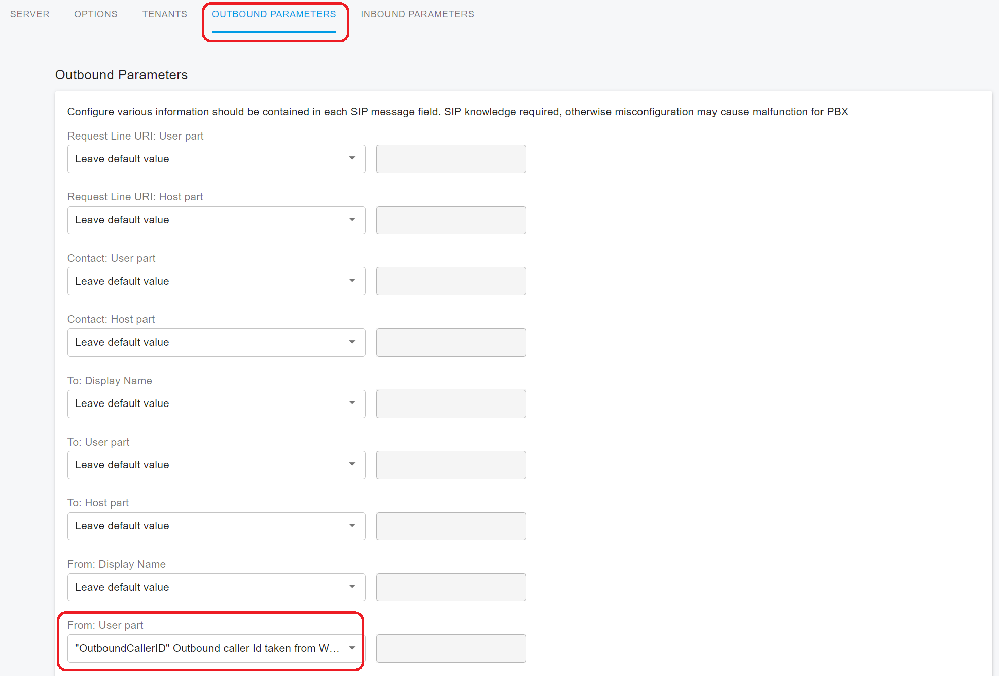
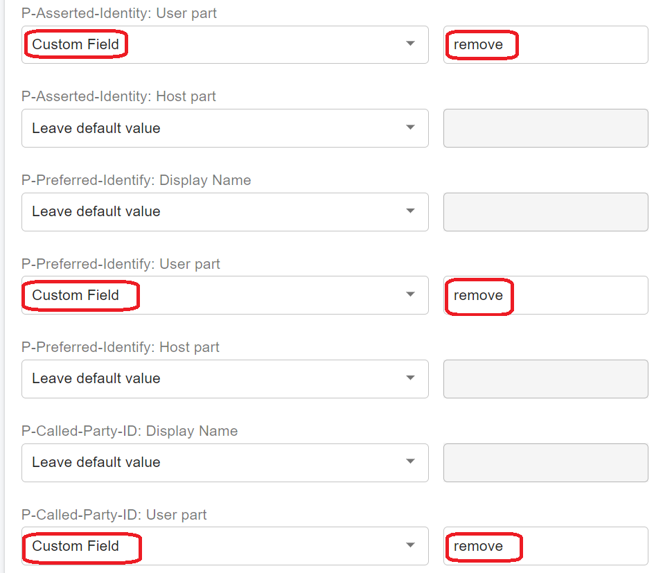

# Handle Outbound Calls Through SIP Trunk

This topic explains how PortSIP PBX processes **outbound calls** through a SIP trunk—specifically, how the PBX builds the SIP **INVITE** request and populates key SIP header and URI fields.

***

### DID Pool

To understand the concept of Direct Inward Dialing (DID), see **What is Direct Inward Dialing (DID)?**

Because PortSIP PBX is a **multi-tenant** system, it must be able to reliably determine which tenant owns a DID and which caller IDs are allowed for that tenant:

* If multiple tenants use the **same trunk provider** and configure the **same DID** in inbound rules, the PBX cannot determine which tenant should receive inbound calls to that DID.
* If an extension in one tenant presents an **outbound caller ID** that belongs to another tenant, it can create conflicts and incorrect identity presentation.

To prevent these issues, PortSIP PBX uses a **DID pool**: a defined set (or range) of DID numbers assigned to each tenant for a given trunk/provider.

***

#### Trunks Added by System Admin

When the **System Admin** assigns a trunk to a tenant, they must configure a **unique DID pool** for that tenant.

* DID pools for the same provider **must not overlap** across tenants.
* After the trunk is assigned, the tenant can only select DID numbers **from its assigned DID pool** when creating inbound rules.

***

#### Trunks Added by Tenant Admin

If a **Tenant Admin** creates a trunk, they must also specify a **DID pool** for that trunk.

* All inbound rules created by that tenant for the trunk must use DID numbers **from that DID pool**.
* The DID pool must be **unique** and must not overlap with DID pools used by other tenants for the same trunk provider.

**Example: Overlapping DID Pools (Not Allowed)**

* Tenant A uses provider **XYZ** and sets the DID pool to **1000–2000**
* Tenant B uses the same provider **XYZ** and sets the DID pool to **2000–3000**

This creates a conflict. If an inbound call arrives for DID **2000**, the PBX cannot determine which tenant should receive the call.

***

### DID Pool Numbering

A DID pool can contain:

* A single range:\
  `1000-2000`\
  `282556000-282556900`
* A mix of individual numbers and ranges (semicolon-separated):\
  `101; 203; 300-450`

#### DID Pool Entry Rules

When adding numbers to a DID pool, the DID number or range **must not begin with**:

* `+`
* `0`
* `00`

If your DID number or range begins with any of these prefixes, remove the prefix before entering the value.

> ❗**Note:** This rule applies to DID pool input formatting in PortSIP PBX. Your trunk provider may still deliver inbound called numbers in E.164 format (for example, `+14155550100`) depending on their SIP signaling and number normalization behavior.

***

## Structuring the INVITE Message

The values included in outgoing INVITE messages sent by PortSIP PBX can be configured within the SIP Structuring the INVITE Message

PortSIP PBX builds an outbound **SIP INVITE** when a user places a call through a SIP trunk. You can control how specific SIP header and URI values are populated by configuring the trunk’s **Outbound Parameters**.

To review or change these settings:

* Go to **Call Manager > Trunks**
* Select the trunk
* Click **Edit**
* Open **Outbound Parameters**

Outbound Parameters let you customize how PortSIP PBX assigns values to key SIP fields in outbound INVITEs. This is especially useful when a trunk provider requires specific formats for caller ID, number presentation, or header values. (These options are explained in detail later in this guide.)

Below is an example of a basic INVITE message generated by PortSIP PBX when placing an outbound call through a SIP trunk:

```log
INVITE sip:88888888@pstn.twillio.com:5060 SIP/2.0
Via: SIP/2.0/UDP 192.168.0.11:5060;branch=z9hG4bK-524287-1---39f4bc06b915b70f;rport
Max-Forwards: 19
Contact: <sip:101@192.168.0.11:5060;ob>
To: <88888888@pstn.twillio.com>
From: <sip:101@sip.portsip.io>;tag=35c2342b
Call-ID: DSSzmYKnCwhMeB1TWUwv2A..
CSeq: 1 INVITE
Session-Expires: 300
Min-SE: 90
Accept-Language: en
Allow: REGISTER, INVITE, ACK, CANCEL, OPTIONS, BYE, REFER, NOTIFY, SUBSCRIBE, UPDATE, INFO, MESSAGE, PUBLISH
Content-Type: application/sdp
Supported: replaces, norefersub, tdialog, join, timer
User-Agent: PortSIP UC - Call Manager 16.0.0.302
X-CID: QERh8-brREchTYRqTSTALQ..
X-Session-Id: 678271070897180672
X-Trunk-Name: CallCentric
Content-Length: 361
```

***

### Configurable SIP Fields

PortSIP PBX does not allow full customization of the entire INVITE message. The PBX always includes the required SIP structure and core headers needed for standards-compliant call setup. However, PortSIP PBX does allow you to configure how it populates the following **supported fields** (via **Call Manager > Trunks > Edit > Outbound Parameters**):

* **Request-Line URI**
  * User Part
  * Host Part
* **Contact**
  * User Part
  * Host Part
* **To**
  * Display Name
  * User Part
  * Host Part
* **From**
  * Display Name
  * User Part
  * Host Part
* **Remote-Party-ID (Called Party)**
  * Display Name
  * User Part
  * Host Part
* **Remote-Party-ID (Calling Party)**
  * Display Name
  * User Part
  * Host Part
* **P-Asserted-Identity**
  * Display Name
  * User Part
  * Host Part
* **P-Preferred-Identity**
  * Display Name
  * User Part
  * Host Part
* **P-Called-Party-ID**
  * Display Name
  * User Part
  * Host Part
* **Privacy Types Supported**
* **Variables**

> ❗**Note:** These controls adjust specific header/URI values, not the overall SIP message layout. Use the default settings unless your trunk provider explicitly requires a different header format or number presentation.

***

### Variables

PortSIP PBX provides variables that you can assign to the configurable SIP fields above. These variables allow the PBX to dynamically populate SIP values based on trunk configuration and call context.

The following variable is available:

#### AuthID

**AuthID** resolves to the value configured as the trunk’s **Authentication Name (SIP User ID)**:

* **Path:** **Call Manager > Trunks > Edit (Register-Based Trunk) > Client Verification > Authentication Name (SIP User ID)**

**Applies to:**

* Register-Based Trunks
* Accept Register Trunks

<figure><figcaption></figcaption></figure>

#### CalledNum

**CalledNum** is the dialed (destination) number that the outbound INVITE is intended to call.

#### CallerNum

**CallerNum** is the caller number used for identity presentation in outbound signaling.

#### CallerDispName

When an extension registered to PortSIP PBX places an outbound call, and a value is provided for **From: Display Name**, PortSIP PBX attempts to preserve that value in the INVITE sent to the trunk.

* If the endpoint does not send a display name, PortSIP PBX uses the extension user’s name by default.

#### OriginatorCallerID

**OriginatorCallerID** attempts to preserve the original caller’s number—even if the call did not originate from PortSIP PBX (for example, a forwarded call).

* If the user places an outbound call using an anonymous dial code, this variable is populated as `anonymous`.

#### Anonymous

When PortSIP PBX sends an outbound call to the trunk in anonymous mode, this variable is populated as:

* `anonymous`

#### Custom Field

Use **Custom Field** when you want to manually enter a fixed value instead of using a dynamic variable.

#### TrunkHostPort

**TrunkHostPort** is the combined value of the trunk **Host Domain/IP** and **Port** fields:

* **Path:** **Trunks > Edit SIP Trunk > Server > Host Domain or IP** + **Port**

#### OutHostPort

**OutHostPort** is the combined value of the trunk **Outbound Proxy Server** and **Outbound Proxy Server Port** fields:

* **Path:** **Trunks > Edit SIP Trunk > Server > Outbound Proxy Server** + **Outbound Proxy Server Port**

#### ContactUri

**ContactUri** is the IP address and port at which the SIP trunk should contact PortSIP PBX. It is typically used to populate **Contact: Host Part**.

* The port is always the **PortSIP PBX transport port**.

***

### OutboundCallerId

During an outbound call, PortSIP PBX determines the **Outbound Caller ID** using a priority order (highest priority first). The highest priority source is the **Outbound Caller ID configured on the extension user**.

#### Configure the Extension Outbound Caller ID

1. Go to **Call Manager > Users**
2. Select the user and click **Edit**
3. Open the **Extension** tab
4. In **Outbound Caller ID**, set the outbound caller ID for the user

#### DID Pool Requirement

The outbound caller ID must fall within the trunk’s **DID pool** range.

> ❗**Important formatting note:** The original text states the outbound caller ID “can begin with `+`, `0`, `00`, or `+00`.” This is **inconsistent** with the DID pool input rule earlier (“DID pool cannot begin with `+`, `0`, or `00`”).\
> A safer and clearer way to express this is:
>
> * **DID pool entry**: entered without dialing prefixes (`+`, `0`, `00`)
> * **Outbound caller ID**: may be entered or presented with prefixes depending on PBX normalization and provider requirements

(Your existing text suggests PortSIP allows prefixes in outbound caller ID fields even if DID pools are stored without prefixes.)

#### User Groups as a Fallback (When Using “Calls from user groups”)

As described in the **User Groups** section:

* You can create a user group, add users as members, and assign DID numbers to the group.
* If an outbound rule uses **Calls from user groups**, and a group member does not have an outbound caller ID set, PortSIP PBX will use the **user group’s outbound caller ID** for that call.

#### Company-Level Fallback

If both of the following are empty:

* The user’s outbound caller ID, and
* The group’s outbound caller ID (or the outbound rule does not use user group criteria),

then PortSIP PBX uses the **company-wide outbound caller ID** settings.

To configure company-level outbound caller ID:

* Go to **Company > Outbound Caller ID**

<figure><figcaption></figcaption></figure>

***

### Outbound Caller ID Priority

When an extension places an outbound call through a SIP trunk, PortSIP PBX selects the **Outbound Caller ID** using the following priority order (highest to lowest). The selected value is then used to populate caller identity in the outbound INVITE—most notably by updating the **From** header (based on your trunk’s Outbound Parameters configuration).

#### Priority Order

1. **App-specified Outbound Caller ID (PortSIP ONE)**
   * If the user places the call from the **PortSIP ONE app** and explicitly selects/specifies an Outbound Caller ID, the PBX uses that value.
2. **Caller Extension’s Outbound Caller ID**
   * If the caller’s extension has an **Outbound Caller ID** configured, the PBX uses it and overwrites the **From** header accordingly.
3. **Outbound Rule’s Outbound Caller ID**
   * If the extension does not have an Outbound Caller ID configured, the PBX uses the **Outbound Caller ID** set on the **Outbound Rule** and overwrites the **From** header.
4. **User Group’s Outbound Caller ID**
   * If the outbound rule does not define an Outbound Caller ID, but the rule applies to a **User Group** that has an Outbound Caller ID assigned, the PBX uses the group’s Outbound Caller ID and overwrites the **From** header.
5. **Company Outbound Caller ID**
   * If none of the above are set, the PBX uses the **Company-wide Outbound Caller ID** and overwrites the **From** header.

***

### Outbound Caller ID for PBX Services

You can configure an Outbound Caller ID for PBX services such as:

* **Virtual Receptionist (IVR)**
* **Call Queue**
* **Ring Group**
* **Meeting**

When PortSIP PBX places an outbound call to the trunk on behalf of one of these services—for example:

* a queue/ring group/virtual receptionist call **fails**, **times out**, or is **not answered** and is then routed to an external destination via the trunk, or
* a meeting **invites (dials out to)** an external number through the trunk,

The PBX uses the **Outbound Caller ID configured for that service**.

If the service does not have an Outbound Caller ID configured, PortSIP PBX falls back to the **Company Outbound Caller ID**.

***

### Adjust Trunk Parameters to Apply Outbound Caller ID

To ensure the selected Outbound Caller ID is actually reflected in outbound SIP signaling, configure the trunk’s **Outbound Parameters** so the appropriate variables are mapped into the SIP identity fields (such as **From** and/or identity headers).

Use the trunk settings to adjust outbound parameters:

* Go to **Call Manager > Trunks**
* Select the trunk and click **Edit**
* Open **Outbound Parameters**
* Configure the SIP fields (for example, **From: User Part**, **From: Display Name**, and other identity headers) to use the Outbound Caller ID variables required by your provider

> ❗**Note:** Outbound Parameters are advanced options. Use the default mappings unless your trunk provider requires specific caller ID formatting or specific identity headers.

<figure><figcaption></figcaption></figure>

***

### Bypassing the Outbound Caller ID Settings

PortSIP PBX can bypass the standard Outbound Caller ID selection logic by allowing a caller device (IP phone / softphone / application) to request a specific outbound caller ID using a custom SIP header in the INVITE it sends to the PBX.

When the endpoint includes the `X-Outbound-Cli` header, PortSIP PBX can rewrite selected identity fields in the outbound INVITE before forwarding the call to the SIP trunk.

> ❗**Security Note:** This is an advanced feature. Allowing endpoints to influence outbound caller ID can increase the risk of caller ID spoofing if not governed properly. Use it only when required, and ensure DID pool restrictions are enforced.

***

#### How It Works

The endpoint sends an INVITE to PortSIP PBX with one or more `X-Outbound-Cli` directives. The PBX then applies the requested rewrite(s) when sending the call to the trunk.

**Rewrite the From header user part**

```
X-Outbound-Cli: rewrite-from=123
```

PortSIP PBX rewrites the **username (user part)** in the `From` header to `123` before forwarding the INVITE to the trunk.

**Add/Rewrite P-Asserted-Identity (PAI)**

```
X-Outbound-Cli: rewrite-pai=456
```

PortSIP PBX adds (or updates) the `P-Asserted-Identity` header so its **username (user part)** is set to `456` before sending the INVITE to the trunk.

**Add/Rewrite Remote-Party-ID (RPI)**

```
X-Outbound-Cli: rewrite-rpi=789
```

PortSIP PBX adds (or updates) the `Remote-Party-ID` header so its **username (user part)** is set to `789` when sending the INVITE to the trunk.

***

#### Apply the Rewrite Only for a Specific Trunk

If you want the rewrite to apply only when the call is routed through a specific trunk, include the trunk identifier in the header.

**v22.x and later: use `trunk-id`**

```
X-Outbound-Cli: rewrite-from=123; trunk-id=235468356
```

PortSIP PBX rewrites the `From` header only when the call is routed through trunk ID `235468356`.

You can combine multiple rewrite directives:

```
X-Outbound-Cli: rewrite-from=123; rewrite-rpi=789; rewrite-pai=456; trunk-id=235468356
```

PortSIP PBX rewrites the `From`, `Remote-Party-ID`, and `P-Asserted-Identity` headers for the specified trunk.

**If `trunk-id` is omitted**

If no `trunk-id` is specified, PortSIP PBX applies the rewrite(s) to **any trunk** the call is routed through.

**v16.x: use `trunk-name`**

In **v16.x**, specify the trunk using `trunk-name` instead of `trunk-id`.

> ❗**Note:** Use the exact trunk name as configured in the PBX.

***

#### DID Pool Requirement

When using `X-Outbound-Cli` to bypass the PBX outbound caller ID settings, the caller ID you specify must still be within the tenant’s assigned **trunk DID pool** range.

***

### Remove SIP Headers on Outbound Messages

PortSIP PBX allows you to remove specific SIP identity headers from outbound SIP messages sent to a SIP trunk. This can be useful when a trunk provider does not support certain headers, or when you want to ensure only the required identity headers are sent.

You can remove the following headers:

* `P-Asserted-Identity`
* `P-Preferred-Identity`
* `P-Called-Party-ID`

#### Configure Header Removal

1. Go to **Call Manager > Trunks**
2. Select the trunk and click **Edit**
3. Open **Outbound Parameters**
4. Configure the header removal options as shown in the product UI (see the screenshot in the original guide)
5. Save your changes

<figure><figcaption></figcaption></figure>

***

### Privacy Types Supported

PortSIP PBX supports the following SIP **Privacy** types. These values influence how identity and informational headers are handled when sending SIP requests (for example, INVITEs) toward a trunk.

> ❗**Note:** Privacy handling is typically relevant when you need to withhold caller identity or reduce information disclosure. Some trunk providers have specific requirements for identity and privacy headers.

#### `user`

**User-level privacy** is applied. PortSIP PBX removes non-essential informational headers that are not required for call routing, including:

* `Subject`
* `Call-Info`
* `Organization`
* `User-Agent`
* `Reply-To`
* `In-Reply-To`

Depending on the call scenario and configuration, PortSIP PBX may also change the original `From` header value to `anonymous`.

#### `header`

**Header privacy** is applied. PortSIP PBX modifies headers that the caller typically cannot arbitrarily set, such as:

* `Contact`
* `Via`

The PBX also avoids adding unnecessary headers that could reveal personal information about the originator.

> ❗The modified values must remain routable, meaning the PBX can still receive and route in-dialog requests (such as re-INVITEs or BYEs) back to the originator as required.

#### `id`

**Identity privacy** is applied. Third-party asserted identity is kept private from SIP entities outside of the trusted domain where the user authenticated.


