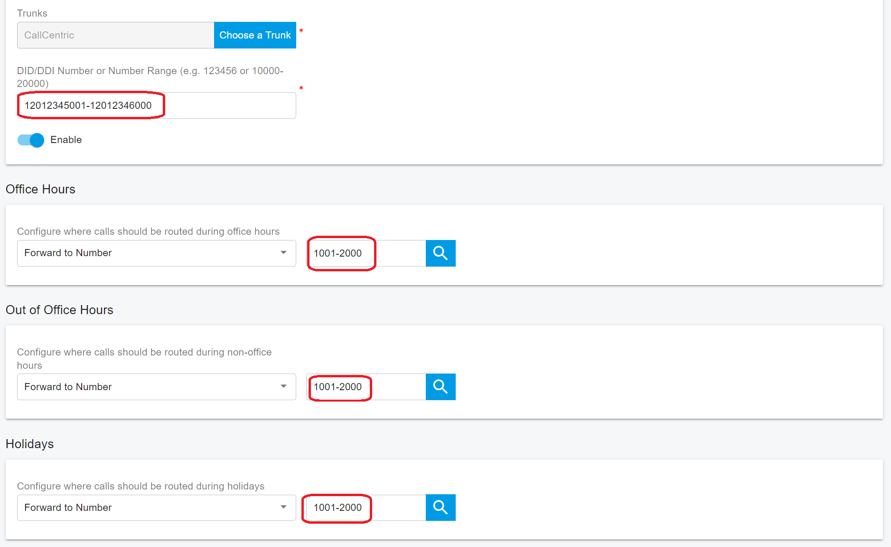
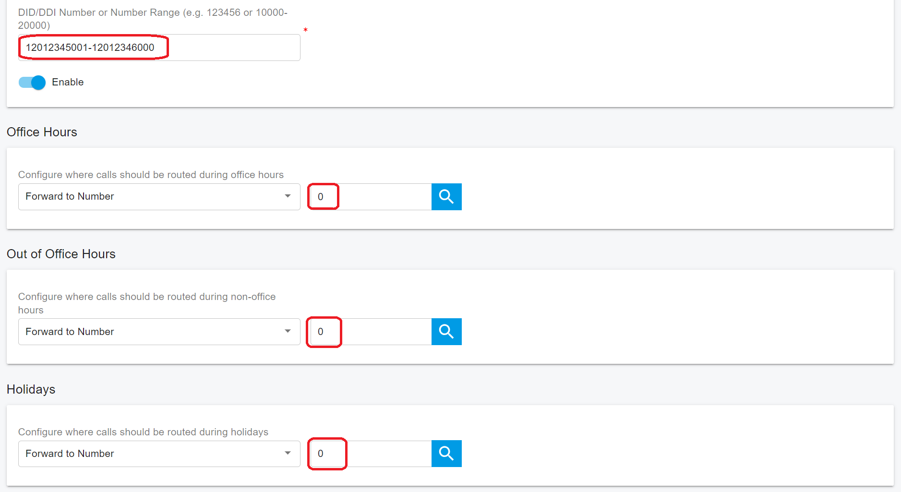

# Configuring Inbound Rule

### Creating Inbound Rules

Many organizations assign **Direct Inward Dialing (DID)** numbers to users or departments so external callers can reach the right person or team directly, without going through a receptionist or IVR (auto attendant). In some regions, DID numbers are also called **DDI** (United Kingdom) or **MSN** (Germany).

DID numbers are provided by your SIP trunk provider (or phone company). They are virtual numbers that route inbound calls to your PBX, and providers typically assign them in a number range. If you need details about your DID range or format, contact your trunk provider.

***

#### Prerequisites

* Configure at least **one SIP trunk** before you create inbound rules.

#### Procedure: Add an inbound rule

1. Sign in to the PortSIP PBX Web Portal:
   * **System Admin**: Go to **Tenants**, select a tenant, then click **Manage** to configure rules for that tenant.
   * **Tenant Admin**: Sign in and manage inbound rules for your own tenant.
2. Go to **Call Manager > Inbound Rules**, then click **Add**.
3. Enter a **Name** (a friendly label to help you identify the rule later).
4.  Configure the rule matching fields:

    **Caller Number Mask (optional)**\
    Use this field to match inbound calls by **caller ID (CID)**. You can:

    * Enter the **full number** to match a specific caller.
    * Use `*` as a wildcard to match multiple callers. For example:
      * `0044**********` matches caller numbers in that format (example: UK format).
      * `004420********` matches caller numbers in that format (example: London area).
    * Specify a **number range**, such as: `00442012345670-00442012345680`.

    **Wildcard rule:** If you use `*`, the number of `*` characters must match the number of digits you want to match. For example, use `***` to match a 3-digit pattern.

    > ❗**Note:** In most deployments, you can leave **Caller Number Mask** empty unless you need to restrict matching to specific caller IDs.
5. In **Trunk**, select the SIP trunk to associate with this inbound rule.
   * Only **one** SIP trunk can be assigned to an inbound rule.
6.  In **DID/DDI Number Mask**, enter the DID as it appears in the SIP **To** header for inbound calls. PortSIP PBX matches this value against the **To** header in the inbound SIP **INVITE** received from the trunk.

    The DID/DDI Number Mask can be:

    * A **single number**, for example: `442012345678`
    * A **number range**, for example: `3325261000-3325262000` or `442012345600-442012345800`

    The DID (or DID range) must be within the trunk’s **DID pool** range.

    > ❗**Note:** The DID number and DID pool cannot start with **`+`, `0`, or `00`.** If your provider presents numbers with these prefixes, remove the prefix before entering the value.
7. Review how matching works:
   * If you set **both** **Caller Number Mask** and **DID/DDI Number Mask**, the rule matches only when:
     * The **caller ID** matches the Caller Number Mask, **and**
     * The **called number** matches the DID/DDI Number Mask.
   * If you set **only** **DID/DDI Number Mask**, the rule matches when the **called number** matches the DID/DDI Number Mask.
8. (Optional) Enable **Play recording notifications**.\
   When enabled, inbound calls routed through this rule will play a voice prompt notifying the caller that the call may be recorded.

<figure><figcaption></figcaption></figure>

9\. Specify how inbound calls are forwarded

Choose how calls that match this inbound rule are routed:

*   **Forward to number**\
    Routes the call to a specific destination. The destination can be:

    * An **extension**
    * A **system extension**, such as a ring group, virtual receptionist (IVR), meeting number, or queue
    * A **PSTN phone number**
    * A **range of extensions**, for example `2000–3000`

    **1:1 DID-to-extension range mapping**\
    If **Forward to number** is configured as a range, both **DID Number Mask** and **Forward to number** must be **serial ranges of the same size**. Example:

    * DID Number Mask: `442012345600–442012345800`
    * Forward to number: `1100–1300`

    With this configuration:

    * A call to `442012345600` is routed to extension `1100`
    * A call to `442012345698` is routed to extension `1198`

    The PBX maintains a **1:1 offset mapping** between the DID numbers and the corresponding extensions.
* **Forward to voicemail**\
  Routes the call directly to voicemail, allowing the caller to leave a message.\
  Select the extension whose mailbox should receive the voicemail. For example, selecting extension `108` stores the voicemail in extension `108`’s mailbox.
* **Hang up**\
  Terminates the inbound call when it matches this rule.

10\. Configure office hours and holiday routing

You can define different call-handling behavior for inbound calls received **outside of office hours** or **during holidays**. This allows you to apply alternate routing rules that align with your business schedule.

11\. Configure bulk DID-to-extension routing

You can configure an inbound rule to route **ranges of DID numbers** to corresponding **ranges of extensions** for large-scale deployments. This enables efficient **1:1 mapping** between DID ranges and extension ranges.\
Refer to the earlier **DID range mapping** example for details.

***

### Office Hours and Holidays

Inbound rules can apply **different call routing behavior based on time and date**, allowing you to control how calls are handled during business hours, after hours, and on holidays.

#### Office Hours

Use the **Office Hours** tab in the inbound rule to define how incoming calls are routed based on the **time of day**.

* **Use default Global Office Hours**\
  When selected, the inbound rule follows the **global office hours** configured by the **Tenant Admin**.
* **Use specific Office Hours**\
  When selected, you can define **custom office hours** that apply only to this inbound rule, overriding the global tenant schedule.

#### Holidays

In the **Holidays** section, select one or more holidays from the tenant’s configured holiday list.

* During the selected holidays, any inbound call that matches this rule will be routed to the **holiday destination** specified in the inbound rule.
* Holiday routing takes precedence over regular office hours for the selected dates.

> **Note:** Holidays must be defined in the tenant’s holiday schedule before they can be selected here.

For more information about configuring schedules, see [Office Hours and Holiday Schedule](../office-hours-and-holiday-schedule/).

<figure><figcaption></figcaption></figure>

***

### Language Skill Routing

You can create **multiple inbound rules that use the same DID and trunk** to route calls based on the **caller’s number (Caller ID / CID)**. Each inbound rule must use a **unique Caller Number Mask** to distinguish which rule applies.

This approach allows you to route callers to different destinations—such as queues staffed by agents with specific language skills—based on the caller’s country or number pattern.

#### Example: Language-based queue routing

You have the DID `00326012345670` and want to route calls to different queues based on the caller’s language.

1. **Inbound Rule for English-speaking callers**
   * **Caller Number Mask:** `0044**********` (UK callers)
   * **DID Number Mask:** `326012345670`
   * **Destination:** Queue `8000` (English-speaking agents)
2. **Inbound Rule for French-speaking callers**
   * **Caller Number Mask:** `0033*********` (French callers)
   * **DID Number Mask:** `326012345670`
   * **Destination:** Queue `9000` (French-speaking agents)

#### Call flow behavior

When a caller dials `00326012345670`:

* Calls from **UK numbers** (caller ID starting with `0044`) are routed to **Queue 8000**, where English-speaking agents are assigned.
* Calls from **French numbers** (caller ID starting with `0033`) are routed to **Queue 9000**, where French-speaking agents are assigned.

This configuration enables **language skill–based routing** without requiring the caller to interact with an IVR or make a language selection.

***

### Route Bulk Numbers to Bulk Extensions

For large organizations with hundreds or thousands of employees, manually creating individual inbound rules for each DID can be time-consuming and error-prone. For example, assigning 1,000 DID numbers to 1,000 extensions would traditionally require creating 1,000 separate inbound rules.

PortSIP PBX simplifies this process by allowing you to route **ranges of DID numbers** to **ranges of extensions** using a **single inbound rule**.

***

#### Example: 1:1 DID-to-extension range mapping

Assume your organization has:

* A range of **1,000 serial DID numbers** provided by the trunk service provider:\
  `0012012345001–0012012346000`
* A corresponding range of **employee extensions**:\
  `1001–2000`

#### Configuration

To create the inbound rule:

1. Set **DID Number Mask** to:\
   `12012345001–12012346000`
2. Set **Call Route Destination** to:\
   `1001–2000`

> **Note:** The DID range and extension range must contain the **same number of entries** to maintain correct 1:1 mapping.

#### Call routing behavior

With this configuration, PortSIP PBX routes calls as follows:

* Calls to `0012012345001` are routed to extension `1001`
* Calls to `0012012345002` are routed to extension `1002`
* Calls to `0012012345005` are routed to extension `1005`

The PBX automatically maintains a **fixed offset mapping** between the DID range and the extension range.

<figure><figcaption></figcaption></figure>

***

#### Route a DID Range to a Single Extension

In some scenarios, you may want to route **all DID numbers in a range** to a **single destination**, such as a main receptionist or shared extension.

Using the same DID range (`0012012345001–0012012346000`), configure the inbound rule as follows:

* **DID Number Mask:** `12012345001–12012346000`
* **Call Route Destination:** `1001`

With this configuration:

* Any call to a DID within `0012012345001–0012012346000` is routed to extension `1001`.

<figure><figcaption></figcaption></figure>

***

#### Route Calls to Any Number

In some scenarios, you may want inbound calls to be routed **without modifying the called number**. This is useful when you want the PBX to pass the dialed number through unchanged—for example, when integrating with downstream systems or external routing logic.

To achieve this, configure an inbound rule with the **route destination number set to `0`**, as shown in the example screenshot. A destination value of `0` instructs the PBX **not to rewrite or replace the called number** during routing.

**Call routing behavior**

* If a caller dials a DID within the range `0012012345001–0012012346000`, the call is routed using **the same destination number that was dialed**.
* The PBX does **not** alter the destination number when forwarding the call.

**Configuration options**

* You can apply this behavior to:
  * A **single DID number**, or
  * A **range of DID numbers**

Both configurations ensure that inbound calls retain their original called number as they are routed by the PBX.

<figure><figcaption></figcaption></figure>

***

### Advanced Routing

In addition to **office hours** and **holiday schedules**, PortSIP PBX supports **advanced time-based routing** for inbound calls. This allows you to route calls based on more granular temporal criteria, including:

* Year
* Month
* Day
* Day of the week
* Time of day

Using these conditions, you can precisely control how inbound calls are handled under different time scenarios, ensuring that calls are always routed to the most appropriate destination.

For detailed configuration steps and examples, see [Advanced Routing for Inbound Rules](configuring-inbound-rule.md#advanced-routing-1).

