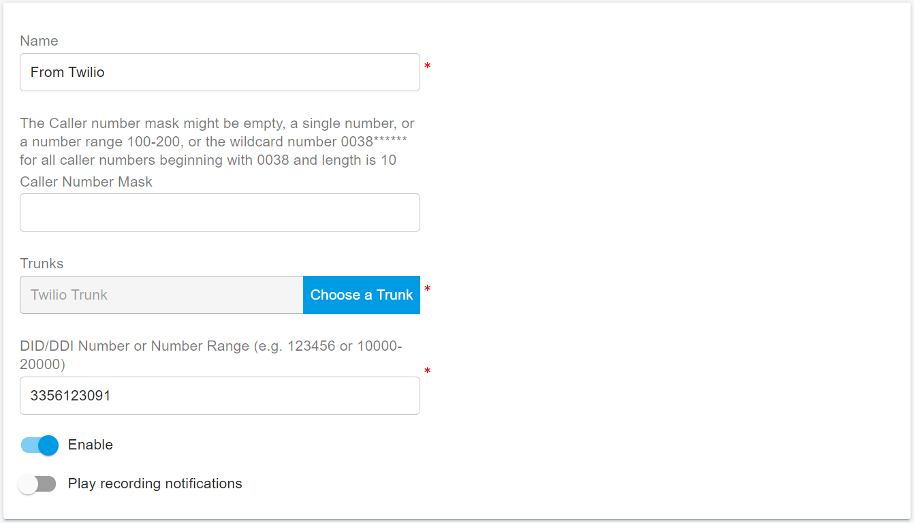
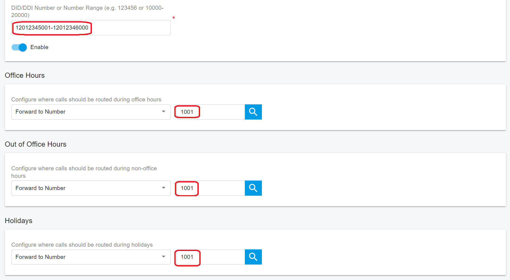

# Configuring Inbound Rule

## Creating Inbound Rules

Many companies provide users or departments with Direct or DID numbers, allowing their contacts to bypass the receptionist and make direct calls. DID numbers, known as DDI numbers in the United Kingdom and MSN numbers in Germany, offer a more convenient way for callers to reach their intended party without going through a virtual receptionist.

Even when using a virtual receptionist, direct dial numbers are often preferred for their convenience. DID numbers are provided by your trunk provider or phone company and are virtual numbers assigned to your physical lines. Typically, you're assigned a range of numbers. For more information about DID numbers, please contact your phone company or trunk provider.

You must configure at least one trunk before adding inbound rules.

To add an inbound rule:

1. Sign in to the PortSIP PBX Web Portal using **System Admin** credentials. Navigate to **Tenants**, select a tenant, and click the **Manage** button to configure the inbound rule for that tenant. Alternatively, a user with **Tenant Admin** permissions can sign in to manage the tenant.
2. From the Web Portal, go to **Call Manager > Inbound Rules**, and click the **Add** button.
3. Enter a friendly name for the rule.
4.  **Caller Number Mask**:\
    You can enter the caller number mask, which the PBX will use to identify incoming callers. You can specify the full number to identify a single caller, or use `*` as a wildcard. For example:

    * `0044**********` will identify a UK caller.
    * `004420********` will identify a caller from London.

    If using wildcards, the number of `*` must match the number of digits in the actual caller number. For example, for a 3-digit number, use `***`.

    You can also define a range of numbers in the caller number mask, such as:

    * `00442012345670-00442012345680`.

    The caller number mask field can be left empty in most cases, as it is not always necessary to set.
5. In the **Trunk** box, select the SIP trunk you wish to associate with this DID and inbound rule. Only one SIP trunk can be assigned to an inbound rule.
6.  In the **DID/DDI Number Mask** field, enter the DID number as it appears in the SIP **To** header (the main or first DID number assigned by your trunk provider). PortSIP PBX will match this number with the **To** header in the SIP INVITE message sent to the PBX by the trunk.

    The DID number can be:

    * A single number, such as `442012345678`.
    * A serial number range, such as `3325261000-3325262000` or `442012345600-442012345800`.

    The single DID number or serial number range must be within the trunk's DID pool range.

    **Note**: The DID number and DID pool cannot start with "+", "0", or "00". If your DID number or DID pool begins with these characters, please remove them before entering.


Unless specified otherwise, the **Caller Number Mask** should typically be left empty and does not need to be configured.

If both the **Caller Number Mask** and **DID Number Mask** are set, it means the following: when an incoming call is received, if the caller's number matches the **Caller Number Mask** (CID) and the called number matches the **DID Number Mask**, then this inbound rule is considered a match.

Alternatively, if only the **DID Number Mask** is set, it means that when an incoming call is received, if the called number matches the **DID Number Mask**, the inbound rule is considered a match.


7. Play recording notifications: When this option is enabled, any inbound calls routed to the PBX through this rule will trigger the PBX to play a voice prompt, notifying the caller that the call may be recorded.

<figure><figcaption></figcaption></figure>

8. Specify how you wish to forward incoming calls according to this inbound rule:

*   **Forward to number**:\
    Allows you to forward the call to a specific number. This number can be an extension, system extension (such as a ring group, virtual receptionist, meeting number, or queue number), or a PSTN phone number. You can also specify a range, such as **2000-3000**. If the **Forward to number** field is set as a range, both the **DID Number Mask** and the **Forward to number** must be serial ranges of equal size. For example:

    * **DID Number Mask**: `442012345600-442012345800`
    * **Forward to number**: `1100-1300`

    If a call from the trunk is directed to `442012345600`, the PBX will route it to extension `1100`. Similarly, if the call is to `442012345698`, the PBX will route it to extension `1198`, maintaining a 1:1 mapping between the DID number and the extension.
* **Forward to voicemail**:\
  Routes the call to voicemail, allowing the caller to leave a message. You can select the extension number for the voicemail box. For example, if you choose extension **108**, the voicemail will be saved in the mailbox for extension **108**.
* **Hangup**:\
  The PBX will terminate the call.

9. You can specify different call forwarding behavior for incoming calls received **outside of office hours** or on a **holiday**. This allows you to create more flexible routing rules based on your business schedule.
10. Additionally, you can configure an inbound rule to route **bulk DID numbers** to **bulk extensions**. For example, you can map a range of DID numbers to a corresponding range of extensions for 1:1 routing. (See the example in the earlier section regarding DID range mapping.)

## **Office Hours and Holidays**

### **Office Hours**

On the **Office Hours** tab of the inbound rule, you can configure the office hours to determine how incoming calls are routed based on the time of day.

* If **Use default Global Office Hours** is selected, the PBX will follow the office hours specified by the **Tenant Admin**.
* If **Use specific Office Hours** is selected, you can customize the office hours specifically for this rule.

### **Holidays**

In the **Holidays** section, you can select one or more holidays from the tenant's holiday list. During these holidays, any incoming call that matches this inbound rule will be routed to the holiday destination specified in the rule.

For more details, please refer to the section on [**Office Hours and Holiday Schedule**](configuring-inbound-rule.md#office-hours-and-holidays).

<figure><figcaption></figcaption></figure>

## **Language Skill Routing**

You can create multiple inbound rules using the same DID number with a trunk, but each inbound rule must have a unique **Caller Number Mask (CID)**.

**Example:**

You have the DID **00326012345670** and want to create two inbound rules:

1. For the first rule, the **Caller Number Mask** is `0044**********` (UK callers), the **DID Number Mask** is `326012345670`, and the call is routed to **Queue 8000**.
2. For the second rule, the **Caller Number Mask** is `0033*********` (French callers), the **DID Number Mask** is `326012345670`, and the call is routed to **Queue 9000**.

You can assign all English-speaking employees to **Queue 8000** and designate all French-speaking employees as agents for **Queue 9000**.

When a caller dials **00326012345670**:

* UK callers (with caller numbers starting with `0044`) will be routed to **Queue 8000** to speak with an English-speaking agent.
* French callers (with caller numbers starting with `0033`) will be routed to **Queue 9000** to speak with a French-speaking agent.

## **Route Bulk Numbers to Bulk Extensions**

For large corporations with hundreds or thousands of employees, manually creating inbound rules to route each DID number to a corresponding extension can be a daunting task. For example, assigning 1,000 DID numbers to 1,000 employees would traditionally require creating 1,000 inbound rules.

PortSIP PBX simplifies this process with a feature that allows you to accomplish this with just **one inbound rule**.

**Example:**

Assume the corporation has purchased 1,000 serial DID numbers from a trunk service provider, ranging from **0012012345001** to **0012012346000**. The employees' extension numbers range from **1001** to **2000**.

To configure the inbound rule:

1. Set the **DID Number Mask** field to **12012345001-12012346000**.
2. Configure the **Call Route Destination** field to **1001-2000**.

With this setup, PortSIP PBX will route calls as follows:

* If someone dials **0012012345001**, the call will be routed to extension **1001**.
* If someone dials **0012012345002**, the call will be routed to extension **1002**.
* If someone dials **0012012345005**, the call will be routed to extension **1005**.

<figure><figcaption></figcaption></figure>

In the scenario above, if you want to route all DID numbers from **0012012345001** to **0012012346000** to a single number, such as **1001**, you can configure an inbound rule as shown in the screenshot below.

With this configuration, if someone dials any number within the range **0012012345001-0012012346000**, the call will be routed to extension **1001**.

<figure><figcaption></figcaption></figure>

## Route Calls to Any Number

In certain scenarios, if you want to route a single DID number or a range of DID numbers without changing the destination number, you can set up an inbound rule with the route destination number set to **0**, as shown in the screenshot below. The **0** indicates that the PBX should not alter the destination number when routing the call.

<figure><figcaption></figcaption></figure>

If someone dials a number within the range **0012012345001-0012012346000**, the call will be routed to the same number as the one dialed. The PBX does not change the destination number when routing the call.

You can also configure the DID number as a single number, rather than a range, for this routing purpose.

## Advanced Routing

In addition to office hours and holidays, PortSIP PBX allows you to route inbound calls based on specific criteria such as year, month, day, weekday, and time. This enables more granular control over call routing, ensuring that calls are directed to the appropriate destinations based on various temporal factors.

For more detailed information, please refer to the topic [**Advanced Routing for Inbound Rules**](../office-hours-and-holiday-schedule/routing-calls-based-on-office-hours-and-holidays.md#advanced-routing-for-inbound-rule).

