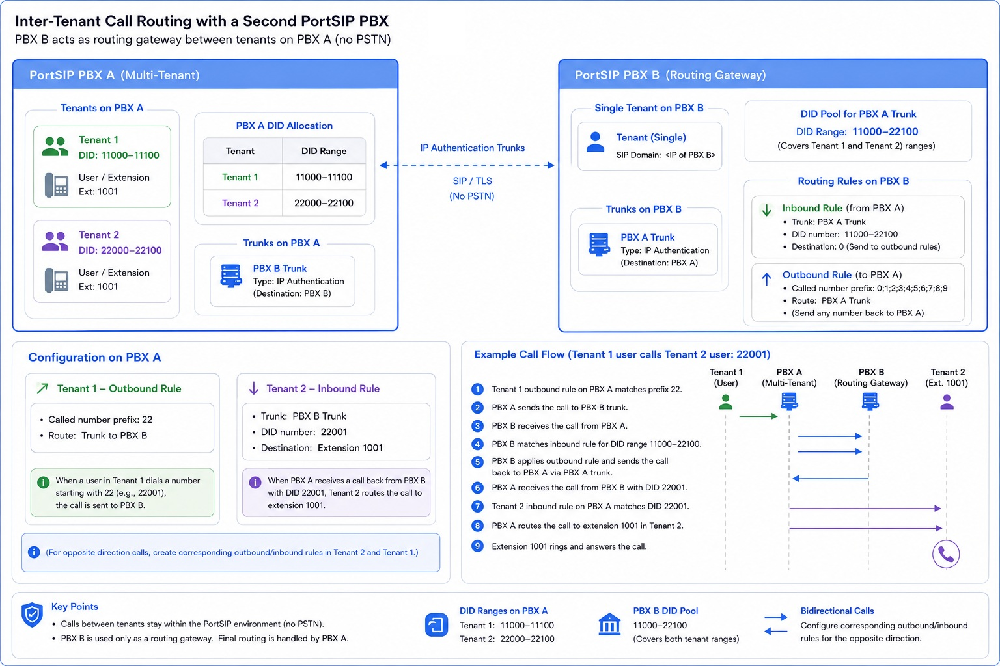
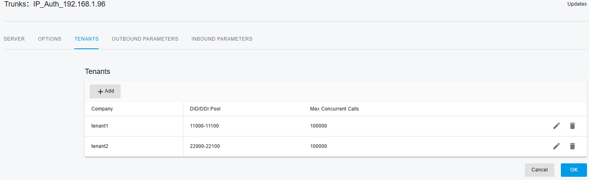
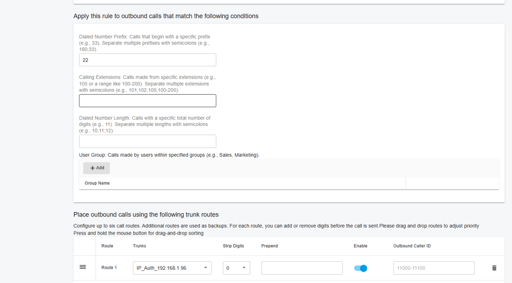
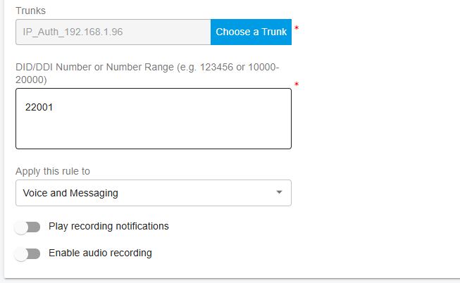
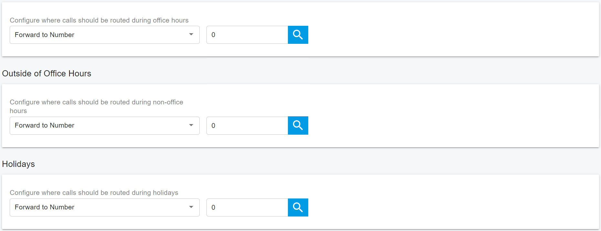
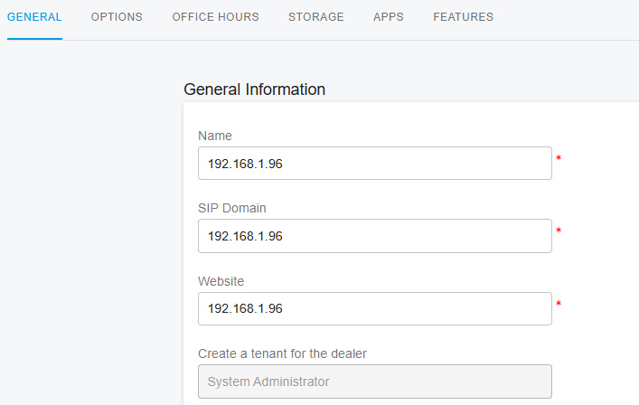
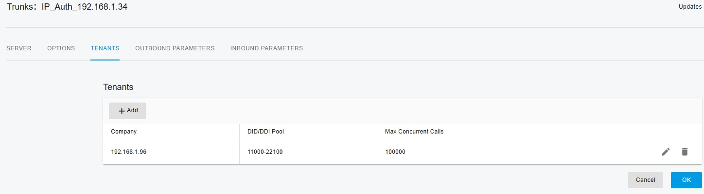
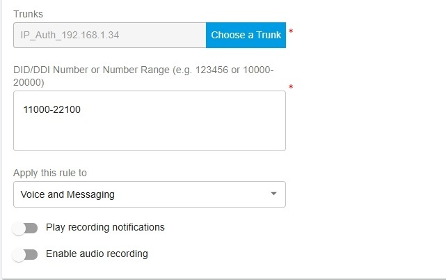
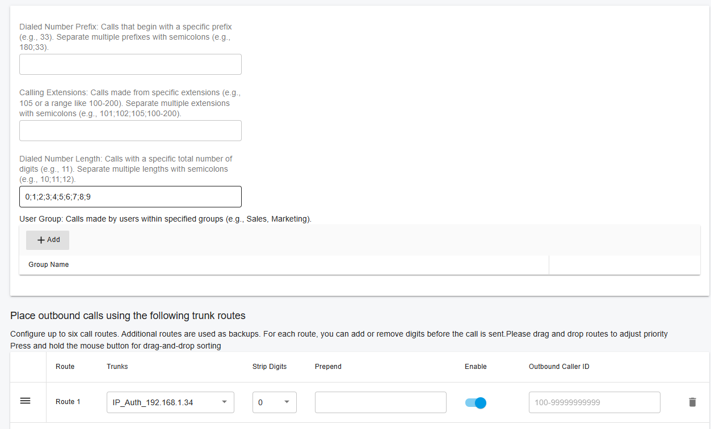

# Configuring Inter-Tenant Call Routing

This guide explains how to enable direct calling between tenants by using a second PortSIP PBX as an **inter-tenant routing gateway**.

This architecture allows users in different tenants on the same multi-tenant PortSIP PBX to call each other without routing calls through the PSTN.

### Scenario

Assume that you already have **PortSIP PBX A**(Assume the IP address is `192.168.1.34`) deployed and hosting multiple tenants.

You now want users in one tenant to call users in another tenant directly, without sending the calls through a PSTN provider.

To achieve this, deploy a second PortSIP PBX, referred to in this guide as **PortSIP PBX B**(Assume the IP address is `192.168.1.96`). PBX B acts solely as a routing gateway between the tenants hosted on PBX A.

### Example Tenant Numbering Plan

Assume the following DID ranges are assigned to tenants on **PBX A**:

| Tenant   | DID Range     |
| -------- | ------------- |
| Tenant 1 | `11000–11100` |
| Tenant 2 | `22000–22100` |

In this example, a user in Tenant 1 can call a user in Tenant 2 by dialing the destination user's DID number, such as `22001`.

The following diagram illustrates the overall deployment architecture and call-routing flow:

<figure><figcaption></figcaption></figure>

***

## 1. Configure PBX A

PBX A hosts the actual tenants, extensions, DID pools, and final inbound-routing rules.

### 1.1 Add PBX B as an IP Authentication Trunk

On **PBX A**, configure **PBX B** as an **IP Authentication trunk**.

This trunk is used to send inter-tenant calls from PBX A to PBX B for routing.

### 1.2 Allocate DID Numbers to the Tenants

On PBX A, assign the appropriate DID ranges to each tenant.

For example:

| Tenant   | DID Range     |
| -------- | ------------- |
| Tenant 1 | `11000–11100` |
| Tenant 2 | `22000–22100` |

The following screenshot shows an example configuration:

<figure><figcaption></figcaption></figure>

### 1.3 Create an Outbound Rule in Tenant 1

In **Tenant 1**, create an outbound rule that routes calls destined for Tenant 2 through the **PBX B trunk**.

Example configuration:

| Field                | Value       |
| -------------------- | ----------- |
| Called number prefix | `22`        |
| Route                | PBX B trunk |

With this rule, when a Tenant 1 user dials a number beginning with `22`, such as `22001`, PBX A sends the call to PBX B.

The following screenshot shows an example configuration:

<figure><figcaption></figcaption></figure>

### 1.4 Create an Inbound Rule in Tenant 2

In **Tenant 2**, create an inbound rule for calls received from the **PBX B trunk**.

Example configuration:

| Field       | Value            |
| ----------- | ---------------- |
| Trunk       | PBX B trunk      |
| DID number  | `22001`          |
| Destination | Extension `1001` |

With this rule, when PBX A receives a call from PBX B with the called number `22001`, the Tenant 2 inbound rule routes the call to extension `1001`.

The following screenshot shows the inbound rule configuration:

<figure><figcaption></figcaption></figure>

Set the route destination to extension `1001`, as shown below:

<figure><figcaption></figcaption></figure>

***

## 2. Configure PBX B

**PBX B** acts as the inter-tenant routing gateway. It receives calls from PBX A and routes them back to PBX A, where the destination tenant's inbound rules perform the final routing decision.

### 2.1 Create a Single Tenant on PBX B

On **PBX B**, create a single tenant.

Set the tenant's SIP domain to the **IP address of PBX B**, as shown below:

<figure><figcaption></figcaption></figure>

### 2.2 Add PBX A as an IP Authentication Trunk

On PBX B, configure **PBX A** as an **IP Authentication trunk**.

This trunk is used to:

* Receive calls from PBX A.
* Route those calls back to PBX A for final tenant-level routing.

### 2.3 Allocate DID Numbers to the PBX A Trunk

Allocate a DID range to the PBX A trunk that covers all tenant DID numbers that may participate in inter-tenant calling.

In this example, use:

```
11000-22100
```

This range covers the DID pools assigned to Tenant 1 and Tenant 2, as shown below:

<figure><figcaption></figcaption></figure>

### 2.4 Create an Inbound Rule on PBX B

In the tenant on PBX B, create an inbound rule for calls received through the **PBX A trunk**.

Example configuration:

| Field       | Value         |
| ----------- | ------------- |
| Trunk       | PBX A trunk   |
| DID number  | `11000–22100` |
| Destination | `0`           |

This rule allows PBX B to accept calls from PBX A for DID numbers within the configured range and pass them to the outbound-routing process.

Refer to the following screenshot for the detailed configuration:

<figure><figcaption></figcaption></figure>

### 2.5 Create an Outbound Rule on PBX B

In the tenant on **PBX B**, create an outbound rule that sends calls back to **PBX A**.

Example configuration:

| Field                | Value                 |
| -------------------- | --------------------- |
| Called number prefix | `0;1;2;3;4;5;6;7;8;9` |
| Route                | PBX A trunk           |

By matching all possible leading digits from `0` through `9`, this rule allows PBX B to route any called number back to PBX A through the PBX A trunk, as shown below:

<figure><figcaption></figcaption></figure>

***

## 3. Example Call Flow

The following example demonstrates how a user in Tenant 1 calls a user in Tenant 2.

### Example

A user in **Tenant 1** on PBX A dials:

```
22001
```

The call proceeds as follows:

1. The Tenant 1 outbound rule on PBX A matches the called-number prefix `22`.
2. PBX A sends the call to PBX B through the **PBX B trunk**.
3. PBX B receives the call from PBX A through the **PBX A trunk**.
4. PBX B matches the inbound rule for the DID range `11000–22100`.
5. PBX B applies its outbound rule and sends the call back to PBX A through the PBX A trunk.
6. PBX A receives the call from PBX B with the original called number `22001`.
7. Tenant 2 matches its inbound rule for DID `22001`.
8. PBX A routes the call to extension `1001` in Tenant 2.
9. Extension `1001` rings and answers the call.

The call is now established between the Tenant 1 user and extension `1001` in Tenant 2 without using the PSTN.

The complete signaling path is:

```
Tenant 1 user
    ↓
PBX A
    ↓
PBX B routing gateway
    ↓
PBX A
    ↓
Tenant 2 inbound rule
    ↓
Extension 1001
```

***

## 4. Notes

For calls in the opposite direction, for example, from Tenant 2 to Tenant 1, create the corresponding outbound rule in Tenant 2 and inbound rule in Tenant 1.

Ensure that DID ranges assigned to different tenants do not overlap unless you have implemented a clearly defined access-code or routing-prefix scheme.

PBX B should be used only as the inter-tenant routing gateway in this architecture. The final destination-routing decision remains on PBX A and is determined by the inbound rules configured for each tenant.

This design keeps inter-tenant calls entirely within the PortSIP PBX environment and avoids routing them through the PSTN.
