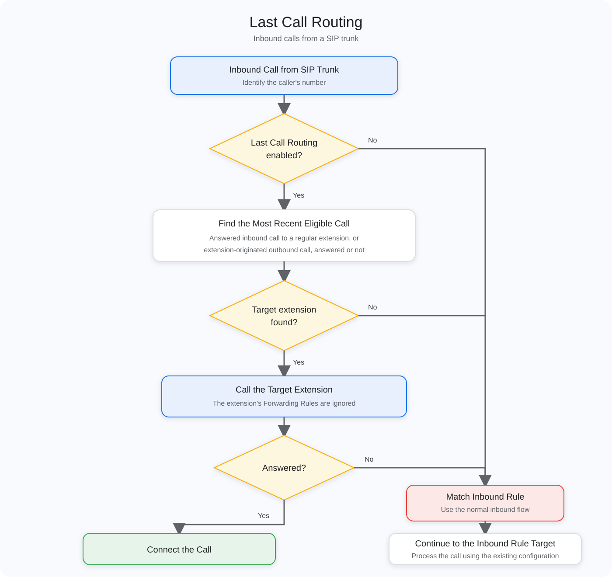

# Last Call Routing

Last Call Routing uses recent call history to route an inbound call from a SIP trunk to the extension that most recently answered a call from or placed a call to the external number. This helps returning callers reach the person who most recently handled their call.

If the target extension does not answer, declines the call, or cannot be reached, the PBX falls back to normal Inbound Rule matching.

***

### Configure Last Call Routing

1. Sign in to the PortSIP PBX Web Portal as a system administrator and select a tenant to manage, or sign in as a tenant administrator.
2. Select **Company > General > Options**.
3. Turn on **Last Call Routing**.
4. In **Last Call Routing Lookback Period (Hours)**, enter how far back the PBX should search the call history.
5. Save the changes.

#### Last Call Routing

Enables or disables Last Call Routing for the tenant.

* Default: **Off**
* Existing installations upgraded from an earlier version: **Off**

#### Last Call Routing Lookback Period (Hours)

Specifies the number of hours of call history that the PBX searches when determining the target extension.

* Default: `24`
* Valid range: `1–8760`

For example, if the value is set to `48`, the PBX searches eligible calls made or received during the previous 48 hours.

***

### How the Target Extension Is Selected

When the PBX receives an inbound call from a SIP trunk, it searches for eligible call records associated with the caller's number within the configured lookback period.

The following records are eligible:

#### Previous Inbound Calls

A previous inbound call is eligible only when:

* It was received from a SIP trunk.
* It was answered by a regular extension.

An unanswered inbound call is not used for Last Call Routing.

#### Previous Outbound Calls

A previous outbound call is eligible when a PBX extension called the current caller's number. The record is eligible whether or not the external party answered the call.

#### Most Recent Eligible Call

If multiple eligible inbound and outbound records exist, the PBX selects the most recent record. The extension associated with that record becomes the Last Call Routing target.

***

### How the Inbound Call Is Handled

When a target extension is found, the PBX skips Inbound Rule matching and calls the target extension directly.

* If the extension answers, the call is connected and no Inbound Rule is applied.
* The extension's **Forwarding Rules** are ignored, as they are when a queue calls an agent.
* If the extension does not answer, declines the call, or cannot be reached, the Last Call Routing attempt ends and the PBX resumes normal Inbound Rule matching.

<figure><figcaption></figcaption></figure>

The PBX falls back to Inbound Rule matching in any of the following situations:

* The extension does not answer.
* The extension declines the call.
* The extension is busy.
* The extension is not registered.
* The extension is unavailable.
* The call to the extension fails.

The PBX also proceeds directly to Inbound Rule matching when:

* Last Call Routing is disabled.
* No eligible record is found within the lookback period.
* A previous inbound call was not answered by a regular extension.
* The target extension cannot be determined.

***

### Example

Assume the following call history:

```
10:00  Extension 1001 calls customer 123456789
11:00  Customer 123456789 calls the PBX, and Extension 1002 answers
12:00  Customer 123456789 calls the PBX again
```

For the call received at 12:00, the PBX calls **Extension 1002** first because the call at 11:00 is the most recent eligible record.

* If Extension 1002 answers, the call is connected.
* If Extension 1002 does not answer, declines the call, or cannot be reached, the PBX resumes normal Inbound Rule matching.

***

### Routing Priority

When Last Call Routing is enabled and a target extension is found, the routing priority is:

```
Last Call Routing > Inbound Rule
```

