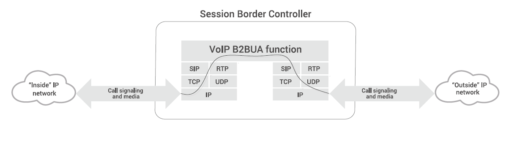
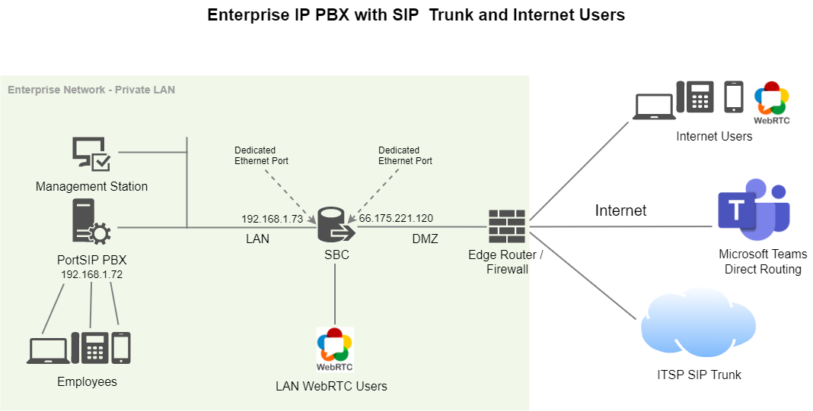

# Topology

The PortSIP Session Border Controller (PortSIP SBC) can operate as an integrated component of the PortSIP PBX, delivering WebRTC services and enabling Microsoft Teams Direct Routing.

Designed for flexibility and scalability, PortSIP SBC allows service providers and enterprises to support a large number of WebRTC users and Internet-based clients while maintaining carrier-grade security and performance.

Before proceeding, we strongly recommend reviewing the section "[What's an SBC?](../../faq/what-is-the-sbc.md)"  for a detailed conceptual overview.\
The SBC role and traffic flow are typically illustrated as shown in the diagram below.

<figure><figcaption></figcaption></figure>

### Enterprise IP PBX with SIP Trunk and Internet Users

This deployment scenario demonstrates how to configure the PortSIP SBC to interwork between:

* An enterprise IP PBX
* A SIP trunk provider
* Nomadic Internet users, such as:
  * Client apps
  * WebRTC browsers
  * Remote IP phones
* Microsoft Teams, integrated via Direct Routing

#### Deployment with One Physical Network Interface

The example deployment includes the following components:

* **Enterprise LAN:** PortSIP PBX running at IP address: `192.168.1.72`
* **SIP Trunk:** Connected to the public Internet
* **Nomadic Internet Users:** Remote users accessing the system over the Internet via apps, WebRTC clients, or IP phones
* **Microsoft Teams:** Integrated with the PBX through the PortSIP SBC using Direct Routing

In this architecture, the PortSIP SBC serves as the **secure demarcation point** between internal PBX services and external networks, providing:

* SIP signaling and media security
* NAT traversal and topology hiding
* Media services for interoperability
* Controlled access for Internet and Teams users

***

<figure><figcaption></figcaption></figure>

**Logical Network Interfaces**

The PortSIP SBC is configured with the following **logical network interfaces**:

* **LAN Interface (Management + Signaling)**
  * IP address: `192.168.1.73`
  * Connected to the internal enterprise LAN
  * Also used for SBC management access
* **DMZ / WAN Interface**
  * IP address: `66.175.221.120`
  * Exposed to the Internet for SIP, media, WebRTC, and Microsoft Teams connectivity

***

**Physical Network Interface Layout**

* **Physical LAN Port Connections:** A single Ethernet port is connected to the LAN

In this topology, the PortSIP SBC uses **one physical network interface** that hosts **two logical interfaces**:

* The **LAN interface** uses the private IP address (`192.168.1.73`)
* The **DMZ/WAN interface** is implemented as a **virtual IP mapping** to the public IP address (`66.175.221.120`)

This design is common in virtualized and cloud environments where public IP addresses are mapped to internal interfaces via NAT or platform-level networking.

***

#### Deployment with Two Physical Network Interfaces

The PortSIP SBC can be deployed using two physical network interfaces (NICs) to provide clear separation between internal (LAN) and external (DMZ/WAN) traffic. This deployment model is recommended for high-security enterprise and carrier-grade environments.

<figure><figcaption></figcaption></figure>

**Logical Network Interface Configuration**

The SBC is configured with the following **logical network interfaces**:

* **LAN Interface (Management + Internal Signaling)**
  * IP address: `192.168.1.73`
  * Connected to the internal enterprise LAN
  * Used for SBC management and internal SIP signaling
* **DMZ / WAN Interface**
  * IP address: `66.175.221.120`
  * Connected to the external network
  * Used for SIP trunks, WebRTC, and Microsoft Teams Direct Routing

***

**Physical Network Interface Connections**

The logical interfaces are mapped to **two separate physical Ethernet ports**:

* **LAN NIC:** Connected to the enterprise LAN
* **DMZ/WAN NIC:** Connected to the DMZ or Internet-facing network

This architecture provides **strong network isolation**, improved security posture, and clearer traffic control compared to a single-NIC deployment.

***

### Hosted Cloud PBX Deployment

This example illustrates how to configure the PortSIP SBC to interwork between LAN-based IP phones, client apps, WebRTC clients, and a hosted cloud IP PBX.

In this scenario, the SBC acts as the **secure service edge**, providing SIP, media, WebRTC, and Microsoft Teams connectivity between internal users and external networks.

<figure><figcaption></figcaption></figure>

#### SBC Logical Network Interface Configuration

This deployment uses **two logical network interfaces** on the SBC:

* **LAN Interface (PBX-Facing)**
  * IP address: `172.31.3.190`
  * Used for communication with the hosted IP PBX
  * The PBX is located on the same LAN at IP address: `172.31.3.192`
* **WAN / Public Interface**
  * IP address: `185.53.179.172`
  * Provides services:
    * SIP services
    * WebRTC services
    * Microsoft Teams Direct Routing

***

#### Traffic Flow Description

* Within the **LAN**, IP phones, desktop and mobile apps, and WebRTC clients communicate with the **PortSIP SBC** using:
  * SIP signaling
  * RTP / SRTP media streams
* The SBC securely brokers and protects traffic between:
  * Internal endpoints and the hosted PBX
  * External services such as SIP trunks and Microsoft Teams

This architecture ensures:

* Secure exposure of cloud PBX services
* Centralized media and signaling control
* NAT traversal and topology hiding
* Scalable support for large numbers of WebRTC and remote users

