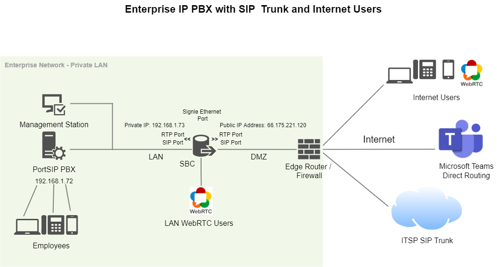

# Topology

The PortSIP SBC can function as a component of the PortSIP PBX, providing WebRTC services and enabling Microsoft Teams Direct Routing. It offers flexibility and scalability, allowing you to support a large number of WebRTC customers.

Before getting started, please review the section  "[What's an SBC?](../../faq/what-is-the-sbc.md)" for a detailed overview. The SBC concept is typically illustrated in the diagram below.

<figure><figcaption></figcaption></figure>

## Deployment Scenarios

### Enterprise IP PBX with SIP Trunk and Internet Users

This example demonstrates how to configure the SBC for interworking between an IP PBX, a SIP trunk, and nomadic internet users (such as apps, WebRTC clients, and IP phones). The scenario includes the following topology:

* **Enterprise LAN**: PortSIP PBX at IP address 192.168.1.72
* **SIP Trunk**: Connected to the internet
* **Nomadic Internet Users**: Accessing the system remotely
* **Microsoft Teams**: Integrated into the system

<figure><figcaption></figcaption></figure>

**SBC Logical Network Interface Connections:**

* One logical interface connected to the LAN, with IP address 192.168.1.73. This interface is also used for management.
* One logical interface connected to the DMZ/WAN, with IP address 66.175.221.120.

**SBC Physical LAN Port Connections:**

* One Ethernet port is connected to the LAN.

In this topology, the SBC has a single physical network interface that supports two logical interfaces. The DMZ/WAN interface is a virtual mapping to the IP address 66.175.221.120.

The PortSIP SBC can also be deployed with two physical network interfaces.

<figure><figcaption></figcaption></figure>

**SBC Logical Network Interface Connections:**

* One logical interface connected to the LAN, with IP address 192.168.1.73. This interface is also used for management.
* One logical interface connected to the DMZ/WAN, with IP address 66.175.221.120.

**SBC Physical Network Interface Connections:**

* One Ethernet port is connected to the LAN.
* One Ethernet port is connected to the DMZ/WAN.

### Hosted Cloud PBX

This example illustrates how to configure the PortSIP SBC for interworking between LAN-based IP phones, apps, WebRTC clients, and a hosted cloud IP PBX. The scenario includes the following topology:

<figure><figcaption></figcaption></figure>

**SBC Logical Network Interface Connections:**

This example uses two logical network interfaces:

* One interface with IP address 172.31.3.190, is used for communication with the PBX (IP address 172.31.3.192), which is located on the same LAN.
* The second interface with IP address 185.53.179.172, providing SIP services, WebRTC services, and Microsoft Teams Direct Routing.

Within the LAN, IP phones, apps, and WebRTC clients communicate with the SBC using SIP and RTP/SRTP.

