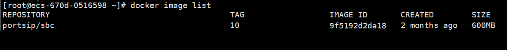
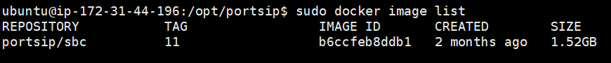

# Upgrade to the Latest v11.x Release

This guide is for upgrading your current PortSIP SBC installation to the latest v11.x version. Please follow the steps below to upgrade.

## Back-up

We recommend backing up your SBC data. The data file path is usually `/var/lib/portsip`. You can also back up the entire VM server or take a snapshot of the VM server.

Please follow the article [Backup and Restore: An Essential Guide](../backup-and-restore/).


All commands must be executed in the **`/opt/portsip`** directory.


## Prerequisites for Upgrading from v10.x

If you have installed PortSIP SBC 10.x with PortSIP PBX v16.x and wish to upgrade to the latest v11.x for compatibility with PortSIP PBX v22.x, follow the steps below to remove the current installation.

### **1: Stop SBC docker instances**

Perform the following commands to stop the SBC Docker instance:

```sh
cd /opt/portsip
sudo /bin/sh sbc_ctl.sh stop
```

### **2: Delete the SBC docker instances**

Perform the following command to delete the SBC Docker instance:

```sh
sudo /bin/sh sbc_ctl.sh rm
```

### **3: Delete the SBC docker images**

Perform the following command to list the SBC Docker images:

```sh
sudo docker image list
```

You will get a similar result, as shown in the screenshot below.

<figure><figcaption></figcaption></figure>

You can use the following command to delete Docker images by specifying the first 4 digits of the IMAGE ID for **SBC**. In this case, the IMAGE ID is **9f51** for **SBC**:

```sh
sudo docker image rm 9f51
```

### **4: Delete the scripts**

Use the below commands to delete the current scripts.

```sh
rm install_pbx_docker.sh
rm install_docker.sh
rm sbc_ctl.sh
```

You are now ready to upgrade to the latest version of PortSIP PBX v11.x.

## Prerequisites for Upgrading from v11.x

If you installed the PortSIP SBC 11.x and wish to upgrade to the latest v11.x, please follow the below steps to remove the current installation.

### **1: Stop SBC docker instances**

Perform the following commands as root to stop the current SBC Docker instance:

```sh
cd /opt/portsip
sudo /bin/sh sbc_ctl.sh stop
```

### **2: Delete the SBC docker instances**

Perform the following command to delete the SBC Docker instance:

```sh
sudo /bin/sh sbc_ctl.sh rm
```

### **3: Delete the SBC docker images**

Perform the following command to list the SBC Docker images:

```sh
docker image list
```

You will get a similar result, as shown in the screenshot below.

<figure><figcaption></figcaption></figure>

You can use the following command to delete Docker images by specifying the first 4 digits of the IMAGE ID for **SBC**. In this case, the IMAGE ID is **b6cc** for **SBC**:

```
docker image rm b6cc
```

### **4: Delete the scripts**

```sh
rm install_pbx_docker.sh
rm install_docker.sh
rm sbc_ctl.sh
rm im_ctl.sh
rm init.sh
```

You are now ready to upgrade to the latest version of PortSIP PBX v11.x.


###

Your SBC has now been successfully upgraded to the latest version.

### Update PBX token after upgrading


If your PBX is upgraded to v16.1, you must upgrade your SBC to v10.0.6, since in the v16.1.0, the PBX token is changed.


After successfully upgrading to PBX v16.1.0 and SBC v10.0.6, please follow the following steps to update the PBX token.

1. Sign in to the PBX web portal [https:/your-pbx-domain:8887](https://https/your-pbx-domain:8887) as System Administrator, and click the menu **Advanced > SBC**. Even if a token already exists, click the **Generate** button to generate a new token for the SBC's access. Click the **Copy** button to copy the token.
2. Sign in to the PortSIP SBC Web Portal at [https://uc.portsip.cc:8883](https://https/your-sbc-domain:8887). Select the menu **Settings > PBX**. Delete the current **PBX Access Token** and then paste the copied token into the **PBX Access Token** field to replace the current PBX Access Token, then click the OK button to save it.


## Upgrading SBC for Windows

1. We suggest backing up your SBC data. The data file path is usually `c:\programdata\portsip`. You can follow the article [Backup and Restore: An Essential Guide](../backup-and-restore/).&#x20;
2. Download the latest installer from the [PortSIP website](https://www.portsip.com/download-portsip-sbc).&#x20;
3. Double-click the installer to install it and the upgrade will be performed automatically.

### Update PBX token after upgrading


If your PBX is upgraded to v16.1, you must upgrade your SBC to v10.0.6, since in the v16.1.0, the PBX token is changed.


After successfully upgrading to PBX v16.1.0 and SBC v10.0.6, please follow the following steps to update the PBX token.

1. Sign in to the PBX web portal [https:/your-pbx-domain:8887](https://https/your-pbx-domain:8887) as System Administrator, and click the menu **Advanced > SBC**. Even if a token already exists, click the **Generate** button to generate a new token for the SBC's access. Click the **Copy** button to copy the token.
2. Sign in to the PortSIP SBC Web Portal at [https://uc.portsip.cc:8883](https://https/your-sbc-domain:8887). From the menu, select **Settings > PBX**. Delete the current **PBX Access Token** and then paste the copied token into the **PBX Access Token** field to replace the current PBX Access Token, then click the OK button to save it.

