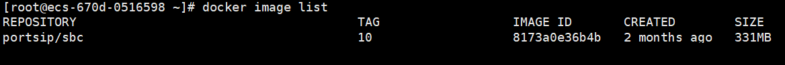

# Upgrade to the Latest v10.x Release

This guide provides instructions for upgrading your current PortSIP SBC v10.x installation to the latest v10.x version. Please follow the steps below to complete the upgrade process.

If you wish to upgrade your current PortSIP SBC v10.x installation to version 11.x, refer to the guide [**Upgrade to the Latest v11.x Release**](upgrade-to-the-latest-sbc-release.md) for detailed instructions.


Please ensure that your current PortSIP SBC installation is version **10.x** version&#x73;**.**


## Open Firewall Rule for Port 10443

From version 10.0.1, the PortSIP SBC changed the WebRTC client port to **10443**; therefore, you must create a new firewall rule for port 10443 on TCP if you are upgrading from v10.0.0.

## Upgrading SBC for Windows

1. We suggest backing up your SBC data. The data file path is usually `c:\programdata\portsip`. You can follow the article [Backup and Restore: An Essential Guide](../../tutorials/backup-and-restore/).&#x20;
2. Download the latest installer from the [PortSIP website](https://www.portsip.com/download-portsip-sbc).&#x20;
3. Double-click the installer to install it and the upgrade will be performed automatically.

### Update PBX token after upgrading


If your PBX is upgraded to v16.1, you must upgrade your SBC to v10.0.6, since in the v16.1.0, the PBX token is changed.


After successfully upgrading to PBX v16.1.0 and SBC v10.0.6, please follow the following steps to update the PBX token.

1. Sign in to the PBX web portal [https:/your-pbx-domain:8887](https://https/your-pbx-domain:8887) as System Administrator, and click the menu **Advanced > SBC**. Even if a token already exists, click the **Generate** button to generate a new token for the SBC's access. Click the **Copy** button to copy the token.
2. Sign in to the PortSIP SBC Web Portal at [https://uc.portsip.cc:8883](https://https/your-sbc-domain:8887). From the menu, select **Settings > PBX**. Delete the current **PBX Access Token** and then paste the copied token into the **PBX Access Token** field to replace the current PBX Access Token, then click the OK button to save it.

## **Upgrading SBC for Linux**

We recommend backing up your SBC data. The data file path is usually `/var/lib/portsip`. You can also back up the entire VM server or take a snapshot of the VM server.

Please follow the article [Backup and Restore: An Essential Guide](../../tutorials/backup-and-restore/).


All commands must be executed in the **`/opt/portsip`** directory.


### Step 1 Stop SBC Docker Instance

Perform the following commands as root to stop the current SBC Docker instance:

<pre class="language-sh"><code class="lang-sh"><strong>su -
</strong><strong>cd /opt/portsip
</strong></code></pre>

<pre class="language-sh"><code class="lang-sh"><strong>/bin/sh sbc_ctl.sh stop
</strong></code></pre>

### Step 2 Delete the SBC Docker Instance

Perform the following command to delete the SBC Docker instance.

```sh
/bin/sh sbc_ctl.sh rm
```

### Step 3 List the SBC Docker Images

Perform the following command to list the SBC Docker images:

```sh
docker image list
```

You will get the result shown in the below screenshot.

<figure><figcaption></figcaption></figure>

### Step 4 Delete the SBC Docker Images

Use the first 4 digits of the IMAGE ID to delete the Docker image:

```sh
docker image rm 8173 
```

### Step 5 Delete the SBC Scripts

```sh
rm install_docker.sh && rm install_sbc_docker.sh && rm sbc_ctl.sh
```

### Step **6 Download the  Latest Installation Scripts**

```
curl https://raw.githubusercontent.com/portsip/portsip-pbx-sh/master/v16.x/new/install_docker.sh \
-o install_docker.sh
```

```
curl https://raw.githubusercontent.com/portsip/portsip-pbx-sh/master/v16.x/new/sbc_ctl.sh \
-o sbc_ctl.sh
```

### Step **7 Setup the Docker Environment**

Execute the below command to install the `Docker-Compose` environment. If you get the prompt likes`*** cloud.cfg (Y/I/N/O/D/Z) [default=N] ?`, enter the **Y** and then press the **Enter** button.

```sh
/bin/sh install_docker.sh
```

### Step 8 Create and Run the PortSIP SBC Docker Container Instance

The below command is used to create and run the SBC on a server.

```sh
/bin/sh sbc_ctl.sh run -p /var/lib/portsip -i portsip/sbc:10
```

Your SBC has now been successfully upgraded to the latest version.

### Update PBX token after upgrading


If your PBX is upgraded to v16.1, you must upgrade your SBC to v10.0.6, since in the v16.1.0, the PBX token is changed.


After successfully upgrading to PBX v16.1.0 and SBC v10.0.6, please follow the following steps to update the PBX token.

1. Sign in to the PBX web portal [https:/your-pbx-domain:8887](https://https/your-pbx-domain:8887) as System Administrator, and click the menu **Advanced > SBC**. Even if a token already exists, click the **Generate** button to generate a new token for the SBC's access. Click the **Copy** button to copy the token.
2. Sign in to the PortSIP SBC Web Portal at [https://uc.portsip.cc:8883](https://https/your-sbc-domain:8887). Select the menu **Settings > PBX**. Delete the current **PBX Access Token** and then paste the copied token into the **PBX Access Token** field to replace the current PBX Access Token, then click the OK button to save it.

