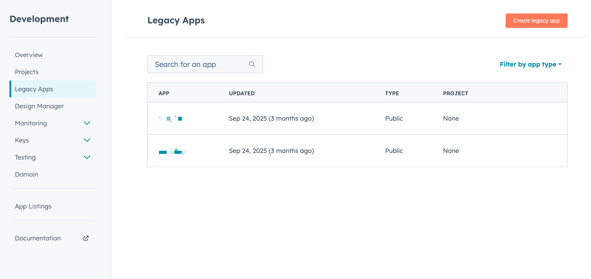
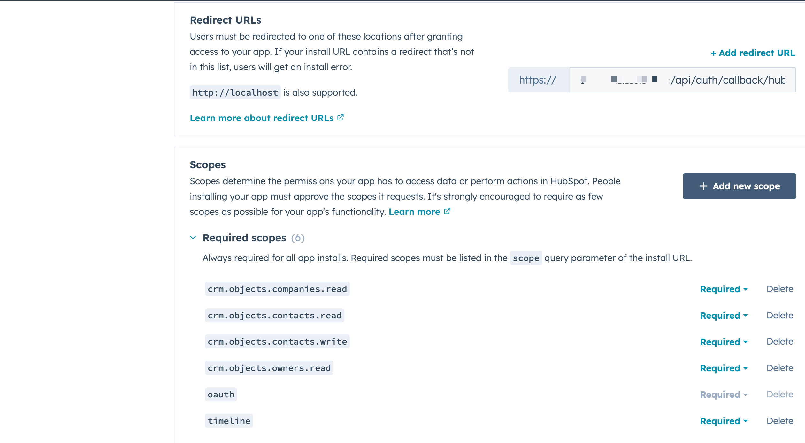
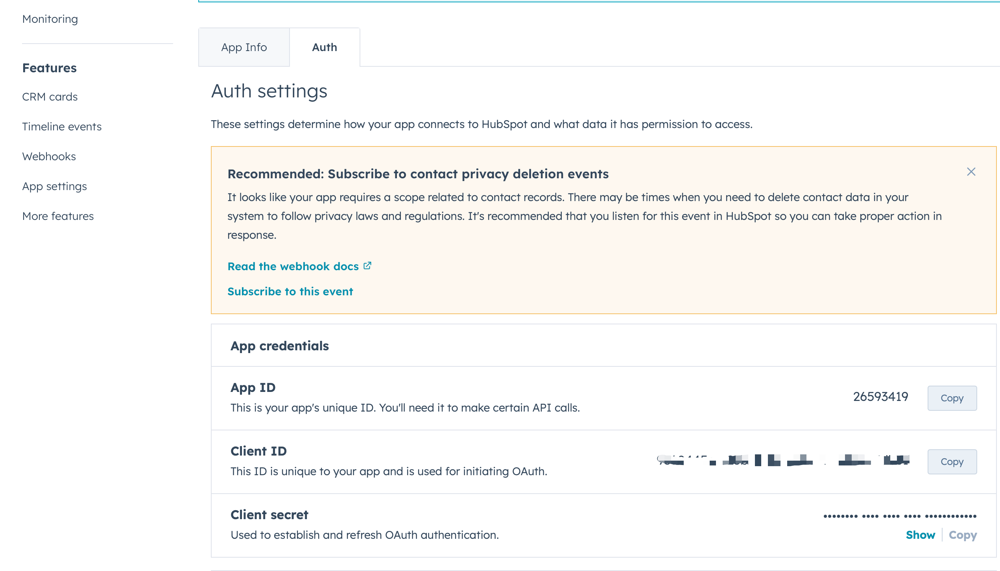
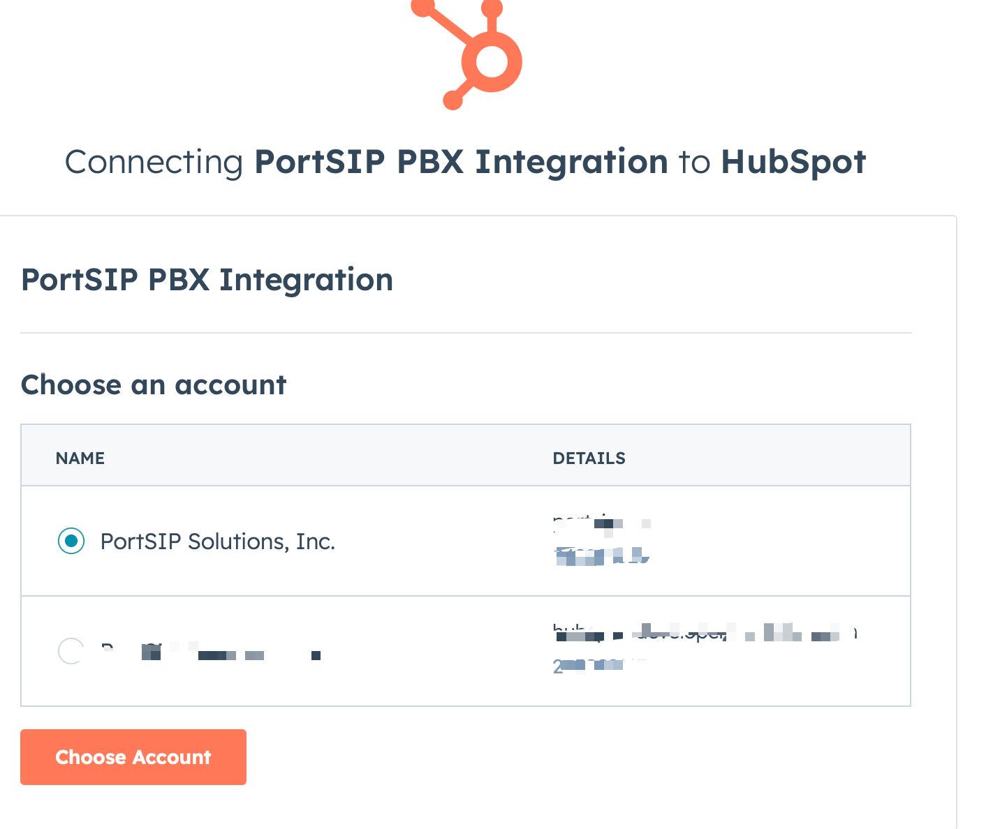
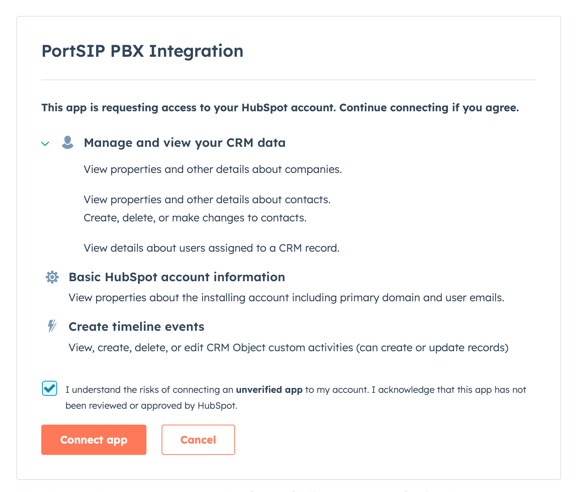

# HubSpot CRM

### HubSpot CRM Integration Overview

Improve your team’s productivity with **PortSIP PBX’s native HubSpot CRM integration**. This integration automatically matches incoming and outgoing calls with **HubSpot contacts, leads, and accounts**, and logs call activities—including **call records, call recordings, and AI transcriptions**—to the appropriate CRM records.

By eliminating manual data entry and providing agents with real-time customer context, this integration helps teams work more efficiently and deliver a consistently superior customer experience.

***

### Key Capabilities

#### Caller ID to Contact Name

Inbound calls automatically trigger a **HubSpot** CRM lookup to identify the caller and display the associated contact name.

#### Contact Lookup from PortSIP ONE

When searching by name in **PortSIP ONE for Windows, macOS, or Web Client**, the system queries **HubSpot** CRM and matches contacts based on phone numbers.

#### Automatic Call Journaling

All trunk calls are automatically logged in the HubSpot Contact Card as CRM call activities. Agents can also append call notes at any time.

#### Create New Contacts Automatically

For calls from unknown numbers, agents can create new HubSpot contacts or leads directly from the PortSIP PBX client.

#### Recording and AI Transcription Logging

Call recording links and AI transcription links are automatically attached to the corresponding Zoho CRM activity.

***

### Step 1: Configure the HubSpot Application

1. Sign in to the [**HubSpot Developer Console**](https://developers.hubspot.com/)**.**
2. In the left navigation panel, select **Legacy Apps**, then click **Create legacy app**.

<figure><figcaption></figcaption></figure>

3. Select **Public** as the type of legacy app.
4. In the **App Info** tab, enter a **Public app name**, for example: `PortSIP PBX Integration`
5.  In the **Redirect URL** field, enter the callback URL of your PortSIP PBX Admin Console. For example: `https://pbx.portsip.com/api/auth/callback/hubspot`

    > **Note:** Replace `pbx.portsip.com` with your actual PBX host name.
6. In the **Scopes** section, add the following permissions:
   * **CRM**
     * `crm.objects.contacts.read`
     * `crm.objects.contacts.write`
     * `crm.objects.companies.read`
     * `crm.objects.owners.read`
   * **Other**
     * `timeline`&#x20;

<figure><figcaption></figcaption></figure>

7. Click **Create App**. HubSpot will generate a **Client ID** and **Client Secret**.
8. Securely store the **Client ID** and **Client Secret**.\
   These credentials are required when configuring PortSIP PBX. Treat them as confidential and rotate them immediately if you suspect they have been compromised.

<figure><figcaption></figcaption></figure>

***

### Step 2: Configure PortSIP PBX

#### Enable CRM at the Tenant Level

Log in to the **PortSIP PBX Web Portal** as a **System Administrator**, then navigate to **Tenants**, select the target tenant, and click **Edit**.

Open the **Features** tab and ensure that the **CRM** option is enabled.

> **Important:** CRM integration will not function unless this feature is enabled for the tenant by a System Administrator.

Alternatively, you may sign in directly as the **Tenant Administrator** for the desired tenant.

***

#### Configure HubSpot CRM Integration

1. Navigate to **Integrations > CRM**.
2. From the **Select a CRM solution** dropdown, choose **HubSpot**.
3. Enter the **Client ID** and **Client Secret** obtained in Step 1.

***

### Configure CRM Behavior

<figure><figcaption></figcaption></figure>

#### Contact Lookup Order

Define the priority for HubSpot CRM searches:

* Contacts
* Companies

#### Query CRM

Specify when PortSIP PBX should query HubSpot CRM:

* **Always query**
* **Only when not found in PBX CRM contacts**

#### Log Calls as Activities

Enable this option to automatically log calls as HubSpot CRM activities.

When enabled, a call recording link can be included in the activity:

* **Private Recording Link** – Authentication with PortSIP PBX is required to access the recording.
* **Public Recording Link** – Authentication with PortSIP PBX is not required.

#### Create Contacts for New Numbers

Allow agents to create CRM records when calls come from unknown numbers.

***

### Authorize HubSpot Access

1. Click **Authorize**. A new browser tab will open.
2. Sign in using the **HubSpot user account** that should grant access _(do not use a developer account)_.

<figure><figcaption></figcaption></figure>

3. Click **Connect app** to authorize PortSIP PBX to access HubSpot CRM data.

<figure><figcaption></figcaption></figure>

Once authorization is complete, the integration becomes active immediately.

