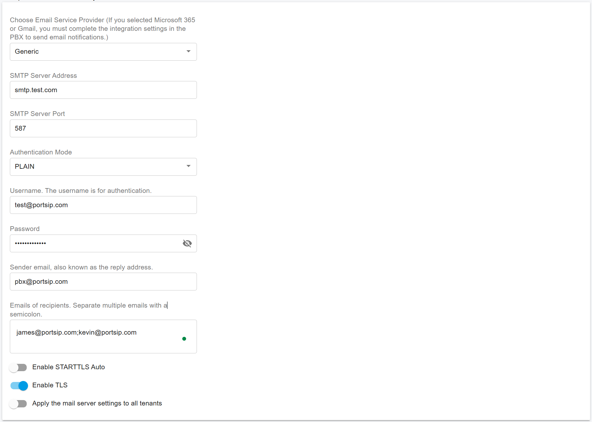
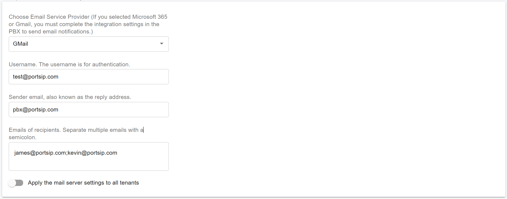
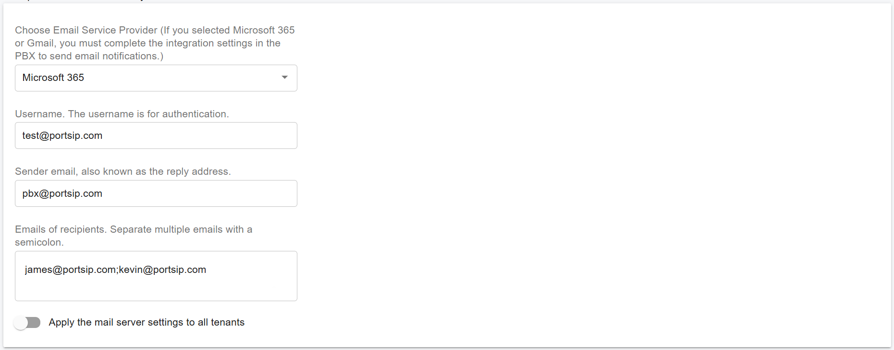
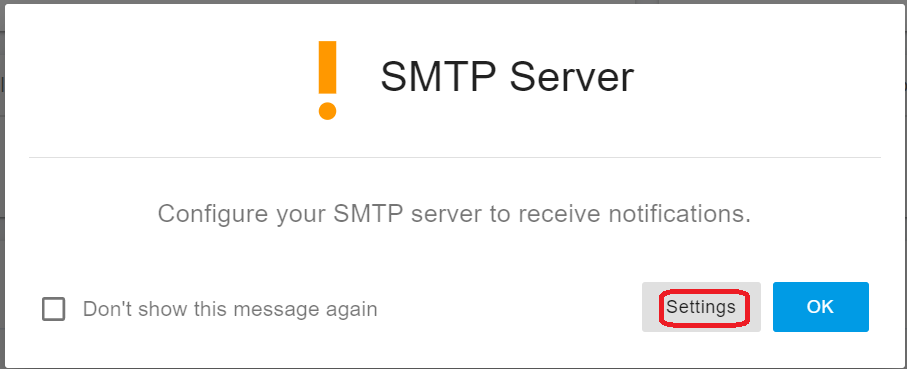
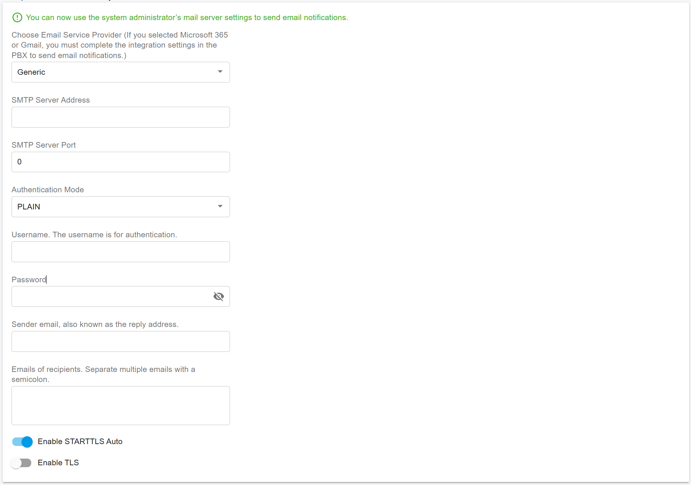
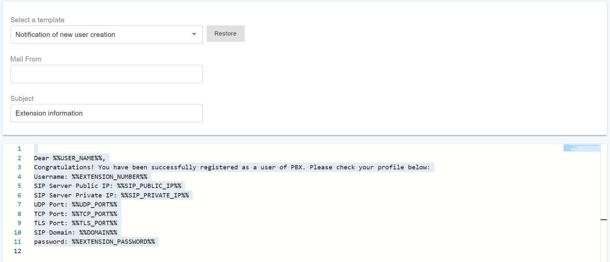

# 31 Configuring Email Notifications

Email notifications are used to send alerts about specific activities occurring in your PBX. For example, you can configure notifications to inform users when a new voicemail is received.

These notifications can be customized by setting various custom parameters.

## System Administrator Level

### Setting Up Mail Server

In order to send email notifications for system events to the system administrator, the mail server must be correctly configured.&#x20;

1. Sign in as System Administrator
2. Select the menu **Advanced > System Notifications,** and click the **Mail Server** tab.

From here, you can set the mail server settings for different email service providers.

#### Generic

For other generic SMTP providers that are not Google or Microsoft, please set it up as per the provider's instructions. For some users, SMTP authentication is done by IP address rather than username and password. In this case, select **NONE** for the **Authentication Mode** field.

<figure><figcaption></figcaption></figure>

#### Google Gmail

You can choose to use Google Gmail as the email service provider. Enter the username (usually your email address), the sender’s email, and the recipient emails.

Since Google has disabled third-party apps from sending emails using a username and password, after saving the settings, you will need to complete the [Google Integration](https://support.portsip.com/portsip-communications-solution/portsip-pbx-administration-guide/29-integrations/google-workspace-integration) process to enable the PBX to send emails via Gmail using OAuth.

<figure><figcaption></figcaption></figure>

#### Microsoft 365

You can choose to use Microsoft 365 as the email service provider. Enter the username (usually your email address), the sender’s email, and the recipient emails.

Since Microsoft has disabled third-party apps from sending emails using a username and password, after saving the settings, you will need to complete the [Microsoft 365 Integration](https://support.portsip.com/portsip-communications-solution/portsip-pbx-administration-guide/29-integrations/microsoft-365-integration) process to enable the PBX to send emails via Microsoft 365 using OAuth.

<figure><figcaption></figcaption></figure>

### Apply Mail Settings to All Tenants

There is an option "**Apply the mail server settings to all tenants"**. When it is enabled, the PBX will use the System Administrator’s email settings to send notification emails to tenants who have not configured their own mail server.

### Configure Notifications

Navigate to **Advanced > System Notifications** and select the **Notifications** tab to configure how notifications will be sent.

1. The following email notifications can be enabled for specific events. These notifications will be sent to the designated recipients:
   * **Hard Disk Threshold**: Notifies when the hard disk usage exceeds a specified threshold. A value of 0 means hard disk usage is not monitored.
   * **CPU Threshold**: Notifies when CPU usage exceeds a specified threshold. A value of 0 means CPU usage is not monitored.
   * **Memory Threshold**: Notifies when memory usage exceeds a specified threshold. A value of 0 means memory usage is not monitored.
2. Enable or disable notifications for the following events:
   * **Hard Disk Usage Exceeds Threshold**: Turn on/off email notifications when the specified hard disk threshold is exceeded.
   * **CPU Usage Exceeds Threshold**: Turn on/off email notifications when the specified CPU threshold is exceeded.
   * **Memory Usage Exceeds Threshold**: Turn on/off email notifications when the specified memory threshold is exceeded.
   * **IP Blacklisting**: Turn on/off email notifications when an IP address is blacklisted.
   * **License Limit Reached**: Turn on/off email notifications when the license limit is reached.
   * **PBX Services Stopped or Failed**: Turn on/off email notifications when any PBX service is stopped or fails.
   * **Failed to update the push notification certificates for the iOS app:** Turn on/off to send an email notification if a the PBX update push notififaction certificates for iOS app is failed.

## Tenant Level

PortSIP PBX supports email notifications for tenant administrators, specifically for call-related events, which differ from system events.

Each tenant can configure their own mail server to receive email notifications. Alternatively, if the system administrator allows it, tenants can use the system administrator’s mail server settings. For more details, refer to [_Apply Mail Settings to Tenants_](configuring-email-notifications.md#apply-mail-settings-to-tenants).

To configure the mail server for a tenant:

1. **Sign in to the Web Portal** as the tenant administrator or manage the tenant from the system administrator workspace.
2. If the SMTP server is not yet configured, the Web Portal will prompt you with a pop-up window to set it up.

<figure><figcaption></figcaption></figure>

You can click the **Settings** button to configure the mail server.&#x20;

You can also navigate to **Advanced > Notifications**, then click the **Mail Server** page to access the configuration options.

<figure><figcaption></figcaption></figure>

If the PBX system administrator has enabled the [**Apply Mail Settings to All Tenants**](configuring-email-notifications.md#apply-mail-settings-to-all-tenants) option, you will see the following text in green:\
&#xNAN;**"You can now use the system administrator's mail server settings to send email notifications."**

This means you do not need to configure the email server information yourself; instead, you can utilize the system administrator's email server to send email notifications. However, you must enter at least one email address in the **Emails of Recipients** field to specify where the notifications will be sent.

#### Overwrite System Administrator's Mail Server Settings

If you prefer to configure your own email server settings for sending notifications, follow the guide [**Setting Up Mail Server**](configuring-email-notifications.md#setting-up-mail-server) to configure it. Once configured, the PBX will use your settings to send email notifications, even if the system administrator has enabled the **Apply Mail Settings to All Tenants** option.

### Configure Notifications

1. Navigate to **Advanced > Notifications** and click the **Notifications** tab to configure how notifications will be sent.
2. The following email notifications can be enabled for specific events, and will be sent to the designated recipients:
   * **A new user was created**: Turn on/off to send a welcome email containing the user’s extension number, password, PBX domain, IP address for login, and a QR code.
   * **When queue SLA time has been breached**: Turn on/off to send an email notification if the SLA time is breached in a queue.
   * **When queue callback has been made**: Turn on/off to send an email notification when a callback is made in a queue.
   * **When the queue callback is unsuccessful**: Turn on/off to send an email notification if a queue callback fails.
   * **When a queue call is lost**: Turn on/off to send an email notification if a call is abandoned in a queue.

## Custom Email Notification Template

PortSIP PBX offers the ability to customize email templates. From the **Advanced > Email Templates** menu, you can fully modify the email templates used within the system.

For example, you can customize the default **Welcome Email Template** (the email sent when a new extension is created). You can add your own text, include personalized links, and even modify the sender’s name to display your own name, or the first and last name of the user, as configured in their extension settings.

<figure><figcaption></figcaption></figure>

