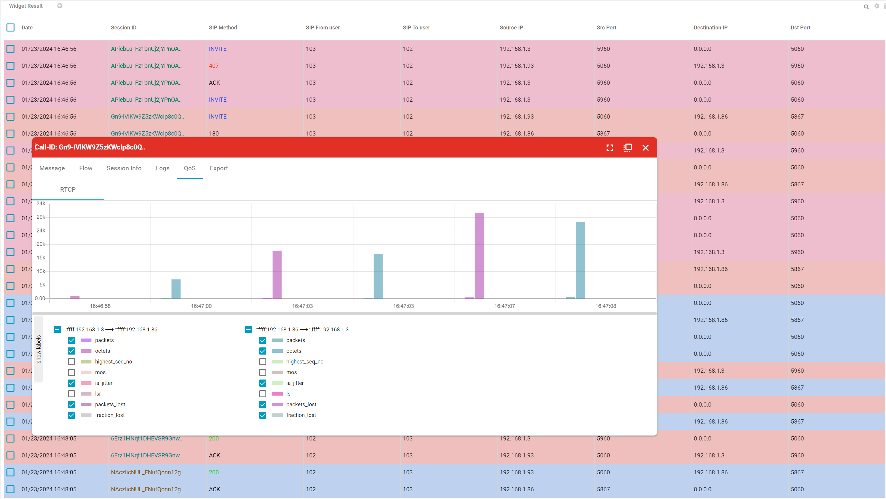

# Trace Server - A Better Way to Monitoring SIP Messages and QoS for PortSIP PBX


**Important**: Please note that the PortSIP Trace Server and PortSIP PBX should not be installed on the same server. Doing so may lead to undefined issues.


PortSIP has been building its SIP Trace Server based on the open-source project [HOMER](https://github.com/sipcapture/homer),  which provides key information in troubleshooting SIP Trunks, SIP endpoints, and other SIP related issues. It provides a place to:

* Access singularly to retrieve SIP and RTCP QoS captures via Web UI
* Centrally store SIP capture data across many hosts
* More intuitively filter SIP capture data and correlate the data to the dialog/transactions each request/response is part of (this is immensely useful!)
* Gracefully age dated capture data you don’t want to persist for very long (though persisting longer term can be configured very easily)
* The calls and RTCP data are beautifully displayed as charts.

## **Supported Linux OS**

* Ubuntu: 20.04, 22.04, 24.04
* Debian: 11.x, 12.x
* Only supports 64bit OS

## Preparing Linux Host Machine&#x20;

Since the Trace server usually takes large CPU and memory resources, we recommend below hardware specifications for the SIP Trace Server:

### Maximum of 200 simultaneous calls

* CPU: 2-4 cores
* Memory: 2G - 4G

### Maximum of 1,000 simultaneous calls

* CPU: 4 cores
* Memory: 4G

### Maximum of 5,000 simultaneous calls

* CPU: 8 - 10 cores
* Memory: 8G

### Maximum of 10,000 simultaneous calls

* CPU: 16 - 20 cores
* Memory: 16G


**Important**: Please note that the PortSIP Trace Server and PortSIP PBX should not be installed on the same server. Doing so may lead to undefined issues.


## Firewall Rules

The firewall and cloud platform security group must allow the ports listed below.

* Port 9061 on TCP
* Port 9080 on TCP
* Port 9060 on UDP

## Installing PortSIP Trace Server

* Ensure server date-time is synced correctly
* Must perform all Linux commands by the **root** user, please **su root** first

### **Download the Installation Scripts**

Perform the following commands to download the installation scripts.

```
mkdir -p /opt/portsip-trace && cd /opt/portsip-trace
curl https://raw.githubusercontent.com/portsip/portsip-pbx-sh/master/v16.x/new/install_docker.sh -o install_docker.sh
curl https://raw.githubusercontent.com/portsip/portsip-pbx-sh/master/v16.x/new/trace_ctl.sh -o trace_ctl.sh
```

### Install the Docker Environment

```
cd /opt/portsip-trace && /bin/sh install_docker.sh
```

### Run the PortSIP Trace Server

The command for running the PortSIP Trace Server with **default settings** is below:

```
cd /opt/portsip-trace && /bin/sh trace_ctl.sh run
```

We can specify the following parameters for specific usage.

* **-p**: Specify the folder path where the data will be stored, for example, `/opt/portsip/trace`. Please ensure that the path does not contain any spaces. The default path is /`var/lib/portsip`.
* **-k**: This option allows you to specify the number of days that the SIP message data will be stored. Any stored SIP message data will be automatically deleted if it exceeds the specified number of days. The default storage duration is 5 days.
* **-l**: Specify the listening port for the trace server on the web portal. The default port is set to 9080.
* **-z**: Specify the port for receiving the SIP messages sent from the PortSIP PBX. The default port is set to 9061.

The following example demonstrates how to run the PortSIP Trace Server.

In this example, the data is stored in the `/opt/portsip/trace` directory, the data is retained for **30** days, the web portal listens on port **12345**, and the server listens on port **23456** for receiving SIP messages.

```
cd /opt/portsip-trace && \
/bin/sh trace_ctl.sh run \
-p /opt/portsip/trace \
-k 30 \
-l 12345 \
-z 23456
```

After the PortSIP Trace Server is successfully installed, you can access the trace server Web Portal by the below URL:

`http://trace-server-ip:12345`

If you didn't use the `-l` parameter to specify the web portal port, then the URL should be:

`http://trace-server-ip:9080`



If you set up the trace server in the cloud platform, please create the firewall rule for TCP in the cloud platform for port 9080 or your specified port with the parameter -`l.`


The default username is `admin`, the password is `admin.`


Please change the default password for the admin after you sign in to the web portal.


## Enabling SIP Trace in the PortSIP PBX

Sign in to the PortSIP PBX Web Portal, click **Advanced** > **Settings**, on the **General** page, and fill out the trace server information as shown in the below screenshot:

<figure><figcaption></figcaption></figure>


Important: Enter with your actually trace server IP. If you used the **-z** parameter to specify a port other than the default 9061, you will also need to enter the actual port in the Trace Server Port field.


After successfully setting up the SIP trace server information and clicking the **OK** button, the PBX will send all SIP messages to the trace server.

## Disabling SIP Trace in the PortSIP PBX

Sign in to the PortSIP PBX Web Portal, click **Advanced** > **Settings**, on the **General** page, remove the information from the trace server fields, and click the **OK** button, the PortSIP PBX will stop to send the SIP message to the trace server.


Important: SIP Trace should be off most of the time and only enabled when troubleshooting is required since it will consume the hardware resource and reduce the PBX performance.


## Troubleshooting SIP Messages

On the SIP Trace Server Web Portal, you have the option to display either the registration messages or the call SIP messages. As shown in the screenshot below, select **Home** to view call messages and **REGISTRATION** to view REGISTER messages.

.png>)

You can view the details of a message by clicking on the method name, as shown in the screenshot below.

.png>)

There is the way for checking the **call-id**, **X-Session-Id**, and **X-CID** of the SIP message is as follows:

.png>)

The **call-id**, **X-Session-Id**, and **X-CID** can now be utilized to search for SIP messages. This feature enhances the ability to track and manage specific SIP messages effectively.

.png>)

.png>)

From the messages list, we can see the call flow by clicking the Session ID.

.png>)

.png>)

## Troubleshooting RTP

The trace server also supports monitoring the call QoS by logging the RTCP packets.&#x20;

By clicking on the **QoS** tab, you’ll be able to select and analyze the voice parameters of the call, such as **packets**, **octets**, **jitter**, **packets\_lost**, and so on.

<figure><figcaption></figcaption></figure>

## Managing Trace Server

You can use the following commands to manage the PortSIP Trace Server.

### Start Service

```
cd /opt/portsip-trace && /bin/sh trace_ctl.sh start
```

### Check Service Status

```
cd /opt/portsip-trace && /bin/sh trace_ctl.sh status
```

### Restart Service

```
cd /opt/portsip-trace && /bin/sh trace_ctl.sh restart
```

### Stop Service

```
cd /opt/portsip-trace && /bin/sh trace_ctl.sh stop
```

### Remove Service

```
cd /opt/portsip-trace && /bin/sh trace_ctl.sh rm
```

## Upgrade Version

Please follow the below steps to upgrade to the latest version.

### Stop Service

```
cd /opt/portsip-trace && /bin/sh trace_ctl.sh stop
```

### Remove Service

```
cd /opt/portsip-trace && /bin/sh trace_ctl.sh rm
```

Now follow the [Installating PortSIP Trace Server](debug-sip-message.md#installing-portsip-trace-server).

