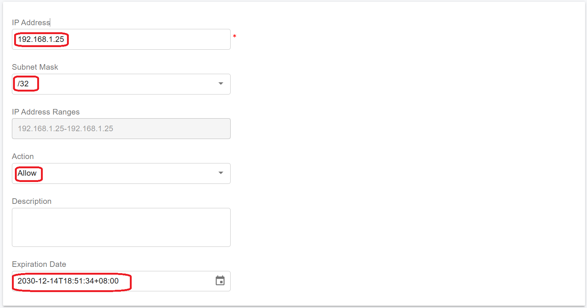

# Install PortSIP IM Server


The **IM server** (Instant Messaging server) installation is a separate step that is only required when installing **PortSIP PBX** in a **Linux environment**.

For Windows-based installations, the IM server is integrated within the main installation process and does not require separate setup.


Before proceeding with this guide, ensure that you have already completed **steps 1–4** of the [Install PortSIP PBX on Linux](../1-installation-of-the-portsip-pbx/installation-of-portsip-pbx-v22/install-portsip-pbx-on-linux.md).

You have two options for deploying the PortSIP IM Server:

1. **Same server as PortSIP PBX**: If you have a smaller number of users, you can install the IM Service on the same server as your PortSIP PBX. This setup is simpler but may not provide optimal performance for larger user bases.
2. **Separate server**: For better performance, especially when dealing with a large number of users who require chat and file-sharing capabilities, it is recommended to install the IM Server on a separate, more powerful server.


All commands must be executed in the **`/opt/portsip`** directory.


## Install IM Service on the Same Server as PortSIP PBX

Follow these steps to install the IM server on the same server as PortSIP PBX.

### Step 1: Generate Token for the IM Server

1. Log in as the **System Administrator** to the PortSIP PBX Web portal.
2. Navigate to **Servers > IM Servers**.
3. Select the default server and click the **Generate Token** button.
4. Copy the generated token.

<figure><figcaption></figcaption></figure>

### Step 2: Create and Run Instant Messaging Docker Instance

Follow these steps to create the IM service Docker instance:

1. Navigate to the **/opt/portsip** directory by running the following command:

```sh
cd /opt/portsip
```

2. Use the command below to create the Instant Messaging service Docker instance. Replace the placeholders with your actual values:

* **-p**: Specifies the path for storing the IM service data.
* **-i**: Specifies the PBX Docker image version.
* **-t**: Specifies the token generated in the previous step.


```sh
sudo /bin/sh im_ctl.sh run -p /var/lib/portsip/ -i portsip/pbx:22 \
-t OWMWYWJKZJYTMWM2NI0ZNZJMLWJJZDKTMGVMZDYXNZU1NWI1
```


If everything is set up correctly, the PBX web portal will display the IM server's IP address, as shown in the screenshot below.

<figure><figcaption></figcaption></figure>

The Instant Messaging (IM) server has been successfully installed. We can now proceed with the next steps in the [PortSIP PBX installation step 6](../1-installation-of-the-portsip-pbx/installation-of-portsip-pbx-v22/install-portsip-pbx-on-linux.md#step-6-reboot-to-apply-the-certificate).

## Install IM Service on a Separate Server

For optimal performance, it’s recommended to install the IM service on a separate server, especially when handling a large number of users for chat and file-sharing activities (including files and pictures). The following hardware specifications are suitable for supporting up to 50,000 users online, with messaging and file sharing:

* **CPU**: 20 cores or higher
* **Memory**: 16 GB
* **Disk**: High I/O performance required (SSD recommended, at least 256 GB)
* **Network Bandwidth**: 1000 Mbps or higher, particularly if handling high volumes of messages and file sharing.
* **Static private IP**: You must configure a static private IP for this IM server. In this case, we assume it's **192.168.1.25.**
* **Static public IP:** If your PBX and IM server are located in the cloud for the internet users to access, you must have a static public IP for this IM service. In this case, we assume it's **104.18.36.110.**

### **Supported Linux OS** <a href="#supported-linux-os" id="supported-linux-os"></a>

It only supports 64-bit OS.

* Ubuntu 22.04, 24.04
* Debian 11.x, 12.x

For this setup, we assume the **PortSIP PBX** is installed on a server:

* PBX Server static private IP address: **192.168.1.20**
* PBX Server static public IP address: **104.18.36.119**.

### Step 1: **Preparing the Linux server for IM Installation**

Tasks that MUST be completed before installing cluster servers.

* **Ensure the server date-time is synced correctly**.
* If the Linux server is on a LAN, assign a **static private IP** address, in this case, **192.168.1.25**.
* Assign/route the static public IP address to this server, in this case, **104.18.36.110.**
* Install all available updates and service packs before installing the cluster server.
* Do not install PostgreSQL on the server.
* Ensure that all power-saving options for your system and network adapters are disabled (by setting the system to High-Performance mode).
* Do not install TeamViewer, VPN, or similar software on the host machine.
* The server must not be installed as a DNS or DHCP server.


If your Instant Messaging (IM) server is hosted in the cloud (e.g., AWS), you must ensure that TCP port 8887 is open in the cloud firewall rules. The client application requires access to this port in order to send and receive messages.


### Step 2: Configure the Firewall on the PBX Server <a href="#configure-the-firewall" id="configure-the-firewall"></a>

To allow the separate Instant Messaging server (IP: **192.168.1.25**) to access the PBX server (IP: **192.168.1.20**), it is necessary to create appropriate firewall rules on the PBX server.

Please execute the following commands on the **PBX server** (IP: **192.168.1.20**) to configure these firewall rules.

```sh
sudo firewall-cmd --permanent --zone=trusted --add-source=192.168.1.25
sudo firewall-cmd --reload
```

To verify that the rule has been created correctly, you can use the following command:

```sh
sudo firewall-cmd --zone=trusted --list-all
```

The correct output should be like the following:

```sh
[ubuntu@localhost ~]$ sudo firewall-cmd --zone=trusted --list-all
trusted (active)
  target: ACCEPT
  icmp-block-inversion: no
  interfaces: 
  sources: 192.168.1.25
  services: 
  ports: 
  protocols: 
  forward: yes
  masquerade: no
  forward-ports: 
  source-ports: 
  icmp-blocks: 
  rich rules:
```

### Step 3: Configuring the IP Address Whitelist <a href="#configuring-the-ip-address-whitelist" id="configuring-the-ip-address-whitelist"></a>

This step is mandatory; the service will not function without it.&#x20;

To prevent the PBX from restricting the request rate to the IM servers, you must add the IM servers' IP addresses to the PBX whitelist. Follow the steps below to complete this process:

1. Sign in to the PBX web portal as the System Administrator
2. Select the menu **IP Blacklist** > **Add**.
3. Enter the IM server IP as shown in the screenshot below and choose a long **expiration date.**

<figure><figcaption></figcaption></figure>

### Step 4: Configure Cloud Firewall or Network Security Rules

> _Skip this step if you are not deploying the PBX and IM server on a cloud platform such as AWS, Azure, or Google Cloud (GCE)._

If your PBX and IM server are hosted on a cloud platform (e.g., AWS, Azure, or GCE), you must configure the necessary firewall or network security rules to allow communication between them.

In your cloud platform, create a firewall or network security rule that permits **all TCP traffic** from the **IM server IP address to the PBX server**. This ensures proper connectivity between the services for messaging and signaling.

> ⚠️ **Note:** Make sure this rule is restricted to the internal IP range of your deployment to maintain security.

### Step 5: Generate Token for the IM Server

1. Log in as the **System Administrator** to the PortSIP PBX Web portal.
2. Navigate to **Servers > IM Servers**.
3. Select the default server and click the **Generate Token** button.
4. Copy the generated token.

<figure><figcaption></figcaption></figure>

### **Step 6: Create and Run Instant Messaging Docker Instance**


All commands must be executed in the **`/opt/portsip`** directory.


Perform the below commands to download the installation scripts and initialize the environment:

```sh
mkdir -p /opt/portsip
```

```sh
sudo curl \
https://raw.githubusercontent.com/portsip/portsip-pbx-sh/master/v22.x/init.sh  \
-o  init.sh
```

```sh
sudo /bin/sh init.sh
```

Execute the below command to install the `Docker-Compose` environment. If you get the prompt likes`*** cloud.cfg (Y/I/N/O/D/Z) [default=N] ?`, enter the **Y** and then press the **Enter** button.

```sh
cd /opt/portsip
```

```sh
sudo /bin/sh install_docker.sh
```

Use the following command to create the Instant Messaging (IM) service Docker instance on the IM server (IP **192.168.1.25)**. Replace each parameter with your actual values:

* **-E**: Specifies that the IM server is installed in extended mode (required).
* **-p**: Specifies the path for storing IM service data (required).
* **-a**: Specifies the private IP address of this IM server. If this parameter is omitted, the **-A** parameter must be specified.
* **-A**: Specifies the public IP address of this IM server. If this parameter is omitted, the **-a** parameter must be specified. If you install the IM server on a **separate server in the cloud, this parameter must be specified**. Otherwise, it can be ignored. In this case is **104.18.36.110**.
* **-i**: Specifies the PBX Docker image version (required).
* **-x**: Indicates the main PBX server's IP address (typically the private IP of the main PBX server) (required).&#x20;


If the PBX is deployed in High Availability (HA) mode, you must enter the **Virtual IP of the PBX** for this parameter.


* **-t**: Provides the token generated and copied in the previous step (required).
* **-f**: Specifies the path for storing files sent in chats (optional). This path **must differ** from the one specified with **-p**. If this parameter is omitted, chat files will be stored in the path specified by **-p.**

```sh
sudo /bin/sh im_ctl.sh run -E \
-p /var/lib/portsip/ \
-a 192.168.1.25 \
-A 104.18.36.110 \
-i portsip/pbx:22 \
-x 192.168.1.20 \
-t OWMWYWJKZJYTMWM2NI0ZNZJMLWJJZDKTMGVMZDYXNZU1NWI1
```

For example, if you want to store the chat files to the path `/chat/files`, please ensure this path is already existing, then use the below command (please pay attention to the **-f** parameter.) to create the Instant Messaging (IM) service Docker instance on the IM server (IP **192.168.1.25)**. Replace each parameter with your actual values:

```sh
sudo /bin/sh im_ctl.sh run -E \
-p /var/lib/portsip/ \
-f /chat/files/ \
-a 192.168.1.25 \
-A 104.18.36.110 \
-i portsip/pbx:22 \
-x 192.168.1.20 \
-t OWMWYWJKZJYTMWM2NI0ZNZJMLWJJZDKTMGVMZDYXNZU1NWI1
```

Perform the below commands to restart the IM service (**please ensure the PBX service on another server is started**).

```sh
cd /opt/portsip
sudo /bin/sh im_ctl.sh restart
```

If everything is set up correctly, the PBX web portal will display the IM server's IP address, as shown in the screenshot below.

<figure><figcaption></figcaption></figure>


If your Instant Messaging (IM) server is hosted in the cloud (e.g., AWS), you must ensure that TCP port 8887 is open in the cloud firewall rules. The client application requires access to this port in order to send and receive messages.


The Instant Messaging (IM) server has been successfully installed. We can now proceed with the next steps in the [PortSIP PBX installation step 6](../1-installation-of-the-portsip-pbx/installation-of-portsip-pbx-v22/install-portsip-pbx-on-linux.md#step-6-reboot-to-apply-the-certificate).

