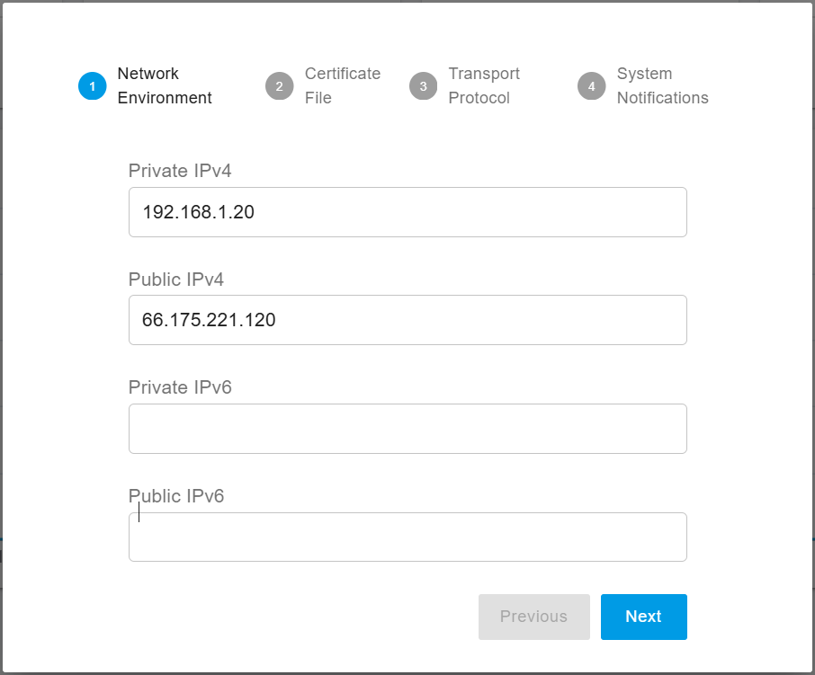

# Install PortSIP PBX

### Attention


This guide is for v22.3.x beta version only.


### Upgrading

This guide is just for installing a **fresh** PortSIP PBX version 22.3.x Beta, you can't upgrade your currently installed previous version to this beta.

### Minimal Hardware Requirements

* CPU: 2 cores
* Memory: 4 GB
* Disk: 50 GB

With this configuration, the PBX can support up to 1,000 online users and handle 300\~500 simultaneous calls.

### Supported OS

* Ubuntu 22.04, 24.04
* Debian 11.x, 12.x

### Preparing the Server for Installation

Tasks that MUST be completed before installing PortSIP PBX

* **Ensure the server date-time is synced correctly**.
* Use the `sudo` to perform the installation is recommended.&#x20;
* Ensure the Linux OS maximum open file limit has been adjusted to a large number, such as 65535, 100000.
* If the server on which PBX will be installed is located on a LAN, assign a _**static private IP address**_ to the PBX server; if it's on a public network, assign a _**static public IP address**_ and a _**static private IP**_ to the PBX server.&#x20;
* Install all available updates and service packs before installing PortSIP PBX.
* Do not install **PostgreSQL** on your PortSIP PBX Server.
* Ensure that all power-saving options for your system and network adapters are disabled (by setting the system to High-Performance mode).
* Do not install TeamViewer, VPN, or other similar software on the host machine.
* The PortSIP PBX must not be installed on a host that is a DNS or DHCP server.
* The following ports must be permitted by your firewall.
  * UDP: 5060, 5066, 25000-34999, 45000–65000
  * TCP: 5061, 5063, 5065, 5067, 8882, 8883, 8887, 8888, 8889, 10443. Please also ensure the above ports have not been used by other applications.


If the PBX runs on a cloud platform such as AWS and the cloud platform has its firewall, you **must** also open the ports on the cloud platform's firewall as well.


### Installing PortSIP PBX

#### Step 1: Download Installation Scripts


All commands must be executed in the **`/opt/portsip`** directory.


Perform the commands below to download the installation scripts and initialize the environment:

```sh
mkdir /opt/portsip
```


```shell
sudo curl \
https://raw.githubusercontent.com/portsip/portsip-pbx-sh/master/v22.3/init.sh  \
-o  init.sh
```


```shell
sudo /bin/sh init.sh
```

#### Step 2: Set up Docker Environment

Execute the below command to install the `Docker-Compose` environment. If you get the prompt likes`*** cloud.cfg (Y/I/N/O/D/Z) [default=N] ?`, enter the **Y** and then press the **Enter** button.

```sh
cd /opt/portsip
```

<pre class="language-shell"><code class="lang-shell"><strong>sudo /bin/sh install_docker.sh
</strong></code></pre>

#### Step 3: Create and Run PBX Docker Instance

The following command is used to create and run the PBX on a server with the public IP address **66.175.221.120**.&#x20;

If you are running the PBX on a local area network (LAN) without a public IP address, simply replace **66.175.221.120** with the PBX server’s private LAN IP address.


If your PBX server has a public IP, you must use it in the command below for the `-a` parameter. If not, the PBX won’t work with the internet trunk and internet users.


```shell
sudo /bin/sh pbx_ctl.sh \
run -p /var/lib/portsip \
-a 66.175.221.120 \
-i portsip/pbx:22
```

In the above command, we can specify the following parameters.

* **-p**: Specifies the path for storing PBX data.
* **-a**: Specifies the PBX server's IP address.
* **-i**: Specifies the PBX Docker image version.
* **-f:** Specifies the path for storing the recording files, it's optional.

The **-f** parameter is optional and allows you to specify a separate path for storing recording files. If this parameter is not specified, the recording files will be stored in the path defined by the **-p** parameter.

For example, if you mount a device or an external NAS device to **`/pbx/recordings`** and want to store the recording files there, you can create and run the PBX Docker instance using the following command:

```sh
sudo /bin/sh pbx_ctl.sh \
run -p /var/lib/portsip \
-a 66.175.221.120 \
-i portsip/pbx:22 \
-f /pbx/recordings
```

After successfully installing the PortSIP PBX, you can access the PBX web portal by visiting: [**https://66.175.221.120:8887**](https://66.175.221.120:8887)

The default system administrator username and password are both **admin**.

#### Step 4: Configure the PortSIP PBX

Once the PortSIP PBX is successfully installed, you can access the web portal by opening your browser and navigating to [**https://66.175.221.120:8887**](https://66.175.221.120:8887). If your browser displays an SSL certificate warning, you can safely ignore it and continue. You will then be directed to the login page, as shown in the screenshot below.

<figure><figcaption></figcaption></figure>

Click on **"Sign in as the administrator or dealer"** to navigate to the administrator login page, as shown in the screenshot below. Enter **admin** as both the username and password to log in to the web portal.

<figure><figcaption></figcaption></figure>


Please change the admin's default password after you log in.


After successfully logging into the PBX Web Portal, with a new installation, the PBX will launch a setup wizard automatically to guide you through completing the mandatory settings.

**1. Network Environment**

* **Private IPv4 Address**\
  You must enter the server's private IPv4 address. If the server does not have a private IP, use the public IP address instead.
* **Public IPv4 Address**\
  If the PBX server has a static public IP address, enter it in the **Public IPv4** field. If the server does not have a static public IP, leave this field blank.

These IP addresses must be accessible to your SIP clients, as the IP entered here will function as the SIP server IP address for the PBX. This is crucial when a SIP client or IP phone registers to PortSIP PBX, and should be configured as the **Outbound Proxy Server**.

* **Cloud Deployment:**\
  If the PBX is deployed in the cloud, both **Private IPv4** and **Public IPv4** addresses must be entered.
* **LAN Deployment:**\
  If the PBX is on a local network (LAN), only the **Private IPv4** address is required.


The loopback interface (127.0.0.1) is unacceptable for the private IP. Only the static IP for the LAN where the PBX is located is allowed (do not use DHCP dynamic IP).&#x20;


<figure><figcaption></figcaption></figure>

**2. SSL Certificate**

To enable **TLS** transport for SIP and secure **HTTPS** access to the Web Portal and REST API, a trusted SSL certificate must be uploaded during this step.

* **Domain Setup:**\
  You will need a web domain. For example, you can purchase a domain from providers like GoDaddy and point it to your PBX’s IP address.
* **SSL Certificate:**\
  A trusted SSL certificate is necessary to avoid browser warnings. Recommended certificate providers include **DigiCert**, **GeoTrust**, **GoDaddy**, and others.
  * If you do not have a domain or SSL certificate, you can use your PBX’s IP address as the **Web Domain** and proceed with the default certificate. However, please note that PortSIP PBX uses a self-signed certificate by default, which will trigger browsers to block the connection and display a security warning.
* **Certificate Providers:**\
  To purchase an SSL certificate, follow the guide: [Preparing TLS Certificates for TLS/HTTPS/WebRTC](../certificates-for-tls-https-webrtc/).

You will have two certificate files if complete the steps in the guide: [Preparing TLS Certificates for TLS/HTTPS/WebRTC](../certificates-for-tls-https-webrtc/).

* **portsip.key**
* **portsip.pem**

**Configuring the Certificates**

In this guide, we assuming use the domain **uc.portsip.cc** for the PBX web domain.

1. In the **Web Domain** field, enter **uc.portsip.cc**.
2. Open the **portsip.pem** file in a text editor (such as Windows Notepad), and copy the entire contents into the **Certificate File** field.
3. Similarly, open the **portsip.key** file, and copy its entire contents into the **Private Key File** field.

<figure><figcaption></figcaption></figure>

**3. Transport Protocol**

You can configure the transport layer protocol for SIP signaling by clicking the **Add** button. The default transport ports are as follows:

* **UDP**: 5060
* **TCP**: 5063
* **TLS**: 5061

You are free to change these default ports to any preferred value but ensure that the new port is not already in use by other applications.


After adding a new transport protocol, be sure to update your firewall rules to allow traffic on the newly assigned transport port. The IP Phone and client app will use this transport and port to connect to the PBX.


<figure><figcaption></figcaption></figure>

#### Step 5: Install Instant Messaging Service

Starting with version 22.0, PortSIP PBX introduces an Instant Messaging (IM) service, offering modern features such as group chat. The IM service requires a separate installation step, as in some cases, you may also want to deploy it on a separate server for optimal performance.

Please follow the article [Install PortSIP IM Server ](install-portsip-im-server.md)to install the PortSIP IM service for the PBX.

#### Step 6: Reboot to Apply the Certificate

Once **Step 5** is complete&#x64;**,** if you uploaded a trusted SSL certificate in **Step 2: SSL Certificate** instead of using the default self-signed certificate, you need to restart the PBX to apply the changes. Use the following commands to reboot the PBX:

```sh
cd /opt/portsip
sudo /bin/sh pbx_ctl.sh restart
sudo /bin/sh im_ctl.sh restart
```

Now that the PortSIP PBX is successfully installed, you can use [https://uc.portsip.cc:8887](https://uc.portsip.cc:8887) to access the PortSIP PBX web portal.

#### Managing PortSIP PBX Docker Instance

After successfully installing the PortSIP PBX, you can use the following commands to manage the PortSIP PBX Docker instance.

```sh
cd /opt/portsip
```

#### Show the PBX Docker Instance Status

<pre class="language-sh"><code class="lang-sh"><strong>sudo /bin/sh pbx_ctl.sh status
</strong></code></pre>

#### Start the PBX Docker Instance

```bash
sudo /bin/sh pbx_ctl.sh start
```

#### Stop the PBX Docker Instance

```bash
sudo /bin/sh pbx_ctl.sh stop
```

#### Restart the PBX Docker Instance

```bash
sudo /bin/sh pbx_ctl.sh restart
```

#### Delete the PBX Docker Instance

This command will not delete the data of the PBX.

<pre class="language-bash"><code class="lang-bash"><strong>sudo /bin/sh pbx_ctl.sh rm
</strong></code></pre>

### Managing PortSIP IM Service Docker Instance

First, you will need to at the `/opt/portsip` folder, then you can use the following commands to manage the PortSIP IM Service Docker instance.

```sh
cd /opt/portsip
```

#### Show the IM Service Docker Instance Status

<pre class="language-sh"><code class="lang-sh"><strong>sudo /bin/sh im_ctl.sh status
</strong></code></pre>

#### Start the IM Service Docker Instance

```bash
sudo /bin/sh im_ctl.sh start
```

#### Stop the IM Service Docker Instance

```bash
sudo /bin/sh im_ctl.sh stop
```

#### Restart the IM Service Docker Instance

```bash
sudo /bin/sh im_ctl.sh restart
```

#### Delete the IM Service Docker Instance

This command will not delete the data of the PBX.

<pre class="language-bash"><code class="lang-bash"><strong>sudo /bin/sh im_ctl.sh rm
</strong></code></pre>

