# Google Workspace Integration

PortSIP PBX integrates with **Google Workspace** to provide the following capability:

* Send email notifications through Google Workspace using **OAuth authentication**

Since Google has discontinued support for [“Less secure apps”](https://support.google.com/accounts/answer/6010255?hl=en) for sending emails from third-party applications, you must configure Google Workspace integration with PortSIP PBX to allow the PBX to use Gmail for sending email notifications securely.

### Prerequisites

Before configuring Google Workspace integration, ensure the following requirements are met:

* **PortSIP PBX** is running on a **static public IP address**
* A configured **web domain (FQDN)** for the PBX with a **valid SSL certificate**
  * The certificate must be issued by a trusted Certificate Authority (CA), such as DigiCert, Thawte, or GoDaddy
  * Refer to the [SSL certificate configuration guide for detailed instructions](../certificates-for-tls-https-webrtc/)
* The PBX **System Administrator** or **Tenant Administrator** must have a **Google account**, either:
  * A Google Workspace account, or
  * A standard Google account
* You must **enable 2FA** with your Google account. Please see the screenshot below

<figure><figcaption></figcaption></figure>

Once these prerequisites are satisfied, you can proceed with configuring Google Workspace OAuth access for email notifications.

***

### Configuring Settings on the Google Side

Follow the steps below to configure Google integration for PortSIP PBX.

#### Creating a Web App in Your Google Account

1. Sign in to your Google account and open the [Google Cloud Console](https://console.cloud.google.com/home/dashboard).
2. Click **CREATE PROJECT** to create a new project.

<figure><figcaption></figcaption></figure>

3. Enter a **Project name**.
4. Select an **Organization** and **Location** from the drop-down lists. If you are using a standard Gmail account, you can select **No organization**.
5. Click **Create** to proceed.

<figure>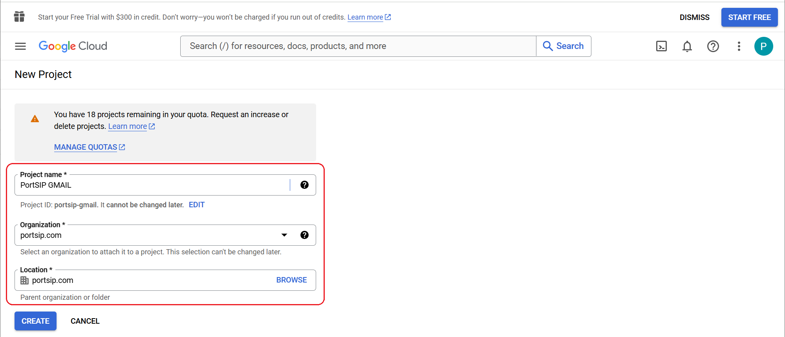<figcaption></figcaption></figure>

***

#### Enabling the Gmail API

To allow PortSIP PBX to send emails via Google Workspace, you must enable the Gmail API for the project.

1. In the Google Cloud Console, open **APIs & Services > Library**.
2. In the search bar, enter **Gmail API**.
3. Click the **Gmail API** result.
4. On the Gmail API page, click **ENABLE**.

<figure><figcaption></figcaption></figure>

***

### Creating Your Application’s Credentials

After enabling the Gmail API, you will be redirected to the **Gmail API Overview** page.

1. Click **CREATE CREDENTIALS**.

<figure>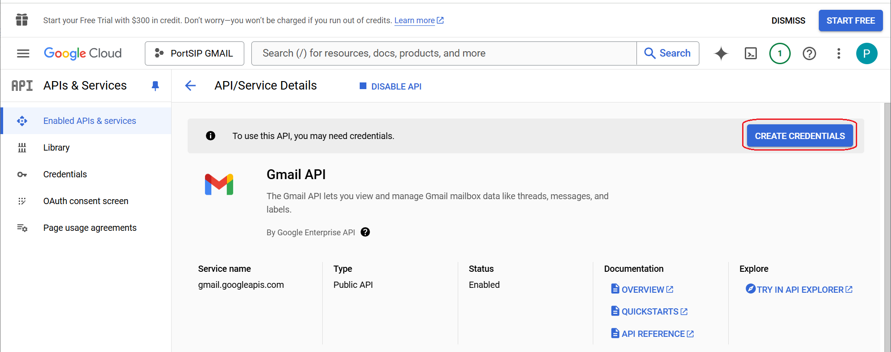<figcaption></figcaption></figure>

2. On the next page, Google will ask a few questions to determine the required credential type.
3. From the **Select an API** drop-down list, choose **Gmail API**.

**Note:** If the Gmail API does not appear in the list, ensure that the Gmail API has been enabled for your project.

4. Under **What data will you be accessing?**, select the **User data** option.&#x20;
5. Click **NEXT** to continue.

<figure>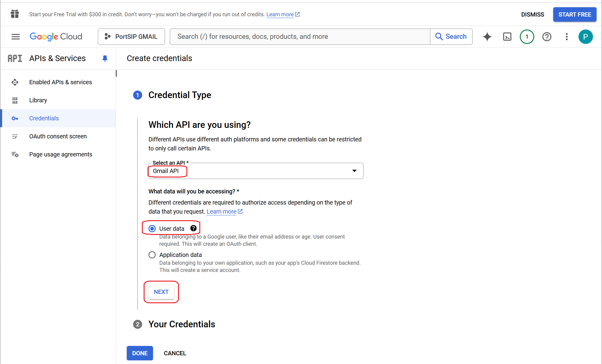<figcaption></figcaption></figure>

***

### Configuring Your OAuth Consent Screen

Google will prompt you to provide basic information about your application. Although this setup is typically for personal or internal use, several fields are required:

* **App name**\
  Enter a name for your application, for example, _PortSIP PBX App_.
* **User support email**\
  Select your email address from the available options.
* **App logo** _(optional)_\
  Upload a logo for your application if desired.
* **Developer contact information**\
  Enter your email address in the **Email addresses** field.

After completing the required fields, click **SAVE AND CONTINUE** to proceed to the next step.

<figure>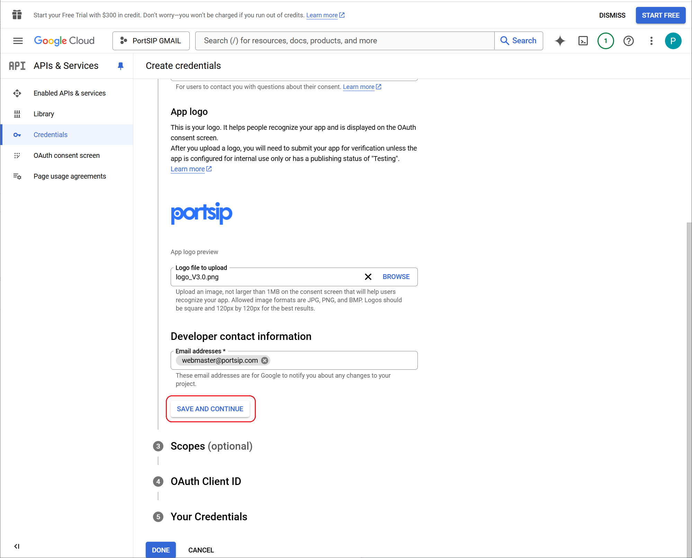<figcaption></figcaption></figure>

***

### Setting Up Your OAuth Client ID

1. Sign in to the PortSIP PBX Web Portal.
2. Navigate to **Integrations > Google Workspace**.
3. Copy the **Authorized Redirect URI** displayed on the page.

If you have set up the **PortSIP SBC** with the PortSIP PBX, there will be **two Authorized Redirect URIs**. Make sure to copy **both** URIs, as they will be required in the Google OAuth configuration.

<figure>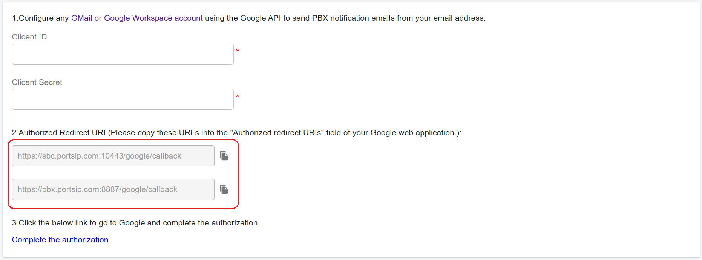<figcaption></figcaption></figure>

Next, provide the required details for your OAuth Client ID in the Google Cloud Console:

4. From the **Application type** dropdown, select **Web application**. Additional fields will be displayed automatically.
5. In the **Name** field, enter a descriptive name, for example **PortSIP PBX Web Portal**.

<figure>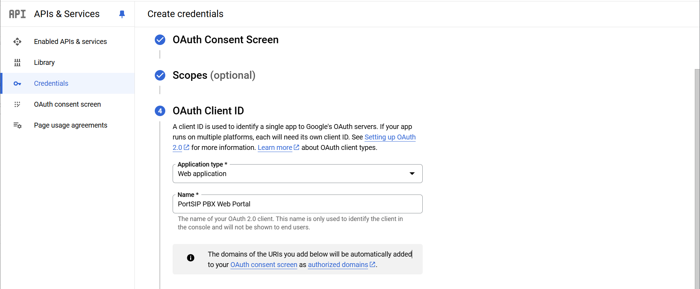<figcaption></figcaption></figure>

Next, skip the **Authorized JavaScript origins** section and scroll down to **Authorized redirect URIs**.

6. Click **+ ADD URI**.
7. Paste the **Authorized Redirect URI** copied from the PortSIP PBX Web Portal.
8. If the PortSIP PBX provides two redirect URIs, make sure to add **both** URIs.

<figure>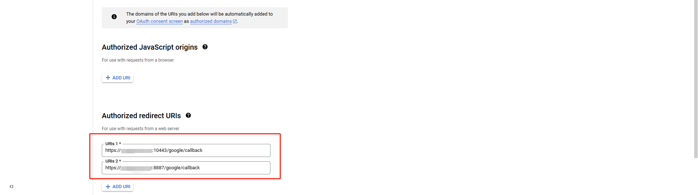<figcaption></figcaption></figure>

Click **CREATE** to complete this step.

Once the application is created, the **Your Credentials** section will expand and display the **Client ID**. You don’t need to copy it at this stage, as it will be accessed from another section in a later step.

Finally, click **DONE** at the bottom of the page to finish the process.

<figure>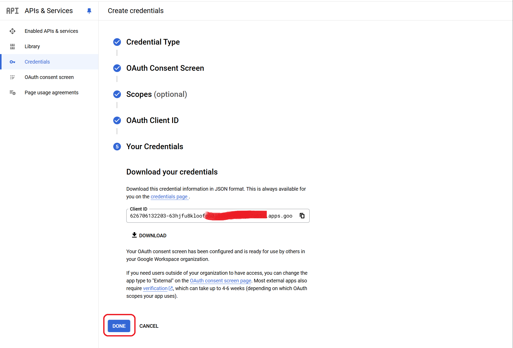<figcaption></figcaption></figure>

***

### Updating the Publishing Status from Testing to Production

By default, Google places newly created apps in **Internal** mode. It is essential to switch the app to **External** mode and publish it; otherwise, the application will be heavily restricted and will not function correctly with Google Workspace integration.

#### For Google Workspace Users

1. In the Google Cloud Console, navigate to **APIs & Services > OAuth consent screen**.
2. Under **User type**, click **MAKE EXTERNAL**.

<figure>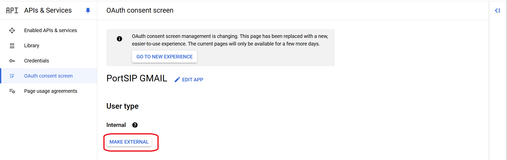<figcaption></figcaption></figure>

3. In the pop-up window, select **In production**.
4. Click **CONFIRM** to apply the change.

<figure>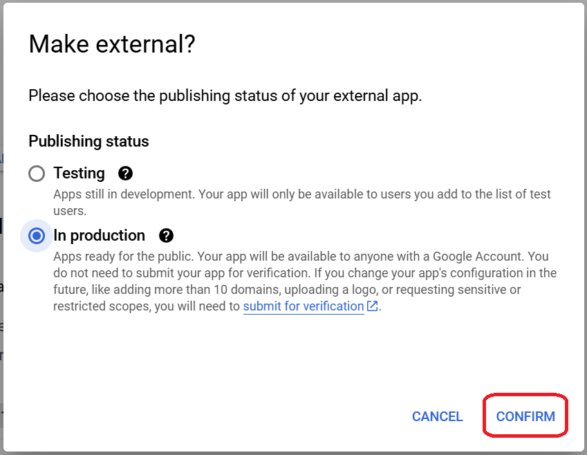<figcaption></figcaption></figure>

***

#### Gmail Users

If you are not using Google Workspace, you will not see the **MAKE EXTERNAL** option. Instead, you need to publish your Google app manually.

1. In the Google Cloud Console, navigate to **APIs & Services > OAuth consent screen**.
2. Under **Publishing status**, you will see the app status set to **Testing**.
3. Click **PUBLISH APP** to change the status.

<figure>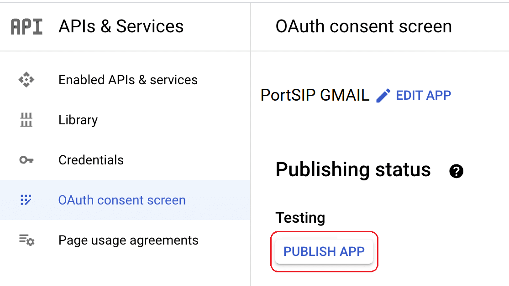<figcaption></figcaption></figure>

4. In the confirmation dialog that appears, click **CONFIRM** to publish the app.

After publishing, the app will be available for production use and can be used by PortSIP PBX to send email notifications through Gmail.

<figure>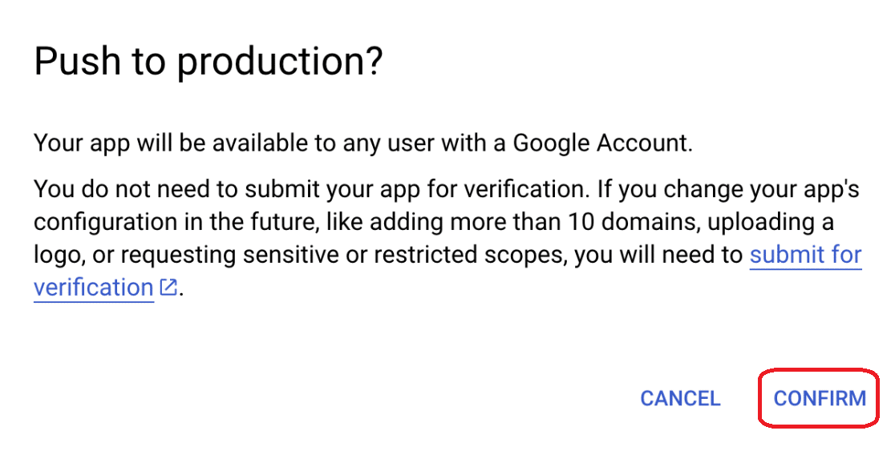<figcaption></figcaption></figure>

***

### Granting Google / Gmail Permissions

1. In the Google Cloud Console, click **Credentials** in the left-hand menu to open the **Credentials** page.
2. Under the **OAuth 2.0 Client IDs** section, locate the web application you just created.
3. Click the application name to view its details.

<figure>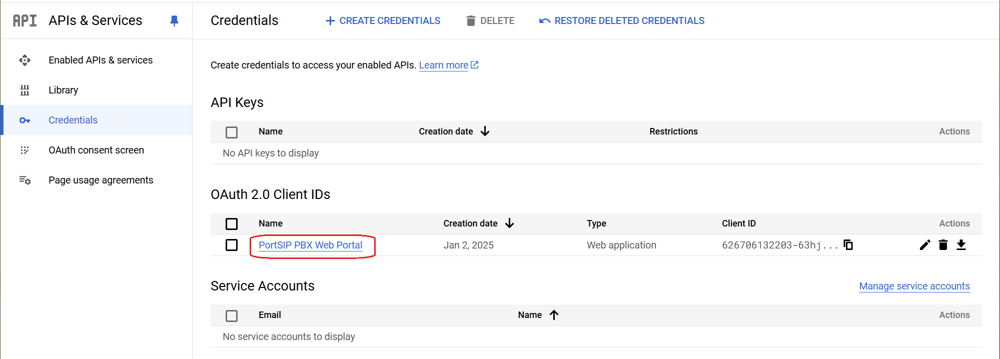<figcaption></figcaption></figure>

4. On the application details page, copy both the **Client ID** and **Client Secret**.

<figure>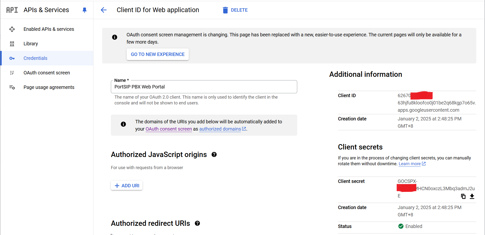<figcaption></figcaption></figure>

5. Sign in to the **PortSIP PBX Web Portal** and navigate to **Integrations > Google Workspace**.
6. Paste the **Client ID** and **Client Secret** into the corresponding fields.
7. Click **OK** to save the settings.

<figure>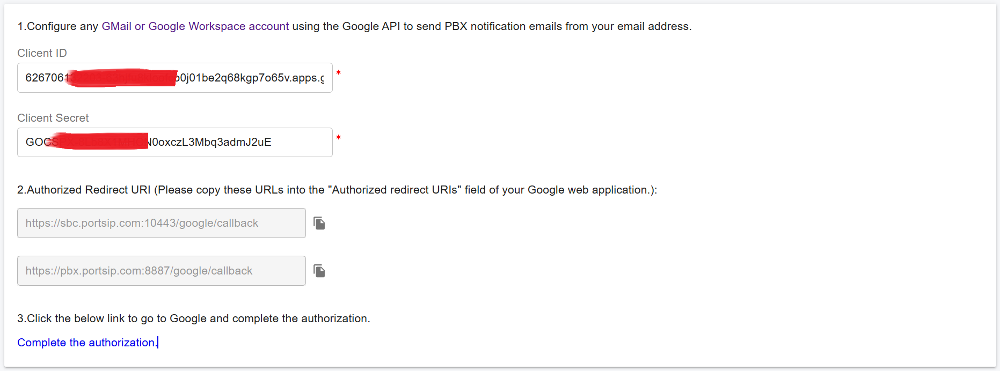<figcaption></figcaption></figure>

8. After saving, click the **Complete the authorization** hyperlink. You will be redirected to Google to complete the OAuth authorization process.

<figure>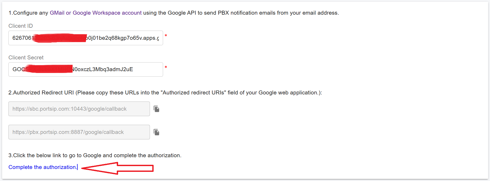<figcaption></figcaption></figure>

9. Once authorization is complete, the Google Workspace integration is successfully configured. You can now use OAuth to send email notifications from PortSIP PBX through the Google Mail service.

