# Google Workspace Integration

PortSIP PBX integrates with **Google Workspace** to provide the following capabilities:

* **User synchronization** from Microsoft 365 or Microsoft Entra ID (including on-premises Active Directory synchronized to the cloud using Azure AD Connect)
* **Single Sign-On (SSO)**, allowing users to sign in to the PortSIP PBX Web Portal and PortSIP ONE app using their Microsoft account
* Send email notifications through Google Workspace using **OAuth authentication**

> **Notice**
>
> Since Google has discontinued support for [“Less secure apps”](https://support.google.com/accounts/answer/6010255?hl=en) for sending emails from third-party applications, you must configure Google Workspace integration with PortSIP PBX to allow the PBX to use Gmail for sending email notifications securely.

***

### Prerequisites

Before configuring Google Workspace integration, ensure the following requirements are met:

* **PortSIP PBX** is running on a **static public IP address**
* A configured **web domain (FQDN)** for the PBX with a **valid SSL certificate**
  * The certificate must be issued by a trusted Certificate Authority (CA), such as DigiCert, Thawte, or GoDaddy
  * Refer to the [SSL certificate configuration guide for detailed instructions](../certificates-for-tls-https-webrtc/)
* The PBX **System Administrator** or **Tenant Administrator** must have a **Google account**:
  * A Google Workspace account
* You must **enable 2FA** with your Google account. Please see the screenshot below

<figure>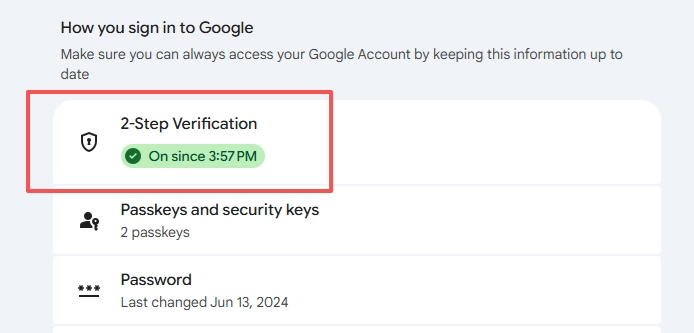<figcaption></figcaption></figure>

Once these prerequisites are satisfied, you can proceed with configuring Google Workspace integration.

***

### User Sync

PortSIP PBX supports integration with Google Workspace at both the **System Admin** level and the **Tenant** level. The available features depend on where the integration is configured.

#### Google Workspace Integration at the System Admin Level

When Google Workspace integration is configured at the **System Admin** level:

* The PBX can use **Gmail** to send system email notifications (such as voicemail alerts, password reset emails, and system notifications).
* The Gmail sending capability can be shared with tenants.

> **Important**
>
> When configured at the System Admin level, the integration provides **email delivery only**.\
> User synchronization (syncing Google users into the PBX) is **not available** at this level.

#### Google Workspace Integration at the Tenant Level

When Google Workspace integration is configured at the **Tenant** level:

In addition to using Gmail for email notifications, you can:

* Synchronize Google Workspace users into the PBX.
* Automatically create PBX extension users based on Google Workspace accounts.
* SSO for PBX Web portal and PortSIP ONE app login

***

### Collect Authorized Redirect URI

1. Sign in to the PortSIP PBX Web Portal.
2. Navigate to **Integrations > Google Workspace**.
3. Locate the **Authorized Redirect URI**.
4. Copy the URI exactly as displayed and save it.

If you have deployed **PortSIP SBC** with the PBX, two Authorized Redirect URIs will be shown. Copy **both URIs**, as they must be added to the Google OAuth configuration.

**Note:** The redirect URI must match exactly in Google OAuth settings, or authentication will fail.

<figure>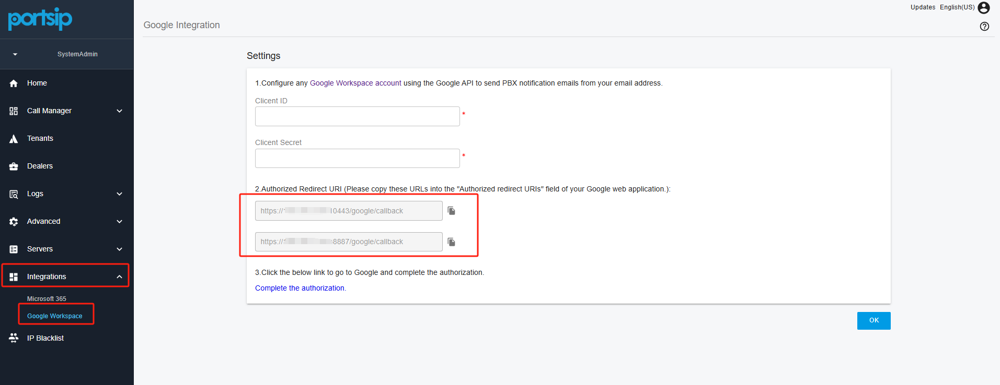<figcaption></figcaption></figure>

***

### Configure Settings in Google Cloud

Follow the steps below to configure Google integration for PortSIP PBX.

#### Create a Project in Google Cloud

1. Sign in to your Google account and open the [Google Cloud Console](https://console.cloud.google.com/home/dashboard).
2. Click **Create Project**.

<figure>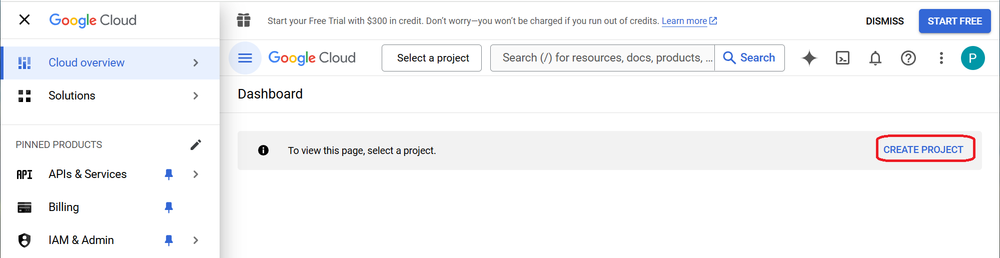<figcaption></figcaption></figure>

3. Enter a **Project Name**.
4. Click **Create**.

After the project is created, you can proceed with configuring OAuth credentials for PortSIP PBX.

<figure>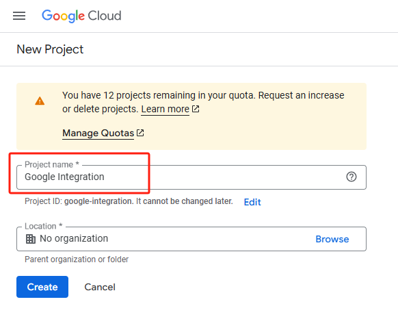<figcaption></figcaption></figure>

***

#### Enabling the Gmail API

To allow PortSIP PBX to send emails via Google Workspace, you must enable the Gmail API for the project.

1. In the Google Cloud Console, open **APIs & Services > Library**.
2. In the search bar, enter **Gmail API**.
3. Click the **Gmail API** result.
4. On the Gmail API page, click **ENABLE**.

<figure>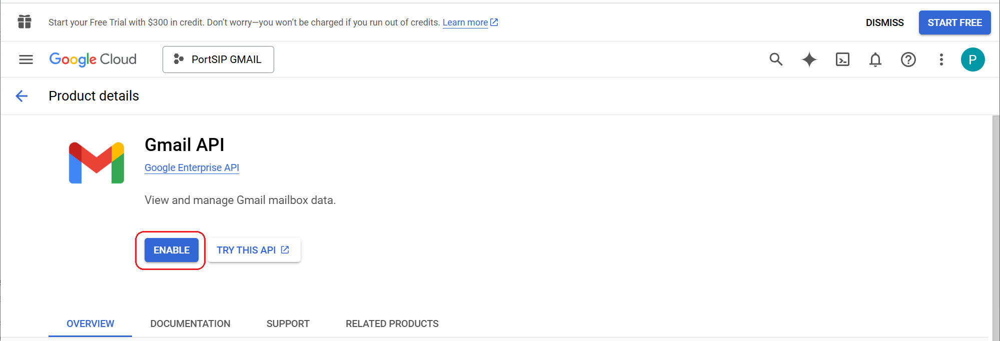<figcaption></figcaption></figure>

***

#### Enabling Admin SDK API and Google People API

To enable Google Workspace SSO and user sync, you need to enable the Admin SDK API and People API.

1. In the Google Cloud Console, open **APIs & Services > Library**.
2. In the search bar, enter **Admin SDK API**
3. Click the **Admin SDK API** result.
4. On the **Admin SDK API** page, click **ENABLE**.
5. Repeat the steps for enabling the **People API**

<figure>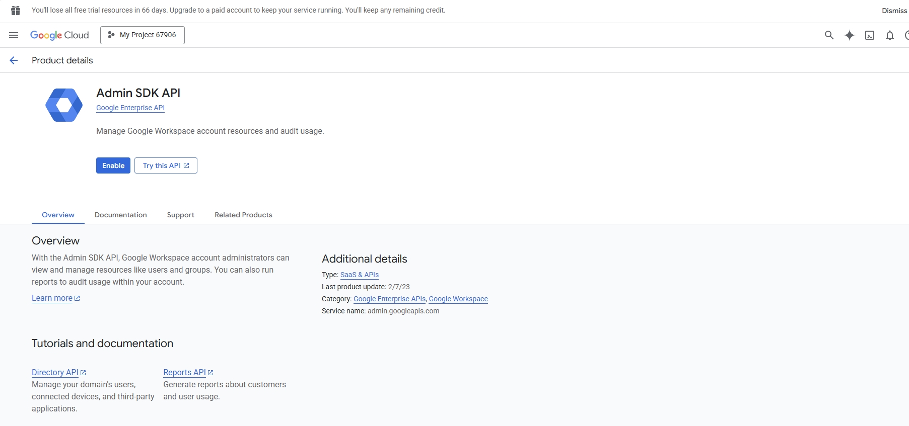<figcaption></figcaption></figure>

<figure>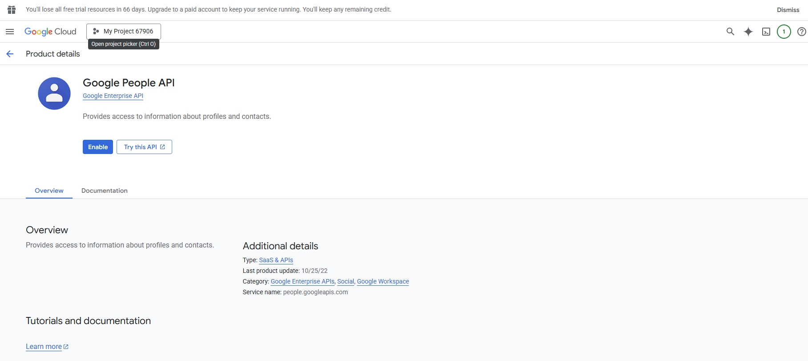<figcaption></figcaption></figure>

***

#### Configuring OAuth&#x20;

After enabling the API permissions, navigate to the OAuth consent screen page.

1. Click **GET START**

<figure><figcaption></figcaption></figure>

2. On the next page, Google will prompt you to enter the **App name** and **User support email** (see the screenshot below).

<figure>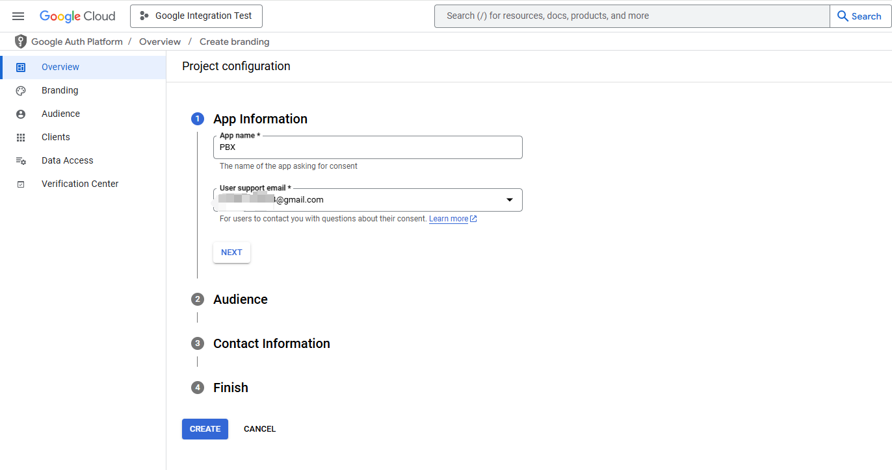<figcaption></figcaption></figure>

4. Click **Next**, then select the appropriate **Audience** for your application. For example, choose **External.**

<figure>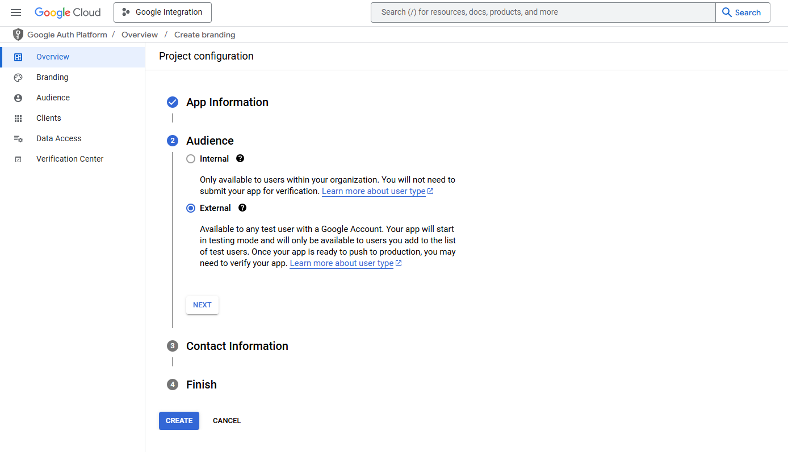<figcaption></figcaption></figure>

4. Click **Next**, then enter the required **Contact Information** email address.

<figure>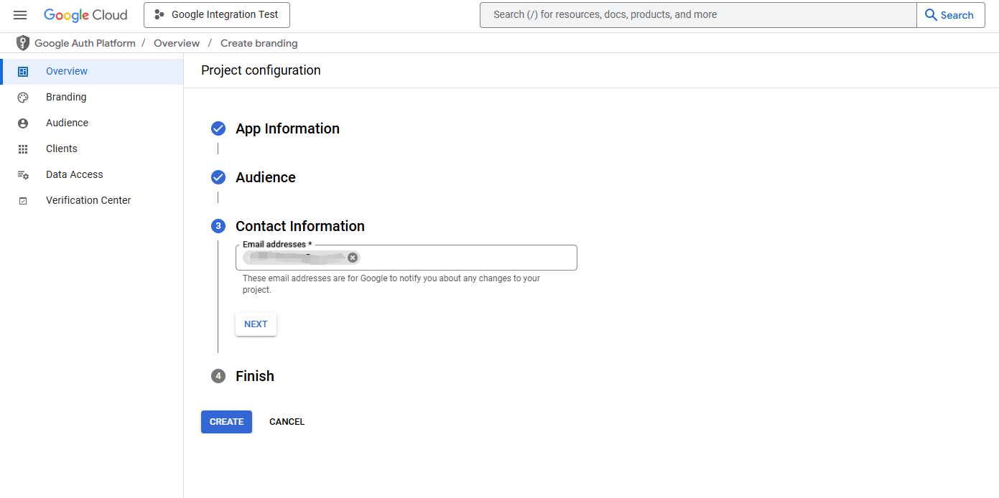<figcaption></figcaption></figure>

5. Click **Next**, review and agree to the **User Data Policy**, then click **Create**.

<figure>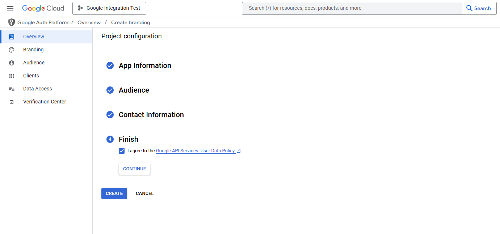<figcaption></figcaption></figure>

6. If you selected **External** as the Audience in the previous step, you must click **Publish App** after the app is created (see the screenshot below).

<figure>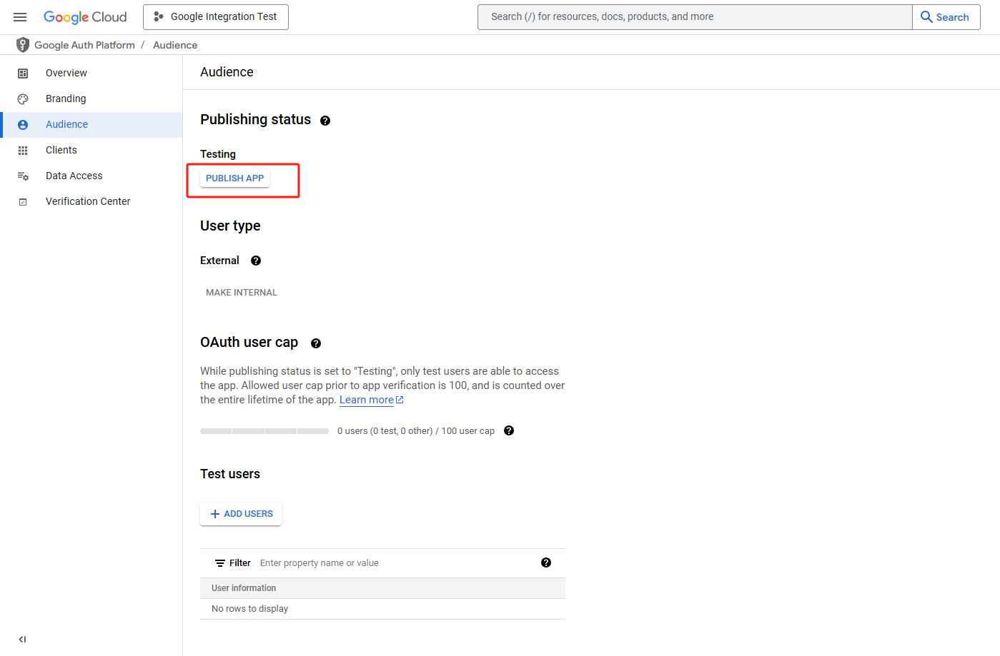<figcaption></figcaption></figure>

7. CClick **Confirm** to publish the app.

<figure>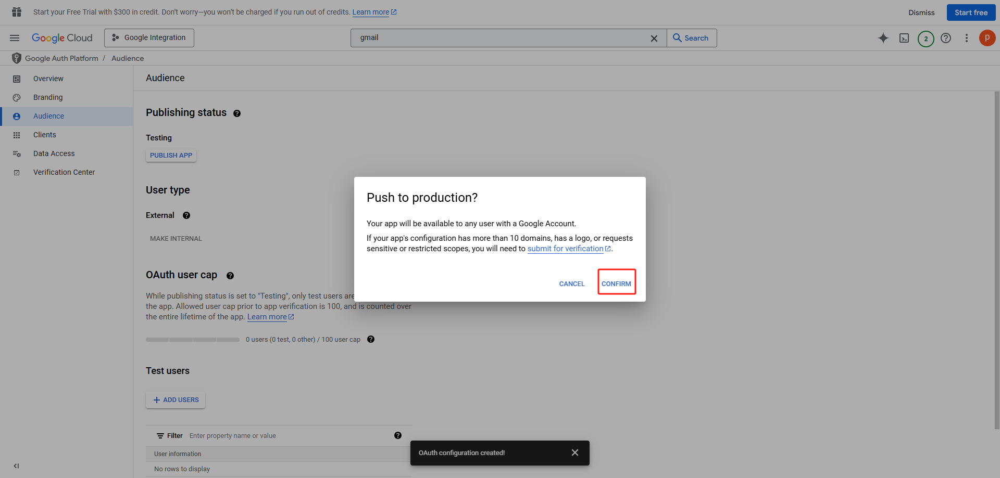<figcaption></figcaption></figure>

8. Navigate to **APIs & Services → Credentials** in the Google Cloud Console.

<figure>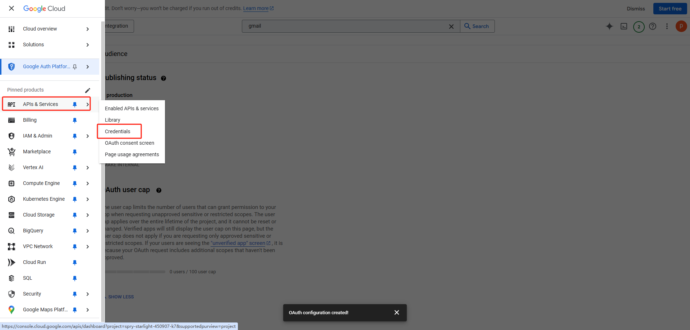<figcaption></figcaption></figure>

9. Click **+ Create Credentials**, then select **OAuth client ID**.

<figure>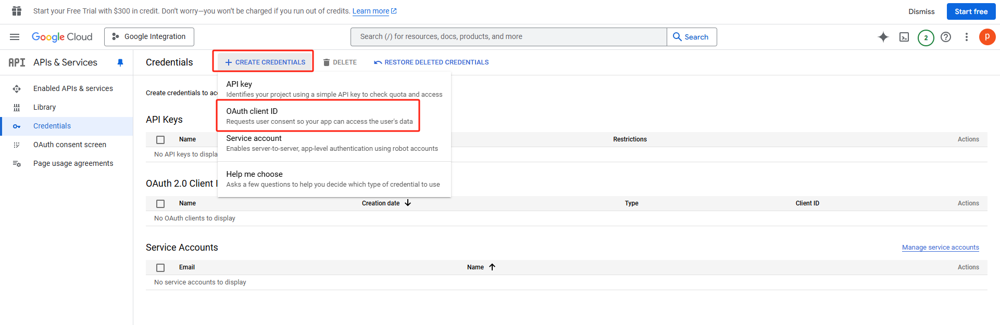<figcaption></figcaption></figure>

10. Enter the required information as follows:

    * **Application type:** Select **Web application**.
    * **Name:** Enter a name (for example, **PBX**).
    * **Authorized redirect URIs:** Click **+ Add URI**, then paste the **Authorized Redirect URI** collected earlier.
      * If PortSIP PBX provides two redirect URIs, make sure to add **both**.

    Click **Create** to generate the OAuth client.

<figure>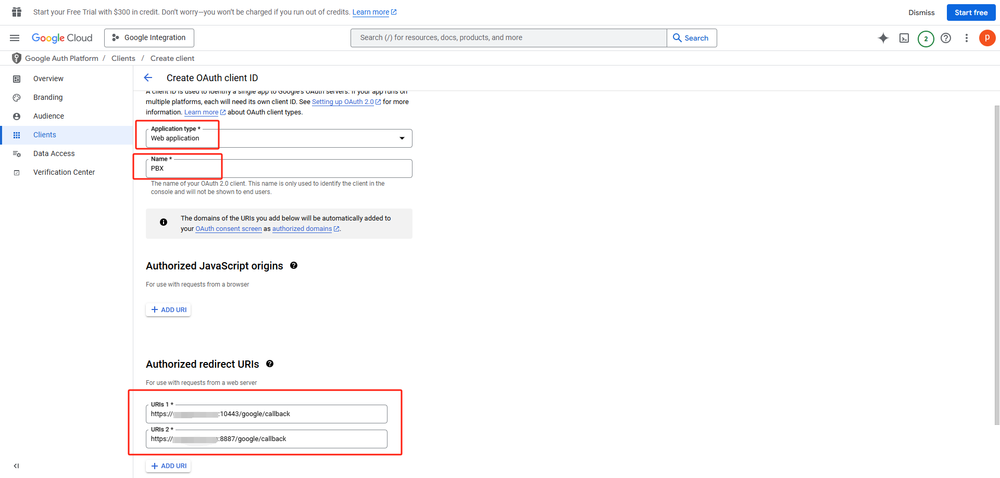<figcaption></figcaption></figure>

11. After the application is created, a confirmation screen will appear (see the screenshot below).

    Copy the **Client ID** and **Client Secret**, and store them securely.\
    You will need these values when configuring Google Workspace integration in PortSIP PBX.

<figure>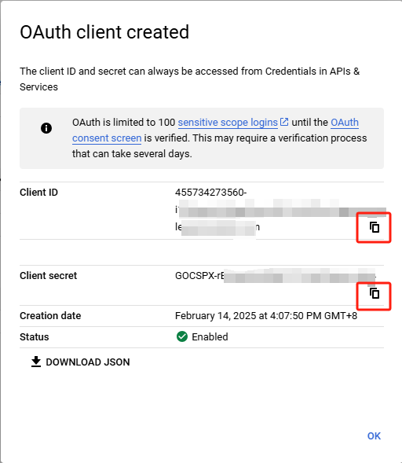<figcaption></figcaption></figure>

***

### Configure Settings in PortSIP PBX

After creating the OAuth client in Google Cloud, configure the integration in PortSIP PBX.

1. Sign in to the PortSIP PBX Web Portal.
2. Navigate to **Integrations > Google Workspace**.
3. Paste the **Client ID** and **Client Secret** you copied earlier into the corresponding fields.
4. Click **OK** to save the settings.

<figure>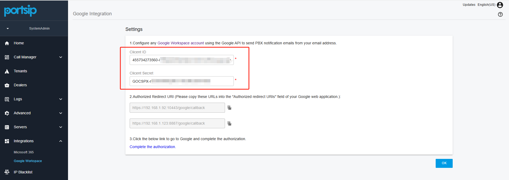<figcaption></figcaption></figure>

2. After saving, click the **Complete the authorization** hyperlink. You will be redirected to Google to complete the OAuth authorization process.

<figure>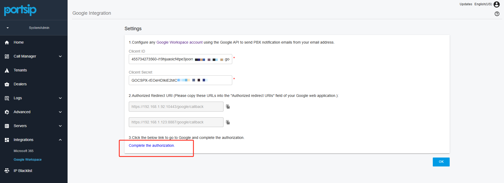<figcaption></figcaption></figure>

3.  Once the authorization process is completed successfully, the **Google Workspace integration** is fully configured.

    You can now use OAuth authentication to send email notifications from **PortSIP PBX** through the **Gmail service**.

<figure>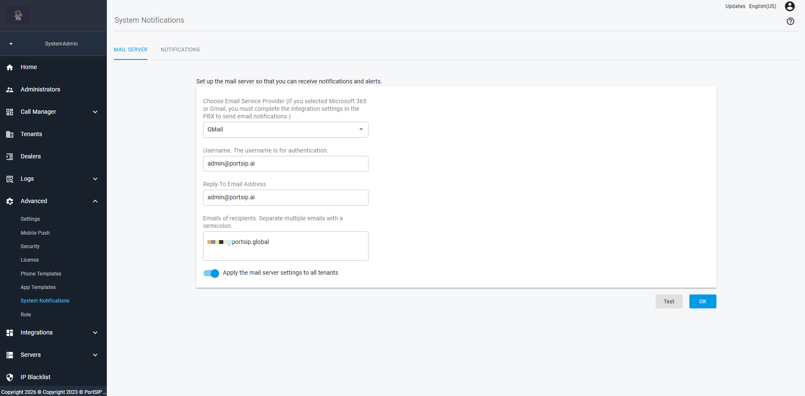<figcaption></figcaption></figure>

***

### Configuring SSO

To enable **Single Sign-On (SSO)**, you must configure the **Google Workspace integration at the tenant level**.

***

#### Configure User Synchronization

To synchronize users from Google Workspace to PortSIP PBX:

1. Sign in to the **PortSIP PBX Web Portal**.
2. Navigate to **Integrations → Google Workspace**.
3. Click the **User Sync** tab.

**Sync Mode**

Select a **Sync Mode**:

* **Manual** – Administrators manually trigger synchronization.
* **Automatic** – The system synchronizes users automatically.

**Important:** After selecting the sync mode, it cannot be changed later. Choose carefully.

***

#### Extension Number Assignment

Specify how extension numbers will be assigned to synchronized users:

* You may define a **starting extension number range**.
* If no range is specified, the system automatically assigns the first available extension numbers.

***

#### User Photo Synchronization

You can enable synchronization of **Google Workspace profile photos**.

When enabled, user photos will be displayed as profile pictures in:

* PortSIP desktop and mobile apps
* The WebRTC client

<figure><figcaption></figcaption></figure>

***

#### Enable SSO

After configuring User Synchronization, you can enable Single Sign-On (SSO).

1. Sign in to the PortSIP PBX Web Portal.
2. Navigate to **Integrations > Google Workspace**.
3. Click the **Sign In** tab.
4. Turn on **Enable**.
5. Select how users will use SSO according to your requirements.

After Google Workspace integration is successfully completed, a **Google icon** will appear on the login pages of:

* The **PortSIP PBX Web Portal**
* The **PortSIP ONE app**

This indicates that SSO is enabled.

Users can click the **Google icon** to sign in using their Google Workspace credentials.

<figure>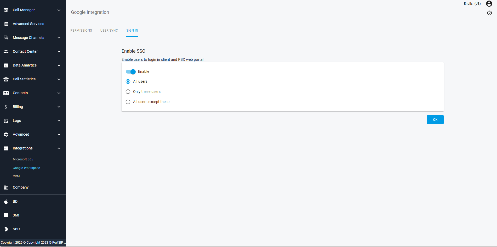<figcaption></figcaption></figure>

