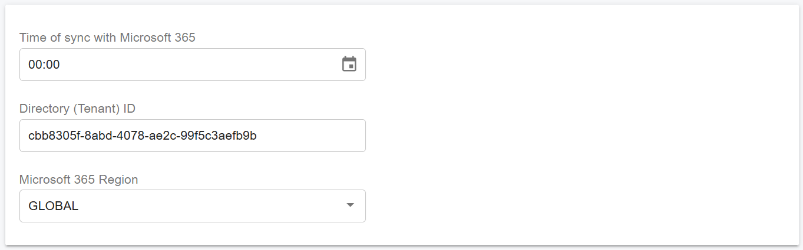

# Microsoft 365 Integration

The PortSIP PBX integrates with **Microsoft 365** to provide seamless identity, contact, and email integration. The integration includes the following features:

* **User synchronization** from Microsoft 365 or Microsoft Entra ID (including on-premises Active Directory synchronized to the cloud using Azure AD Connect)
* **Single Sign-On (SSO)**, allowing users to sign in to the PortSIP PBX Web Portal and PortSIP ONE app using their Microsoft account
* **Personal contact synchronization**, syncing Microsoft 365 users’ personal contacts to PortSIP PBX user contacts
* **Shared mailbox contact synchronization**, syncing shared mailbox contacts to PortSIP PBX company contacts
* **Email notifications sent via Microsoft 365**, using OAuth authentication

***

### Prerequisites

Before enabling Microsoft 365 integration, ensure the following requirements are met:

* PortSIP PBX is running on a **static public IP address**
* PortSIP PBX is accessed via a **fully qualified domain name (FQDN)** with a valid SSL certificate
  * The SSL certificate must be issued by a trusted Certificate Authority (for example: DigiCert, Thawte, GoDaddy). Please refer to the guide [Certificates for TLS/HTTPS/WebRTC](../certificates-for-tls-https-webrtc/).
* The PBX tenant enabling Microsoft 365 integration has Microsoft 365 accounts with an **Exchange subscription**, such as:
  * Microsoft 365 Business Basic, Standard, or Premium
  * Microsoft 365 F3, E3, or E5

***

### Configuring Microsoft 365 Access

#### Configure the Application ID for the Tenant

To enable synchronization between PortSIP PBX and your Microsoft 365 or Azure environment, follow these steps:

1. Sign in to your Microsoft Azure or Microsoft 365 account.
2. Navigate to **Microsoft Entra ID**.
3. Select **App registrations** from the left-hand menu.
4. Click **New registration** to create a new application.
5. Enter an application name, for example: **PBX Server-side**.
6. For **Supported account types**, select **Accounts in this organizational directory only (Single tenant)**.
7. Sign in to the PortSIP PBX Web Portal:
   * Log in as the **Tenant Administrator**, or
   * Switch to the tenant scope if logged in as a **System Administrator**
8. Navigate to **Advanced > Microsoft 365 Integration** and copy the **Redirect URI**.
   * If PortSIP SBC is configured, two Redirect URIs will be displayed; copy both.

You will paste the Redirect URI (or URIs) into the application configuration in Microsoft Entra ID in the next steps.

<figure><figcaption></figcaption></figure>

9. Paste the **Redirect URI** into Microsoft 365 and save the changes.\
   If two Redirect URIs are required, add the first URI now. You will add the second URI in a later step.

<figure><figcaption></figcaption></figure>

10. Copy the **Application (client) ID** and **Directory (tenant) ID** from Microsoft 365.

<figure><figcaption></figcaption></figure>

11. Be sure to save the **Directory (tenant) ID** for later use. At this stage, you only need to copy and paste the **Application (client) ID** into the PortSIP PBX, as shown in the screenshot below.

<figure><figcaption></figcaption></figure>

12. If you have installed and configured the PortSIP SBC with the PBX, two **Redirect URIs** will be displayed in the PBX Web Portal. The first Redirect URI was added in the previous **step 9**.

To add the second Redirect URI, follow these steps:

1. Navigate to **App registrations** in your Azure or Microsoft 365 account.
2. Select the application you created earlier.
3. Open the **Authentication** menu and click **Add URI**.
4. Paste the second Redirect URI and save the changes.

> **Important:** \
> If the PBX web domain or SBC web domain changes in the future, you must update the corresponding Redirect URIs in Microsoft 365 to ensure the integration continues to work properly.

<figure><figcaption></figcaption></figure>

***

### Generate Key Pair

Generate the certificate public key for Microsoft 365 as follows:

1. Sign in to the PortSIP PBX Web Portal.
2. Navigate to **Advanced > Microsoft 365 Integration**.
3. Click **Generate New Key Pair** and download the **public\_key.pem** file.

<figure><figcaption></figcaption></figure>

Next, upload the public key to Microsoft 365:

1. Sign in to Microsoft 365.
2. In the application configuration, click **Upload certificates**.
3. Upload the **public\_key.pem** file and save the changes.

> **Note**\
> By default, the generated certificate is valid for one year. To maintain uninterrupted Microsoft 365 integration, you must regenerate the key pair and repeat the upload process before the current certificate expires each year.

<figure><figcaption></figcaption></figure>

***

### Sync Options

To configure synchronization settings with Microsoft 365, follow these steps:

1. Sign in to the PortSIP PBX Web Portal.
2. Navigate to **Advanced > Microsoft 365 Integration**.

Configure the following options:

**Sync Schedule**\
Specify when the PBX should synchronize users from Microsoft 365. It is recommended to schedule synchronization at midnight (**00:00**) to minimize operational impact.

**Directory (Tenant) ID**\
Paste the **Directory (tenant) ID** that you saved earlier when registering the Microsoft 365 application.

**Microsoft 365 Region**\
National clouds are physically isolated Azure environments designed to meet data residency, sovereignty, and regulatory compliance requirements.

Microsoft Entra ID is available in the following cloud environments:

* Global Azure cloud
* Azure Government
* Microsoft Azure operated by 21Vianet

Currently, PortSIP PBX supports the **Global Azure cloud** and **Microsoft Azure operated by 21Vianet**. Select **GLOBAL** unless you explicitly need to connect to Microsoft Azure operated by 21Vianet.

<figure><figcaption></figcaption></figure>

> **Important**\
> If both the **First Name** and **Last Name** fields of a Microsoft 365 user are empty (even if an email address exists), that user will not be synchronized to PortSIP PBX. This limitation is enforced by Microsoft 365.

<figure><figcaption></figcaption></figure>

***

### Configuring API Permissions

Configure Microsoft Graph API permissions for the application as follows:

1. In the Azure or Microsoft 365 portal, open **API permissions** for the application.
2. Click **Add a permission**.
3. Select **Microsoft Graph**.

<figure><figcaption></figcaption></figure>

4. On the Microsoft Graph page, choose **Application permissions**. Then, type each of the permissions listed below into the **Select permissions** field. After selecting them, click on the **Add permissions** button.&#x20;
   * User.Read.All
   * Contacts.Read

<figure><figcaption></figcaption></figure>

Once all required permissions have been granted successfully, they will appear in the API permissions list, as shown in the screenshot below.

If you plan to use the Microsoft 365 mail server to send email notifications, you must also grant the **Mail.Send** permission.

<figure><figcaption></figcaption></figure>

***

### Configuring User Synchronization

Configure user synchronization from Microsoft 365 to PortSIP PBX as follows:

* **Extension Number Assignment**\
  Specify the extension number range for Microsoft 365 users when synced. You can define a starting extension number; otherwise, the system will automatically assign the first available extension.
* **Synchronization Direction and Schedule**\
  User synchronization is one-way, from **Microsoft 365 to PortSIP PBX**.\
  Synchronization runs automatically at midnight (**00:00**) or at the custom time you configured.\
  If a user is not deleted from Microsoft 365, they will be re-synchronized and reappear in PortSIP PBX during the next scheduled sync.
* **User Photo Synchronization**\
  You can synchronize Microsoft 365 user profile photos to PortSIP PBX. These photos will be displayed as profile pictures in the PortSIP apps and the WebRTC client.

<figure><figcaption></figcaption></figure>

***

### Configuring SSO

After you configured the User Synchronization, you are ready to configure the SSO now.

1. Navigate to the menu Integrations > Microsoft 365, click the SIGN IN tab
2. Turn on the Enable option, choose how do you want the users to use the SSO

After Microsoft 365 integration is completed successfully, a **Microsoft** icon will appear on the login pages of both the **PortSIP PBX Web Portal** and **PortSIP ONE app**. This indicates that Single Sign-On (SSO) has been enabled.

Users can click the Microsoft icon to sign in to the PortSIP PBX Web Portal and the WebRTC client using their Microsoft 365 credentials.

<figure><figcaption></figcaption></figure>

***

### Configuring Contact Synchronization

You can synchronize Microsoft 365 contacts with PortSIP PBX as follows:

* **Personal contacts**\
  Microsoft 365 personal contacts can be synced to each PortSIP PBX user’s personal contacts. This synchronization is **one-way**, meaning contacts must be created and maintained in Microsoft 365.
* **Shared mailbox contacts**\
  Contacts from Microsoft 365 shared mailboxes can be synchronized to the **PortSIP PBX company contacts**, making them available to all users.

All contacts stored in Microsoft 365 [Well-Known (Default) folders](https://learn.microsoft.com/en-us/dotnet/api/microsoft.exchange.webservices.data.wellknownfoldername?view=exchange-ews-api) will be synchronized.

<figure><figcaption></figcaption></figure>

