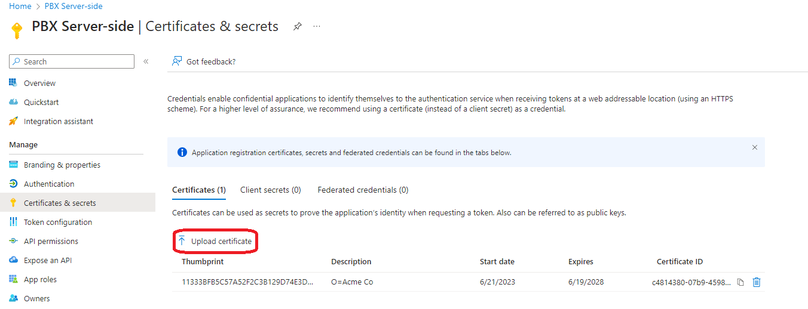

# Microsoft 365 Integration

The PortSIP PBX integrates with Microsoft 365 to provide the following features:

* Synchronous user accounts from Microsoft 365 or Azure Active Directory (Local Active Directory synced to the cloud using Azure Connect).
* Allow users to use their Microsoft Account to log in to the PortSIP PBX web portal and PortSIP ONE app(SSO).
* Microsoft 365 Users' personal contacts are synchronized with the PortSIP PBX users' personal contacts.
* Shared mailbox contacts are synchronized with the PortSIP PBX Company contacts.
* Send email notifications through Microsoft 365 mail server with OAuth.

## Prerequisites 

* You need PortSIP PBX running on a static public IP address.
* A web domain (which is FQDN) in PortSIP PBX with a valid SSL certificate. The certificate should be issued by a trusted certificate provider such as Digicert, Thawte, Godaddy, etc. You can read this [article ](../../tutorials/certificates-for-tls-https-webrtc/)to configure the SSL certificate.
* Requires the PBX tenant who wants to enable the Microsoft 365 integration to have Microsoft 365 Accounts with an Exchange subscription plan:
  * Microsoft 365 Business Basic, Standard, or Premium
  * Microsoft 365 F3, E3 or E5

## Configuring Microsoft 365 Access 

### Configure the App ID for the Tenant

To enable synchronization between PortSIP PBX and your Azure or Microsoft 365 account, follow these steps:

1. Sign in to your Azure or Microsoft 365 account.
2. Navigate to Microsoft Entra ID:
   * Click the **Microsoft Entra ID** icon.
   * In the left-hand menu, select **App registrations**.
   * Click **New registration** to create a new application.
3. Enter a name for the application: For example: **PBX Server-side**.
4. Configure supported account types: Choose **Accounts in this organizational directory only** (Single tenant: PortSIP Solutions, Inc. only).
5. Sign in to the PortSIP PBX web portal: Log in as the **Tenant Administrator**, or switch to the tenant scope if you are logged in as a **PBX System Administrator**.
6. Copy the Redirect UR&#x49;**:** From the **Advanced > Microsoft 365 Integration** menu, copy the **Redirect URI**. There may be two Redirect URIs if you configured the PortSIP SBC; please copy them both.

<figure><figcaption></figcaption></figure>

7. Paste the Redirect URI into Microsoft 365 and save. If you have two Redirect URIs, paste one first; the second URI will be added later.

<figure><figcaption></figcaption></figure>

8. Copy the **Application (client) ID** and **Directory (tenant) ID** from Microsoft 365.

<figure><figcaption></figcaption></figure>

9. Please remember to save the **Directory (tenant) ID** for later use. You just need to copy and paste the **Application (client) ID** into the PBX as in the below screenshot for now.

<figure><figcaption></figcaption></figure>

10. If you have installed and configured the PortSIP SBC with the PBX, you will have two Redirect URIs in the PBX web portal. The first URI was added in the previous step.

    Next, follow these steps to add the second URI:

    1. **Navigate to the App registrations menu** in your Azure or Microsoft 365 account.
    2. **Select the application** you configured in **Step 7**.
    3. **Click on the Authentication menu**, then select **Add URI**.
    4. **Paste the second Redirect URI** and save your changes.

    **Important:** If your PBX web domain or SBC web domain changes in the future, make sure to update the Redirect URIs in Microsoft 365 accordingly.

<figure><figcaption></figcaption></figure>

### Generate Key Pair

Now generate the certificate public key for Microsoft 365 (go to the PortSIP PBX Web portal menu **Advanced > Microsoft 365 Integration**).

1. Click the button **Generate New Key Pair**, and download the **public\_key.pem** file.

<figure><figcaption></figcaption></figure>

2. Go to Microsoft 365, and upload the **public\_key.pem** file to Microsoft 365 by clicking the **Upload certificates.**

<figure><figcaption></figcaption></figure>


By default, the certificate is only valid for one year. To maintain the validity of your MS 365 integration, you must regenerate the certificates and repeat the previously mentioned steps to update them before the current certificate expires each year.


## Sync Options

Select the PortSIP PBX Web portal menu  **Advanced > Microsoft 365 Integration** to configure the options for sync with Microsoft 365.

1. Schedule a time for the PBX system to synchronize with Microsoft 365 users. Suggest set it to occur at midnight (00:00).&#x20;
2. directory\_id: Paste the **Directory (tenant) ID** (which you saved in above step 8).
3.  national\_cloud: National clouds are physically isolated instances of Azure. These regions of Azure are designed to make sure that data residency, sovereignty, and compliance requirements are honored within geographical boundaries.

    Including the global Azure cloud, Microsoft Entra ID is deployed in the following national clouds:

    * Azure Government
    * Microsoft Azure operated by 21Vianet

Currently, PortSIP PBX supports **Global Azure cloud** and **Microsoft Azure operated by 21Vianet**. Please choose the **GLOBAL** unless you are sure you need to connect with Microsoft Azure operated by 21Vianet.

<figure><figcaption></figcaption></figure>


If both the first name and last name fields are empty for a Microsoft 365 user, but the email address is not, the user will not be synchronized with PortSIP PBX. This limitation is imposed by Microsoft 365.


<figure><figcaption></figcaption></figure>

## Configuring API Permissions 

Select the menu **API permissions**, click **Add a permission**, and then select the **Microsoft Graph.**

<figure><figcaption></figcaption></figure>

In the Microsoft Graph page as shown below, click on **Application permissions**. Then, type each of the permissions listed below into the **Select permissions** field. After selecting them, click on the **Add permissions** button.

* User.Read.All
* Contacts.Read

<figure><figcaption></figcaption></figure>

Once all required permissions have been successfully granted, it will appear as shown in the screenshot below.

If you want to use the MS365 mail server to send the email notifications, you have to grant the **Mail.Send** permission as well.

<figure><figcaption></figcaption></figure>

### Configuring User Synchronization 

Now you need to synchronize the users from Microsoft 365 to PortSIP PBX:

1. Set the extension number range to be assigned to Microsoft users. You can configure a starting extension, otherwise, it will use the first available extension.
2. The synchronization is one-way (Microsoft 365 to PortSIP PBX) and happens every middle night(time 00:00) or the custom time that you scheduled. If you have not deleted the user in Microsoft 365 it will reappear in PortSIP PBX the next day.
3. You can sync Microsoft 365 user photos to PortSIP PBX to show the photo as a profile picture in the apps and in the WebRTC client.

<figure><figcaption></figcaption></figure>

### Configuring SSO 

Once Microsoft 365 is successfully integrated, a Microsoft icon will appear on both the PBX Web portal and WebRTC Client login pages. This indicates that Single Sign-On (SSO) is enabled. Users can then click on this icon to log in to the PortSIP web portal and WebRTC client using their Microsoft credentials.

<figure><figcaption></figcaption></figure>

### Configuring Contact Synchronization 

You can have personal 365 contacts synced to the PortSIP PBX user's personal contacts. This is a one-way synchronization: Contacts need to be managed and updated from Microsoft 365. You can do the same for Microsoft 365 shared mailbox contacts and synchronize these with the PortSIP PBX company contacts. All contacts in [“Well-Known Folders”](https://learn.microsoft.com/en-us/dotnet/api/microsoft.exchange.webservices.data.wellknownfoldername?view=exchange-ews-api) (Default) folders will be synced.

<figure><figcaption></figcaption></figure>

