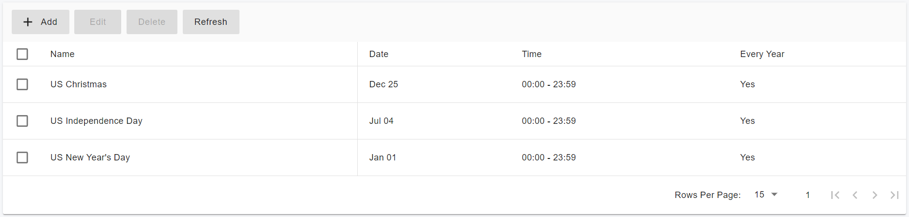
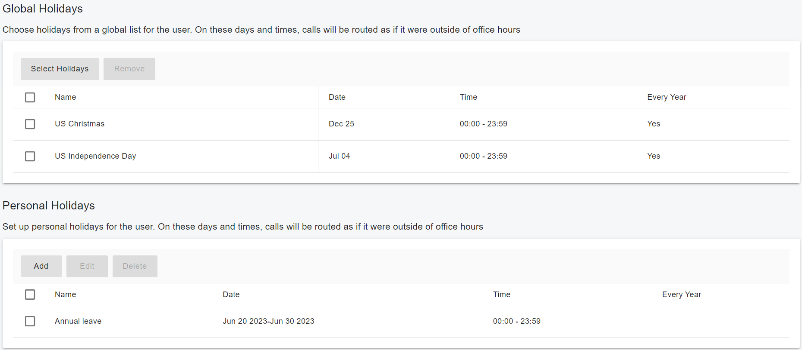

# Configuring Office Hours and Holiday Schedule

**Office Hours** and **Holiday Schedules** are configured by the **Tenant Admin** in the PortSIP PBX Web Portal. Once defined, these schedules can be applied to **inbound rules** to control how calls are routed based on:

* Time of day
* Day of the week
* Selected holidays

Using schedules, you can route inbound calls to different destinations—such as **Virtual Receptionists (Auto Attendants)**, **Call Queues**, or **individual users**—ensuring calls are handled appropriately during business hours, after hours, and on holidays.

***

### Office Hours

Office hours define your organization’s **working time periods**.

* You can configure **one or more shifts** based on your business requirements.
* A **shift** represents a continuous period of time that the system treats as **working hours**.
* Any time outside defined shifts is considered **non-working hours**.

Office hours can be applied globally, per rule, or per user to support flexible routing behavior.

***

### Holiday Lists

Holiday lists define **non-working days** for your organization.

* You can create one or more **holiday lists** based on regional, national, or company-specific holidays.
* Holidays can be applied globally or selectively to rules and users.
* During holidays, calls can be routed differently (for example, to voicemail, an IVR, or an after-hours queue).

***

### Schedule Scope and Usage

PortSIP PBX supports office hours and holidays at multiple levels, allowing precise control over call routing behavior.

#### Office Hours

* **Global Office Hours**\
  Defined at the **tenant level**, global office hours can be referenced by:
  * Inbound rules
  * Outbound rules
  * Users\
    This provides a consistent default schedule across the tenant.
* **Inbound & Outbound Rule Office Hours**\
  You can define **rule-specific office hours** for inbound or outbound rules, overriding the global office hours for that rule only.
* **User Office Hours**\
  You can define **user-specific office hours**, allowing individual users to follow a schedule different from the tenant’s global office hours.

#### Holidays

* **Global Holidays**\
  Defined at the **tenant level**, global holidays can be used by:
  * Inbound rules
  * Outbound rules
  * Users\
    This ensures consistent holiday handling across the organization.
* **Inbound & Outbound Rule Holidays**\
  You can select one or more holidays from the **Global Holiday List** and apply them to a specific inbound or outbound rule.
* **User Holidays**\
  You can assign holidays directly to users and also select from the **Global Holiday List**, allowing user-level holiday customization.

***

### Configuring Global Office Hours

Global Office Hours define the **default business hours** for the entire tenant. These hours can be referenced by **users**, **inbound rules**, and **outbound rules** to control time-based call routing.

#### Procedure: Create Global Office Hours

1. Sign in to the PortSIP PBX Web Portal as a **Tenant Admin**.
2. From the menu, go to **Company > Office Hours**.
3. In the **Office Hours** section, configure one or more **shifts** for each day:
   * A **shift** represents a continuous period of working time (for example, 09:00–12:00 and 13:00–18:00).
4. Use the **Apply To** button to apply the configured shifts to:
   * All days, or
   * Weekdays only.

#### Office hours behavior

* If a **day is turned off**, the office is considered **closed for the entire day**.
* If a **day is turned on but no shifts are defined**, the entire day is treated as **office hours**.
* If **one or more shifts** are defined, only those time periods are treated as office hours; all other times are considered non-working hours.

#### Usage

Once configured, **Global Office Hours** can be selected and used by:

* **Users**
* **Inbound rules**
* **Outbound rules**

This provides a consistent default schedule for time-based call routing across the tenant.

<figure><figcaption></figcaption></figure>

***

### Configuring the Global Holiday List

The **Global Holiday List** defines non-working days or periods for the entire tenant. These holidays can be referenced by **users**, **inbound rules**, and **outbound rules** to control call routing during holidays.

#### Procedure: Create global holidays

1. Sign in to the PortSIP PBX Web Portal as a **Tenant Admin**.
2. From the menu, go to **Company > Office Hours**.
3. In the **Holidays** section, create one or more holidays:
   * Assign each holiday a **friendly name** to make it easy to identify and reuse.
4. Define the holiday period:
   * A **specific time range within a single day**, or
   * A **continuous range of days**
5. Specify whether the holiday applies:
   * To a **specific year**, or
   * **Every year** (for recurring holidays).

#### Usage

Once created, holidays in the **Global Holiday List** can be selected and applied by:

* **Users**
* **Inbound rules**
* **Outbound rules**

When a holiday is applied, call routing follows the holiday behavior defined in the associated rule or user configuration.

<figure><figcaption></figcaption></figure>

***

### Configuring User Office Hours

User Office Hours allow you to define when a specific user is considered **available** for call routing. These hours can follow the tenant’s global schedule or be customized for individual users.

#### Procedure: Create or modify user office hours

1. Sign in to the PortSIP PBX Web Portal as a **Tenant Admin** or as the **user**.
2. From the menu, go to **Call Manager > Users > Office Hours**.
3. Choose how the user’s office hours are defined:
   * **Use Default Global Office Hours**\
     The user follows the tenant’s **Global Office Hours**. This is the default setting.
   * **Use Specific Office Hours**\
     Define **custom office hours** that apply only to this user.

#### Usage

* User Office Hours can be used by inbound and outbound rules to determine how calls are routed to or from the user.
* When **Use Specific Office Hours** is selected, the user’s schedule overrides the global office hours for that user.

<figure><figcaption></figcaption></figure>

***

### Configuring User Holiday List

User Holidays allow you to define **non-working days** for individual users. These holidays can include both **tenant-wide holidays** and **user-specific personal holidays**, and are used to control call routing behavior for that user.

#### Procedure: Configure holidays for a user

1. Sign in to the PortSIP PBX Web Portal as a **Tenant Admin** or as the **user**.
2. Go to **Call Manager > Users**, select the user you want to configure, and open the **Office Hours** tab.
3. Configure the user’s holidays:
   * **Global Holidays**\
     Select one or more holidays from the **Global Holiday List** to apply to this user.
   * **Personal Holidays**\
     Define **custom holidays** specific to the user, such as annual leave or personal time off.

#### Holiday behavior

* Both **selected Global Holidays** and **Personal Holidays** are treated as the user’s holidays.
* During these holidays, the user is considered **unavailable**, and call routing follows the holiday behavior defined in the applicable rules.

<figure><figcaption></figcaption></figure>

