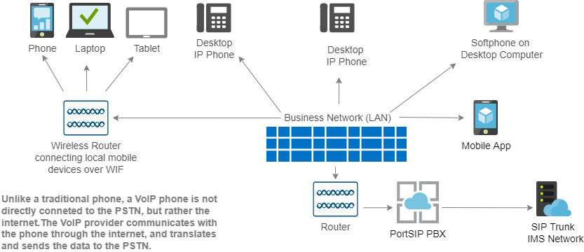
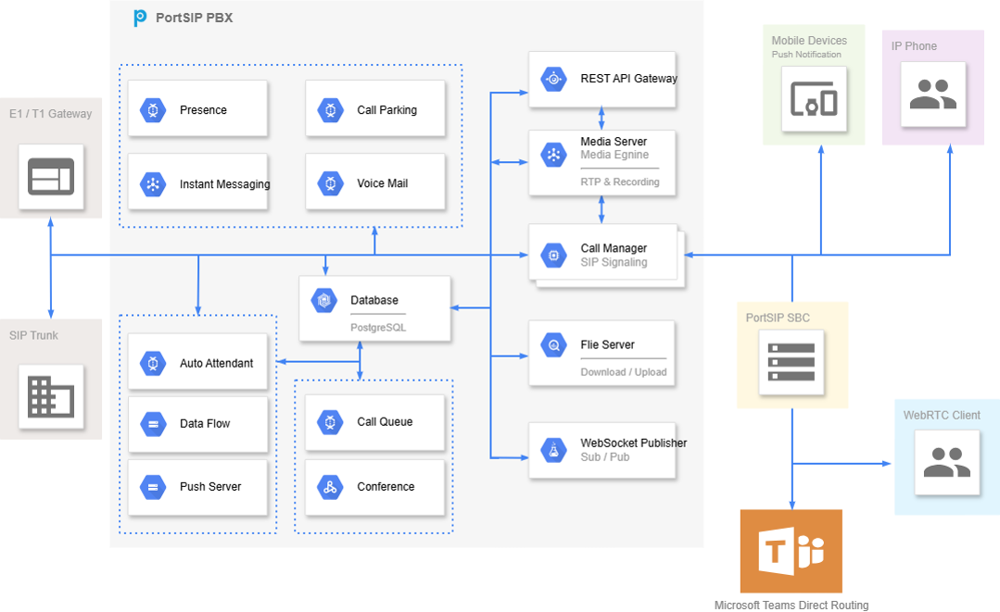

# Overview

**Our product is not built on Asterisk or FreeSWITCH.**

PortSIP PBX is a software-based VoIP PBX platform designed for business communications and collaboration. It is not built on Asterisk or FreeSWITCH.

PortSIP PBX supports both on-premises and cloud deployment models. It provides a complete Unified Communications solution that includes SIP PBX services, integrated Session Border Controller functionality, and the [PortSIP ONE app](https://www.portsip.com/portsip-one). The platform supports audio and video calling, instant messaging and presence, rich text chat, Microsoft Teams Direct Routing, WebRTC, screen sharing, file sharing, picture messages, voice and video messages, and mobile push notifications.

PortSIP PBX also includes integrated contact center capabilities that help organizations manage demanding customer communication scenarios. The solution includes a built-in SBC for Microsoft Teams Direct Routing, video meetings, screen sharing, online meeting rooms, and collaboration features at no additional cost.

Large service providers that require a UCaaS platform designed to support more than 1 million users can contact PortSIP for information about PortSIP UCaaS.

***

### Key Features

PortSIP PBX includes the following capabilities.

#### Platform and Deployment

* Fully rebrandable platform
* True multi-tenant architecture
* Horizontally scalable cluster deployment for media servers, queue servers, meeting servers, IM servers, Data Flow servers, and IVR servers
* Dealer management
* Support for multiple System Administrators
* Integrated Session Border Controller
* Open REST APIs
* Webhook support
* Pub/Sub support
* WebSocket-based subscription mechanism for pushing real-time events to subscribers
* Free apps for iOS, Android, Windows, macOS, and WebRTC
* Free client VoIP SDK

#### Security and Access Control

* TLS support
* SRTP support
* Let’s Encrypt support
* Third-party and private ACME provider support
* Role-based permissions
* Password policy
* PIN policy
* Two-Factor Authentication
* Password reset
* PIN verification for auto-provisioning
* Anti-hacking protection
* IP blacklist and whitelist
* Number blacklist
* Country-code-based call blocking

#### Calling and Collaboration

* Audio calling
* Video calling
* Video meetings
* Screen sharing for video calls
* Screen sharing for meetings
* Instant messaging and presence
* Group chat
* Rich messaging
* Voice and video messages
* File and picture sharing
* Mobile push notifications
* WebRTC
* Synchronous status across apps and IP phones
* Synchronous contacts across apps and IP phones
* Synchronous CDR across apps

#### Call Routing and PBX Services

* Service management for call settings
* Centralized service configuration, including call forwarding and Do Not Disturb
* Virtual Receptionist
* Visual IVR editor
* DISA
* Ring Groups
* Call queues
* Call park
* Call pickup
* Call pickup groups
* Call flip
* Automatic callback
* Voicemail and shared voicemail
* Music on hold
* Feature access codes
* Speed Dial 8 and Speed Dial 100
* Outbound caller ID
* SIP header manipulation
* Trunk management
* Emergency number configuration

#### Time-Based and Presence-Based Routing

* Time zone based routing
* Multiple office hours
* Holidays
* Night mode for tenants
* Night mode for Ring Groups, Queues, and IVRs
* Call routing based on presence status
* Call routing based on holidays and office hours
* Advanced routing for specific dates and times
* Office hours, holidays, and destination settings for each IVR DTMF input
* Selective Call Rejection
* Selective Call Acceptance

#### Contact Center

* Contact center functionality
* Contact center wallboard
* Contact center supervisor tool
* Agent activities
* Skills-based routing
* Queue callback
* User activities
* Call activities
* Call reports

#### Recording, Storage, and AI

* Audio call recording
* Video call recording
* Recording management
* Private recording links that require authentication
* Public recording links
* AI transcription
* Recording file storage in AWS S3
* Recording file storage in Azure Blob Storage
* Call recording notification prompt playback
* Granular call recording controls

#### Messaging and Integrations

* WhatsApp messaging integration
* WhatsApp message templates
* SMS/MMS
* Address book and contact management
* CRM integrations
* Microsoft Teams Direct Routing
* Microsoft 365 integrations
* Google Workspace integrations
* Single Sign-On
* Billing
* Email notifications at the system and tenant levels
* HTML email notifications
* Webhooks for pushing CDR and extension events

#### Provisioning and Device Management

* Zero-touch auto-provisioning
* DECT phone support
* Custom phone templates
* Custom notification templates
* Hot desking

***

### Deployment Architecture

PortSIP PBX supports both cloud and on-premises deployments. The platform can be deployed as a single-server system or scaled horizontally by adding dedicated servers for media processing, queues, meetings, instant messaging, Data Flow, and IVR services.

For larger environments, PortSIP PBX supports clustered deployment models to improve scalability and operational flexibility.

<figure><figcaption></figcaption></figure>

***

### Design Architecture

PortSIP PBX is designed as a software-based Unified Communications and PBX platform. It combines core SIP PBX services with collaboration, contact center, messaging, recording, provisioning, reporting, and integration capabilities.

The platform is suitable for enterprises, service providers, and organizations that require a flexible PBX or UCaaS-ready communications solution.

<figure><figcaption></figcaption></figure>

***

### Getting Help and Support Resources

For product documentation, troubleshooting information, and technical assistance, use the following PortSIP support resources:

* [PortSIP Support Center](https://support.portsip.com/)&#x20;
* [Submit a support request](https://portsip.zendesk.com/hc/en-us/requests/new)
* [Email support](mailto:support@portsip.com)

