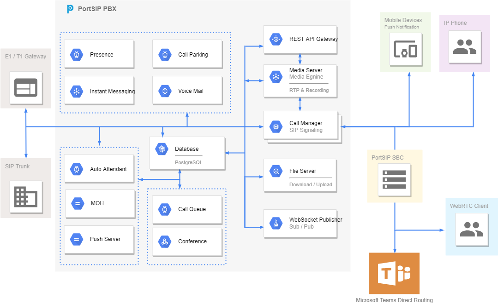

# Overview

## Our product is not built on Asterisk or FreeSwitch.

[PortSIP PBX](https://www.portsip.com/portsip-pbx/) is a software-based VoIP PBX that offers business collaboration solutions. it’s designed for both on-premise and cloud PBX environments, including SBC, audio, video calling, Instant Messaging, presence, rich text chat, Microsoft Teams Direct Routing, WebRTC, sharing screens, sending file, picture, voice, and video messages, and mobile push notifications. 

[PortSIP PBX](https://www.portsip.com/portsip-pbx/) integrates contact center features that help you satisfy the most demanding of customers. Integrated the free SBC to support Microsoft Teams Direct Routing, and free video meeting, at no extra cost, share your screen for presentations & online meeting rooms. 

A purchased SIP PBX license is packaged with the Giveaway of [PortSIP SBC](https://www.portsip.com/portsip-pbx/),  [PortSIP VoIP SDK](https://www.portsip.com/portsip-voip-sdk), and [PortSIP ONE App](https://www.portsip.com/portsip-one)! If you are a large service provider looking for a UCaaS solution that supports 1M+ users, please get in [touch with us](mailto:sales@portsip.com) for the PortSIP UCaaS.

The solution includes the following features:

* Full rebrandability
* Multi-tenant
* Extended media servers, queue servers, meeting servers, IM servers, and IVR servers for cluster
* Dealers management
* Audio calling and video calling
* Video meeting
* Instant messaging and presence (IM\&P)
* Group chat
* SIP header manipulation
* Voice and video messages
* Screen sharing for video calls
* Screen sharing for meetings
* File and picture sharing
* Service management (call settings)
* Audio and video call recording
* Recordings management
* AI transcritpion
* Storing recording files into AWS S3
* Play call recording notification prompt for calls
* Address books/contact management
* CRM Integrations
* Push notifications
* Billing
* Hot desking
* Virtual receptionist
* Visual IVR editor
* Ring group
* Contact center
* Contact center wallboard
* Contact center supervisor tool
* Skills-based routing
* Queue callback
* Call reports
* Call park
* Music on hold
* Call flip
* Call pickup
* Call pickup group
* Voicemail and shared voicemail
* Automatic callback
* WebRTC
* Microsoft Teams direct routing
* Microsoft 365 integrations
* Integrated SBC
* Full open REST API
* Zero-touch provisioning
* DECT phones
* Set up office hours, holidays, and destinations for each IVR DTMF input
* Multiple office hours
* Holidays
* Call routing based on presence status
* Call routing based on holidays and office hours
* Advanced routing for any date and time
* Custom phone template
* Custom notifications template
* Role and permissions
* Trunk management
* Password policy
* Feature access code
* Outbound caller ID
* SIP header manipulation
* Centralized service configuration (call forwarding, do not disturb, and so on)
* Anti-hacking
* IP blacklist and whitelist
* Number blacklist
* Emergency number
* Block calls based on the country code
* Troubleshooting
* Webhook for push CDR and extension events
* WebSocket-based subscribe mechanism for pushing real-time events to subscribers
* Synchronous status between apps and IP phones
* Synchronous contacts across apps and IP phones
* Synchronous CDR across apps
* Free client VoIP SDK

## Deployment Architecture

<figure><figcaption></figcaption></figure>

## Design Architecture

<figure><figcaption></figcaption></figure>
