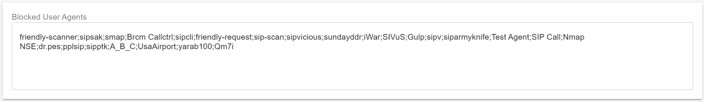

# PortSIP Security Features

## Overview

Being in charge of a VoIP system in the planning to deployment stage makes VoIP security one of your main considerations. This document presents simple and clear guidelines for PortSIP PBX, that can help you understand and make PortSIP PBX deployment more resilient to network attacks.

## Ports Security

PortSIP PBX provides various services that use different protocols on different ports. To secure the PBX, block the unnecessary ports on the firewall just to allow the below ports can be accessed remotely.

| Service               | Port        | Description                              |
| --------------------- | ----------- | ---------------------------------------- |
| Web Portal            | 8887        | Web Portal over HTTPS                    |
| IP Phone Provisioning | 8888        | IP Phone provisioning                    |
| Queue Wallboard       | 8889        | For access the Queue Wallboard           |
| Rest API              | 8887        | Rest API over HTTPS                      |
| WebRTC                | 10443       | The WebRTC client over HTTPS             |
| SBC Web Portal        | 8883        | SBC Web Portal over HTTPS                |
| IP Phone Provisioning | 8882        | IP Phone provisioning via SBC over HTTP  |
| WSI                   | 8885        | The WebSocket Interface                  |
| RTP                   | 45000-64999 | The UDP ports for the RTP packets on PBX |
| RTP                   | 25000-34999 | The UDP ports for the RTP packets on SBC |
| SIP                   | 5066        | SIP signaling port on SBC over UDP       |
| SIP                   | 5067        | SIP signaling port on SBC over TCP       |
| SIP                   | 5060        | SIP Signaling port on PBX over UDP       |
| SIP                   | 5061        | SIP Signaling port on PBX over TLS       |
| SIP                   | 5063        | SIP Signaling port on PBX over TCP       |
| SIP                   | 5065        | SIP Signaling port on SBC over WSS       |
| SSH                   | 22          | SSH port over TCP                        |

By default, PortSIP creates the UDP transport on 5060 and WSS transport on 5065, you can simply delete the transports and create them again with different ports. Once created the transports on new ports are, don't forget to create the firewall rule by the firewalld command, and create the security group rules if deployed on the cloud platform.


We strongly suggest changing the default SSH port 22 to another port for example 10210.



By default, after the PortSIP PBX is installed, the **Firewalld** is enabled and all firewall rules have been configured. If installed the PBX is on Debian/Ubuntu, the default firewall **UFW** will be disabled.


### The Best Practices for AWS, Azure, GCE

* Installed the PortSIP PBX in AWS/Azure/GCE, let the PBX run on a private network called VPC for AWS and GCE, for Azure, it's called VNet, and then the PBX is isolated to the internet.
* In order to allow users to access PBX from the internet,  a static public IP is required to be assigned to the PBX server.
  * AWS: assign an elastic IP to the PBX EC2, and create the necessary inbound rules in the security group for the services port in the above section
  * Azure: associate a Public IP to the PBX VM NIC then change the IP address assignment to static, and create necessary inbound rules in the security group for the service port in the above section
  * GCE: in the "**External IP**" settings, select the static external IP address to assign to the VM instance, and create the necessary VPC firewall rules for the services port in the above section
* Disable the firewalld service in the PBX server by performing the below command:

```
 systemctl disable firewalld && systemctl stop firewalld 
```


**Important**: don't stop and disable the firewalld if the PBX was deployed in the on-premise.


## Network Security

Separate Voice Traffic and Data Traffic for some VoIP ISPs, and provide dedicated SIP trunks that support  NGN ports (Next Generation Network). NGN can separate data, voice, and video networks or any combination of the three to form a converged network.&#x20;

For the on-premise deployment, the best practice is to suggest setting up VLAN (Virtual Local Networks) on the PBX. VLAN can improve the call quality but also can secure PBX. The voice traffic and data traffic can be logically separated by a VLAN switch. If one VLAN is penetrated, the other will remain secure. Also, limiting the rate of traffic to IP telephony VLANs can slow down an outside attack.

## Transport Security

#### TLS and WSS for SIP Signaling

Transport Layer Security (TLS) is a mechanism for securing SIP connections. It is recommended to use TLS as PortSIP PBX SIP transport to prevent data from being passed between other SIP endpoints and PortSIP PBX.

For the WebRTC client, PortSIP offers WSS transport (WebSockets over SSL/TLS). WSS is encrypted, just like HTTPS, and so protects against man-in-the-middle attacks. If the transport is secured, a range of attacks against WebSockets becomes unfeasible.

#### SRTP and DTLS-SRTP for Audio and Video

PortSIP PBX and PortSIP Apps support SRTP and DTLS-SRTP. SRTP extends RTP to include encryption and authentication so that all SIP and WebRTC conversations are as secure as possible. The audio and video media data is transported and protected by SRTP/DTLS-SRTP with AES-256 encryption.

## Web Access Security

PortSIP PBX provides HTTPS and HTTP access on the port 8887 and 8888. The following are the recommended practices for securing web portal transactions and preventing unwanted access.

* Create the security rule/firewall rule to disable the HTTP access on TCP port 8888
* Disable Redirect from port 80
* Disable Redirect from port 443
* Upload the trusted SSL certificates, for example, purchase an SSL certificate from DigiCert, GeoTrust

## Password and Login Security

### Web Portal Password for PBX Administrator

The default username and password of PortSIP PBX administrator for Web Portal Access both are **admin**. There are strongly suggested to change the password after first logging into the Web Portal.

* Click the profile picture in the upper right corner, choose the **Change Password** menu, then enter the current password and new password, the new password must meet all the following requirements
  * At least one letter (Latin characters)&#x20;
  * At least one number (0-9)&#x20;
  * One upper case letter or special character (e.g. !, @, $, #)&#x20;
  * No sequential characters (e.g. "1234", "7890", "Abcd")&#x20;
  * No repeating characters (e.g. "222", "Aaa", "###")&#x20;
  * No account information (e.g. first/last name, phone number)&#x20;
  * Password length is about 8-32 characters

### Password for Tenant Administrator

After creating a user with the "**Admin**" role, a tenant administrator was created, since it's also the extension, there are two passwords for him.

* SIP Password. It's used for the IP Phone, Softphone, and WebRTC client to register to PortSIP PBX
* User Password. It's used for the user to sign the PBX Web Portal to check voicemail, recording, CDR

There are strongly suggested to change the password after the tenant administrator first logs in to the Web Portal.

* Click the profile picture in the upper right corner, choose the **Change User Password**, **Change Extension Password** menu, then enter the current password and new password, the new password must meet the tenant's password policy.

### Password for Extension

After creating a user with the **Standard User**" or **Standard International User** role, a normal extension user was created, there are two passwords with a user.

* SIP Password. It's used for the IP Phone, Softphone, and WebRTC client to register to PortSIP PBX.
* User Password. It's used for the user to sign the PBX Web Portal to check voicemail, recording, CDR
* Both SIP Password and User Password must meet the tenant's password policy.

## Login Security

After the PortSIP PBX administrator signs in to the Web Portal, there are some settings that allow login security for tenant managers, tenants, and extensions.

* Click the left menu **Advanced > Security**, on the **Web Login** page,  set the maximum number of login tries on the **Web Login** page, and the user's IP will be blocked if the number of failed login attempts exceeds the allowed times.
* Set the period of an IP block, and a blocked IP will be removed after this time.
* You can require the newly created users to change their default password upon their initial login.
* You can enable [2FA ](portsip-security-feature.md#password-and-login-security)for extension users

## SIP and TCP/IP Security

PortSIP PBX provides security features with the main purpose of blocking any malicious attacks targeted to the PortSIP PBX in case the administrator has not taken necessary precautions at the firewall level. It works by detecting and blocking packet floods / DoS attacks or brute force dictionary attacks within the scope of identifying and cracking the extension number and the password.

Click the left menu **Advanced > Security**, on the **Anti Hacking** page, which shows the main interface of the PortSIP PBX Anti Hacking configurations.

### Detection Period&#x20;

This is a time interval in seconds when counting starts, but no action is enforced. To disable security, set it to a higher value.

### Failed Authentication Protection&#x20;

This is the protection in case the attacker tries to use a dictionary attack to guess the password set for a particular extension.

To do this the attacker has to send numerous requests and after the server sends a **Proxy Authentication Required** message the attacker will send a request with authentication. With this feature, the attacker can only send 50 requests in an attempt to crack the password. If an IP Address spams PortSIP with 50 wrong Authentication attempts in **Detection Period**, that IP address will be blocked and put on the blacklist for the time specified in the **SIP Blacklist time interval** parameter, by default 1 hour.

### Failed Challenge Requests (407)

D.O.S. attacks can send REGISTER/INVITE requests but do not reply to Challenge (407). Configure the amount of **fake** requests that PortSIP PBX will accept per IP Address. If this value is exceeded in the **Detection Period** interval the source IP address is put in the Blacklist. IP will remain blacklisted till the **SIP Blacklist time interval** expires, by default 1 hour.

### Level 2 security&#x20;

This is the 2nd layer of protection. Here you can specify how many packets can be sent from a unique source IP address. The default value is 2000 packets per second. If an IP Address is sending more than 200 packets per second, it means that there is something wrong. At this point, the attacker's IP will be blocked until the **Level 2 blacklist time interval** expires.

### Level 1 security&#x20;

This is the 1st layer in packets per second. If an IP sends more packets than the amount specified per second, it will get blacklisted for the **Level 1 blacklist time interval.** By default value is 500 packets per second.&#x20;

At this layer, once that packet rate exceeds the rating, the blacklist is enforced, and the user IP will get blacklisted for the **Level 1 blacklist time interval**.&#x20;

Once an IP address was blocked due to the above L1/L2 rules, it will display in the menu **Blacklist and Codes > IP Blacklist**, from which you can add it to the **Whitelist** manually.

### User-Agent Blacklist

To safeguard against malicious activities such as SPIT (SPam over Internet Telephony), TDoS (Telephony Denial-Of-Service), fuzzing, and War dialing, PortSIP PBX offers a feature that blocks specific User-Agents found in SIP messages. This feature is instrumental in enhancing the security of your telecommunication services.

Click the left menu **Advanced > Security**, on the **Blocked User Agents** page, you can edit the user-agents blacklist.

<figure><figcaption></figcaption></figure>

## Extension Security

You can assign a role type for a user when creating it and change it later as well. There are three roles by default: **Admin**, **Standard User**, and **Standard International User**. The Admin user has all permissions in the tenant scope and can manage the whole tenant. The Standard International User has permission to make calls to local, national, and international numbers. The Standard User only has permission to make calls between users.

## IP Phone Security

In PortSIP PBX, each extension's IP Phone configuration file is stored in a separate directory with a random name to prevent guessing the configuration file downloading URL even if the phone MAC address is leaked.&#x20;

## Whitelist/Blacklist

PortSIP PBX allows you to whitelist and blacklist IP addresses. All traffic originating from whitelisted IP addresses will be allowed unchecked by the anti-hacking features. All traffic originating from blacklisted IP addresses will be dropped immediately and silently.

### Adding a Whitelist Entry <a href="#h.z1lrdcguvo38" id="h.z1lrdcguvo38"></a>

Assume a remote office is connected to the PortSIP PBX. The public IP address of the remote office is 103.224.182.210. This IP address's traffic is safe to trust. Follow the settings below to add this IP address to a whitelist.

<figure><figcaption></figcaption></figure>

* Click on the menu "**IP Blacklist**"
* Click "**Add**" to add an entry
* Enter the IP address that you want to allow – in this example, it should be 103.224.182.210 (you can also enter the IP 103.224.182.210.0 and choose a Subnet Mask to allow an IP range)
* Choose "**Allow**" for the "**Action**" dropdown
* Add a description for the IP address, for example, "**My Remote office**"
* Click "**Apply**", and the allow entry will be created in the IP Blacklist page for the whitelisted IP address. All traffic originating from this IP address will not be checked and the anti-hacking algorithms will not come into effect

### Blocking an IP Address or a range of IP Addresses

Let us look at another scenario. Assume that there is a distributed attack coming from the following IP addresses – 41.202.160.2 and 41.202.191.5. These two IP addresses have already been blacklisted by PortSIP PBX’s anti-hacking auto-detection mechanisms. You would, however, want to blacklist all the range, since you are sure that you will never get any traffic from these IP addresses. In this case, we will blacklist the whole range from 41.202.0.0 to 41.202.255.255, i.e. all the IP addresses that started with 41.202. 1.

<figure><figcaption></figcaption></figure>

* Click on the menu **IP Blacklist**
* Click **Add** to add an entry
* In the **IP address** enter the first address of the network range you want to block. For this example, we will enter **41.202.0.0**
* Since we want to block all IP addresses started with 41.202, we will select a Subnet Mask of **255.255.0.0**. The range of IP addresses contained in this mask will be displayed below
* Set Action to **Block**
* Enter a Description for this entry to help you remember why you added this entry, for example, “Anti D.O.S attack coming from 41.202.x.x”
* Click **Apply**. A blocked entry will be created on the IP Blacklist page. All traffic coming from this IP address range will be checked, anti-hacking algorithms will come into effect and all packets from this IP Address range will be completely dropped and ignored
* The PortSIP Blacklist/Whitelist mechanism does not conform to a replacement of firewall. It merely provides a defense mechanism to help differentiate traffic trustable, and traffic not trustworthy. If, for example, you want to block all traffic to your network and allow only your VoIP Provider IP address, you need to set this up on your firewall


When configuring a range of IP addresses in the Blacklist, you should also ensure that the range does not include the IP address of which the PBX is installed.


## Trunk Security

SIP Trunking is often a Peer-to-peer connection for the primary use of delivering PSTN connectivity over VoIP. SIP Trunking is delivered over a couple of different methods, Internet Telephony Service Providers (ITSP) deliver SIP Trunking over the Internet and Managed Service Providers deliver SIP Trunking over the dedicated carriers' WAN connections. The application of security solutions involves providing a Firewall in combination with an IP-PBX that is used to define the Peer-to-peer relationship at various networks and VoIP application layers, and also ensure signaling and media are secure as well.

### SIP Trunk Authentication

**Register Based Authentication:** Many SIP Trunk Service Providers will require a level of Authentication within the SIP Trunk. The Service Provider requires Registration Authentication and Call Initiation Authentication from the PBX. When the PBX initiates a call to the Service Provider, the PBX must provide Authentication within the SIP Protocol for the Service Provider to accept and process the call.

**IP Based Authentication:** Because some SIP Trunk Service Providers do not support the SIP REGISTER method, you'll need to set up Trunk as the **IP Based** and add Trunk IP addresses as trusted peers in PBX, then the PBX to accept SIP traffic from trunk IP does not challenge for authentication credentials.

PortSIP PBX supports both **Register Based** and **IP Based Authentication** Trunks, but the **IP Based Authentication** trunk is strongly recommended, it's more secure.

PortSIP PBX is also supporting accepting the Trunk/E1/T1 gateway registration. For example, if an E1/T1 gateway is located in a local LAN but the PBX is in the cloud, we can create an **Accept Register**" Trunk in PortSIP PBX, set the username and password, and the E1/T1 gateway will be able to use that username and password register to the PortSIP PBX,  the PBX only allows make & accept calls with E1/T1 gateway after successfully authorized.

### Max Concurrent Calls Limited

PortSIP PBX provides a feature that allows you to set a limit on the maximum number of concurrent calls at both the global and tenant levels for a trunk. If a trunk has already reached its maximum concurrent call limit, any new call attempts will not be processed. This feature ensures efficient call management and prevents overloading of the system.

### Outbound Route Permission

When creating the outbound rule in the PortSIP PBX,  you will need to consider outbound rule permission for different users.

You can create the outbound rule using the provided called number prefix, called number length, and caller belonged user groups.&#x20;

For example, you can set up outbound rules as below.

* The outbound rule for local calls,  long-distance calls, and international calls
  * &#x20;Create an outbound rule and select the trunk that is least-cost for local calls, and set the user role as **Standard International User**, then that user will have permission to make calls to the trunk.&#x20;
* In the menu **Blacklist and Codes** > **Codes and E164**, you can find **Allowed Country Code** and **Disallowed Codes** options that let you block the calls based on the country code.
* Office hours for the outbound rule
  * PortSIP PBX allows specified office hours for an outbound rule, once set, the outbound rule will be unavailable and no one can make the call on it if outside of those hours.

