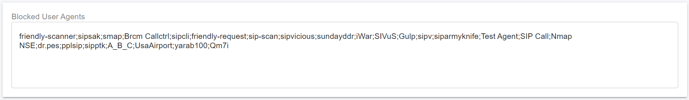

# PortSIP Security Features

Securing a VoIP system is a shared responsibility across planning, deployment, and day-to-day operations. This guide provides practical security recommendations for PortSIP PBX to help administrators reduce exposure to common network attacks, unauthorized access, toll fraud, and service disruption.

The recommendations in this guide are intended to strengthen security, but they do not replace a complete security architecture. Always combine PBX security settings with proper firewall rules, secure network design, strong authentication, TLS/SRTP, monitoring, and operational best practices.

***

### Ports Security

PortSIP PBX provides multiple services that use different protocols and ports. To reduce the attack surface, block all unnecessary ports at the firewall and allow remote access only to the ports required for your deployment.

#### Change Default SIP Transport Ports

By default, PortSIP PBX creates the following SIP transports:

* UDP transport on port `5060`
* WSS transport on port `5065`

For better protection against generic Internet scanning and opportunistic attacks, you can delete these default transports and recreate them on non-default ports.

After changing SIP transport ports:

1. Update the server firewall rules, such as Firewalld rules on Linux.
2. If PortSIP PBX is deployed in a cloud environment, update the cloud security group, VPC firewall, or equivalent cloud network firewall rules.
3. Confirm that IP phones, softphones, WebRTC clients, and SIP trunks are updated to use the new ports where required.
4. Test registration and call flows after the change.

> ❗**Note**\
> Changing SIP ports can reduce exposure to automated scanning, but it is not a substitute for strong authentication, TLS/SRTP, and strict firewall policy.

#### Change the Default SSH Port

It is recommended to change the default SSH port from `22` to a non-standard port, such as `10210`, to reduce automated brute-force login attempts.

Recommended practices:

1. Update the SSH server configuration.
2. Allow the new SSH port in the firewall.
3. Confirm that SSH access works on the new port before closing port `22`.
4. Restrict SSH access by source IP wherever possible.

> ❗**Warning**\
> Do not close port `22` until you have verified that you can successfully sign in through the new SSH port. Otherwise, you may lock yourself out of the server.

#### Default Firewall Behavior After Installation

On supported Linux systems, Firewalld is enabled by default, and the PortSIP PBX installation process automatically configures the required firewall rules.

On Debian and Ubuntu systems, UFW is disabled after PBX installation.

| Service               | Port        | Description                              |
| --------------------- | ----------- | ---------------------------------------- |
| Web Portal            | 8887        | Web Portal over HTTPS                    |
| IP Phone Provisioning | 8888        | IP Phone provisioning                    |
| Rest API              | 8887        | Rest API over HTTPS                      |
| WebRTC                | 10443       | The WebRTC client over HTTPS             |
| SBC Web Portal        | 8883        | SBC Web Portal over HTTPS                |
| IP Phone Provisioning | 8882        | IP Phone provisioning via SBC over HTTP  |
| WSI                   | 8885        | The WebSocket Interface                  |
| RTP                   | 45000-64999 | The UDP ports for the RTP packets on PBX |
| RTP                   | 25000-34999 | The UDP ports for the RTP packets on SBC |
| SIP                   | 5066        | SIP signaling port on SBC over UDP       |
| SIP                   | 5067        | SIP signaling port on SBC over TCP       |
| SIP                   | 5060        | SIP Signaling port on PBX over UDP       |
| SIP                   | 5061        | SIP Signaling port on PBX over TLS       |
| SIP                   | 5063        | SIP Signaling port on PBX over TCP       |
| SIP                   | 5065        | SIP Signaling port on SBC over WSS       |
| SSH                   | 22          | SSH port over TCP                        |

***

### Cloud Deployment Best Practices

When deploying PortSIP PBX on a cloud platform, use a private network design whenever possible so that the PBX server is not unnecessarily exposed to the public Internet.

Common cloud network models include:

* **AWS / Google Cloud:** Deploy the PBX in a VPC.
* **Azure:** Deploy the PBX in a VNet.

To allow users, devices, or trunks to access the PBX from the Internet, assign a static public IP address and configure only the required inbound rules.

#### AWS

1. Assign an Elastic IP address to the EC2 instance.
2. Configure the required inbound rules in the Security Group.
3. Restrict access by protocol, port, and trusted source IP ranges wherever possible.

#### Azure

1. Associate a Public IP address with the VM network interface.
2. Set the IP assignment to **Static**.
3. Configure the required inbound rules in the Network Security Group.

#### Google Cloud

1. Assign a static external IP address to the VM instance.
2. Create the required VPC firewall rules.
3. Restrict access by source IP ranges wherever possible.

#### Disabling Firewalld in Cloud Deployments

If PortSIP PBX is deployed in a cloud environment and security is strictly enforced through cloud security groups, VPC firewall rules, or equivalent cloud firewall controls, you may disable Firewalld on the PBX server.

Command:

```
systemctl disable firewalld && systemctl stop firewalld
```

> ❗**Important**\
> Disable Firewalld only when cloud-level firewall rules are correctly configured, strictly enforced, and regularly reviewed. Do not disable Firewalld for on-premises deployments, where the host firewall is often a primary layer of protection.

***

### Network Security

#### Separate Voice and Data Traffic

Some VoIP providers offer dedicated SIP trunk connections that support NGN, or Next Generation Network, access and traffic separation. NGN-based services can separate data, voice, and video traffic, or any combination of them, to create a converged but segmented network.

For on-premises deployments, a common best practice is to use VLANs, or Virtual LANs, for voice traffic.

Voice VLANs can help:

* Separate voice and data traffic at the network layer.
* Improve call quality by reducing contention with general data traffic.
* Limit the impact of a compromised device or network segment.
* Apply targeted rate limiting and security controls to VoIP traffic.

> ❗**Note**\
> VLANs improve segmentation, but they do not provide complete security by themselves. Combine VLANs with access control lists, firewall policy, secure device provisioning, and monitoring.

***

### Transport Security

#### TLS and WSS for SIP Signaling

TLS, or Transport Layer Security, secures SIP signaling and helps prevent SIP messages from being intercepted or modified in transit. Use TLS for SIP transports wherever possible, especially for remote users and Internet-facing deployments.

For WebRTC clients, PortSIP PBX supports WSS, or WebSocket Secure. WSS provides encrypted signaling similar to HTTPS and helps protect WebRTC traffic against interception and man-in-the-middle attacks.

#### SRTP and DTLS-SRTP for Audio and Video

PortSIP PBX and PortSIP Apps support SRTP and DTLS-SRTP for media encryption.

* **SRTP**, or Secure Real-time Transport Protocol, protects RTP audio and video media using encryption and authentication.
* **DTLS-SRTP** secures media key exchange for WebRTC scenarios.

When SRTP or DTLS-SRTP is enabled, media is protected using AES-256 encryption.

***

### Web Access Security

PortSIP PBX provides web access through the following ports:

* HTTPS access on TCP `8887`
* HTTP access on TCP `8888`

Recommended practices for securing the PBX Web Portal:

1. Disable or block HTTP access on TCP `8888` through firewall or security rules.
2. Disable redirect from port `80` if it is not required.
3. Disable redirect from port `443` if it is not required.
4. Upload a trusted SSL certificate, such as a certificate issued by DigiCert, GeoTrust, or another trusted certificate authority.
5. Restrict Web Portal access by IP allowlist or VPN wherever possible.

> ❗**Best Practice**\
> Use HTTPS only for administrative access. Avoid exposing the PBX Web Portal directly to the public Internet unless required. Where possible, restrict access to trusted IP addresses or require VPN access.

***

### Password and Login Security

#### Web Portal Password for the PBX Administrator

The default PBX Web Portal administrator credentials are:

* **Username:** `admin`
* **Password:** `admin`

Change the default password immediately after the first login.

**Steps**

1. Sign in to the PBX Web Portal as the PBX administrator.
2. Click the profile picture in the top-right corner.
3. Select **Change Password**.
4. Enter the current password.
5. Enter and confirm the new password.
6. Save the change.

**Default Password Requirements**

The new password must meet the following default requirements:

* Contains at least one Latin letter.
* Contains at least one number from `0` to `9`.
* Contains one uppercase letter or one special character, such as `!`, `@`, `$`, or `#`.
* Does not contain sequential characters, such as `1234`, `7890`, or `Abcd`.
* Does not contain repeating characters, such as `222`, `Aaa`, or `###`.
* Does not contain account information, such as first name, last name, or phone number.
* Contains 8 to 32 characters.

> ❗**Expected outcome**\
> After the password is changed, the default administrator password can no longer be used to access the PBX Web Portal.

#### Passwords for Tenant Administrators

When you create a user with the **Admin** role, that user becomes a tenant administrator. A tenant administrator has two passwords:

* **SIP Password:** Used by IP phones, softphones, and WebRTC clients for SIP registration.
* **User Password:** Used to sign in to the PBX Web Portal to access voicemail, recordings, CDRs, and other user-level features.

It is strongly recommended to change both passwords after the tenant administrator’s first login.

**Steps**

1. Sign in as the tenant administrator.
2. Click the profile picture in the top-right corner.
3. Select **Change User Password** to update the Web Portal login password.
4. Select **Change Extension Password** to update the SIP registration password.
5. Set new passwords that comply with the tenant password policy.
6. Save the changes.

#### Passwords for Extension Users

Users created with the **Standard User** or **Standard International User** role also have two passwords:

* **SIP Password:** Used by devices and apps for SIP registration.
* **User Password:** Used to sign in to the PBX Web Portal to access voicemail, recordings, CDRs, and other user-level features.

Both passwords must comply with the tenant password policy.

#### Password Policy

PortSIP PBX supports password policies for:

* System administrators
* Dealers
* Tenant users and extensions

Administrators can customize password policy requirements to align with their organization’s security standards. This allows each deployment to define appropriate password length, complexity, and other password rules.

***

### Login Security Controls

After signing in as the PBX administrator, you can configure login protection policies.

#### Steps

1. Go to **Advanced > Security**.
2. Open the **Web Login** page.
3. Configure the maximum number of failed login attempts.
4. Configure whether an IP address should be blocked after the failure threshold is exceeded.
5. Set the IP block duration.
6. Enable **Require newly created users to change the default password on first login**, if required.
7. Enable 2FA for extension users, if required.
8. Enable 2FA for system administrators and dealers, if required.
9. Save the changes.

> ❗**Best Practice**\
> Enable two-factor authentication, or 2FA, for administrators and users who access sensitive information such as recordings, CDRs, voicemail, and system configuration.

***

### SSO for Login Security

PortSIP PBX supports SSO login with Microsoft 365 and Google Workspace.

SSO, or Single Sign-On, can improve login security by allowing organizations to use centralized identity controls from Microsoft or Google, including multi-factor authentication, password policies, conditional access, and account lifecycle management.

> ❗**Note**\
> SSO security depends on how the identity provider is configured. Ensure Microsoft 365 or Google Workspace security policies are properly configured and enforced.

***

### Role and Permissions Security

PortSIP Roles and Permissions provide role-based access control for features and functions in PortSIP PBX.

Each role includes a predefined set of permissions that determines what a user can view, configure, or manage. By assigning roles, administrators can control access based on job responsibility and operational need.

PortSIP PBX includes standard roles for common user types, such as administrators and end users. These roles include predefined permissions suitable for typical deployments.

For more specialized requirements, administrators can create custom roles and define the exact permissions included in each role. Both standard roles and custom roles can be assigned to users.

> ❗**Best Practice**\
> Follow the principle of least privilege. Assign users only the permissions they need to perform their tasks.

***

### Multi-Level System Administrators

PortSIP PBX supports multiple system administrators and provides role-based access control, or RBAC, for administrator accounts.

RBAC allows organizations to assign administrator privileges based on operational responsibility. This helps reduce security risk by ensuring each administrator has only the permissions required for their role.

PortSIP PBX includes three predefined system administrator roles.

#### System Admin

The **System Admin** has the highest level of privileges in PortSIP PBX.

This role is intended for trusted administrators who are responsible for global system configuration, platform-level management, security settings, and overall PBX administration.

#### Operation Admin

The **Operation Admin** has fewer privileges than the System Admin and is intended for day-to-day operational management.

This role is suitable for administrators who manage routine PBX operations but do not require full system-level control.

#### Site Admin

The **Site Admin** has fewer privileges than the Operation Admin and is typically used for site-level or delegated administration.

This role is suitable for administrators who manage a specific site, location, or delegated operational scope.

#### Custom Administrator Roles

In addition to the predefined roles, PortSIP PBX allows you to create custom administrator roles to meet specific operational requirements.

Custom roles allow you to define administrator permissions more precisely based on your organization’s security policy, team structure, and operational workflow.

> ❗**Best Practice**\
> Follow the principle of least privilege. Assign each administrator only the permissions required for their operational responsibilities. Use the System Admin role only for trusted users who require full system-level control.

***

### Audit Logs

PortSIP PBX provides audit logs that allow system administrators to review activities performed by administrators and tenant users, including extensions.

Audit logs help organizations track system access, configuration changes, and security-related operations. They are useful for troubleshooting, compliance reviews, and security investigations.

Recommended practices:

1. Review audit logs regularly.
2. Monitor administrator sign-ins and configuration changes.
3. Investigate unusual access patterns or unexpected changes.
4. Retain audit logs according to your organization’s security and compliance policies.
5. Restrict access to audit logs to authorized administrators only.

> ❗**Best Practice**\
> Use audit logs as part of your regular security review process. Audit logs can help identify unauthorized access, configuration mistakes, and suspicious activity by administrators or extension users.

***

### SIP and TCP/IP Security

PortSIP PBX includes anti-hacking protections designed to help mitigate malicious traffic when firewall controls are insufficient, incomplete, or misconfigured.

These protections can help detect and block:

* Packet floods and DoS-style attacks
* Brute-force attempts against extension numbers and passwords
* Abnormal SIP traffic patterns

#### Configure Anti-Hacking Protection

**Steps**

1. Go to **Advanced > Security**.
2. Open the **Anti Hacking** page.
3. Configure the detection period, authentication protections, challenge request limits, and packet rate limits as required.
4. Review blocked IP addresses under **Blacklist and Codes > IP Blacklist**.
5. Add trusted IP addresses to the whitelist only when necessary.

#### Detection Period

The detection period defines the time window, in seconds, used to count events before an enforcement action is applied.

To effectively reduce or disable enforcement, configure a higher value according to your operational requirements.

#### Failed Authentication Protection

Failed authentication protection limits repeated authentication failures that may indicate password guessing or brute-force attempts.

By default, if an IP address reaches 50 failed authentication attempts within the detection period, it is blocked and added to the blacklist for the configured duration. The default blacklist duration is 1 hour.

#### Failed Challenge Requests

Some DoS attacks send SIP `REGISTER` or `INVITE` requests but never respond to the PBX authentication challenge, such as a `407 Proxy Authentication Required` response.

You can configure how many unanswered challenge requests are allowed from the same IP address during the detection period. If the threshold is exceeded, the IP address is added to the blacklist for the configured duration. The default blacklist duration is 1 hour.

#### Level 1 and Level 2 Security

Level 1 and Level 2 security settings block IP addresses that exceed configured packet rate thresholds.

* **Level 1:** Default threshold is 500 packets per second.
* **Level 2:** Default threshold is 2000 packets per second.

If an IP address exceeds the configured packet rate threshold, it is blacklisted for the corresponding blacklist interval.

Blocked IP addresses appear under **Blacklist and Codes > IP Blacklist**. From there, you can manually add trusted IP addresses to the whitelist if required.

> ❗**Important**\
> Whitelist only trusted IP addresses. A whitelisted IP bypasses anti-hacking checks, so it should be used carefully.

***

### User-Agent Blacklist

To help mitigate threats such as SPIT, TDoS, fuzzing, and war dialing, PortSIP PBX can block SIP messages from specific User-Agent strings.

* **SPIT:** Spam over Internet Telephony.
* **TDoS:** Telephony Denial of Service.
* **Fuzzing:** Sending malformed messages to test or exploit software behavior.
* **War dialing:** Automated scanning for reachable phone numbers or SIP endpoints.

#### Configure Blocked User Agents

**Steps**

1. Go to **Advanced > Security**.
2. Open **Blocked User Agents**.
3. Add or edit User-Agent strings as required.
4. Save the changes.

> ❗**Note**\
> User-Agent filtering is useful as an additional protection layer, but attackers can spoof User-Agent values. Do not rely on this control as the only security measure.

<figure><figcaption></figcaption></figure>

***

### Extension Security

PortSIP PBX uses role-based access control for tenant users. Default roles include:

* **Admin:** Has full permissions within the tenant scope.
* **Standard International User:** Can call local, national, and international numbers.
* **Standard User:** Can call internal users only.

You can assign a role when creating a user and modify the role later as required.

> ❗**Best Practice**\
> Assign international calling permissions only to users who require them. This reduces exposure to toll fraud.

***

### IP Phone Security

Each extension’s IP phone provisioning configuration is stored in a directory with a randomized name. This reduces the risk of attackers guessing the provisioning URL, even if a phone’s MAC address is exposed.

PortSIP PBX also supports HTTPS for IP phone provisioning to help protect configuration files in transit.

> ❗**Best Practice**\
> Use HTTPS provisioning where supported by the phone model. Avoid exposing provisioning URLs publicly unless required.

***

### Whitelist and Blacklist

PortSIP PBX supports IP allowlisting and blocklisting.

* Traffic from whitelisted IP addresses is trusted and bypasses anti-hacking checks.
* Traffic from blacklisted IP addresses is dropped immediately.

> ❗**Important**\
> PortSIP PBX whitelist and blacklist controls are not a replacement for a network firewall. If you need to restrict access to trusted VoIP providers only, enforce that restriction at the firewall, cloud security group, or VPC firewall level.

#### Add a Whitelist Entry

**Scenario**

A trusted remote office uses the public IP address `103.224.182.210`.

**Steps**

1. Go to **IP Blacklist**.
2. Click **Add**.
3. Enter `103.224.182.210`.
4. To allow a range instead of a single IP, enter the network address and select the appropriate subnet mask.
5. Set **Action** to **Allow**.
6. Add a description, such as `My Remote Office`.
7. Click **Apply**.

> ❗**Expected outcome**\
> Traffic from the specified trusted IP address is allowed and bypasses anti-hacking checks.

<figure><figcaption></figcaption></figure>

***

#### Block an IP Range

**Scenario**

You want to block all IP addresses in the range `41.202.*.*`.

**Steps**

1. Go to **IP Blacklist**.
2. Click **Add**.
3. Enter `41.202.0.0`.
4. Select subnet mask `255.255.0.0`.
5. Set **Action** to **Block**.
6. Add a description, such as `Anti-DoS from 41.202.x.x`.
7. Click **Apply**.

> ❗**Expected outcome**\
> Traffic from the specified IP range is blocked immediately.

> ❗**Warning**\
> When blocking an IP range, make sure the range does not include the PBX server’s own IP address, trusted SIP trunk provider IPs, administrator IPs, or remote office IPs.

<figure><figcaption></figcaption></figure>

***

### Trunk Security

SIP trunking establishes a peer relationship between PortSIP PBX and a service provider or gateway to provide PSTN connectivity over VoIP.

Depending on the provider, SIP trunks may be delivered over:

* Public Internet connections through an ITSP
* Dedicated carrier WAN links or managed services

Trunk security should be enforced across multiple layers, including firewall policy, SIP authentication, signaling encryption, media encryption, caller ID controls, and outbound route permissions.

#### SIP Trunk Authentication

PortSIP PBX supports both register-based authentication and IP-based authentication.

**Register-Based Authentication**

With register-based authentication, the trunk provider requires PortSIP PBX to register and authenticate using SIP credentials.

This model is commonly used when the provider expects the PBX to send SIP `REGISTER` requests.

**IP-Based Authentication**

With IP-based authentication, the trunk provider does not require SIP `REGISTER`. Instead, SIP traffic is accepted based on trusted source IP addresses.

This model is commonly used by ITSPs that provide fixed source IP addresses.

> ❗**Best Practice**\
> IP-based authentication can be secure when inbound SIP traffic is strictly restricted to known provider IP addresses and spoofing risks are addressed through network controls. Register-based authentication can also be secure when strong credentials, TLS, and proper firewall rules are used. Choose the model required by your provider and secure it with appropriate network and transport controls.

#### Accept Register Trunk

PortSIP PBX can accept registrations from a trunk gateway, such as an E1/T1 gateway, by using an **Accept Register** trunk.

In this model:

1. Configure a username and password in PortSIP PBX.
2. Configure the gateway to register to PortSIP PBX using those credentials.
3. PortSIP PBX permits calls only after successful authorization.

***

### Call Control and Fraud Prevention

#### Maximum Concurrent Call Limits

PortSIP PBX allows you to limit the maximum number of concurrent calls on a trunk at both the global level and the tenant level.

If the limit is reached, new call attempts through that trunk are rejected.

This helps:

* Prevent trunk overload.
* Reduce exposure to certain toll fraud and abuse scenarios.
* Protect service quality during abnormal call spikes.

#### Outbound Route Permissions

When creating outbound rules, plan permissions carefully.

Use conditions such as:

* Called number prefix
* Called number length
* User group membership
* User role
* Allowed and disallowed country codes

Recommended approach:

1. Create separate outbound rules for local, long-distance, and international calls.
2. Assign least-cost routing for local calls where applicable.
3. Restrict international calling to users with the **Standard International User** role.
4. Use **Allowed Country Code** and **Disallowed Codes** under **Blacklist and Codes > Codes and E164** to control calls by country code.
5. Test each outbound route with representative numbers before enabling it for production users.

> ❗**Best Practice**\
> Use E.164 number formatting where possible. E.164 is the international phone number format that starts with a country code, such as `+1` for the United States or Canada.

#### Office Hours for Outbound Rules

PortSIP PBX allows you to define office hours for outbound rules.

Outside the specified office hours:

* The outbound rule is unavailable.
* Calls that rely on that rule are not permitted.

This can help reduce after-hours misuse, unauthorized calling, and toll fraud risk.

***

### STIR/SHAKEN Definitions

#### STIR (Secure Telephony Identity Revisited)

STIR is the proposed standard developed by the IETF that defines a signature to verify the calling number and specifies how it will be transported in SIP “on the wire.”

#### SHAKEN (Signature-based Handling of Asserted information using tokens)

SHAKEN is the framework document developed by the ATIS/SIP Forum IP-NNI task force to provide an implementation profile for service providers implementing STIR. STIR/SHAKEN will be the basis for verifying calls, classifying calls, and facilitating the ability to trust caller ID information.

#### Caller Authentication

The idea behind STIR/SHAKEN is to mitigate unwanted robocalls and bad actors who use caller ID spoofing to increase the chances of speaking to a subscriber.

STIR is used to enhance the SIP protocol to provide a mechanism for service providers to verify that the originator of a SIP call is highly likely to be valid (i.e., not a spoofed/fraudulent calling party). The goal of these enhancements is to make it considerably more difficult for bad actors to spoof the identity of a call for malevolent or other purposes. Examples of such activities include:

* Spoofing voice messaging or credit card validation services to gain access to the victim’s voice messages or credit.
* Engaging in confidence schemes by masquerading as legitimate enterprises (e.g., banks for personal identification or the IRS for swindling).
* Getting through blocked caller lists, such as robocalling.

PortSIP PBX provides the complete implementation of STIR/SHAKEN for two key reasons:

1. Our clients no longer need to pay for expensive STIR/SHAKEN subscription services for their business.
2. Our clients' data stays secure, without being routed through third-party service provider networks.

However, it is important to note that each of our partners must still obtain a STIR/SHAKEN certificate.

***

### Recording Files Security

Recording privacy and access control are important for regulated industries and sensitive environments, such as healthcare, insurance, finance, and government-related deployments.

To support compliance and privacy requirements, PortSIP PBX provides audit logs for access to recording files. PortSIP PBX also allows administrators to configure whether recording file links are generated as public links or private links.

#### Public Recording Links

A public recording link uses a randomly generated URL that is difficult to guess.

However, anyone who has the link can download the recording file.

Use public links only when this behavior is acceptable for your organization’s security and compliance requirements.

#### Private Recording Links

A private recording link also uses a randomly generated URL that is difficult to guess.

However, even if someone has the link, the recording file cannot be downloaded unless the user is authorized.

Private links provide stronger access control and are recommended when recordings contain sensitive or regulated information.

> ❗**Best Practice**\
> Use private recording links for deployments that handle sensitive, confidential, or regulated communications. Review recording access logs regularly and restrict recording access based on user role.

***

### Emergency Calling Security and Compliance Considerations

Emergency calling configuration may be subject to local regulations, including E911 or equivalent emergency service requirements.

Administrators are responsible for ensuring that emergency numbers, caller location information, routing, notifications, and provider settings comply with applicable laws and service provider requirements.

Recommended practices:

1. Configure emergency numbers according to local regulations.
2. Ensure caller location information is accurate and maintained.
3. Verify that emergency calls are routed through the correct trunk or provider.
4. Configure emergency call notifications where required.
5. Test emergency calling behavior according to your organization’s policy and local regulatory requirements.

> ❗**Important**\
> Emergency calling requirements vary by country, region, and provider. PortSIP PBX administrators should work with their SIP trunk provider, legal team, and compliance team to ensure emergency calling is configured correctly.

